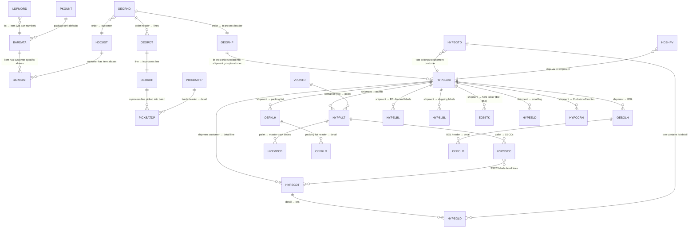

# Data Model

This package contains 4 physical files, 32 logical files, 2 SQL tables, 2 SQL views, and 3 SQL indexes. Many other files are *referenced* but defined elsewhere.

> **2026-06 update — pick-batch promotion.**  PICKBATR (option 4) and
> PICKERR (option 5) needed several additional files plus schema corrections
> on existing tables.  Those changes are documented in §"Promoted / corrected
> schemas for PICKBATR / PICKERR" near the bottom of this file.  The
> originally-promoted PF / LF documentation below is unchanged; the SQL-table
> equivalents now live in `src/*.table.sql` and `src/*.lf`.
>
> **Status note:** the data-layer changes documented in this file are all
> applied and verified on `AITSK00030`.  The PICKERR mobile login (option 5)
> renders correctly through Profound UI; PICKBATR's dashboard (option 4)
> still paints a blank screen client-side despite the IBM i side reaching
> EXFMT cleanly — see `rebuild-guide.md` §15 and §17 for the open
> follow-ups.  Nothing in this data-model file is currently believed to be
> the cause; the failure is in the PUI client render, not in the schemas.

## Physical files included

### `BARCUST.PF` — Customer barcode mapping

Maps a Hornady item + customer to that customer's item number and UCC carton codes. Format `BARCUSTR`, **UNIQUE**, keyed on `CBITEM, CBCUST`.

| Field | Type | Description |
|---|---|---|
| `CBITEM` | 15A | Item number (Hornady) |
| `CBCUST` | 7S 0 | Customer number |
| `CBCITEM` | 30A | Customer's item number |
| `CBCUPC` | 12A | Customer UPC |
| `CBCUCCMC` | 14A | Customer master carton UCC-14 |
| `CBBOXCTN` | 5S 0 | Boxes per carton |
| `CBQTYCTN` | 6S 0 | Quantity per carton |
| `CBCTNDESC` | 12A | Carton description |
| `CBCUCCBC` | 14A | Customer barrel carton UCC-14 |
| `CBQTYBAR` | 7S 0 | Quantity per barrel carton |
| `CBCUCCIP` | 14A | Customer inner-pack UCC-14 |
| `CBQTYIPC` | 5S 0 | Quantity per inner-pack carton |
| `CBIPL` | 1A | Packing-List item-number flavor (H/C/B = Hornady / Customer / Both) |
| `CBIASN` | 1A | EDI 856 ASN item-number flavor |
| `CBIINVC` | 1A | Invoice / EDI 810 item-number flavor |

### `BARDATA.PF` — Bar code data master

Master per Hornady item with UPC/UCC codes, vendor cross-references, die data, and ammunition ballistics. Format `BARDATAR`, **UNIQUE**, keyed on `BDITEM`. Includes a status flag `BDSTS` (`A` = active, `I`/blank = inactive).

Selected fields (the file has ~50 fields total):

| Field | Type | Description |
|---|---|---|
| `BDSTS` | 1A | A=Active, I/blank=Inactive |
| `BDITEM` | 15A | Item # |
| `BDUPC` | 5A | UPC 5-digit |
| `BDCTNDESC` | 12A | Carton description |
| `BDUPC12` | 12A | Box UPC-12 |
| `BDUCC14` | 14A | Master carton UCC-14 |
| `BDUCCB14` | 14A | Barrel carton UCC-14 |
| `BDQTYBAR` | 7S 0 | Qty/barrel master pack |
| `BDUCC14I` | 14A | Inner-pack carton UCC-14 |
| `BDQTYIPC` | 5S 0 | Qty/inner-pack carton |
| `BDVNDITM` `BDVNDUPC` `BDVND14` `BDVND14I` | A | Vendor item / UPC / UCC codes |
| `BDSHLHDR` `BDSERIES` `BDDIES23` | A | Die data (shellholder, series, # of dies in set) |
| `BDLINE01..BDLINE12` | 25A | Free-text label data lines |
| `BDACIP` | 25A | Ammo CIP designation |
| `BDAMUZZL` `BDAMZFPS` `BDAMO1YDS..BDAMO6YDS` `BDAMO1TRJ..BDAMO6TRJ` | 8A | Trajectory data at 1–6 yardages |
| `BDABARREL` | 11A | Barrel length |
| `BDXLIN01` `BDXLIN02` | 50A | Misc label lines |

### `PICKBATHP.PF` — Pick batch header

The header for the Profound-UI pick dashboard. Format `PICKBATHR`, **UNIQUE**, keyed on `PICKBAT`. References an external `FLDREF` for `REFFLD(ORD#)`.

| Field | Type | Description |
|---|---|---|
| `PICKBAT` | (from `ORD#`) | Pick Batch # |
| `PICKSEQNO` | 8S 0 | Batch sequence # |
| `PICKER` | 10A | Picker user-id |
| `PICKINVLOC` | 4A | Pick inventory location |
| `PICKSTAT` | 1A | Pick batch status |
| `PICKNUMITM` | 5S 0 | Number of items |
| `PICKNUMPCS` | 5S 0 | Number of pieces |
| `PICKSTART` | Z | Pick start timestamp |
| `PICKEND` | Z | Pick end timestamp |
| `PICKDUR` | 6P 0 | Pick duration |
| `PICKCRTUSR` `PICKCRTTZ` | 10A / Z | Created-by user + timestamp |
| `PICKCHGUSR` `PICKCHGTZ` | 10A / Z | Changed-by user + timestamp |
| `PICKCHGJBU` `PICKCHGJBN` `PICKCHGJB#` | 10A / 10A / 6P 0 | Job user / name / number that last used the batch |
| `PICKTOT` | 50A | Tote id (default blank) |

### `PICKBATDP.PF` — Pick batch detail

One row per line in a pick batch. Format `PICKBATDR`, **UNIQUE**, keyed on `PICKBAT, PICKSEQ`. References `FLDREF` for most field types.

| Field | Type | Description |
|---|---|---|
| `PICKBAT` | (REFFLD `ORD#`) | Pick Batch # |
| `PICKSEQ` | (REFFLD `SEQ3`) | Sequence # |
| `PICKOVRORD` | 4P 0 | Override pick order |
| `PICKTURN` | (REFFLD `TURN`) | Turnaround # |
| `PICKORD` | (REFFLD `ORD#`) | Order # |
| `PICKORDL` | (REFFLD `ORL#`) | Line # |
| `PICKITEM` | (REFFLD `ITEM`) | Item # |
| `PICKITEMUM` | 5A | Pick item U/M |
| `PICKITEMCT` | 50A | Pick item comment |
| `PICKWHS` | 3P 0 | Warehouse |
| `PICKSTKRM` | 3A | Stockroom |
| `PICKAISLE` | 4A | Aisle |
| `PICKLOC` | 8A | Stock location |
| `PICKITMST` | 1A | Pick item status |
| `PICKNEED` | (REFFLD `IMQT`) | Qty needed |
| `PICKQTYP` | (REFFLD `IMQT`) | Qty picked |

## Logical files in this package

LFs grouped by parent. Each LF defines an alternate key/access path; record format always matches the parent PF unless noted.

### Over `BARCUST` (Customer barcode)

| LF | Keys | Purpose (inferred) |
|---|---|---|
| `BARCUSTL1` | `CBCUST, CBITEM` | Lookup by customer + item |
| `BARCUSTL3` | `CBCUCCMC` | Lookup by master carton UCC |
| `BARCUSTL4` | `CBCUCCBC` | Lookup by barrel carton UCC |
| `BARCUSTL5` | `CBCUCCIP` | Lookup by inner-pack UCC |
| `BARCUSTL6` | `CBCITEM, CBCUST` | Lookup by customer item # |

### Over `BARDATA` (Item master)

| LF | Keys | Purpose |
|---|---|---|
| `BARDATAL2` | `BDUPC12` | Lookup by 12-digit UPC |
| `BARDATAL3` | `BDUCC14` | Lookup by master carton UCC |
| `BARDATAL4` | `BDUCC14I` | Lookup by inner-pack UCC |
| `BARDATAL5` | `BDUCCB14` | Lookup by barrel carton UCC |

### Over `PICKBATHP`/`PICKBATDP`

| LF | Keys | Purpose |
|---|---|---|
| `PICKBATHL1` | `PICKER, PICKBAT` | Header by picker |
| `PICKBATHL2` | `PICKSEQNO` | Header by seq # |
| `PICKBATDL1` | `PICKBAT, PICKTURN, PICKORD, PICKORDL` | Detail by batch / order line |
| `PICKBATDL2` | `PICKTURN, PICKORD, PICKORDL` | Detail by order line (any batch) |

### Over external `HYP*` files (parents not in this package)

These define access paths used by the shipping programs. Field names follow the family prefix: `GC*` for customer groupings, `GD*` for shipment detail, `LD*` for lot detail, `TD*` for tote detail, etc.

| LF | Parent PF | Keys |
|---|---|---|
| `HYLSGCU1`  | `HYPSGCU` | `GCGRP#, GCCPTY, GCBLTO, GCSHTO, GCDSHP` |
| `HYLSGCU2`  | `HYPSGCU` | `GCBLTO, GCSHTO, GCDSHP, GCGRP#` |
| `HYLSGCU3`  | `HYPSGCU` | `GCSHTO, GCDSHP, GCGRP#` |
| `HYLSGCU4`  | `HYPSGCU` | `GCSTNM, GCSHTO, GCDSHP, GCGRP#` |
| `HYLSGCU12` | `HYPSGCU` | `GCBLTO, GCSHTO, GCDSHP, GCGRP#` (variant) |
| `HYLSGCU13` | `HYPSGCU` | `GCSHTO, GCDSHP, GCGRP#` (variant) |
| `HYLSGCU14` | `HYPSGCU` | `GCSTNM, GCSHTO, GCDSHP, GCGRP#` (variant) |
| `HYLSGDT1`  | `HYPSGDT` | `GDGRP#, GDTURN, GDITEM, GDORD#, GDORL#, GDBLN#, GDSSCCBC` |
| `HYLSGDT2`  | `HYPSGDT` | `GDGRP#, GDSSCCBC, GDORD#, GDORL#, GDBLN#` |
| `HYLSGDT3`  | `HYPSGDT` | `GDGRP#, GDBLTO, GDSHTO, GDDSHP, GDTURN, GDITEM, GDORD#, GDORL#, GDBLN#, GDRSEQ, GDSSCCBC` |
| `HYLSGDT4`  | `HYPSGDT` | (similar, no `GDTURN`) |
| `HYLSGDT5`  | `HYPSGDT` | (similar, item-first within billto/shipto) |
| `HYLSGLD1`  | `HYPSGLD` | `LDGRP#, LDTURN, LDTSEQ, LDRSEQ, LDLOT#, LDSSCC` |
| `HYLSGSD1`  | `HYPSGSD` | `CDTURN` |
| `HYLSGTD1`  | `HYPSGTD` | `TDTOTE, TDGRP#, TDBLTO, TDSHTO, TDDSHP, TDITEM, TDTURN, TDTSEQ, TDRSEQ` |
| `HYLSGTD2`  | `HYPSGTD` | (similar, billto-first) |
| `HYLELBL1`  | `HYPELBL` | `ELJOBN, ELORD#` (hazard / EDL labels) |
| `HYLSLBL1`  | `HYPSLBL` | `SLJOBN, SLORD#` (shipping labels) |
| `HYLMPCD3`  | `HYPMPCD` | `MDORD#, MDTURN, MDSRL#` (pallet master pkg codes) |
| `HYLOREL1`  | `HYPOREL` | `ORSORD#` (order release?) |
| `HYLPLLT4`  | `HYPPLLT` | `PMSHTO, PMPSRL#` (pallet master, by ship-to + pallet serial) |
| `HYLSSCC8`  | `HYPSSCC` | 10 keys including `SCSRL#, SCORD#, SCORL#, SCBLN#, SCLOT#` and `S1*` companions — SSCC consolidation join |
| `LDLMORD1`  | `LDPMORD` | `OMLOT` (lot → MO by lot) |
| `LDLMORD2`  | `LDPMORD` | `OMPN, OMLOT` (lot → MO by part-number + lot) |

## SQL objects

### `PKGUNT.TABLE` — Package Unit (target lib `XXPVAR350F`)

Package-unit codes (EA, CS, etc.) with default dimensions.

```sql
CREATE TABLE XXPVAR350F/PKGUNT (
  PKUNIT CHAR(2)           NOT NULL,  -- Package unit code (PK)
  PKDESC CHAR(10)          NOT NULL,  -- Description
  PKDLEN NUMERIC(6,2)      NOT NULL,  -- Default length
  PKDWDT NUMERIC(6,2)      NOT NULL,  -- Default width
  PKDHTG NUMERIC(6,2)      NOT NULL,  -- Default height
  PRIMARY KEY (PKUNIT)
) RCDFMT PKGUNTR;
```

### `PKGUNTL1.VIEW`

`SELECT *` view over `PKGUNT` (5 columns).

### `VPCNTR.TABLE` — Varsity Container master (target lib `XXPVAR350F`)

59 columns — container types with dimensions, capacity, weight limits, packing rules, hazmat flags, return codes, and misc tracking fields. Defines container-level constraints used by Varsity WMS. Key fields include `CNCMNO` (company), `CNCONT` (container), `CNTYPE`, `CNCNTP` (parent container), and `CNLEVL` (nesting level).

### `VPCNTRL3.VIEW`

`SELECT *` view over `VPCNTR` (all 59 columns).

### Indexes (target lib `HDSSTDPGM`)

| Index | Base table | Keys |
|---|---|---|
| `OEORDP01` | `OEORDP` (order-in-process detail) | `IDTURN, IDORD#, IDORL#, IDBLN#` |
| `HDITSL01` | `HDITSL` (inventory stock locations) | `ISITEM, ISWHS, ISRATE, ISSTKR, ISAILE, ISSLOC` |
| `HDSHPV01` | `HDSHPV` (ship-via codes) | `SVSVDS, SVSVSV` |

The base files for these indexes are not in this package.

## Inferred entity-relationship diagram



Items in **bold** below are in this package; the rest are referenced from outside.

- **`BARDATA`, `BARCUST`** — barcode/item masters (in-package).
- `OEORHD/OEORDT` — sales orders (external).
- `OEORHP/OEORDP` — order in-process (external; `OEORDP01.INDEX` is in-package).
- **`PICKBATHP/PICKBATDP`** — pick batch (in-package); detail lines reference `OEORDP` by `PICKTURN+PICKORD+PICKORDL`.
- `HYPSGCU/HYPSGDT/HYPSGLD/HYPSGTD/HYPSGSD` — shipment work files (external; many LFs in-package).
- `OEBOLH/OEBOLD`, `OEPKLH/OEPKLD` — BOL and packing list (external).
- `HYPSSCC`, `HYPSLBL`, `HYPELBL`, `HYPPLLT`, `HYPMPCD` — UCC-128, label, pallet domain (external; some LFs in-package).
- `EO56TK`, `EDOTPM`, `EDLTPXR1` — EDI 856 outbound (external).
- `HYPEELD`, `HYPELG` — outbound email log (external).
- `HYPCCRH`, `HYPCCSF`, `CCLOG` — CurbstoneCard payment domain (external).
- **`PKGUNT`, `VPCNTR`** — Varsity package-unit and container masters (in-package as SQL DDL).

## Logical-file fan-out summary

```mermaid
graph LR
    BARCUST[BARCUST.PF<br/>Customer barcode]
    BARDATA[BARDATA.PF<br/>Item master]
    PICKBATHP[PICKBATHP.PF<br/>Pick batch header]
    PICKBATDP[PICKBATDP.PF<br/>Pick batch detail]
    HYPSGCU[(HYPSGCU<br/>external)]
    HYPSGDT[(HYPSGDT<br/>external)]
    HYPSGLD[(HYPSGLD<br/>external)]
    HYPSGTD[(HYPSGTD<br/>external)]
    HYPSGSD[(HYPSGSD<br/>external)]
    HYPSSCC[(HYPSSCC<br/>external)]
    HYPSLBL[(HYPSLBL<br/>external)]
    HYPELBL[(HYPELBL<br/>external)]
    HYPPLLT[(HYPPLLT<br/>external)]
    HYPMPCD[(HYPMPCD<br/>external)]
    HYPOREL[(HYPOREL<br/>external)]
    LDPMORD[(LDPMORD<br/>external)]

    BARCUST --> BARCUSTL1 & BARCUSTL3 & BARCUSTL4 & BARCUSTL5 & BARCUSTL6
    BARDATA --> BARDATAL2 & BARDATAL3 & BARDATAL4 & BARDATAL5
    PICKBATHP --> PICKBATHL1 & PICKBATHL2
    PICKBATDP --> PICKBATDL1 & PICKBATDL2
    HYPSGCU --> HYLSGCU1 & HYLSGCU2 & HYLSGCU3 & HYLSGCU4 & HYLSGCU12 & HYLSGCU13 & HYLSGCU14
    HYPSGDT --> HYLSGDT1 & HYLSGDT2 & HYLSGDT3 & HYLSGDT4 & HYLSGDT5
    HYPSGLD --> HYLSGLD1
    HYPSGTD --> HYLSGTD1 & HYLSGTD2
    HYPSGSD --> HYLSGSD1
    HYPSSCC --> HYLSSCC8
    HYPSLBL --> HYLSLBL1
    HYPELBL --> HYLELBL1
    HYPPLLT --> HYLPLLT4
    HYPMPCD --> HYLMPCD3
    HYPOREL --> HYLOREL1
    LDPMORD --> LDLMORD1 & LDLMORD2
```



---

## Promoted / corrected schemas for PICKBATR / PICKERR (2026-06)

Bringing options 4 (`PICKBATR` Pick Batch Dashboard) and 5 (`PICKERR` Picker
Workflow) into the build required:

1. promoting `PICKBATHP`/`PICKBATDP` from the package PFs into SQL tables in
   `AITSK00030`,
2. inventing stubs for several files the package only references (`OEORHP`,
   `OEORDP`, `OEORDT`, `PICKBATLOG`, `PICKBATMP`, `PICKMBATDP`, `PICKBATSP`),
3. **correcting** the schemas of several already-promoted tables whose
   reverse-engineered column names did not match what the Hornady programs
   actually reference.

Every table below lives under `src/` as a `.table.sql` (SQL DDL) or `.pf` (DDS)
file; LFs are alongside as `.lf` files; see `src/Rules.mk` for the build rules.

### New SQL tables

| Source file | Object | Format | Purpose |
|---|---|---|---|
| `pickbathp.table.sql` | `PICKBATHP` | `PICKBATHR` | 1:1 SQL promotion of the in-package `PICKBATHP.PF` — pick-batch header.  Primary key `(PICKBAT)`. |
| `pickbatdp.table.sql` | `PICKBATDP` | `PICKBATDR` | 1:1 SQL promotion of `PICKBATDP.PF` — pick-batch detail line.  Primary key `(PICKBAT, PICKSEQ)`. |
| `pickbatlog.table.sql` | `PICKBATLOG` | `PICKLOGR` | Event log inferred from `PICKBATLR2.SQLRPGLE` inserts: `LOGTS, LOGBAT, LOGGRP, LOGMSG, LOGUSR, LOGJOB, LOGJOB#`.  Not uniquely keyed. |
| `pickbatmp.table.sql` | `PICKBATMP` | `PICKBATMR` | One free-text note per pick batch.  Two columns — `PICKBAT, PICKBATMSG`.  PK `(PICKBAT)`. |
| `pickmbatdp.table.sql` | `PICKMBATDP` | `PICKMBATDR` | MegaBatch → component-batch link, two-col `(PICKMBAT, PICKBAT)` composite key.  Lets PICKBATR group several pick batches into a single picking unit while keeping shipment publishing per-component. |
| `oeorhp.table.sql` | `OEORHP` | `OEORHPR` | Stub Order Header (IH-prefix).  Columns set from PICKBATR / PICKBATLR2 / PICKERR `chain` / `where` clauses: `IHORD#, IHTURN, IHSHTO, IHBLTO, IHDSHP, IHORRF, IHORTY`.  Extend when more references are uncovered. |
| `oeordp.table.sql` | `OEORDP` | `OEORDPR` | Stub Order Detail (ID-prefix): `IDORD#, IDTURN, IDORL#, IDBLN#, IDSEQ#, IDQOPK, IDEMP`. |
| `oeordt.table.sql` | `OEORDT` | `OEORDTR` | Stub Order Detail Trade (OD-prefix), 2-key `(ODORD#, ODORL#)` join target for PICKBATLR2. |

### New DDS physical file

| Source file | Object | Format | Notes |
|---|---|---|---|
| `pickbatsp.pf` | `PICKBATSP` | `PICKBATSR` | Pick-Batch Scan history.  Used by PICKERR (prefix `sc_`).  DDS rather than SQL because each (PICKBAT, PICKSEQ) line may receive **multiple** scan rows; SQL primary keys require uniqueness.  Fields: `PICKBAT 8S0, PICKSEQ 3S0, SCANCODE 30A, SCANQTY 5S0, SCANTS Z`.  Keys: `K PICKBAT / K PICKSEQ / K SCANCODE` (3-key path is the one PICKBATR uses with the `DELETECODE` SCANCODE filter — that 3rd key is what makes the standard `chain (bat:seq:scancode) PICKBATSP` work). |

### New logical files

| LF source | Format | Over | Keys |
|---|---|---|---|
| `pickbathl1.lf` | `PICKBATHR` | `PICKBATHP` | `PICKER, PICKBAT` |
| `pickbathl2.lf` | `PICKBATHR` | `PICKBATHP` | `PICKSEQNO` |
| `pickbatdl1.lf` | `PICKBATDR` | `PICKBATDP` | `PICKBAT, PICKTURN, PICKORD, PICKORDL` |
| `pickbatdl2.lf` | `PICKBATDR` | `PICKBATDP` | `PICKTURN, PICKORD, PICKORDL` |
| `oeordp01.lf`   | `OEORDPR`   | `OEORDP`    | `IDTURN, IDORD#, IDORL#, IDBLN#` |
| `hylsgsd1.lf`   | `HYRSGSD`   | `HYPSGSD`   | `CDTURN` |

### Schema corrections to previously-promoted tables

Each of the following tables had at least one column name or PK ordering that
**did not match what the Hornady programs reference**.  Renames are the only
practical fix — the program sources use these names everywhere via F-spec
`R` references and SQL host variables.

| Table | What changed | Why |
|---|---|---|
| `HDCUST` | Prefix `CU` → `CM`.  New columns `CMCNA1, CMALPH, CMCCLS, CMLOC#, CMD01, CMD02, CMCITY, CMSTAT, CMZIP, CMCNTRY, CMSHPV, CMSTS, CMTS`. | HYR0600 / PICKBATR / PICKERR every reference HDCUST as `chain ... HDCUST` then read `CMCNA1` etc. — never `CUNAME`. |
| `HDIMST` | Columns `IMDESC, IMUOM, IMWGT, IMSTS` → `IMIMDS, IMUOMS, IMIMWG, IMST`.  Added `IMPCLS`, `IMUDN4`. | PICKERR `ITMDESC = IMIMDS`, `hld_IMUOMS = IMUOMS`.  HYR0600 also uses `IMPCLS, IMUDN4`. |
| `GUPTDAT` | Was `(GUKEY, GUVAL)`.  Now `(TDTABL, TDKEY1, TDKEY2, TDKEY3, TDDESC, TDVAL, TDCF01, TDDATA, TDDAT, TDWN, TDAT, TDTSTP1)` keyed on `(TDTABL, TDKEY1, TDKEY2, TDKEY3)`. | PICKBATR / PICKERR pattern: `chain ('SHIPUSER':userId) GUPTDAT` then read `TDDESC` — that's a `(TDTABL, TDKEY1)` two-key chain returning a name string. |
| `HYPTDTA` | Was `(TDORD#, TDTURN, TDTRK#, TDSHPV, TDTSTP1)`.  Now superset of GUPTDAT plus the existing order-busy fields, keyed on `(TDTABL, TDKEY1, TDKEY2, TDKEY3)` with a new `TDBUSY CHAR(10)` (set to `'DIGIPICK'` while a pick turn is busy, cleared on delete by PICKBATR). | HYR0600 uses `TDTABL='SHIPVIA' / 'BXLLINDFTS' / 'ALDAWKSTN' / 'GIWKSTN'` patterns — same shape as GUPTDAT. |
| `HDCCMT` | Was `(CXCUST, CXCTYP, CXORD#, CXSEQ, CXCMNT)`.  Now `(CXCVF, CXBLTO, CXTYPE, CXSEQ, CXCMNT)` with PK `(CXCVF, CXBLTO, CXTYPE, CXSEQ)`. | PICKERR `setll (hld_CXCVF :hld_IHBLTO :hld_PICCMT) HDCCMT` — three keys: `'C'` (view flag), bill-to cust#, `'PIC'` (category).  Old type order (`CXCUST 7S0, CXCTYP 8A, CXORD# 8S0`) produced 9 `RNF7072` CHAR-vs-NUMERIC errors. |
| `HYPSGSD` | Added `CDDS#, CDSTYP, CDSHPV, CDBLTO`. | PICKBATR's merge-batches flow does `update HYPSGSD set CDDS#=..., CDSTYP=..., CDSHPV=..., CDBLTO=... where CDTURN in (:baseTurn,:moveTurn)`. |

### New data areas

| Library | Name | Type | Value | Used by |
|---|---|---|---|---|
| `AITSK00030` | `GS1COMP`  | `*CHAR(6)` | `054321` | PICKERR (`wk_GS1Comp DTAARA(GS1COMP)`) -- GS1 prefix used to parse outer/inner UCC barcodes |
| `AITSK00030` | `GS1COMP2` | `*CHAR(6)` | `054322` | PICKERR (`wk_GS1Comp2 DTAARA(GS1COMP2)`) -- secondary GS1 prefix |
| `AITSK00030` | `DATABASEID` | `*CHAR(2)` | `XX`   | HYR0600 (HDSOPT path); pre-existing |
| `AITSK00030` | `PICKBATD`  | `*DEC(11,0)` | n/a — PICKBATR creates lazily on first run (`dcl-s lastUsedBatch packed(11:0) DTAARA('PICKBATD')`).  Not pre-seeded. |

Create them once per fresh task library:

```bash
ssh dev '/usr/bin/qsh -c "
system \"crtdtaara AITSK00030/GS1COMP  type(*char) len(6) value('"'"'054321'"'"')\" 2>&1 | head -1
system \"crtdtaara AITSK00030/GS1COMP2 type(*char) len(6) value('"'"'054322'"'"')\" 2>&1 | head -1
"'
```

### Seed data added for the dashboards (see `Hornady/documentation/sample-data.sql`)

* `GUPTDAT`: 3 `SHIPUSER` rows (`PICKER01 / PICKER02 / PICKER03`) so the dashboard can resolve picker IDs to names via the standard `chain ('SHIPUSER':code) GUPTDAT` pattern.
* `PICKBATHP`: 5 batches `5001..5005` covering all four `PICKSTAT` values (`O` open, `A` assigned, `P` in-progress, `Z` complete) and both warehouses (`WEST` × 4, `ALDA` × 1).  Two distinct pickers (`PICKER01`, `PICKER02`) plus a complete-batch `PICKER03`.
* `PICKBATDP`: 14 detail lines spread across the 5 batches (3-4 SKUs per batch, all from the `DEMO-*` item set).

Expected row counts after running `sample-data.sql`:

| Table | Rows |
|---|---|
| `PICKBATHP` | 5 |
| `PICKBATDP` | 14 |
| `GUPTDAT`   | 3 |
| `HDCUST`    | 8 (with CM-prefix columns) |
| `HDIMST`    | 6 (with IM-prefix corrections) |
