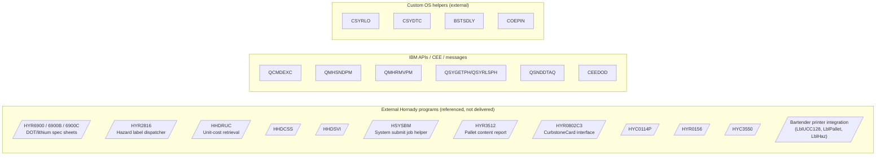

# Program Architecture

The RPG/CL programs split into five layers:

1. **CL wrappers** (`HYC*`) — entry points that set the activation group and call into RPG.
2. **Interactive RPG** (`HYR0138`, `HYR0189`, `HYR0500`, `HYR0520`, `HYR0600`, `HYR0602`, `HYR0606`, `HYR0606TV`, `HYR0608`, `HYR0626` + the modern `PICKBATR`/`PICKBATDR`/`PICKERR`) — drive `.DSPF` screens.
3. **Batch / orchestrator** (`HYR0114`, `HYR0116`, `HYR0120`, `HYR0142`, `HYR0185`, `HYR0540`, `HYR0610`, `HYR0614`, `HYR0622`, `HYR3504`, `HYR3552`, `HYR6080`, `PICKBATLR2`) — produce printer output / consolidated work.
4. **Service procedures** (`HYR0139A`, `HYR0148`, `HYR0150`, `HYR0152`, `HYR0240`, `HYR0620`, `HYR2022`, `HYR0804C3`, `HYR0810C3`, `HYR0812`, `HYR9906`, `HYR9916A`, `HYR9930`, `HYR9933`, `HYR9934`, `HYR9937`, `HYR9960`, `HYR9962`, `CHKDIGIT`, `EDR9900`, `VARHDINFD`, `VPRBLDP`, `VPRDMWTCT`, `VPRSWOGINF`, `PICKBATSV`) — small reusable units, mostly `EXPORT`-ed procedures invoked via `CALLP`.
5. **CL utilities** (`VPCCRTCNT`) — Varsity setup.

## The orchestrator: `HYR0614`

`HYR0614` (titled "Consolidated Shipping subprocedures" — but actually the consolidator/driver) is the program that the rest of the shipping batch flow hangs off of. Verified `CALLP` statements in `HYR0614.SQLRPGLE`:

```
CALLP(E) HYR0114 (...)        -- packing list print
CALLP(E) HYR0150 (...)        -- write SSCC work / copy to HYPSSCC
CALLP(E) HYR0152 (...)        -- write EDL work / copy to HYPELD
CALLP(E) HYR0540 (...)        -- print UCC-128 carton labels
CALLP(E) HYR0240 (...)        -- update Varsity files
CALLP(E) HYR2022 (...)        -- non-truck EDI BOL data
CALLP(E) HYR6080 (...)        -- order status email
CALLP(E) HYC3512 (...)        -- shipping pallet content report (via CL)
CALLP(E) HYR0804C3 ('REAUTH',...) -- CurbstoneCard re-auth
CALLP(E) HYR0500 ('1' | '2', ...) -- SSCC/tracking association (incl. SWOG mode)
CALLP(E) HYR3552 (wk_BOL#, ...) -- pallet banner print
CALLP(E) HYR0142 (wk_BOL#, ...) -- bill of lading print
CALLP(E) HYR3504 (wk_BOL#, ...) -- BOL powder weight summary
CALLP(E) HYR0148 (wk_BOL#, ...) -- add EDI 856 tickler

-- shutdown phase:
CALLP(E) sd_HYR0139A() / sd_HYR0810() / sd_HYR0812() / sd_HYR9906()
```

The `sd_*` convention is reused across HYR9xxx service programs — each exports a `sd_<name>()` "shutdown" procedure called at job end.

## End-to-end shipping call graph

```mermaid
graph TD
    subgraph "Interactive — Shipment screens"
      H0600["HYR0600<br/>Shipment Processing"]
      H0602["HYR0602<br/>Shipment Detail"]
      H0606["HYR0606<br/>Lot Inquiry"]
      H0606TV["HYR0606TV<br/>Lot Inquiry — Tote Verify"]
      H0608["HYR0608<br/>Tote Processing"]
      H0626["HYR0626<br/>Mixed/Partial Label Print"]
      H0500["HYR0500<br/>SSCC ↔ Tracking#"]
      H0520["HYR0520<br/>Ship-via & Comments"]
      H0189["HYR0189<br/>Order Comments"]
    end

    subgraph "Interactive — Pallet"
      HYC0138["HYC0138.CL<br/>(wrapper)"]
      H0138["HYR0138<br/>Pallet Contents"]
      HYC0138 --> H0138
    end

    subgraph "Interactive — Picking (Profound UI)"
      PBATR["PICKBATR<br/>Pick Batch Dashboard"]
      PBATDR["PICKBATDR<br/>Pick Batch Detail"]
      PERR["PICKERR<br/>Picker Workflow"]
      PBSV["PICKBATSV<br/>Pick Batch Save"]
      PBATR --> PBATDR --> PBSV
      PBATR --> PERR
    end

    subgraph "Batch — Orchestrator + downstream"
      H0614["HYR0614<br/>Consolidated Shipping"]
      H0610["HYR0610<br/>Consol. Subprocs"]
      H0114["HYR0114<br/>Packing List"]
      H0116["HYR0116<br/>Shipping Label"]
      H0120["HYR0120<br/>Build Work Records"]
      H0142["HYR0142<br/>BOL Print"]
      H0148["HYR0148<br/>EDI 856 Tickler"]
      H0150["HYR0150<br/>SSCC work file"]
      H0152["HYR0152<br/>EDL work file"]
      H0185["HYR0185<br/>Pick Ticket Print"]
      H0240["HYR0240<br/>Varsity Update"]
      H0540["HYR0540<br/>UCC-128 Carton Labels"]
      H0622["HYR0622<br/>UCC-128 Labels"]
      H0620["HYR0620<br/>Build ZPL string"]
      H2022["HYR2022<br/>Non-truck EDI BOL"]
      H3504["HYR3504<br/>BOL Powder Wt Summary"]
      H3552["HYR3552<br/>Pallet Banner Print"]
      H6080["HYR6080<br/>Order Status Email"]
      HYC3512["HYC3512.CL<br/>(wrapper)"]
      H3512[/"HYR3512<br/>(not in package)"/]
      HYC3512 --> H3512
    end

    subgraph "Payment (CurbstoneCard)"
      H0804["HYR0804C3<br/>C3 Request"]
      H0810["HYR0810C3<br/>C3 Data Retrieval"]
      H0812["HYR0812<br/>Complex Requests"]
      H0812 --> H0804
      H0812 --> H0810
    end

    subgraph "Service procedures"
      H0139A["HYR0139A<br/>Pallet Report"]
      H9906["HYR9906<br/>Order subprocs"]
      H9916A["HYR9916A<br/>Hazmat"]
      H9930["HYR9930<br/>Text utils"]
      H9933["HYR9933<br/>Phone#"]
      H9934["HYR9934<br/>TM/©"]
      H9937["HYR9937<br/>CheckDigit"]
      H9960["HYR9960<br/>Item Barcode<br/>(BARDATA)"]
      H9962["HYR9962<br/>Customer Barcode<br/>(BARCUST)"]
      CHK["CHKDIGIT<br/>Mod-10"]
      EDR["EDR9900<br/>EDI Subprocs"]
    end

    subgraph "Varsity bridge"
      VARHD["VARHDINFD"]
      VPRBLDP["VPRBLDP<br/>Pick Load Build"]
      VPRDM["VPRDMWTCT"]
      VPRSWOG["VPRSWOGINF"]
      VPCC["VPCCRTCNT.CL"]
    end

    %% Orchestration edges
    H0600 --> H0602
    H0600 --> H0608
    H0600 --> H0500
    H0600 --> H0520
    H0600 --> H0189
    H0602 --> H0608
    H0602 --> H0626
    H0606TV -. used by .-> H0608
    H0606 --> H9930

    H0614 --> H0114
    H0614 --> H0150
    H0614 --> H0152
    H0614 --> H0540
    H0614 --> H0240
    H0614 --> H2022
    H0614 --> H6080
    H0614 --> HYC3512
    H0614 --> H0500
    H0614 --> H3552
    H0614 --> H0142
    H0614 --> H3504
    H0614 --> H0148
    H0614 --> H0804
    H0614 -. shutdown .-> H0139A
    H0614 -. shutdown .-> H0810
    H0614 -. shutdown .-> H0812
    H0614 -. shutdown .-> H9906

    H0114 --> H6900[/"HYR6900 / HYR6900B / HYR6900C<br/>(not in package)"/]
    H0116 --> Bart[/"Bartender label interface<br/>(LblUCC128, LblPallet, LblHaz)"/]
    H0540 --> H0116
    H0622 --> H0116
    H0622 --> H0152

    H2022 --> H0148

    H9937 --> CHK
    H0114 --> CHK
    H0185 --> CHK

    %% Pallet flow
    H0138 -. uses .-> HYC3512

    %% Varsity
    H0614 -. via .-> VPRSWOG
    H0614 -. via .-> H0240
    VPRBLDP --> PBSV

    classDef inpkg fill:#e8f5e8,stroke:#2d5d2d
    classDef ext fill:#fff3e0,stroke:#bf6900,stroke-dasharray:3 3
    class H3512,H6900,Bart ext
```



## Service program exports

The `HYR99xx` and adjacent files are all service programs — each exports one or more procedures plus an `sd_<name>` shutdown:

| Service | Exported procedures (observed) | Notes |
|---|---|---|
| `CHKDIGIT` | `VldM10ChkDigit`, `RtvM10ChkDigit` | Modulus-10 check-digit math; consumed by `HYR9937`. |
| `HYR9906` | `RetOrdCtl`, `RtvNxtTrn`, `sd_HYR9906` | Order control # / next turnaround#. Opens `OEORHH`, `OEIVHH02`. |
| `HYR9930` | `TrimTrailBlank`, `FmtPhoneNum`, `Capitalize` (text utilities) | Uses `CEEDOD` for dynamic op-descriptors. |
| `HYR9933` | `PhoneNum` | Phone-number formatting. |
| `HYR9934` | `TradeMark`, `Copyright` | TM/© legal text generation. |
| `HYR9937` | (CheckDigit wrappers) | Thin wrapper over `CHKDIGIT`. |
| `HYR9960` | `RtvBarcode` | Item barcode lookup over `BARDATA` (+ L2/L3/L4/L5). |
| `HYR9962` | `RtvCustBarcode` | Customer-item barcode lookup over `BARCUST` (+ L1/L3/L4/L5/L6). |
| `HYR0139A` | `WrtPRLog`, `RtvPRSts`, `ClearPRLog`, `sd_HYR0139A` | Pallet-report logging over `HYPPLTR`. |
| `EDR9900` | `EDI850Char`, `EDI850Nbr`, `RtvParentPO`, `sd_EDR9900` | EDI 850 (PO inbound) segment access against `EDISAVE/HMCEIPBEG`. |

## Cross-cutting external dependencies

The shipping programs lean on a number of named externals that aren't in this package — pick them up from elsewhere in the target IBM i:



## Notes on the orchestration style

- All in-package RPGs are ILE; most are bound via `BNDDIR(...)` to one or more binding directories named after the activation group (`HDSOPT`, `HDSCTL`).
- The pattern across the HYR99xx service programs is consistent: a body of `EXPORT`-ed procedures plus a `sd_<name>()` "shutdown" procedure to close any `USROPN` files. The orchestrator (`HYR0614`) calls every `sd_*` it depends on during its own shutdown phase — that's the cleanup edge in the diagram above.
- The CurbstoneCard chain (`HYR0812 → HYR0810C3` / `HYR0812 → HYR0804C3`) is conventional: complex-request driver delegates to retrieval and request modules.
- The Picking dashboard (`PICKBATR/PICKBATDR/PICKERR/PICKBATSV` + `PICKBATD.DSPF`/`PICKERD.DSPF`) is the newest addition — written by Profound Logic Software (per the file headers, dated Sept 2021) and grafted onto the older MCA shipping platform. It uses the modern Profound UI (`*PUI` keyword in DDS, JSON metadata embedded as `HTML(...)` strings).
