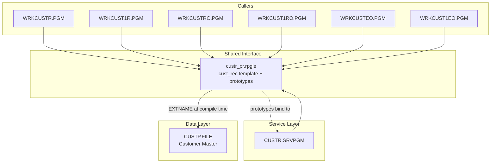

# CUSTR_PR — Technical Documentation

|  |  |
|---|---|
| **Program** | CUSTR_PR (copy member — produces no object of its own) |
| **Type** | */COPY source member* (compiled into every consumer) |
| **Language** | ILE RPG — fixed-format-tolerant free-form source |
| **Source** | `cfdemo/qrpglesrc/custr_pr.rpgle` |
| **IBM i target release** | Not specified (TGTRLS defaults to the build machine's release) |
| **Version / Author / Date** | 1.0 / Claude (Opus 5) / 2026-08-19 |

### Revision History

| Version | Date | Author | Change | Ref |
|---|---|---|---|---|
| 1.0 | 2026-08-19 | Claude (Opus 5) | Initial documentation | — |

## 1. Overview

`CUSTR_PR` is the shared interface member for the customer service layer of the `cfdemo`
application. It contains no executable code and creates no IBM i object. It declares:

- `cust_rec` — an externally described, qualified **template** data structure over the `CUSTP`
  physical file, used by every caller as the row/record type for a customer.
- Prototypes for the two procedures exported by the `CUSTR` service program: `cust_get` and
  `cust_list`.

It is pulled in with `/copy custr_pr.rpgle` by the service program that implements those
procedures and by every program that calls them, so the definition and the callers can never
drift apart. It is never invoked — it is a compile-time include only.

**Consumers (all `/copy custr_pr.rpgle`):**

| Consumer | Role |
|---|---|
| `CUSTR` (`custr.sqlrpgle`) | Implements `cust_get` / `cust_list` |
| `WRKCUSTR` | 5250 customer list |
| `WRKCUST1R` | 5250 customer detail |
| `WRKCUSTRO` | Rich Display (RPG Open Access) customer list |
| `WRKCUST1RO` | Rich Display customer detail |
| `WRKCUSTEO` | EJS screen-mode customer list |
| `WRKCUST1EO` | EJS screen-mode customer detail |

## 2. Technical Specifications

**Control Options** — none. A copy member inherits the `CTL-OPT` of the member that includes it.

**Declarations provided**

`cust_rec` — `dcl-ds cust_rec extname('CUSTP') qualified template end-ds;`

Because it is `template`, no storage is allocated; callers declare their own instances with
`likeds(cust_rec)` (or arrays with `like(cust_rec) dim(n)`). Because it is `qualified`, all
subfields are referenced as `cust_rec.CUSTNO`, `customer.CNAME`, and so on — no subfield name
collides with a display-file field. The subfields are taken from `CUSTP` at compile time:

| Subfield | Type | Length | Dec |
|---|---|---|---|
| `CUSTNO` | Packed | 6 | 0 |
| `CNAME` | Char | 40 | |
| `CADDR1` | Char | 40 | |
| `CADDR2` | Char | 40 | |
| `CCITY` | Char | 30 | |
| `CSTATE` | Char | 2 | |
| `CZIP` | Char | 10 | |
| `CPHONE` | Char | 15 | |
| `CEMAIL` | Char | 60 | |
| `CSTATUS` | Char | 1 | |
| `CTYPE` | Char | 1 | |
| `CLIMIT` | Packed | 11 | 2 |
| `CBALANCE` | Packed | 11 | 2 |
| `CLASTORD` | Zoned | 8 | 0 |
| `CCREATED` | Zoned | 8 | 0 |

**Prototype: `cust_get`** — returns `varchar(80)`: an error message, or `''` on success.

| Parameter | Data Type | Length | Direction | Description |
|---|---|---|---|---|
| `custno` | Packed (`like(cust_rec.custno)`) | 6,0 | In (`const`) | Customer number to retrieve |
| `customer` | DS `likeds(cust_rec)` | 271 bytes | Out | Receives the customer row; untouched when not found |
| `found` | Indicator | 1 | Out | `*on` when a row was returned |

**Prototype: `cust_list`** — returns `varchar(80)`: an error message, or `''` on success.

| Parameter | Data Type | Length | Direction | Description |
|---|---|---|---|---|
| `customers` | Array `like(cust_rec) dim(9999)` | 9999 elements | Out | Receives the matching rows, filled from element 1 |
| `limit` | Integer | 10i | In (`const`) | Maximum rows to return; callers pass `%elem(customers)` |
| `returned` | Integer | 10i | Out | Count of rows actually placed in `customers` |
| `filter` | Varchar | 50 | In (`const`, `options(*omit : *nopass)`) | Case-insensitive substring/prefix filter; omit or blank for all rows |

Note the deliberate asymmetry: `customers` is prototyped `like(cust_rec) dim(9999)` (an array of
the record type) rather than `likeds(...)`, which is what allows a caller to pass a
`dim(9999)` data-structure array as one parameter. The array dimension is part of the prototype,
so a caller **must** declare exactly `dim(9999)` — a smaller array would be a storage overrun.

**Files Used** — none.

**Service Programs / Procedures Called** — none (declarations only).

## 3. ILE Structure & Invocation

Not applicable in its own right. The prototypes it declares resolve to **statically bound** calls
into the `CUSTR` `*SRVPGM`; the binding itself is contributed by each consumer's
`ctl-opt bnddir('CUST')`.

## 4. Dependency Tree (text)

```
custr_pr.rpgle  (/COPY member — no object)
├── Compile-time reference
│   └── CUSTP.FILE (PF)        <- EXTNAME('CUSTP'), resolved from *LIBL at compile
├── Describes the interface of
│   └── CUSTR.SRVPGM
└── Included by
    ├── custr.sqlrpgle    -> CUSTR.MODULE / CUSTR.SRVPGM
    ├── wrkcustr.rpgle    -> WRKCUSTR.PGM
    ├── wrkcust1r.rpgle   -> WRKCUST1R.PGM
    ├── wrkcustro.rpgle   -> WRKCUSTRO.PGM
    ├── wrkcust1ro.rpgle  -> WRKCUST1RO.PGM
    ├── wrkcusteo.rpgle   -> WRKCUSTEO.PGM
    └── wrkcust1eo.rpgle  -> WRKCUST1EO.PGM
```

## 5. Dependency Diagram (Mermaid)



## 6. Complete Object Dependency List

**Copy Members**

| Object | Type | Library | Source member | Description |
|---|---|---|---|---|
| `custr_pr` | Source only | n/a | `cfdemo/qrpglesrc/custr_pr.rpgle` | Customer record template + procedure prototypes |

**Physical Files** (compile-time reference)

| Object | Type | Library | Source member | Description |
|---|---|---|---|---|
| `CUSTP` | *FILE (PF) | *LIBL (task library, then `CFDEMO`/`AIDEMOBASE`) | `cfdemo/qddssrc/custp.pf` | Customer master; supplies `cust_rec` subfields |

**Exported Procedures described**

| Procedure | Return | Description |
|---|---|---|
| `cust_get` | `varchar(80)` error text | Retrieve one customer by number |
| `cust_list` | `varchar(80)` error text | Retrieve a filtered, limited, ordered customer list |

## 7. Database Schema & Access (DB2 for i)

The member itself performs no I/O, but it binds the application's record layout to `CUSTP`.
See §7 of `CUSTR_Technical_Documentation.md` for the full `CUSTP` layout, key, and access notes.
Because the DS is externally described, **any change to `custp.pf` changes this interface**: every
consumer must be recompiled, and if the change alters the total record length the service
program's callers and the service program must be rebuilt together.

## 8. Display File Layout

Not applicable.

## 9. Program Flow (Mermaid) & Key Routines

Not applicable — no executable code.

## 10. Indicators Used

Not applicable.

## 11. Error & Exception Handling

Not applicable at runtime. At compile time, a missing or unfindable `CUSTP` in the compiling job's
library list fails the compile of every consumer with an RNF-series "external file not found"
diagnostic — which is the usual symptom when a task library was recreated but `custp.file` was
never built into it.

## 12. Security & Authority

Not applicable (no object). Compile requires `*USE` authority to `CUSTP`.

## 13. Interfaces & Integration

Not applicable.

## 14. Batch / Job Flow

Not applicable.

## 15. Build & Compile

No build target of its own. It appears as a **normal prerequisite** in `Rules.mk` for every
consumer, so editing it correctly forces all of them to recompile:

```makefile
custr.module:    qrpglesrc/custr.sqlrpgle qrpglesrc/custr_pr.rpgle qddssrc/custp.pf | custp.file
wrkcustr.pgm:    qrpglesrc/wrkcustr.rpgle   qddssrc/wrkcustd.dspf   qrpglesrc/custr_pr.rpgle custr.srvpgm | wrkcustd.file   cust.bnddir
wrkcust1r.pgm:   qrpglesrc/wrkcust1r.rpgle  qddssrc/wrkcust1d.dspf  qrpglesrc/custr_pr.rpgle custr.srvpgm | wrkcust1d.file  cust.bnddir
wrkcustro.pgm:   qrpglesrc/wrkcustro.rpgle  qddssrc/wrkcustdo.json  qrpglesrc/custr_pr.rpgle custr.srvpgm | wrkcustdo.file  cust.bnddir
wrkcust1ro.pgm:  qrpglesrc//wrkcust1ro.rpgle qddssrc/wrkcust1do.json qrpglesrc/custr_pr.rpgle custr.srvpgm | wrkcust1do.file cust.bnddir
wrkcusteo.pgm:   qrpglesrc/wrkcusteo.rpgle  qddssrc/wrkcusteo.json  qrpglesrc/custr_pr.rpgle custr.srvpgm | wrkcusteo.file  cust.bnddir
wrkcust1eo.pgm:  qrpglesrc/wrkcust1eo.rpgle qddssrc/wrkcust1eo.json qrpglesrc/custr_pr.rpgle custr.srvpgm | wrkcust1eo.file cust.bnddir
```

Build with `codermake <target>`; never issue the create commands by hand.

**Maintenance rule:** a change to a prototype here must be matched in `custr.sqlrpgle`, and if the
export list or parameter list changes, `qsrvsrc/custr.bnd` and its signature must be reviewed —
otherwise callers fail at bind time or, worse, at runtime with a signature-violation escape
message (MCH4431).

## 16. Related Programs

| Program | Description | Relationship |
|---|---|---|
| `CUSTR` | Customer data service program | Implements the prototypes declared here |
| `WRKCUSTR` / `WRKCUST1R` | 5250 list / detail | Consumers |
| `WRKCUSTRO` / `WRKCUST1RO` | Rich Display list / detail | Consumers |
| `WRKCUSTEO` / `WRKCUST1EO` | EJS list / detail | Consumers |

## 17. Testing Notes

Nothing to test directly. Verify by compiling a consumer: a clean compile of `custr.module` plus
one caller proves the template and prototypes resolve. After any change, rebuild `custr.srvpgm`
**and** all six consumer programs before testing, so no caller is left bound to a stale signature.

## 18. Version Information

| Attribute | Value |
|---|---|
| Source Format | Free-form declarations, written in columns 8+ (no `**FREE` header) |
| ILE Compatible | Yes |
| Activation Group | Inherited from the including module |
| Uses Embedded SQL | No |
| Multi-threaded | Not declared |
| Target Release (TGTRLS) | Inherited from the including module |
