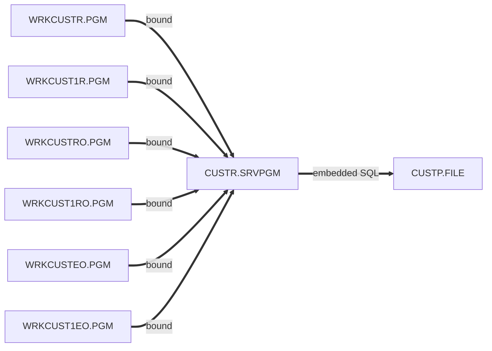
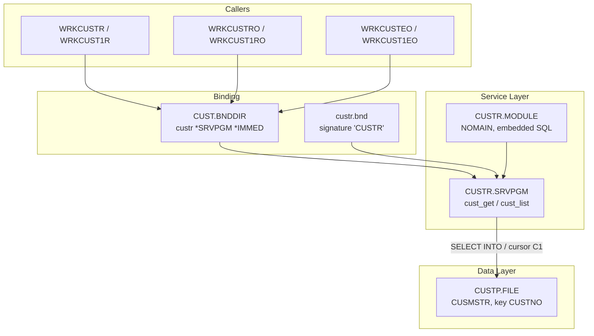
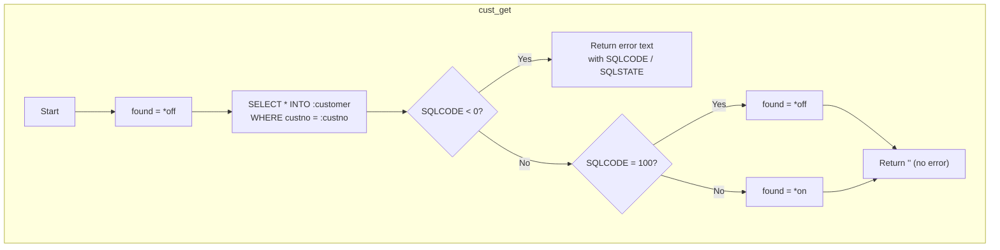
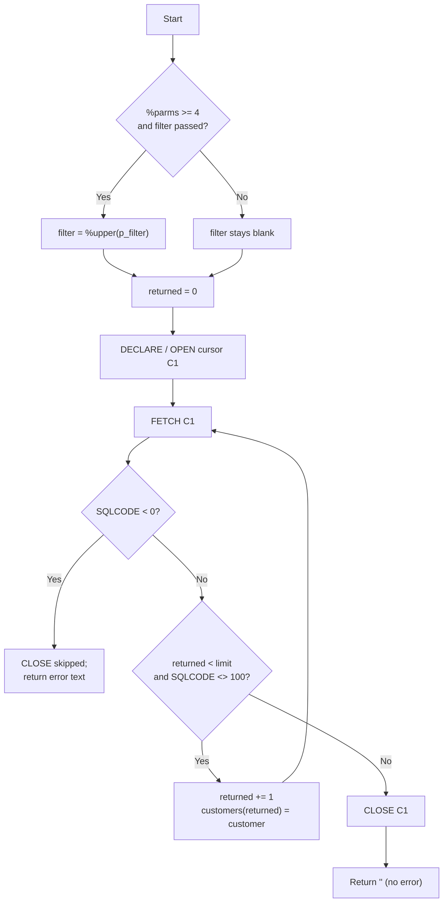

# CUSTR — Technical Documentation

|  |  |
|---|---|
| **Program** | CUSTR |
| **Type** | *MODULE → *SRVPGM (bound as `CUSTR.SRVPGM`) |
| **Language** | SQLRPGLE — ILE RPG free-form (`**FREE`) with embedded SQL |
| **Source** | `cfdemo/qrpglesrc/custr.sqlrpgle` (module), `cfdemo/qsrvsrc/custr.bnd` (export list) |
| **IBM i target release** | Not specified (TGTRLS defaults to the build machine's release) |
| **Version / Author / Date** | 1.0 / Claude (Opus 5) / 2026-08-19 |

### Revision History

| Version | Date | Author | Change | Ref |
|---|---|---|---|---|
| 1.0 | 2026-08-19 | Claude (Opus 5) | Initial documentation | — |

## 1. Overview

`CUSTR` is the **customer data service program** for the `cfdemo` application: the single place
where customer rows are read out of `CUSTP`. It is a `NOMAIN` module — there is no main
procedure and it cannot be `CALL`ed — exporting two procedures:

- `cust_get` — fetch one customer by number.
- `cust_list` — fetch an ordered, limited, optionally filtered list of customers.

All database access is **set-based embedded SQL**; no native record-level access (no `DCL-F`,
no `CHAIN`/`READ`). Every UI variant of the application (5250, Profound UI Rich Display, and EJS
screen mode) calls these same two procedures, which is the point of the design: six front ends,
one data path.

**How it is invoked:** statically bound procedure calls only. Callers `/copy custr_pr.rpgle` for the
prototypes and specify `ctl-opt bnddir('CUST')`; the `CUST` binding directory resolves `CUSTR` at
bind time and the service program is activated on first call.

## 2. Technical Specifications

**Control Options**

| Option | Value | Description |
|---|---|---|
| `NOMAIN` | (from `ctl-opt nomain`) | No main procedure; module contains only subprocedures. Implies `DFTACTGRP(*NO)` — it can only be bound into a program or service program. |
| `DFTACTGRP` | n/a | Not coded; a `NOMAIN` module cannot run in the default activation group |
| `ACTGRP` | *(not coded here)* | The activation group is fixed on the **`CRTSRVPGM`** command, not in source. codermake creates the service program without an `ACTGRP` override, so it takes the `CRTSRVPGM` default `ACTGRP(*CALLER)` — see §3. |
| `BNDDIR` | *(none)* | The module has no outbound bindings of its own |
| `OPTION` | *(compiler default)* | Not overridden in source |
| `THREAD` | *(not coded)* | Not declared thread-safe |

**SQL options** (set with `EXEC SQL SET OPTION`, so they apply to this module's SQL only)

| Option | Value | Why it matters |
|---|---|---|
| `COMMIT` | `*NONE` | No commitment control. Reads do not take commit locks and no commitment definition is started for the activation group. This is deliberate: `CUSTP` is a DDS physical file and is not journaled by the build. |
| `CLOSQLCSR` | `*ENDMOD` | Cursors and prepared statements are closed when the **module** ends, not when the first call returns. Cursor `C1` therefore stays open/reusable across calls within one activation, and is cleaned up when the activation group is reclaimed. |

**Input Parameters** — none at module level. Per-procedure parameters:

`cust_get(custno : customer : found)` → `varchar(80)`

| Parameter | Data Type | Length | Direction | Description |
|---|---|---|---|---|
| `custno` | Packed `like(cust_rec.custno)` | 6,0 | In (`const`) | Customer number to retrieve |
| `customer` | DS `likeds(cust_rec)` | 271 bytes | Out | Receives the row; **left unchanged when not found** |
| `found` | Indicator | 1 | Out | `*on` if a row was returned (`SQLCODE <> 100`) |
| *(return value)* | Varchar | 80 | Out | `''` on success, else `Error retrieving customer. SQLCODE = nnn, SQLSTATE = xxxxx` |

`cust_list(customers : limit : returned [: filter])` → `varchar(80)`

| Parameter | Data Type | Length | Direction | Description |
|---|---|---|---|---|
| `customers` | Array `like(cust_rec) dim(9999)` | 9999 × 271 bytes | Out | Rows written from element 1 upward |
| `limit` | Integer | 10i 0 | In (`const`) | Stop after this many rows |
| `returned` | Integer | 10i 0 | Out | Number of rows placed in `customers` |
| `filter` | Varchar | 50 | In (`const`, `options(*omit : *nopass)`) | Case-insensitive filter; omitted/blank returns everything |
| *(return value)* | Varchar | 80 | Out | `''` on success, else `Error retrieving customer list. SQLCODE = nnn, SQLSTATE = xxxxx` |

**Files Used**

| File | Type | Usage | Access | Description |
|---|---|---|---|---|
| `CUSTP` | DISK (via SQL) | Input | Set-based SQL (`SELECT`, cursor `C1`) | Customer master; referenced unqualified, resolved through the job's library list |

**Service Programs / Procedures Called**

| Service Program | Procedure | Bound/Dynamic | Description |
|---|---|---|---|
| *(SQL runtime)* | `QSQ*` internals | Bound by the SQL precompiler | Generated by `CRTSQLRPGI`; not referenced in source |

## 3. ILE Structure & Invocation

- **Activation group** — `CRTSRVPGM` is issued by codermake without an `ACTGRP` parameter, so the
  service program takes the default **`ACTGRP(*CALLER)`**: it activates inside whichever activation
  group its caller runs in. Every caller in this application specifies `ACTGRP(*NEW)`, so in
  practice `CUSTR` gets a fresh activation per program invocation, its SQL cursor state is private
  to that invocation, and it is reclaimed automatically when the calling program ends. Two nested
  callers (`WRKCUSTR` → `WRKCUST1R`) each run in their own `*NEW` group and therefore each get their
  **own** activation of `CUSTR` — nothing is shared between them, including cursor `C1`.
- **Binding** — static. Exports are controlled by a binder-language source member, so the
  signature is stable and callers do not need recompiling when unrelated procedures are added
  *at the end* of the export list.

  `cfdemo/qsrvsrc/custr.bnd`:

  ```
  strpgmexp pgmlvl(*current) signature('CUSTR           ')
    export symbol("CUST_GET")
    export symbol("CUST_LIST")
  endpgmexp
  ```

  The signature is the **fixed literal `'CUSTR           '`** (16 characters, blank-padded) rather
  than a generated hash. Consequence to understand before changing anything: because the signature
  never changes, the binder will *not* detect an incompatible interface change. If a parameter list
  is altered and only the service program is rebuilt, existing callers keep binding successfully and
  fail (or silently corrupt data) at runtime. Always rebuild all six callers with the service program.

  | Exported procedure | Signature |
  |---|---|
  | `CUST_GET` | `varchar(80) cust_get(packed(6:0) const; likeds(cust_rec); ind)` |
  | `CUST_LIST` | `varchar(80) cust_list(like(cust_rec) dim(9999); int(10) const; int(10); varchar(50) const options(*omit:*nopass))` |

- **Call hierarchy** — called by `WRKCUSTR`, `WRKCUST1R`, `WRKCUSTRO`, `WRKCUST1RO`, `WRKCUSTEO`,
  `WRKCUST1EO`. Calls nothing outside the SQL runtime.



## 4. Dependency Tree (text)

```
CUSTR.SRVPGM
├── Modules
│   └── CUSTR.MODULE
│       └── Source
│           ├── custr.sqlrpgle
│           └── custr_pr.rpgle        (/COPY member: cust_rec template + prototypes)
├── Export List
│   └── custr.bnd                     (binder language, signature 'CUSTR           ')
├── Binding Directory (published through)
│   └── CUST.BNDDIR                   (addbnddire obj((custr *srvpgm *immed)))
└── Database
    └── CUSTP.FILE (PF, keyed on CUSTNO, record format CUSMSTR)
```

## 5. Dependency Diagram (Mermaid)



## 6. Complete Object Dependency List

**Service Programs**

| Object | Type | Library | Source member | Description |
|---|---|---|---|---|
| `CUSTR` | *SRVPGM | `$IBMI_BUILD_LIBRARY` (e.g. `AITSK00104`) / `CFDEMO` | `qsrvsrc/custr.bnd` + `custr.module` | Customer data service |

**Modules**

| Object | Type | Library | Source member | Description |
|---|---|---|---|---|
| `CUSTR` | *MODULE | build library | `qrpglesrc/custr.sqlrpgle` | `NOMAIN` SQL data-access module |

**Physical Files**

| Object | Type | Library | Source member | Description |
|---|---|---|---|---|
| `CUSTP` | *FILE (PF) | *LIBL | `qddssrc/custp.pf` | Customer master |

**Binding Directories**

| Object | Type | Library | Source member | Description |
|---|---|---|---|---|
| `CUST` | *BNDDIR | build library | `cfdemo/cust.bnddir` | Publishes `CUSTR *SRVPGM *IMMED` to callers |

**Copy Members**

| Object | Type | Library | Source member | Description |
|---|---|---|---|---|
| `custr_pr` | Source | n/a | `qrpglesrc/custr_pr.rpgle` | `cust_rec` template + prototypes |

**Exported Procedures**

| Procedure | Return | Description |
|---|---|---|
| `CUST_GET` | `varchar(80)` | Retrieve one customer by number |
| `CUST_LIST` | `varchar(80)` | Retrieve a filtered/limited customer list |

## 7. Database Schema & Access (DB2 for i)

**`CUSTP` — Customer Master (record format `CUSMSTR`, DDS physical file)**

| Field | Type | Length | Dec | Null | Description |
|---|---|---|---|---|---|
| `CUSTNO` | Packed | 6 | 0 | N | Customer number (key) |
| `CNAME` | Char | 40 | | N | Customer name |
| `CADDR1` | Char | 40 | | N | Address line 1 |
| `CADDR2` | Char | 40 | | N | Address line 2 |
| `CCITY` | Char | 30 | | N | City |
| `CSTATE` | Char | 2 | | N | State code |
| `CZIP` | Char | 10 | | N | Zip / postal code |
| `CPHONE` | Char | 15 | | N | Phone number |
| `CEMAIL` | Char | 60 | | N | Email address |
| `CSTATUS` | Char | 1 | | N | Status: `A`=Active, `I`=Inactive, `S`=Suspended |
| `CTYPE` | Char | 1 | | N | Type: `B`=Business, `R`=Residential |
| `CLIMIT` | Packed | 11 | 2 | N | Credit limit |
| `CBALANCE` | Packed | 11 | 2 | N | Current balance |
| `CLASTORD` | Zoned | 8 | 0 | N | Last order date, `YYYYMMDD` |
| `CCREATED` | Zoned | 8 | 0 | N | Date created, `YYYYMMDD` |

Record length 271 bytes. DDS defines no nullable fields, so all columns are `NOT NULL`.

- **Keys & access paths** — `K CUSTNO`, a **non-unique** keyed access path (no `UNIQUE` keyword).
  `cust_get`'s `WHERE CUSTNO = :custno` can use that path directly; `cust_list`'s
  `ORDER BY CUSTNO` can be satisfied by it as well, though with a `LIKE '%…%'` predicate the
  optimizer will normally choose a table scan plus sort. Note that because the key is *not*
  unique, `cust_get`'s `SELECT … INTO` returns `SQLCODE +30` / `SQLSTATE 21000`
  ("more than one row") if duplicate customer numbers ever exist — a positive SQLCODE, which
  `checkError` (which only tests `sqlcode < 0`) does not report; `found` would still be set `*on`
  and `customer` would hold the first row returned. The data is expected to be unique by
  convention, not by constraint.
- **Referential integrity** — none defined in source. `ORDHDRP` / `ORDDTLP` exist in
  `cfdemo/qddssrc` but declare no constraints referencing `CUSTP`.
- **Triggers** — none defined in source.
- **Journaling** — not established by the build. `CUSTP` is created with `CRTPF`, which does not
  attach a journal; nothing in the sources issues `STRJRNPF`. (Only SQL-created tables in a task
  library pick up journaling automatically.)
- **Commitment control** — explicitly disabled: `SET OPTION COMMIT = *NONE`. There are no
  transaction boundaries, no `COMMIT`/`ROLLBACK`, and isolation is effectively read-uncommitted
  with respect to other jobs' uncommitted changes. Appropriate here because the module is
  read-only.

**SQL statements**

| # | Procedure | Statement | Notes |
|---|---|---|---|
| 1 | `cust_get` | `SELECT * INTO :customer FROM custp WHERE custno = :custno` | Whole-row fetch into the host DS. `SELECT *` relies on `cust_rec` matching `CUSTP` column-for-column — adding a column to `custp.pf` without recompiling breaks this at runtime (SQL0313/SQL0407-class errors). |
| 2 | `cust_list` | `DECLARE C1 CURSOR FOR SELECT * FROM custp WHERE :filter = '' OR (ucase(cname) LIKE '%'‖:filter‖'%' OR ucase(cemail) LIKE '%'‖:filter‖'%' OR cphone LIKE :filter‖'%') ORDER BY custno` | Non-scrollable, read-only, forward-only cursor |
| 3 | `cust_list` | `OPEN C1` / `FETCH C1 INTO :customer` (loop) / `CLOSE C1` | Row-at-a-time fetch into the host DS, copied into `customers(returned)` |

Filter semantics worth knowing: the caller's text is upper-cased in RPG (`%upper`) before it
reaches SQL, and matched against `UCASE(CNAME)` and `UCASE(CEMAIL)` as a **substring**, or against
`CPHONE` as a **prefix** (`CPHONE` is *not* upper-cased — it needs no case folding). Passing a
blank filter, `*OMIT`, or omitting the parameter all return the unfiltered list because of the
`:filter = ''` short-circuit.

## 8. Display File Layout

Not applicable — no workstation file.

## 9. Program Flow (Mermaid) & Key Routines





**Key procedures and subroutines**

| Routine | Kind | Purpose |
|---|---|---|
| `cust_get` | Exported procedure | Single-row retrieval by customer number |
| `cust_list` | Exported procedure | Filtered, ordered, limited list retrieval |
| `checkError` | Subroutine (one per procedure, local) | Tests `SQLCODE < 0`; on error `RETURN`s the formatted message straight out of the enclosing procedure |

`checkError` is a subroutine that executes a `RETURN`, so `EXSR checkError` doubles as "bail out on
SQL error". Two consequences: the cursor is **not** closed on the error path in `cust_list`
(cleanup is left to `CLOSQLCSR(*ENDMOD)` when the activation group ends), and the two `checkError`
subroutines are separate local copies — each procedure has its own.

## 10. Indicators Used

None. The module uses no numbered indicators; `found` is a named `ind` output parameter and control
flow is structured (`DOW`, `IF`, `SELECT`). SQL state is tested through `SQLCODE`/`SQLSTATE`, which
the precompiler supplies.

## 11. Error & Exception Handling

**Strategy — return codes, not exceptions.** Neither procedure uses `MONITOR`/`ON-ERROR`, a `*PSSR`,
a PSDS, or an INFDS. Both are written to be non-throwing for expected conditions and to hand the
caller a human-readable string:

| Condition | Detection | Result to caller |
|---|---|---|
| Row found | `SQLCODE <> 100` | `found = *on`, return value `''` |
| Row not found | `SQLCODE = 100` | `found = *off`, return value `''` — **not** an error |
| SQL failure (e.g. file not found, authority, decimal data error) | `SQLCODE < 0` in `checkError` | Return `'Error retrieving customer. SQLCODE = -nnn, SQLSTATE = xxxxx'` (or `'... customer list. ...'`), and the procedure exits immediately |
| Multiple rows for one `CUSTNO` | Not tested (`SQLCODE +30`) | Silently treated as success with the first row |

**Messages** — the module sends no program messages; it does not use `QMHSNDPM` and does not
signal escape messages. Callers decide how to surface the returned text: `WRKCUSTR` / `WRKCUSTRO`
put it in a message subfile via `QMHSNDPM`; `WRKCUSTEO` assigns it to the screen's `msg` field.

**Unhandled conditions** — an unexpected RPG runtime exception (for example a decimal data error
while copying a corrupt row into the array) is *not* trapped here and percolates to the caller's
default handler, producing an inquiry message and, unanswered, an RNX-series dump. If hardening is
wanted, a `MONITOR` around each SQL block plus a `*PSSR` in each procedure is the minimal change.

**Recovery** — all failures are read-side and non-destructive (no writes, no commitment control),
so the recovery procedure is: read the returned SQLCODE/SQLSTATE from the screen message, then check
the usual causes — `CUSTP` missing from the job's library list, no `*USE` authority to `CUSTP`, or
a `CUSTP` layout that no longer matches the compiled `cust_rec` template.

## 12. Security & Authority

- No adopted authority: `CRTSRVPGM` is issued without `USRPRF(*OWNER)`, so the service program runs
  under the **caller's** authority (`USRPRF(*USER)` default). A user who cannot read `CUSTP` gets an
  SQL failure returned as message text rather than a security exception at the screen.
- Object ownership is whichever profile ran the build (`$IBMI_USER`); public authority follows the
  build library's `CRTAUT`. No authorization list (`*AUTL`) is referenced in source.
- The module needs only `*USE` on `CUSTP`; it performs no updates, deletes or inserts.
- Data sensitivity: `CUSTP` holds names, addresses, email, phone, credit limit and balance. No
  field procedures, encryption or masking are defined, and the module returns whole rows to every
  caller — access control is entirely at the object level.

## 13. Interfaces & Integration

Not applicable — no data queues, data areas, web services, IFS or MQ usage. The only interface is
the bound procedure interface in §2.

## 14. Batch / Job Flow

Not applicable — activated on demand inside interactive callers.

## 15. Build & Compile

Build order: `custp.file` → `custr.module` → `custr.srvpgm` → `cust.bnddir` → callers.

```
CRTSQLRPGI OBJ(<LIB>/CUSTR) OBJTYPE(*MODULE) SRCSTMF('cfdemo/qrpglesrc/custr.sqlrpgle')
CRTSRVPGM  SRVPGM(<LIB>/CUSTR) MODULE(<LIB>/CUSTR) EXPORT(*SRCFILE) SRCSTMF('cfdemo/qsrvsrc/custr.bnd')
```

`Rules.mk`:

```makefile
custr.module: qrpglesrc/custr.sqlrpgle qrpglesrc/custr_pr.rpgle qddssrc/custp.pf | custp.file
custr.srvpgm: custr.module qsrvsrc/custr.bnd
cust.bnddir:  cust.bnddir
```

Build it with codermake — never issue the create commands by hand:

```bash
cd /workspace/workspace/ibmi-agentic
codermake custr.srvpgm
```

Notes that matter when building:

- The `.sqlrpgle` extension is what selects `CRTSQLRPGI`; the SQL precompile runs first and its
  diagnostics appear ahead of the RPG listing in `tmp/logs/custr.module.log`.
- `custp.file` is an **order-only** prerequisite: `CUSTP` must exist to compile (the `EXTNAME`
  template needs it), but a rebuild of the file does not force a module rebuild. Be careful not to
  rebuild `custp.file` casually in a task library — that creates an *empty* `CUSTP` that shadows the
  populated base-library copy.
- `cust.bnddir` is a CL-script source (`CRTBNDDIR` + `ADDBNDDIRE`), not a DDS member.

## 16. Related Programs

| Program | Description | Relationship |
|---|---|---|
| `WRKCUSTR` | 5250 customer list | Caller (`cust_get`, `cust_list`) |
| `WRKCUST1R` | 5250 customer detail | Caller (`cust_get`) |
| `WRKCUSTRO` | Rich Display customer list | Caller (`cust_get`, `cust_list`) |
| `WRKCUST1RO` | Rich Display customer detail | Caller (`cust_get`) |
| `WRKCUSTEO` | EJS customer list | Caller (`cust_get`, `cust_list`) |
| `WRKCUST1EO` | EJS customer detail | Caller (`cust_get`) |
| `custr_pr` | Prototype copy member | Declares this module's interface |

## 17. Testing Notes

The service program has no UI, so exercise it through a caller (menu option 1, 2 or 3) or a small
driver program. Scenarios:

| Scenario | Setup | Expected result |
|---|---|---|
| Get existing customer | Known `CUSTNO` in `CUSTP` | `found = *on`, return `''`, all 15 fields populated |
| Get missing customer | `CUSTNO` not in `CUSTP` | `found = *off`, return `''`, `customer` unchanged (caller must not display it) |
| List unfiltered | Blank filter | Rows returned in ascending `CUSTNO` order, `returned` ≤ `limit` |
| List with name filter | Filter matching part of a `CNAME`, mixed case | Case-insensitive substring match |
| List with email filter | Filter matching part of a `CEMAIL` | Case-insensitive substring match |
| List with phone filter | Leading digits of a `CPHONE` | Prefix match only — a middle-of-string phone fragment must **not** match |
| Limit honoured | `limit` smaller than the matching row count | Exactly `limit` rows, no error |
| No matches | Filter matching nothing | `returned = 0`, return `''` |
| SQL failure path | Remove `CUSTP` from the library list, or revoke `*USE` | Return text contains a negative SQLCODE and the SQLSTATE |

No automated (RPGUnit) tests exist in the repository. A `NOMAIN` module is a natural RPGUnit
target if test coverage is wanted later.

## 18. Version Information

| Attribute | Value |
|---|---|
| Source Format | Fully free-format (`**FREE`) |
| ILE Compatible | Yes (ILE only — `NOMAIN`) |
| Activation Group | `*CALLER` (CRTSRVPGM default; callers use `*NEW`) |
| Uses Embedded SQL | Yes (`CRTSQLRPGI OBJTYPE(*MODULE)`) |
| Multi-threaded | No (`THREAD` not declared) |
| Commitment Control | `*NONE` |
| Target Release (TGTRLS) | Compiler default (build machine's release) |
