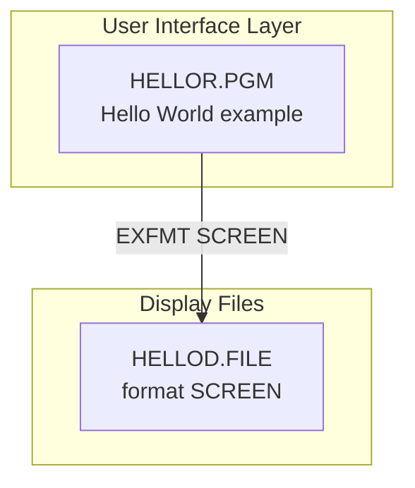
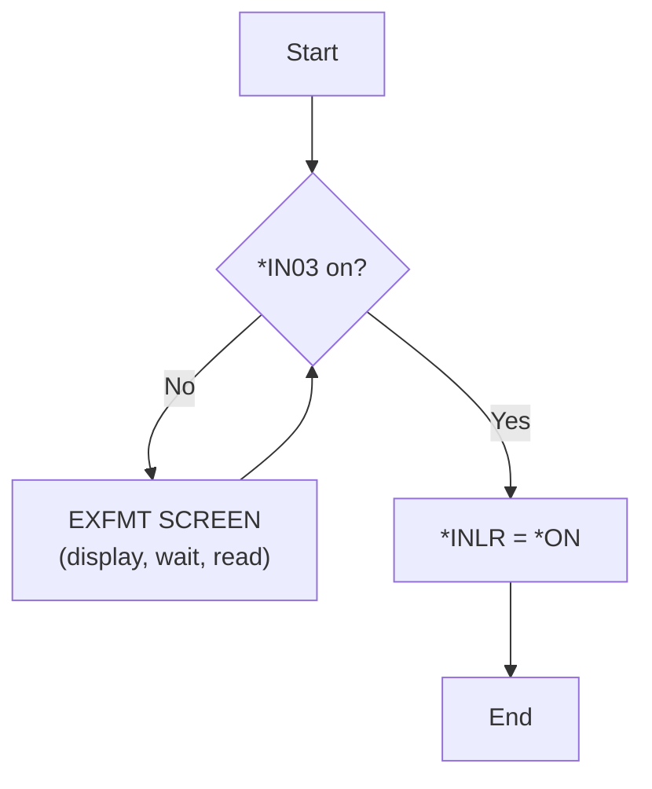

# HELLOR — Technical Documentation

|  |  |
|---|---|
| **Program** | HELLOR |
| **Type** | *PGM |
| **Language** | ILE RPG, fully free-format (`**FREE`) |
| **Source** | `cfdemo/qrpglesrc/hellor.rpgle` |
| **IBM i target release** | Not specified (TGTRLS defaults to the build machine's release) |
| **Version / Author / Date** | 1.0 / Claude (Opus 5) / 2026-08-19 |

### Revision History

| Version | Date | Author | Change | Ref |
|---|---|---|---|---|
| 1.0 | 2026-08-19 | Claude (Opus 5) | Initial documentation | — |

## 1. Overview

`HELLOR` is the smallest example in the `cfdemo` repository: a five-line "Hello World" program that
displays the `HELLOD` screen in a loop until F3 is pressed. Its purpose is to demonstrate the
minimum viable RPG + DDS pair and to give the build tooling a trivial target to verify against.

It is **not** wired to the `MENU` menu (which offers only options 1, 2, 3 and 90) and takes no
parameters, so it is reached by an explicit `CALL HELLOR` from a command line, an interactive
session, or a CL driver.

Behavioural note worth recording: the screen has an input field `NAME` and an output field
`MESSAGE`, but the program never reads `NAME` into anything or assigns `MESSAGE`. Whatever the user
types is returned by `EXFMT` into the field, then redisplayed unchanged on the next iteration, and
`MESSAGE` always stays blank. It is a display-only stub — if this is meant to greet the user, the
missing logic is the assignment of `MESSAGE`.

## 2. Technical Specifications

**Control Options**

No `CTL-OPT` statement is coded, so every control option takes its compiler default. The one that
matters:

| Option | Value | Description |
|---|---|---|
| `DFTACTGRP` | `*YES` (`CRTBNDRPG` default) | The program runs in the **default activation group** (OPM-compatible behaviour). It cannot bind to service programs, and it is not reclaimed by `RCLACTGRP`. |
| `ACTGRP` | n/a | Not applicable while `DFTACTGRP(*YES)` |
| `BNDDIR` | *(none)* | No bindings |
| `OPTION` | *(compiler default)* | Not overridden |
| `THREAD` | *(not coded)* | Not declared thread-safe |

**Input Parameters** — none. There is no `DCL-PI *ENTRY`; the program is called with no arguments.

**Files Used**

| File | Type | Usage | Access | Description |
|---|---|---|---|---|
| `HELLOD` | WORKSTN | Update (`EXFMT`) | Record format `SCREEN` | Single-format 24×80 display file |

No database files are used.

**Service Programs / Procedures Called** — none.

## 3. ILE Structure & Invocation

- **Activation group** — the default activation group (`DFTACTGRP(*YES)`). This is the only program
  in the repository that is not ILE-scoped; consequently it cannot be given a `BNDDIR` and cannot
  call the `CUSTR` service program. If it ever needs to, it must first be changed to
  `ctl-opt dftactgrp(*no) actgrp(*new);` like the other programs here.
- **Binding** — none. Built directly from source with `CRTBNDRPG`; no modules, no service programs.
- **Call hierarchy** — no callers in the repository (not on the menu, not called by any other
  source member); calls nothing.

## 4. Dependency Tree (text)

```
HELLOR.PGM
├── Source
│   └── hellor.rpgle
└── Display Files
    └── HELLOD.FILE  (DSPF, format SCREEN)
```

## 5. Dependency Diagram (Mermaid)



## 6. Complete Object Dependency List

**Programs**

| Object | Type | Library | Source member | Description |
|---|---|---|---|---|
| `HELLOR` | *PGM | `$IBMI_BUILD_LIBRARY` (e.g. `AITSK00104`) / `CFDEMO` | `cfdemo/qrpglesrc/hellor.rpgle` | Hello World example |

**Display Files**

| Object | Type | Library | Source member | Description |
|---|---|---|---|---|
| `HELLOD` | *FILE (DSPF) | build library | `cfdemo/qddssrc/hellod.dspf` | Single-format example screen |

No modules, service programs, logical files, data areas, data queues, message files or copy members
are involved.

## 7. Database Schema & Access (DB2 for i)

Not applicable — no database access.

## 8. Display File Layout

`HELLOD`, `DSPSIZ(24 80 *DS3)`, one record format: `SCREEN`.

```
 1 Hello World Example
 2
 3  Enter your name:  [________________________________________________]
 4
 5  MESSAGE (70 characters, output — never populated by the program)
 ...
23 F3=Exit
```

| Field | Length | Type (I/O/Both) | Row/Col | Description |
|---|---|---|---|---|
| `NAME` | 50A | I (input only) | 3, 19 | Name entry; `CHECK(LC)` allows lower case |
| `MESSAGE` | 70A | O (output only) | 5, 2 | Intended for the greeting; left blank by the program |

**Constants / attributes**

| Row/Col | Text | Attribute |
|---|---|---|
| 1, 2 | `Hello World Example` | `COLOR(WHT)` |
| 3, 2 | `Enter your name:` | default |
| 23, 1 | `F3=Exit` | `COLOR(BLU)` |

**Keyword highlights** — `CA03(03 'Exit')` sets `*IN03` when F3 is pressed. `CA` (rather than `CF`)
means the input fields are **not** returned to the program on F3 — appropriate here since the loop
simply ends. `CHECK(LC)` on `NAME` permits mixed-case entry (without it the workstation would fold
to upper case). No subfiles, no windows, no validity-checking keywords, no edit codes.

## 9. Program Flow (Mermaid) & Key Routines



No subroutines or subprocedures — the entire program is the main body.

## 10. Indicators Used

| Indicator | Purpose |
|---|---|
| `*IN03` | Set by `CA03` when F3 is pressed; terminates the `DOW` loop |
| `*INLR` | Set `*ON` at the end so the program closes its file and returns cleanly |

No other indicators are used, and the program declares no named indicators.

## 11. Error & Exception Handling

**None is coded.** There is no `MONITOR`/`ON-ERROR`, no `*PSSR`, no PSDS or INFDS, and no `(E)`
error extenders. Any exception — the most likely being a workstation-file open failure if `HELLOD`
is not in the library list, or a device error if the session is dropped mid-`EXFMT` — percolates to
the RPG default handler, producing an inquiry message (`RNQ`-series) and a formatted dump if the
inquiry is not answered `G`.

Recovery is simply to end the program and re-`CALL` it after correcting the library list. For a
program this size the absence of handling is acceptable; if it is used as a template for real work,
add a `*PSSR`.

## 12. Security & Authority

No adopted authority (`USRPRF(*USER)` default), no authorization list, no sensitive data. The caller
needs `*USE` on `HELLOR` and `HELLOD`. Object ownership is the building profile (`$IBMI_USER`);
public authority follows the build library's `CRTAUT`.

## 13. Interfaces & Integration

Not applicable.

## 14. Batch / Job Flow

Not applicable — interactive only; it requires a workstation device and cannot run in batch.

## 15. Build & Compile

```
CRTDSPF    FILE(<LIB>/HELLOD) SRCFILE(<LIB>/QDDSSRC)
CRTBNDRPG  PGM(<LIB>/HELLOR) SRCSTMF('cfdemo/qrpglesrc/hellor.rpgle')
```

`Rules.mk`:

```makefile
hellod.file: qddssrc/hellod.dspf
hellor.pgm:  qrpglesrc/hellor.rpgle qddssrc/hellod.dspf | hellod.file
```

Build with codermake — never issue the create commands by hand:

```bash
cd /workspace/workspace/ibmi-agentic
codermake hellor.pgm
```

`hellod.dspf` appears twice on purpose: as a **normal** prerequisite (edit the DDS and the program
recompiles, picking up the new record format) and as an **order-only** prerequisite via
`hellod.file` (the display file object must exist before the program compiles, but rebuilding the
object alone does not force a program rebuild).

## 16. Related Programs

| Program | Description | Relationship |
|---|---|---|
| `TN510L` | Minimal ILE COBOL example (`cfdemo/qcbllesrc/tn510l.cblle`) | Alternate — the COBOL equivalent of this "smallest possible program" example |

No caller/callee relationships exist.

## 17. Testing Notes

| Scenario | Steps | Expected result |
|---|---|---|
| Screen displays | `CALL HELLOR` from a 5250 session | "Hello World Example" heading, name prompt, `F3=Exit` on line 23 |
| Loop persists | Type a name, press Enter | Screen redisplays; typed text is still in `NAME`; `MESSAGE` remains blank |
| Exit works | Press F3 | Program ends, session returns to the caller |
| Lower case allowed | Type `mixed Case` and press Enter | Text is preserved as typed (`CHECK(LC)`) |

No automated tests exist.

## 18. Version Information

| Attribute | Value |
|---|---|
| Source Format | Fully free-format (`**FREE`) |
| ILE Compatible | Yes (built with `CRTBNDRPG`, but runs in the default activation group) |
| Activation Group | Default activation group (`DFTACTGRP(*YES)`) |
| Uses Embedded SQL | No |
| Multi-threaded | No |
| Target Release (TGTRLS) | Compiler default (build machine's release) |
