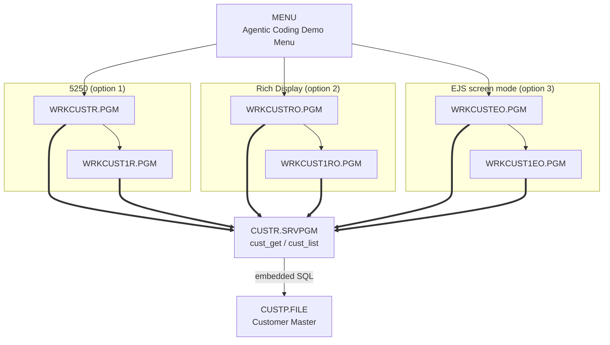

# cfdemo RPG Technical Documentation

Technical reference documents for every source member in `cfdemo/qrpglesrc`, generated from the
sources in this repository (no IBM i object interrogation). Each document follows the same 18-section
structure: overview, technical specifications, ILE structure, dependency tree and diagram, object
list, database access, screen layout, program flow, indicators, error handling, security, interfaces,
build, related programs, testing notes and version information.

## Documents

| Object | Type | Document | What it is |
|---|---|---|---|
| `CUSTR` | *MODULE → *SRVPGM | [CUSTR_Technical_Documentation.md](CUSTR_Technical_Documentation.md) | Customer data service program — the only code that touches `CUSTP` (embedded SQL, `NOMAIN`) |
| `custr_pr` | /COPY member | [CUSTR_PR_Technical_Documentation.md](CUSTR_PR_Technical_Documentation.md) | Shared `cust_rec` template and the `cust_get` / `cust_list` prototypes |
| `WRKCUSTR` | *PGM | [WRKCUSTR_Technical_Documentation.md](WRKCUSTR_Technical_Documentation.md) | Work with Customers — 5250 subfile list (menu option 1) |
| `WRKCUST1R` | *PGM | [WRKCUST1R_Technical_Documentation.md](WRKCUST1R_Technical_Documentation.md) | Customer detail — 5250 panel + error window |
| `WRKCUSTRO` | *PGM | [WRKCUSTRO_Technical_Documentation.md](WRKCUSTRO_Technical_Documentation.md) | Work with Customers — Profound UI Rich Display grid (menu option 2) |
| `WRKCUST1RO` | *PGM | [WRKCUST1RO_Technical_Documentation.md](WRKCUST1RO_Technical_Documentation.md) | Customer detail — Rich Display panel + error window |
| `WRKCUSTEO` | *PGM | [WRKCUSTEO_Technical_Documentation.md](WRKCUSTEO_Technical_Documentation.md) | Work with Customers — EJS screen mode (menu option 3) |
| `WRKCUST1EO` | *PGM | [WRKCUST1EO_Technical_Documentation.md](WRKCUST1EO_Technical_Documentation.md) | Customer detail — EJS screen mode |
| `HELLOR` | *PGM | [HELLOR_Technical_Documentation.md](HELLOR_Technical_Documentation.md) | Hello World example (not on the menu) |

## How the application fits together

Three front ends, one service layer, one file. The list/detail RPG logic is deliberately near-identical
across the three variants — `WRKCUSTRO` differs from `WRKCUSTR` in four lines and `WRKCUST1RO` differs
from `WRKCUST1R` in one — so the diffs isolate what modernization actually costs on the program side.
The EJS pair goes further and drops indicators entirely in favour of named `action` / `msg` fields.

## Cross-cutting notes

Points that apply to more than one object, each covered in detail in the individual documents:

- **Data path** — no program does its own database I/O; everything goes through `cust_get` / `cust_list`.
- **Fixed export signature** — `custr.bnd` hard-codes `signature('CUSTR           ')`, so the binder
  cannot detect an incompatible interface change. Rebuild the service program **and** all six callers
  together.
- **Field truncation** — the 5250 and Rich Display lists show `SNAME(20)` / `SEMAIL(25)` from 40- and
  60-character columns while the filter matches full values, so a match can be invisible. The EJS list
  uses full widths.
- **Date handling** — the detail programs run `%date()` over 8-digit zoned date columns with no
  `MONITOR`; a zero or invalid date is an unhandled `RNQ0114`.
- **Edit mode is designed but not implemented** — `WRKCUST1R` / `WRKCUST1RO` carry a complete
  `*IN30` protect/unprotect scheme (and, in the Rich Display file, Save/Cancel buttons), but the
  programs always set `*IN30` off and no update procedure exists in `CUSTR`.
- **EJS assets are not deployed by codermake** — the templates, CSS and JS under
  `docs/htdocs/profoundui/userdata/ui/wrkcuste/` must be copied to the Profound UI document root, or the
  screens render blank while the programs run normally.

## Source of truth

| Kind | Location |
|---|---|
| RPG / SQLRPGLE | `cfdemo/qrpglesrc/` |
| DDS display and physical files | `cfdemo/qddssrc/*.dspf`, `*.pf`, `*.lf` |
| Rich Display / EJS screen definitions | `cfdemo/qddssrc/*.json` |
| Binder language | `cfdemo/qsrvsrc/custr.bnd` |
| Binding directory / message file scripts | `cfdemo/cust.bnddir`, `cfdemo/menu.msgf` |
| Build rules | `cfdemo/Rules.mk` (build with `codermake <target>`; never edit generated Makefiles) |
| EJS client assets | `docs/htdocs/profoundui/userdata/ui/wrkcuste/` |

The COBOL members in `cfdemo/qcbllesrc` (`tn510l.cblle`, `inq01l.cblle`) are outside the scope of this
set, which covers `qrpglesrc` only.
