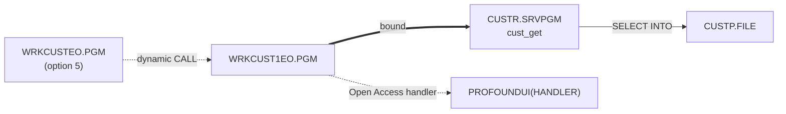
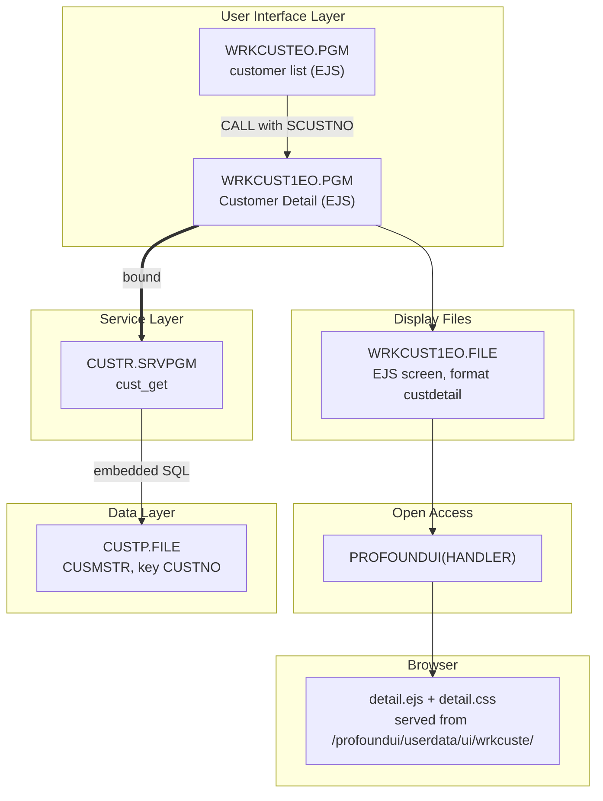
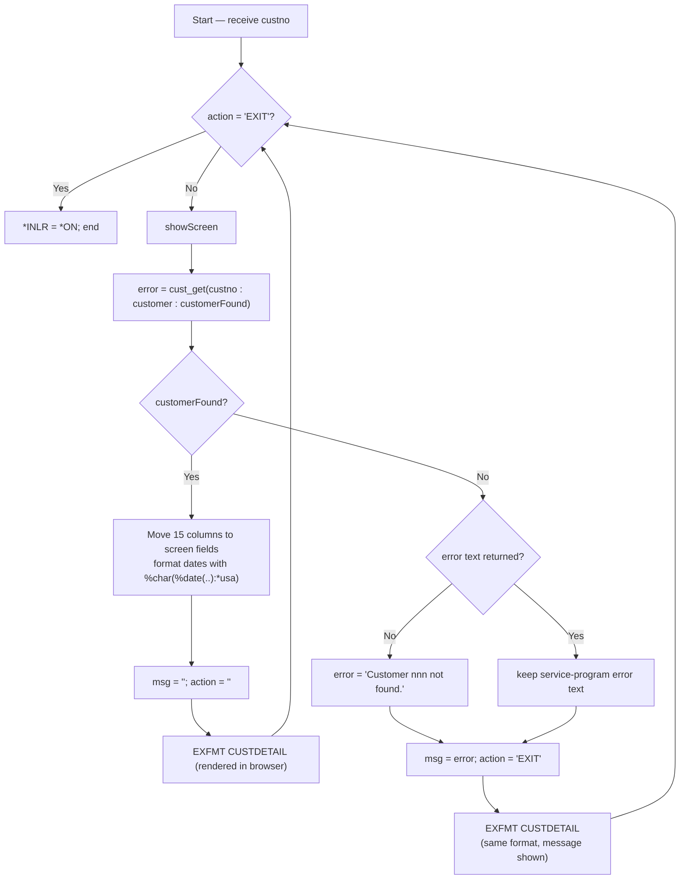

# WRKCUST1EO — Technical Documentation

|  |  |
|---|---|
| **Program** | WRKCUST1EO |
| **Type** | *PGM |
| **Language** | ILE RPG, fully free-format (`**FREE`) — RPG Open Access |
| **Source** | `cfdemo/qrpglesrc/wrkcust1eo.rpgle` |
| **IBM i target release** | Not specified (TGTRLS defaults to the build machine's release) |
| **Version / Author / Date** | 1.0 / Claude (Opus 5) / 2026-08-19 |

### Revision History

| Version | Date | Author | Change | Ref |
|---|---|---|---|---|
| 1.0 | 2026-08-19 | Claude (Opus 5) | Initial documentation | — |

## 1. Overview

`WRKCUST1EO` is the **EJS screen-mode** customer-detail program. It receives a customer number,
retrieves the row through `CUSTR`, and hands the fifteen column values to an EJS template
(`detail.ejs`) that renders them as a card-based web page. Compared with the 5250 and Rich Display
detail programs it is the simplest of the three:

| Aspect | `WRKCUST1R` / `WRKCUST1RO` | `WRKCUST1EO` |
|---|---|---|
| Indicators | `*IN03`, `*IN30` | **none** |
| Exit | `*IN03` from F3 | `action = 'EXIT'` |
| Not-found handling | Separate `ERRORWIN` window format | Same `custdetail` format with `msg` populated |
| Record formats | 2 | 1 |
| Protect/unprotect scheme | `*IN30` → `DSPATR(PR)` / `read only` | none needed — the template renders values as text, not inputs |

**How it is invoked:** a dynamic program call from `WRKCUSTEO` when a row is submitted with option
`5`, passing that row's `SCUSTNO`. One required parameter, no menu entry.

## 2. Technical Specifications

**Control Options**

| Option | Value | Description |
|---|---|---|
| `DFTACTGRP` | `*NO` | ILE program |
| `ACTGRP` | `*NEW` | Fresh activation group per call, reclaimed on return |
| `BNDDIR` | `'CUST'` | Binds `CUSTR *SRVPGM` |
| `OPTION` | *(compiler default)* | Not overridden |
| `THREAD` | *(not coded)* | Not declared thread-safe |

**Input Parameters**

| Parameter | Data Type | Length | Direction | Description |
|---|---|---|---|---|
| `custno` | Packed (`like(cust_rec.custno)`) | 6,0 | **In** (`const`) | Customer number to display |

**Files Used**

| File | Type | Usage | Access | Description |
|---|---|---|---|---|
| `WRKCUST1EO` | WORKSTN (EJS screen, Open Access) | Update (`EXFMT`) | `HANDLER('PROFOUNDUI(HANDLER)')`; one format, `custdetail` | Browser-rendered detail page |
| `CUSTP` | DISK | Input (indirect) | Set-based SQL inside `CUSTR` | Never declared here |

The program object and the display file object share the name `WRKCUST1EO`.

**Service Programs / Procedures Called**

| Service Program | Procedure | Bound/Dynamic | Description |
|---|---|---|---|
| `CUSTR` | `cust_get` | Bound (via `BNDDIR('CUST')`) | Retrieve one customer row |
| `PROFOUNDUI` | `HANDLER` | Open Access handler, resolved at run time | Renders the EJS screen in the browser |

No local subprocedures.

## 3. ILE Structure & Invocation

- **Activation group** — `ACTGRP(*NEW)`; the handler activates in the same group and is reclaimed with
  it, so each drill-down re-activates both the handler and `CUSTR`.
- **Binding** — static bind to `CUSTR` through `CUST.BNDDIR`; prototypes from
  `/copy custr_pr.rpgle`. The handler name and the template URL are both resolved at run time, so
  neither is validated by the compiler.
- **Call hierarchy**



## 4. Dependency Tree (text)

```
WRKCUST1EO.PGM
├── Source
│   ├── wrkcust1eo.rpgle
│   └── custr_pr.rpgle               (/COPY member: cust_rec template + prototypes)
├── Display Files
│   └── WRKCUST1EO.FILE              (EJS screen file, ENHDSP(*YES), generated from
│                                     qddssrc/wrkcust1eo.json — format custdetail)
├── Client-side assets (IFS, served by the Profound UI HTTP instance)
│   ├── /profoundui/userdata/ui/wrkcuste/detail.ejs    (docs/htdocs/... in the repo)
│   └── /profoundui/userdata/ui/wrkcuste/detail.css
├── Service Programs
│   ├── CUSTR.SRVPGM                 (cust_get)
│   └── PROFOUNDUI.SRVPGM            (Open Access handler — third party, run-time)
├── Binding Directory
│   └── CUST.BNDDIR
└── Database
    └── CUSTP.FILE (PF, key CUSTNO) — accessed only through CUSTR.SRVPGM
```

## 5. Dependency Diagram (Mermaid)



## 6. Complete Object Dependency List

**Programs**

| Object | Type | Library | Source member | Description |
|---|---|---|---|---|
| `WRKCUST1EO` | *PGM | `$IBMI_BUILD_LIBRARY` (e.g. `AITSK00104`) / `CFDEMO` | `cfdemo/qrpglesrc/wrkcust1eo.rpgle` | Customer detail (EJS) |

**Service Programs**

| Object | Type | Library | Source member | Description |
|---|---|---|---|---|
| `CUSTR` | *SRVPGM | build library | `qrpglesrc/custr.sqlrpgle` + `qsrvsrc/custr.bnd` | Customer data service |
| `PROFOUNDUI` | *SRVPGM | Profound UI product library (via *LIBL) | *(third party — source not available; documented from reference only)* | Open Access handler |

**Display Files**

| Object | Type | Library | Source member | Description |
|---|---|---|---|---|
| `WRKCUST1EO` | *FILE (DSPF, `ENHDSP(*YES)`) | build library | `cfdemo/qddssrc/wrkcust1eo.json` | EJS screen definition — see §8 |

**Physical Files**

| Object | Type | Library | Source member | Description |
|---|---|---|---|---|
| `CUSTP` | *FILE (PF) | *LIBL | `cfdemo/qddssrc/custp.pf` | Customer master (via `CUSTR`) |

**Binding Directories**

| Object | Type | Library | Source member | Description |
|---|---|---|---|---|
| `CUST` | *BNDDIR | build library | `cfdemo/cust.bnddir` | Resolves `CUSTR` |

**Copy Members**

| Object | Type | Library | Source member | Description |
|---|---|---|---|---|
| `custr_pr` | Source | n/a | `cfdemo/qrpglesrc/custr_pr.rpgle` | `cust_rec` template + prototypes |

**IFS assets** (not IBM i objects, and **not deployed by codermake** — see §15)

| Path in repo | Deployed path | Description |
|---|---|---|
| `docs/htdocs/profoundui/userdata/ui/wrkcuste/detail.ejs` | `/profoundui/userdata/ui/wrkcuste/detail.ejs` | Detail screen template |
| `.../detail.css` | same | Detail screen styling |

No `js` file is declared for this format.

## 7. Database Schema & Access (DB2 for i)

No direct database access — one `cust_get` per display. Column-to-field mapping, with the JSON
declarations and what the template does with each value:

| `CUSTP` field | Type | Screen field | JSON type | Rendered as |
|---|---|---|---|---|
| `CUSTNO` | Packed 6,0 | `scustno` | zoned 6 | `#123456` badge next to the heading |
| `CNAME` | Char 40 | `sname` | char 40 | *Name* value |
| `CTYPE` | Char 1 | `stype` | char 1 | Decoded in the template: `B` → `Business`, `R` → **`Retail`**, anything else shown raw |
| `CSTATUS` | Char 1 | `sstatus` | char 1 | `A` → `Active`, `I` → `Inactive`, `S` → `Suspended`, plus a `status-<code>` CSS class |
| `CLIMIT` | Packed 11,2 | `slimit` | **packed** 11,2 | `$` + `Number(...).toLocaleString('en-US', {minimumFractionDigits: 2})` — thousands separators |
| `CBALANCE` | Packed 11,2 | `sbalance` | **packed** 11,2 | Same currency formatting |
| `CLASTORD` | Zoned 8,0 | `slastord` | char 10 | Program formats `%char(%date(...) : *usa)` |
| `CCREATED` | Zoned 8,0 | `screated` | char 10 | Same |
| `CADDR1` / `CADDR2` | Char 40 | `saddr1` / `saddr2` | char 40 | Address block; line 2 rendered only when non-blank |
| `CCITY` | Char 30 | `scity` | char 30 | `City, ST ZIP` line |
| `CSTATE` | Char 2 | `sstate` | char 2 | |
| `CZIP` | Char 10 | `szip` | char 10 | |
| `CEMAIL` | Char 60 | `semail` | char 60 | **Full length** — no truncation, unlike the 40-character 5250/Rich Display fields |
| `CPHONE` | Char 15 | `sphone` | char 15 | |

- **Key & access path** — `cust_get` selects on `CUSTNO`, `CUSTP`'s non-unique keyed access path.
- **Referential integrity / triggers / journaling** — none defined in source.
- **Commitment control** — none; read-only program with `COMMIT(*NONE)` in `CUSTR`.

Three presentation differences from the other variants, all decided in the template rather than the
program, and all worth knowing when the three screens are compared side by side:

1. **`R` is labelled `Retail`** here, while `custp.pf` documents `Customer Type R/B` and both DDS
   screens print the legend `(B=Business, R=Residential)`. One of the two labels is wrong; the DDS
   wording and the file's own `TEXT` keyword agree with each other, so `Retail` in `detail.ejs` looks
   like the odd one out.
2. **Money is formatted with thousands separators and a `$` sign**, whereas `EDTCDE(P)` on the 5250
   panel deliberately prints no separators.
3. **`slimit` / `sbalance` are declared `packed`** in `wrkcust1eo.json` but `zoned` in the Rich Display
   equivalent. Both work because the program assigns from the packed `cust_rec` subfields, but it is a
   real inconsistency between the two JSON definitions.

**Date-conversion risk** (identical to the other detail programs): `%date()` on the 8-digit zoned date
columns assumes `*ISO`; a `0` or invalid value raises an unhandled `RNQ0114` rather than showing a blank
date. There is no `MONITOR` around it.

## 8. Display File Layout

`WRKCUST1EO` is an **EJS-type Rich Display source**: `cfdemo/qddssrc/wrkcust1eo.json` declares
`"type": "ejs"` plus, per format, the template and CSS URLs and a flat field list. codermake converts it
to DDS and compiles it `ENHDSP(*YES)`; the layout lives in `detail.ejs`.

**Format `custdetail`** — "Customer Detail"

| Asset | Path |
|---|---|
| `template` | `/profoundui/userdata/ui/wrkcuste/detail.ejs` |
| `css` | `/profoundui/userdata/ui/wrkcuste/detail.css` |
| `js` | *(none declared)* |

| Field | Type | Length | Dec | Direction in practice | Description |
|---|---|---|---|---|---|
| `action` | char | 10 | | Both | Command channel; template sends `EXIT` |
| `scustno` | zoned | 6 | 0 | Output | Customer number |
| `sname` | char | 40 | | Output | Name |
| `stype` | char | 1 | | Output | Customer type |
| `sstatus` | char | 1 | | Output | Customer status |
| `slimit` | packed | 11 | 2 | Output | Credit limit |
| `sbalance` | packed | 11 | 2 | Output | Balance due |
| `slastord` | char | 10 | | Output | Last order date (pre-formatted) |
| `screated` | char | 10 | | Output | Created date (pre-formatted) |
| `saddr1` | char | 40 | | Output | Address line 1 |
| `saddr2` | char | 40 | | Output | Address line 2 |
| `scity` | char | 30 | | Output | City |
| `sstate` | char | 2 | | Output | State |
| `szip` | char | 10 | | Output | Zip |
| `semail` | char | 60 | | Output | Email |
| `sphone` | char | 15 | | Output | Phone |
| `msg` | char | 78 | | Output | Message line — carries the not-found / SQL error text |

Every field except `action` is output-only in practice: the template renders them inside `<span>`
elements, so there is nothing for the user to type into and nothing to read back. That is why this
program needs no `*IN30` protect scheme.

**Rendered layout** (`detail.ejs`)

```
┌────────────────────────────────────────────────────────────────────┐
│ Customer Detail        #123456                                     │
│                                                                    │
│ ‹ error message — shown only when msg is non-blank ›               │
│                                                                    │
│ ┌── Customer Information ──┐  ┌── Financial ──────────────────┐    │
│ │ Name    ACME INDUSTRIES  │  │ Credit Limit  $50,000.00      │    │
│ │ Type    Business         │  │ Balance Due   $12,345.67      │    │
│ │ Status  Active           │  │ Last Order    03/14/2026      │    │
│ └──────────────────────────┘  │ Created       01/02/2019      │    │
│                               └───────────────────────────────┘    │
│ ┌── Contact ───────────────┐  ┌── Address ────────────────────┐    │
│ │ Email  orders@acme.…     │  │ 100 MAIN ST                   │    │
│ │ Phone  555-0100          │  │ SUITE 400                     │    │
│ └──────────────────────────┘  │ SPRINGFIELD, IL 62704         │    │
│                               └───────────────────────────────┘    │
│                                                   [ Back (F3) ]    │
└────────────────────────────────────────────────────────────────────┘
```

Template mechanics worth knowing:

- **Submit channel** — `<input type="hidden" name="action" value="">` plus one button calling
  `pui.submit({action: 'EXIT'})`, tagged `data-fkey="F3"`. `EXIT` is the only action the screen sends.
- **Defensive field references** — `msg` and `saddr2` are guarded with
  `typeof x !== 'undefined' && x && x.trim()`. This matters because in an EJS screen a reference to a
  field the format does not declare throws and aborts the entire render (blank screen, no error message),
  so every identifier in the template must exist in the JSON field list.
- **Lower-case field names** — the handler exposes DDS field names in lower case, which is why the JSON
  and template both use `scustno`, `slimit`, `msg`.
- **Renders correctly without JavaScript** — no `js` file is declared and the template needs none, which
  makes this the most robust of the three detail screens in a browser session.
- **Deployment coupling** — the template and CSS are fetched from the Profound UI document root, are not
  part of the display file object, and are not deployed by codermake. Missing assets produce a blank
  screen while the program runs normally; after editing an asset, expect to cache-bust the URL.

## 9. Program Flow (Mermaid) & Key Routines



**Key routines**

| Routine | Kind | Purpose |
|---|---|---|
| `showScreen` | Subroutine | Re-reads the customer via `cust_get`; on success moves all columns and displays the panel; on failure puts the message in `msg` and displays the same panel |

There is no `endError` subroutine — the not-found path reuses `custdetail` instead of a separate window
format, which is why this program has one format where the other two have two.

**Refresh semantics** — `showScreen` runs on every pass, so any submit that is not `EXIT` re-reads the
row and redisplays current data.

**Exit behaviour — a real subtlety.** On the not-found path the program sets `action = 'EXIT'` *before*
`EXFMT`. That assignment does **not** cause the loop to end, because `EXFMT` writes the format and then
reads the screen back, overwriting `action` with whatever the browser returns — and `detail.ejs`
initialises the hidden input to `''`. In practice the program leaves the loop only when the user clicks
`Back (F3)`, which submits `action = 'EXIT'`. So the not-found screen is displayed and stays displayed
until the user dismisses it (each submit re-attempts the read and redisplays the same message) rather
than ending on its own. That is benign — it waits for input rather than spinning — but it is not what the
pre-assignment suggests, and it differs from the 5250/Rich Display variants, which genuinely end after
their error window is dismissed. If the intent was "show the error, then leave", the exit has to be
driven by a separate field the screen does not overwrite (or checked before the field is re-read).

## 10. Indicators Used

**None.** No numbered indicators at all, not even `*IN03`. Screen state travels in named character
fields:

| Named condition field | Values | Purpose |
|---|---|---|
| `action` | `''`, `'EXIT'` | Command from the template; `EXIT` ends the program |
| `msg` | free text | Error line (not-found or SQL failure) |

`*INLR` is set `*ON` at the end so the program closes down cleanly. Because the template renders values
as text rather than inputs, there is no need for the `*IN30` protect/unprotect scheme that both other
detail programs carry.

## 11. Error & Exception Handling

**Strategy — error text as data in a single message field, displayed on the normal panel.** No
`MONITOR`/`ON-ERROR`, no `*PSSR`, no PSDS, no INFDS, no `(E)` extenders.

| Condition | Detection | User sees | Recovery |
|---|---|---|---|
| Customer not found | `customerFound = *off` and `cust_get` returned `''` | `custdetail` with `msg` = `Customer nnn not found.`; all value fields hold whatever the previous pass left | Click `Back (F3)` to return to the list |
| Service-program/SQL failure | `cust_get` returned non-blank text | Same panel with `Error retrieving customer. SQLCODE = ..., SQLSTATE = ...` | Check library list, authority, `CUSTP` layout |
| Invalid or zero date | **not handled** | `RNQ0114` inquiry then dump | Correct the data, or guard the `%date` calls |
| `PROFOUNDUI` handler missing / wrong FP level | **not handled** | Escape message on the first `EXFMT`, or a blank screen | Environmental |
| Missing / stale IFS assets | **not handled** | Blank or outdated screen with the program running | Deploy `detail.ejs` / `detail.css`; cache-bust the URLs |
| Workstation/device error, missing display file | **not handled** | Default handler inquiry then `RNX` dump | Fix the library list and re-call |

The error variable is `varchar(210)` while `msg` is `char(78)`, so a long service-program message is
**truncated to 78 characters** on the way to the screen. The `varchar(80)` values `CUSTR` returns fit
comfortably, but a longer locally built message would be cut.

Precedence is deliberate and correct: a non-blank service-program message is preserved, and
`'Customer nnn not found.'` is only substituted when the service program reported no error — so an SQL
failure is never mislabelled as a missing customer.

One presentation weakness on the not-found path: the program populates `msg` but does **not** clear the
value fields, so the page shows the error alongside the previously displayed customer's data (or blanks
on the first pass). The other two variants avoid this by using a separate error window.

Nothing is written to the database, so no failure requires a back-out.

## 12. Security & Authority

- No adopted authority; runs with the caller's authority.
- Required authority: `*USE` on `WRKCUST1EO` (program and display file), `CUSTR`, `CUSTP` and the
  Profound UI product objects, plus `*EXECUTE` on the libraries.
- The Profound UI HTTP instance and the IFS document root are part of the perimeter: `detail.ejs` is
  served to the browser, and write access to `/profoundui/userdata/ui/wrkcuste/` is effectively code
  deployment authority — a modified template changes what the screen renders and submits.
- **Sensitive data:** this is the most exposing screen of the EJS pair — credit limit and outstanding
  balance next to full contact details, at full column width, unmasked, with no audit-journal record of
  viewing. The values are present in the rendered HTML, so browser-level access equals data access.

## 13. Interfaces & Integration

| Interface | Direction | Format | Trigger |
|---|---|---|---|
| Open Access handler `PROFOUNDUI(HANDLER)` | Bidirectional | Field values | Every `EXFMT` |
| HTTP(S) fetch of `detail.ejs` / `detail.css` | Inbound to the browser | Text assets from the IFS | Screen render |
| `pui.submit({action: 'EXIT'})` | Browser → program | `action` field value | User clicks `Back (F3)` |

No data queues, data areas, web services, MQ or file transfers.

## 14. Batch / Job Flow

Not applicable — interactive, browser-driven.

## 15. Build & Compile

```
CRTDSPF   FILE(<LIB>/WRKCUST1EO) SRCFILE(<LIB>/QDDSSRC) ENHDSP(*YES)    <- DDS generated from wrkcust1eo.json
CRTBNDRPG PGM(<LIB>/WRKCUST1EO) SRCSTMF('cfdemo/qrpglesrc/wrkcust1eo.rpgle')
```

`Rules.mk`:

```makefile
wrkcust1eo.file: qddssrc/wrkcust1eo.json
wrkcust1eo.pgm:  qrpglesrc/wrkcust1eo.rpgle qddssrc/wrkcust1eo.json qrpglesrc/custr_pr.rpgle custr.srvpgm | wrkcust1eo.file cust.bnddir
```

Build order: `custp.file` → `custr.module` → `custr.srvpgm` → `cust.bnddir` → `wrkcust1eo.file` →
`wrkcust1eo.pgm`. Build with codermake — never issue the create commands by hand:

```bash
cd /workspace/workspace/ibmi-agentic
codermake wrkcust1eo.pgm
```

**The build is only half the deployment.** codermake creates IBM i objects and does not copy the
`htdocs` tree; `detail.ejs` and `detail.css` must be transferred to the Profound UI document root at
`/profoundui/userdata/ui/wrkcuste/`. A green build with missing assets renders a blank screen.

## 16. Related Programs

| Program | Description | Relationship |
|---|---|---|
| `WRKCUSTEO` | Customer list (EJS) | Caller — option `5` |
| `CUSTR` | Customer data service program | Callee (bound) |
| `WRKCUST1R` | Same panel on a 5250 DDS display file | Alternate front end |
| `WRKCUST1RO` | Same panel on a Profound UI Rich Display file | Alternate front end |

## 17. Testing Notes

Requires a Profound UI browser session **and** the IFS assets in place.

| Scenario | Steps | Expected result |
|---|---|---|
| Detail renders | From the EJS list, submit a row with option `5` | `Customer Detail` heading with a `#nnnnnn` badge and four cards: Customer Information, Financial, Contact, Address |
| Assets missing | Rename/remove `detail.ejs` on the server | Blank screen with the program still running |
| Type decoding | Pick a `B` customer, then an `R` customer | `Business` / `Retail` — note `Retail` disagrees with the `R=Residential` legend on the DDS screens |
| Status decoding | Customers with `A`, `I`, `S` | `Active` / `Inactive` / `Suspended`, with a `status-<code>` class applied |
| Money formatting | Any customer | `$50,000.00` style — thousands separators, unlike the 5250 `EDTCDE(P)` output |
| Dates | Compare with `CUSTP` | `mm/dd/yyyy` |
| Email full width | Customer with an email longer than 40 characters | Shown in full (60-character field) |
| Address block | Customer with a blank `CADDR2` | Line 2 omitted entirely, no empty line |
| Refresh | Submit without `EXIT` | Row re-read and redisplayed |
| Not-found path | Call directly with a nonexistent number (correctly declared packed 6,0) | Panel shows `Customer nnn not found.`; the screen **stays** until `Back (F3)` is clicked (see §9), and the value area is not cleared |
| Zero date | Point at a row with `CLASTORD = 0` | **Known weakness** — `RNQ0114` rather than a blank date |
| Exit | Click `Back (F3)` | Returns to the EJS list, refreshed |

No automated tests exist in the repository.

## 18. Version Information

| Attribute | Value |
|---|---|
| Source Format | Fully free-format (`**FREE`) |
| ILE Compatible | Yes |
| Activation Group | `*NEW` |
| Uses Embedded SQL | No (SQL is inside `CUSTR`) |
| Multi-threaded | No |
| Display Type | Profound UI **EJS screen** (`"type": "ejs"`, RPG Open Access, `ENHDSP(*YES)`) |
| Indicators Used | None |
| Target Release (TGTRLS) | Compiler default (build machine's release) |
