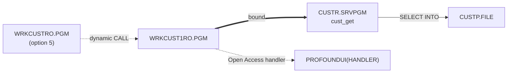
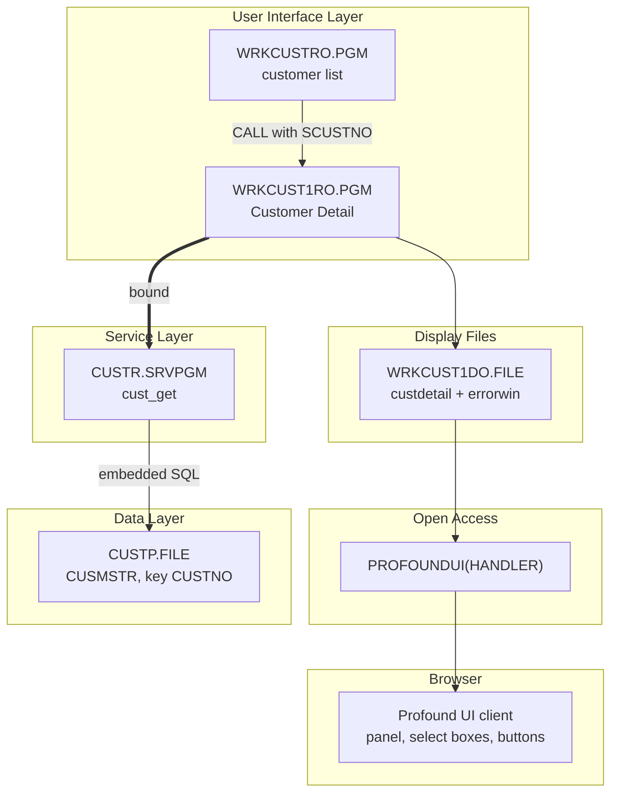
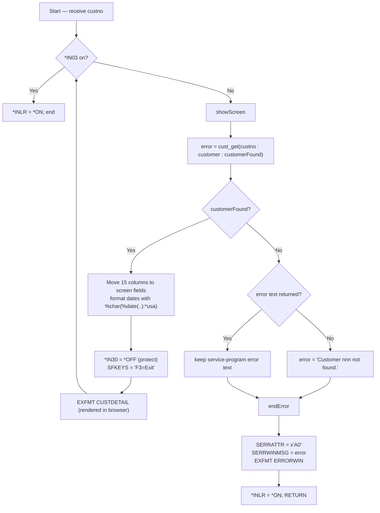

# WRKCUST1RO — Technical Documentation

|  |  |
|---|---|
| **Program** | WRKCUST1RO |
| **Type** | *PGM |
| **Language** | ILE RPG, fully free-format (`**FREE`) — RPG Open Access |
| **Source** | `cfdemo/qrpglesrc/wrkcust1ro.rpgle` |
| **IBM i target release** | Not specified (TGTRLS defaults to the build machine's release) |
| **Version / Author / Date** | 1.0 / Claude (Opus 5) / 2026-08-19 |

### Revision History

| Version | Date | Author | Change | Ref |
|---|---|---|---|---|
| 1.0 | 2026-08-19 | Claude (Opus 5) | Initial documentation | — |

## 1. Overview

`WRKCUST1RO` is the **Profound UI Rich Display** customer-detail screen. It receives a customer
number, retrieves the row through `CUSTR`, and displays all fifteen columns in a browser-rendered
panel; a red pop-up window (`errorwin`) reports a customer that cannot be retrieved and ends the
program.

The RPG source is a **one-line change** from the 5250 `WRKCUST1R` — only the `DCL-F` differs:

```rpgle
dcl-f wrkcust1do workstn handler('PROFOUNDUI(HANDLER)');   // instead of: dcl-f wrkcust1d workstn;
```

Everything else — the parameter, the `cust_get` call, the field moves, the date formatting, the
`*IN30` protect scheme, the error window logic — is character-for-character identical. All of the
visual modernization (panels, select boxes, styled buttons, a fieldset legend built in JavaScript)
lives in the Rich Display File, not in the program.

**How it is invoked:** a dynamic program call from `WRKCUSTRO` when the user selects option `5` in the
grid, passing that row's `SCUSTNO`. One required parameter, no menu entry.

## 2. Technical Specifications

**Control Options**

| Option | Value | Description |
|---|---|---|
| `DFTACTGRP` | `*NO` | ILE program |
| `ACTGRP` | `*NEW` | Fresh activation group per call, reclaimed on return |
| `BNDDIR` | `'CUST'` | Binds `CUSTR *SRVPGM` |
| `OPTION` | *(compiler default)* | Not overridden |
| `THREAD` | *(not coded)* | Not declared thread-safe |

**Input Parameters**

| Parameter | Data Type | Length | Direction | Description |
|---|---|---|---|---|
| `custno` | Packed (`like(cust_rec.custno)`) | 6,0 | **In** (`const`) | Customer number to display |

**Files Used**

| File | Type | Usage | Access | Description |
|---|---|---|---|---|
| `WRKCUST1DO` | WORKSTN (Rich Display, Open Access) | Update (`EXFMT`) | `HANDLER('PROFOUNDUI(HANDLER)')`; formats `custdetail`, `errorwin` (window) | Browser-rendered detail panel and error pop-up |
| `CUSTP` | DISK | Input (indirect) | Set-based SQL inside `CUSTR` | Never declared here |

**Service Programs / Procedures Called**

| Service Program | Procedure | Bound/Dynamic | Description |
|---|---|---|---|
| `CUSTR` | `cust_get` | Bound (via `BNDDIR('CUST')`) | Retrieve one customer row |
| `PROFOUNDUI` | `HANDLER` | Open Access handler, resolved at run time | Renders the Rich Display file in the browser |

## 3. ILE Structure & Invocation

- **Activation group** — `ACTGRP(*NEW)`; the Profound UI handler activates in the same group and is
  reclaimed with it. Each drill-down therefore re-activates both the handler and `CUSTR`.
- **Binding** — static bind to `CUSTR` via `CUST.BNDDIR`; prototypes from `/copy custr_pr.rpgle`. The
  Open Access handler is a run-time literal, not a bind-time dependency — a missing `PROFOUNDUI`
  service program fails on the first `EXFMT`, not at compile.
- **Call hierarchy**



## 4. Dependency Tree (text)

```
WRKCUST1RO.PGM
├── Source
│   ├── wrkcust1ro.rpgle
│   └── custr_pr.rpgle              (/COPY member: cust_rec template + prototypes)
├── Display Files
│   └── WRKCUST1DO.FILE             (Rich Display File, ENHDSP(*YES), generated from
│                                    qddssrc/wrkcust1do.json: custdetail, errorwin)
├── Service Programs
│   ├── CUSTR.SRVPGM                (cust_get)
│   └── PROFOUNDUI.SRVPGM           (Open Access handler — third party, run-time)
├── Binding Directory
│   └── CUST.BNDDIR
└── Database
    └── CUSTP.FILE (PF, key CUSTNO) — accessed only through CUSTR.SRVPGM
```

## 5. Dependency Diagram (Mermaid)



## 6. Complete Object Dependency List

**Programs**

| Object | Type | Library | Source member | Description |
|---|---|---|---|---|
| `WRKCUST1RO` | *PGM | `$IBMI_BUILD_LIBRARY` (e.g. `AITSK00104`) / `CFDEMO` | `cfdemo/qrpglesrc/wrkcust1ro.rpgle` | Customer detail (Rich Display) |

**Service Programs**

| Object | Type | Library | Source member | Description |
|---|---|---|---|---|
| `CUSTR` | *SRVPGM | build library | `qrpglesrc/custr.sqlrpgle` + `qsrvsrc/custr.bnd` | Customer data service |
| `PROFOUNDUI` | *SRVPGM | Profound UI product library (via *LIBL) | *(third party — source not available; documented from reference only)* | Open Access handler |

**Display Files**

| Object | Type | Library | Source member | Description |
|---|---|---|---|---|
| `WRKCUST1DO` | *FILE (DSPF, `ENHDSP(*YES)`) | build library | `cfdemo/qddssrc/wrkcust1do.json` | Rich Display File — see §8 |

**Physical Files**

| Object | Type | Library | Source member | Description |
|---|---|---|---|---|
| `CUSTP` | *FILE (PF) | *LIBL | `cfdemo/qddssrc/custp.pf` | Customer master (via `CUSTR`) |

**Binding Directories**

| Object | Type | Library | Source member | Description |
|---|---|---|---|---|
| `CUST` | *BNDDIR | build library | `cfdemo/cust.bnddir` | Resolves `CUSTR` |

**Copy Members**

| Object | Type | Library | Source member | Description |
|---|---|---|---|---|
| `custr_pr` | Source | n/a | `cfdemo/qrpglesrc/custr_pr.rpgle` | `cust_rec` template + prototypes |

## 7. Database Schema & Access (DB2 for i)

No direct database access — one `cust_get` per screen display. Column-to-widget mapping:

| `CUSTP` field | Type | Screen field | Widget | Notes |
|---|---|---|---|---|
| `CUSTNO` | Packed 6,0 | `SCUSTNO` | output field, zoned(6) | Also injected into the fieldset legend by the `onload` script |
| `CNAME` | Char 40 | `SNAME` | textbox char(40) | |
| `CTYPE` | Char 1 | `STYPE` | **select box** — choices `Business` / `Residential`, values `B` / `R` | Friendlier than the 5250 single-character entry |
| `CSTATUS` | Char 1 | `SSTATUS` | **select box** — `Active` / `Inactive` / `Suspended`, values `A` / `I` / `S` | |
| `CLIMIT` | Packed 11,2 | `SLIMIT` | textbox zoned(11,2), `numSep:false`, `zeroBalance:true`, `negNum:-999.00` | Equivalent of `EDTCDE(P)` — zero is shown, no thousands separator, leading minus |
| `CBALANCE` | Packed 11,2 | `SBALANCE` | output field zoned(11,2), right-aligned, same formatting | |
| `CLASTORD` | Zoned 8,0 | `SLASTORD` | output field char(10) | Program formats with `%char(%date(...) : *usa)` |
| `CCREATED` | Zoned 8,0 | `SCREATED` | output field char(10) | Same |
| `CADDR1` / `CADDR2` | Char 40 | `SADDR1` / `SADDR2` | textbox char(40) | |
| `CCITY` | Char 30 | `SCITY` | textbox char(30) | |
| `CSTATE` | Char 2 | `SSTATE` | textbox char(2) | |
| `CZIP` | Char 10 | `SZIP` | textbox char(10) | |
| `CEMAIL` | Char 60 | `SEMAIL` | textbox char(40) | **Truncated** — 40-character widget for a 60-character column, same as the 5250 panel |
| `CPHONE` | Char 15 | `SPHONE` | textbox char(15) | |

- **Key & access path** — `cust_get` selects on `CUSTNO`, `CUSTP`'s (non-unique) keyed access path.
- **Referential integrity / triggers / journaling** — none defined in source.
- **Commitment control** — none; `CUSTR` uses `COMMIT(*NONE)` and this program never writes.

**Date-conversion risk** (identical to the 5250 variant): `%date()` on the 8-digit zoned date columns
assumes `*ISO`. A `0` or otherwise invalid value raises an unhandled `RNQ0114` date-conversion error at
that statement instead of showing a blank date. There is no `MONITOR` around it.

## 8. Display File Layout

`WRKCUST1DO` is a **Profound UI Rich Display File**; the source of truth is
`cfdemo/qddssrc/wrkcust1do.json`, converted to DDS by codermake and compiled `ENHDSP(*YES)`.

| Record format | Kind | Overlay range | Purpose |
|---|---|---|---|
| `custdetail` | Full panel | 1–23 | Customer detail; `onload` script sets the fieldset legend |
| `errorwin` | Window (`show as window: true`, top 7, left 24) | 1–9 | Error pop-up |

**`custdetail` structure**

| Widget | Type | Details |
|---|---|---|
| `custdetail_screenlayout` | layout, `css panel` | Header text `Customer Detail`; themes `pls--header` / `pls--body`; class `pls--panel--wide` |
| `fldCustomer` | layout, `fieldset` | Legend `Customer`, replaced at load time (below) |
| `Layout1` | layout | Secondary container (`Primary Contact` group) |
| `sfkeys` | output field | `sfkeys` char(512), classes `pls--output-field pls--fkeys`, `BLU` |
| `custdetail_btncancel` | graphic button | Shortcut **F3**, `response = *IN03`, icon `material:arrow_back`. Its **label is an expression**: `Back` when `*IN30` is off, `Cancel` when on |
| `custdetail_btnsave` | graphic button | `Save`, icon `material:save`, shortcut **Enter**; `visibility` bound to `30`, `disabled` bound to `N30` |
| `btnSubmit` | graphic button | `Continue`, shortcut **Enter** (hidden container) |
| `scustno` | output field | zoned(6) |
| `sname`, `saddr1`, `saddr2`, `scity`, `sstate`, `szip`, `semail`, `sphone` | textbox | `read only` bound to `N30`; `css class 2` = `PR` when `N30`; `css class 3` = `UL_removed` when `30` |
| `stype`, `sstatus` | select box | Choice lists as in §7; same `N30` / `30` class bindings |
| `slimit` | textbox | Numeric formatting as in §7; `read only` when `N30` |
| `sbalance` | output field | Numeric, right-aligned — always output-only |
| `slastord`, `screated` | output field | char(10) |
| Constants | output fields | `Customer Detail`, `Customer`, `Name:`, `Type:`, `(B=Business, R=Residential)`, `Status:`, `(A=Active, I=Inactive, S=Suspended)`, `Credit limit:`, `Balance due:`, `Last order:`, `Created on:`, `Primary Contact`, `Address:`, `City:`, `State:`, `Zip:`, `Email:`, `Phone:` |

**Client-side script.** The format carries an `onload` property:

```javascript
applyProperty("fldCustomer", "legend", `Customer ${get("scustno")}`);
```

so the fieldset legend becomes e.g. `Customer 123456` when the panel is rendered. This is the only
JavaScript in the file, and it is a *property* of the format rather than a separate asset — no external
`.js` file is referenced (unlike the EJS variant, which loads real files).

**Protect/edit scheme.** The `N30` / `30` bindings are the Rich Display equivalents of
`DSPATR(PR)` / `DSPATR(UL)`. Because the program always sets `*IN30` off (see §10), the rendered screen
is read-only: every textbox is `read only` with the `PR` class, the **Save button is hidden**, and the
tertiary button reads **`Back`** rather than `Cancel`. Turning on `*IN30` would reveal Save, enable the
inputs and relabel the button — the widget layer for editing is complete; only the RPG side is missing.

**`errorwin`**

| Widget | Type | Details |
|---|---|---|
| `errorwin_screenlayout` | layout, `css panel` | Header `Error` |
| `serrwinmsg` | text area | `serrwinmsg` char(210), 300×280 px, `display attribute field` = `serrattr` |
| `serrattr` | output field | char(1), placed in the hidden-field container; carries the attribute byte the program sets (`x'A0'`) |
| `errorwin_btnsubmit` | graphic button | `OK`, shortcut **Enter**, icon `material:keyboard_return` |
| `errorwin_btncancel` | graphic button | `Exit`, shortcut **F3**, `bypass validation` |
| `btnCA03` | graphic button | `response = *IN03` |

The 5250 file achieved the same thing with `WINDOW(7 24 10 32)`, `WDWBORDER((*COLOR RED))`,
`WDWTITLE((*TEXT 'Error'))`, `CNTFLD(030)` and `WRDWRAP`; here it is a panel-styled window with a text
area that wraps naturally.

**Runtime environment note.** Rendering requires a Profound UI installation whose server-side objects
and client-side JavaScript are at compatible fix-pack levels. On a mismatch the handler returns no
widget metadata and the screen renders blank even though the RPG runs correctly — check that before
suspecting the program.

## 9. Program Flow (Mermaid) & Key Routines

Identical to `WRKCUST1R`:



**Key routines**

| Routine | Kind | Purpose |
|---|---|---|
| `showScreen` | Subroutine | Re-reads the customer, moves all columns to screen fields, forces protection on, displays `custdetail` |
| `endError` | Subroutine | Fills and displays `errorwin`, sets `*INLR`, returns |

**Refresh semantics** — `showScreen` runs on every pass, so submitting the panel (Enter, or the hidden
`Continue` button) re-reads the row and redisplays current data.

**Reachability of `errorwin`** — unreachable on the normal path from `WRKCUSTRO`, because the grid can
only offer customers that were just returned by `cust_list`. It appears if the row is deleted between
listing and drill-down, if `cust_get` reports an SQL failure, or on a direct call with a bad number.

## 10. Indicators Used

| Indicator | Purpose |
|---|---|
| `*IN03` | Exit — set by the `response` property of `custdetail_btncancel` / `btnCA03` (F3), not by a DDS `CA03` keyword |
| `*IN30` | Protect/edit switch, consumed by widget `read only`, `css class 2`/`3`, `visibility`, `disabled` and the Cancel/Back label expression |
| `*INLR` | Set `*ON` before returning |

`*IN30` is set `*OFF` unconditionally in `showScreen` and never set on, so the screen is
**display-only in practice, edit-ready by design** — the Rich Display file is further along than the
5250 one here, since it already provides a Save button, enable/disable states and a context-sensitive
button label. Implementing edit would need `*IN30` set, the changed fields read back, and an update
procedure added to `CUSTR` (none exists in the current sources).

## 11. Error & Exception Handling

Strategy — one explicit failure path, no exception monitors. No `MONITOR`/`ON-ERROR`, no `*PSSR`, no
PSDS, no INFDS, no `(E)` extenders.

| Condition | Detection | User sees | Recovery |
|---|---|---|---|
| Customer not found | `customerFound = *off`, `cust_get` returned `''` | `Error` window: `Customer nnn not found.` | `OK` / `Exit` dismisses; the program ends |
| Service-program/SQL failure | `cust_get` returned non-blank text | Same window with `Error retrieving customer. SQLCODE = ..., SQLSTATE = ...` | Check library list, authority, `CUSTP` layout |
| Invalid or zero date | **not handled** | `RNQ0114` inquiry then dump | Correct the data, or guard the `%date` calls |
| `PROFOUNDUI` handler missing / wrong level | **not handled** | Escape message on the first `EXFMT`, or a blank screen if FP levels mismatch | Environmental — fix the Profound UI installation or library list |
| Workstation/device error, missing display file | **not handled** | Default handler inquiry then `RNX` dump | Fix the library list and re-call |

The error text variable is `varchar(210)`, matching `serrwinmsg`, and a service-program message always
takes precedence over the locally built `not found` text — so an SQL failure is never mislabelled as a
missing customer. Nothing is written to the database, so no failure needs backing out.

## 12. Security & Authority

- No adopted authority; runs with the caller's authority.
- Required authority: `*USE` on `WRKCUST1RO`, `CUSTR`, `WRKCUST1DO`, `CUSTP` and the Profound UI
  product objects, plus `*EXECUTE` on the libraries.
- The browser front end adds the Profound UI HTTP instance (its authentication and the profile its
  jobs run under) to the security perimeter.
- **Sensitive data:** the most exposing screen in the application — credit limit and outstanding
  balance alongside full contact details, unmasked, with no audit-journal record of viewing. Note the
  values are also present in the client-side page, so browser-level access is equivalent to data
  access.

## 13. Interfaces & Integration

The only integration is the Open Access handler: workstation I/O is serviced by
`PROFOUNDUI(HANDLER)`, which exchanges field values with the Profound UI browser client over HTTP(S).
No data queues, data areas, web services, IFS or MQ.

## 14. Batch / Job Flow

Not applicable — interactive, browser-driven.

## 15. Build & Compile

```
CRTDSPF   FILE(<LIB>/WRKCUST1DO) SRCFILE(<LIB>/QDDSSRC) ENHDSP(*YES)    <- DDS generated from wrkcust1do.json
CRTBNDRPG PGM(<LIB>/WRKCUST1RO) SRCSTMF('cfdemo/qrpglesrc/wrkcust1ro.rpgle')
```

`Rules.mk`:

```makefile
wrkcust1do.file: qddssrc/wrkcust1do.json
wrkcust1ro.pgm:  qrpglesrc//wrkcust1ro.rpgle qddssrc/wrkcust1do.json qrpglesrc/custr_pr.rpgle custr.srvpgm | wrkcust1do.file cust.bnddir
```

(The doubled separator in `qrpglesrc//wrkcust1ro.rpgle` is in the repository as written; it is
harmless to make, but worth tidying if the line is ever touched.)

Build order: `custp.file` → `custr.module` → `custr.srvpgm` → `cust.bnddir` → `wrkcust1do.file` →
`wrkcust1ro.pgm`. Build with codermake — never issue the create commands by hand:

```bash
cd /workspace/workspace/ibmi-agentic
codermake wrkcust1ro.pgm
```

The `.json` is the source of truth; never edit generated DDS or the display file object.

## 16. Related Programs

| Program | Description | Relationship |
|---|---|---|
| `WRKCUSTRO` | Customer list (Rich Display) | Caller — option `5` |
| `CUSTR` | Customer data service program | Callee (bound) |
| `WRKCUST1R` | Same panel on a 5250 DDS display file | Alternate front end; the RPG differs in one line |
| `WRKCUST1EO` | Same panel as a Profound UI EJS screen | Alternate front end |

## 17. Testing Notes

Requires a Profound UI (or Genie) browser session.

| Scenario | Steps | Expected result |
|---|---|---|
| Detail displays | From the Rich Display list, choose `5` on a row | `Customer Detail` panel; fieldset legend reads `Customer <number>` |
| Select boxes | Inspect Type and Status | Rendered as dropdowns showing `Business`/`Residential` and `Active`/`Inactive`/`Suspended`, with the correct current value selected |
| Read-only state | Try to edit any field | All inputs read-only (`PR` class); **Save button not visible**; tertiary button reads `Back` |
| Numeric formatting | Look at a zero credit limit | Zero displayed (not blank), no thousands separator |
| Dates | Compare with `CUSTP` | `mm/dd/yyyy` |
| Email truncation | Pick a customer with an email longer than 40 characters | Value cut at 40 characters |
| Refresh | Press Enter / submit | Row re-read and redisplayed |
| Not-found path | Call directly with a nonexistent number (correctly declared packed 6,0) | `Error` window with `Customer nnn not found.`; `OK`/`Exit` ends the program |
| Zero date | Point at a row with `CLASTORD = 0` | **Known weakness** — `RNQ0114` rather than a blank date |
| Exit | Click `Back` or press F3 | Returns to the Rich Display list, refreshed |

No automated tests exist in the repository.

## 18. Version Information

| Attribute | Value |
|---|---|
| Source Format | Fully free-format (`**FREE`) |
| ILE Compatible | Yes |
| Activation Group | `*NEW` |
| Uses Embedded SQL | No (SQL is inside `CUSTR`) |
| Multi-threaded | No |
| Display Type | Profound UI Rich Display File (RPG Open Access, `HANDLER('PROFOUNDUI(HANDLER)')`, `ENHDSP(*YES)`) |
| Target Release (TGTRLS) | Compiler default (build machine's release) |
