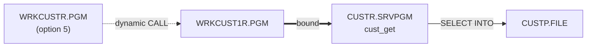
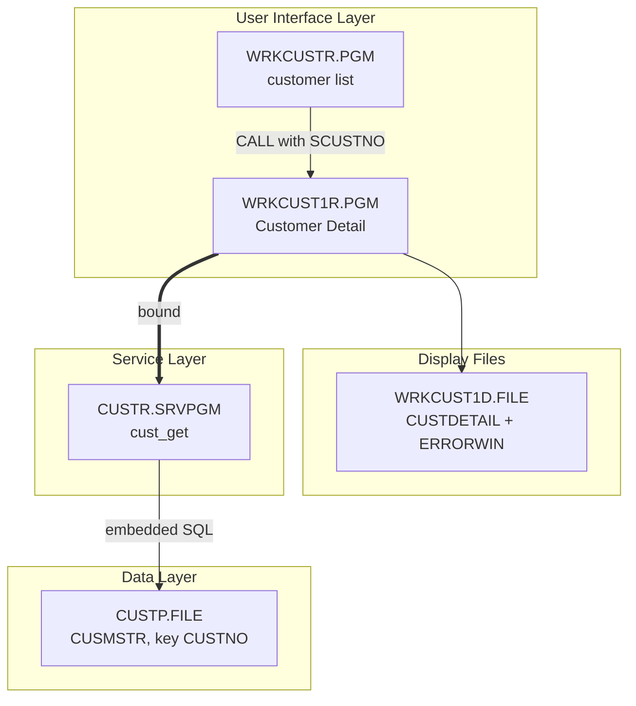
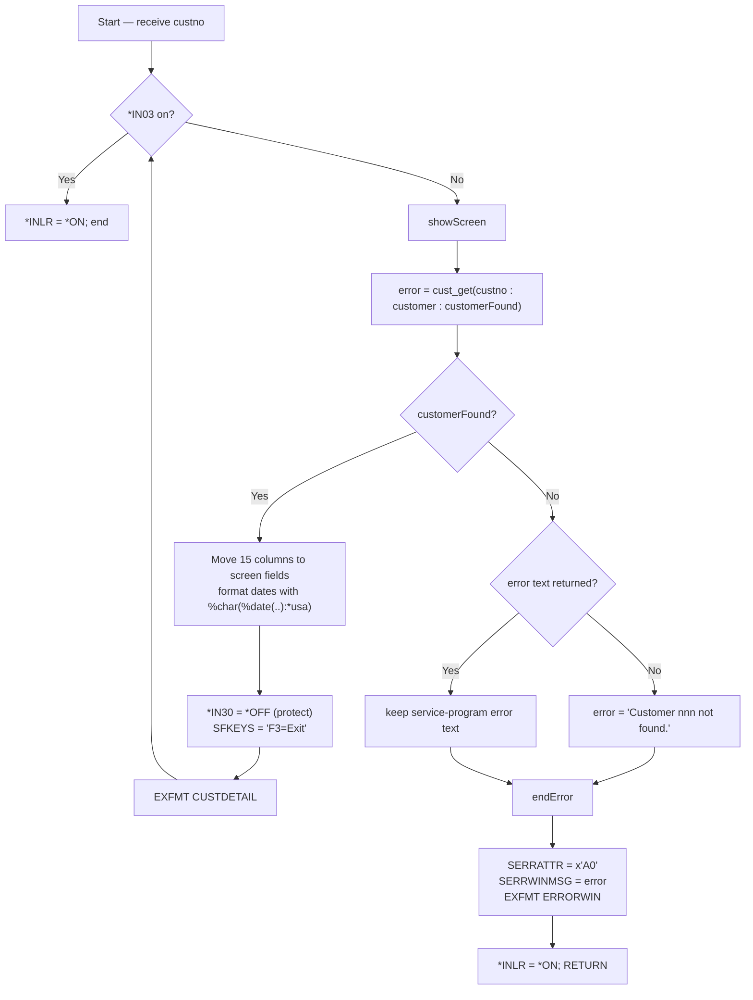

# WRKCUST1R — Technical Documentation

|  |  |
|---|---|
| **Program** | WRKCUST1R |
| **Type** | *PGM |
| **Language** | ILE RPG, fully free-format (`**FREE`) |
| **Source** | `cfdemo/qrpglesrc/wrkcust1r.rpgle` |
| **IBM i target release** | Not specified (TGTRLS defaults to the build machine's release) |
| **Version / Author / Date** | 1.0 / Claude (Opus 5) / 2026-08-19 |

### Revision History

| Version | Date | Author | Change | Ref |
|---|---|---|---|---|
| 1.0 | 2026-08-19 | Claude (Opus 5) | Initial documentation | — |

## 1. Overview

`WRKCUST1R` is the 5250 **Customer Detail** screen: it receives a customer number, retrieves the row
through the `CUSTR` service program, and displays all fifteen columns on one panel. It is
display-only — the DDS provides input-capable fields and an indicator-driven protect/unprotect
scheme, but the program hard-codes protection on (see §10), so nothing can be typed or saved.

A second record format, `ERRORWIN`, is a red-bordered pop-up used when the requested customer cannot
be retrieved; showing it ends the program.

**How it is invoked:** a dynamic program call from `WRKCUSTR` when the user types option `5` beside a
subfile row, passing that row's `SCUSTNO`. It has one required parameter and no menu entry, so the
only other way in is an explicit `CALL WRKCUST1R PARM(...)`.

## 2. Technical Specifications

**Control Options**

| Option | Value | Description |
|---|---|---|
| `DFTACTGRP` | `*NO` | ILE program; may bind to service programs |
| `ACTGRP` | `*NEW` | Fresh activation group per call, reclaimed on return. Because the caller is also `*NEW`, the drill-down gets its own activation of `CUSTR` and shares no SQL state with the list program. |
| `BNDDIR` | `'CUST'` | Binds `CUSTR *SRVPGM` |
| `OPTION` | *(compiler default)* | Not overridden |
| `THREAD` | *(not coded)* | Not declared thread-safe |

**Input Parameters**

| Parameter | Data Type | Length | Direction | Description |
|---|---|---|---|---|
| `custno` | Packed (`like(cust_rec.custno)`) | 6,0 | **In** (`const`) | Customer number to display |

Because the parameter is `const`, the compiler may pass a temporary copy — but a raw CL
`CALL PGM(WRKCUST1R) PARM(...)` still has to supply a genuine packed(6,0) value. Passing a character
literal or a differently sized numeric from CL corrupts the field (a classic `RNX0105`), so test
calls should be made from a program with the prototype in scope, or with a correctly declared CL
variable.

**Files Used**

| File | Type | Usage | Access | Description |
|---|---|---|---|---|
| `WRKCUST1D` | WORKSTN | Update (`EXFMT`) | Two formats: `CUSTDETAIL`, `ERRORWIN` (window) | Detail panel and error pop-up |
| `CUSTP` | DISK | Input (indirect) | Set-based SQL inside `CUSTR` | Never declared here |

**Service Programs / Procedures Called**

| Service Program | Procedure | Bound/Dynamic | Description |
|---|---|---|---|
| `CUSTR` | `cust_get` | Bound (via `BNDDIR('CUST')`) | Retrieve one customer row |

## 3. ILE Structure & Invocation

- **Activation group** — `ACTGRP(*NEW)`. Every drill-down creates and destroys an activation group.
  That is tidy but not free: each call re-activates `CUSTR` (`ACTGRP(*CALLER)`) and re-opens its SQL
  cursor environment. On a heavily used screen, `ACTGRP('CUSTGRP')` shared with the caller would be
  the cheaper choice; `*NEW` is fine for a demo and guarantees clean state.
- **Binding** — static bind to `CUSTR` via the `CUST` binding directory; prototypes from
  `/copy custr_pr.rpgle`.
- **Call hierarchy**



## 4. Dependency Tree (text)

```
WRKCUST1R.PGM
├── Source
│   ├── wrkcust1r.rpgle
│   └── custr_pr.rpgle          (/COPY member: cust_rec template + prototypes)
├── Display Files
│   └── WRKCUST1D.FILE          (DSPF: CUSTDETAIL, ERRORWIN)
├── Service Programs
│   └── CUSTR.SRVPGM            (cust_get)
├── Binding Directory
│   └── CUST.BNDDIR
└── Database
    └── CUSTP.FILE (PF, key CUSTNO) — accessed only through CUSTR.SRVPGM
```

## 5. Dependency Diagram (Mermaid)



## 6. Complete Object Dependency List

**Programs**

| Object | Type | Library | Source member | Description |
|---|---|---|---|---|
| `WRKCUST1R` | *PGM | `$IBMI_BUILD_LIBRARY` (e.g. `AITSK00104`) / `CFDEMO` | `cfdemo/qrpglesrc/wrkcust1r.rpgle` | Customer detail (5250) |

**Service Programs**

| Object | Type | Library | Source member | Description |
|---|---|---|---|---|
| `CUSTR` | *SRVPGM | build library | `qrpglesrc/custr.sqlrpgle` + `qsrvsrc/custr.bnd` | Customer data service |

**Display Files**

| Object | Type | Library | Source member | Description |
|---|---|---|---|---|
| `WRKCUST1D` | *FILE (DSPF) | build library | `cfdemo/qddssrc/wrkcust1d.dspf` | Detail panel + error window |

**Physical Files**

| Object | Type | Library | Source member | Description |
|---|---|---|---|---|
| `CUSTP` | *FILE (PF) | *LIBL | `cfdemo/qddssrc/custp.pf` | Customer master (via `CUSTR`) |

**Binding Directories**

| Object | Type | Library | Source member | Description |
|---|---|---|---|---|
| `CUST` | *BNDDIR | build library | `cfdemo/cust.bnddir` | Resolves `CUSTR` at bind time |

**Copy Members**

| Object | Type | Library | Source member | Description |
|---|---|---|---|---|
| `custr_pr` | Source | n/a | `cfdemo/qrpglesrc/custr_pr.rpgle` | `cust_rec` template + prototypes |

## 7. Database Schema & Access (DB2 for i)

No direct database access — one `cust_get` call per screen display. Every `CUSTP` column is mapped
to a screen field:

| `CUSTP` field | Type | Screen field | Screen type | Notes |
|---|---|---|---|---|
| `CUSTNO` | Packed 6,0 | `SCUSTNO` | 6S 0, output | Header, `COLOR(WHT)` |
| `CNAME` | Char 40 | `SNAME` | 40A | Full length — no truncation |
| `CTYPE` | Char 1 | `STYPE` | 1A | `B`=Business, `R`=Residential |
| `CSTATUS` | Char 1 | `SSTATUS` | 1A | `A`=Active, `I`=Inactive, `S`=Suspended |
| `CLIMIT` | Packed 11,2 | `SLIMIT` | 11Y 2, `EDTCDE(P)` | |
| `CBALANCE` | Packed 11,2 | `SBALANCE` | 11Y 2, output, `EDTCDE(P)` | |
| `CLASTORD` | Zoned 8,0 | `SLASTORD` | 10A, output | Formatted `%char(%date(...) : *usa)` |
| `CCREATED` | Zoned 8,0 | `SCREATED` | 10A, output | Formatted `%char(%date(...) : *usa)` |
| `CADDR1` / `CADDR2` | Char 40 | `SADDR1` / `SADDR2` | 40A | |
| `CCITY` | Char 30 | `SCITY` | 30A | |
| `CSTATE` | Char 2 | `SSTATE` | 2A | |
| `CZIP` | Char 10 | `SZIP` | 10A | |
| `CEMAIL` | Char 60 | `SEMAIL` | 40A | **Truncated** — 40-character field for a 60-character column |
| `CPHONE` | Char 15 | `SPHONE` | 15A | |

- **Key & access path** — `cust_get` selects on `CUSTNO`, which is `CUSTP`'s (non-unique) keyed
  access path.
- **Referential integrity / triggers / journaling** — none defined in source.
- **Commitment control** — none; `CUSTR` runs with `COMMIT(*NONE)` and this program never writes.

**Date-conversion risk.** `%date(customer.clastord)` interprets the 8-digit zoned column as `*ISO`
(`yyyymmdd`). A customer whose `CLASTORD` (or `CCREATED`) is `0` — plausible for a customer that has
never ordered — or holds any non-date value raises an unhandled date-conversion exception
(`RNQ0114`) at this line rather than displaying a blank date. There is no `MONITOR` around it. If
zero dates are possible in the data, guard the conversion before formatting.

## 8. Display File Layout

`WRKCUST1D` — `DSPSIZ(24 80 *DS3)`, two record formats.

**`CUSTDETAIL`**

```
                                 Customer Detail                                  (1,33)
                                                                                  
  Customer  123456                                                                (3)
                                                                                  
  Name:           ACME INDUSTRIES                                                  (5)
  Type:           B  (B=Business, R=Residential)                                   (6)
  Status:         A  (A=Active, I=Inactive, S=Suspended)                            (7)
  Last order:     03/14/2026        Credit limit:      50000.00                     (8)
  Created on:     01/02/2019        Balance due:       12345.67                     (9)
                                                                                  
  Primary Contact                                                                 (11)
                                                                                  
  Address:        100 MAIN ST                                                     (13)
                  SUITE 400                                                       (14)
  City:           SPRINGFIELD                                                     (15)
  State:          IL                                                              (16)
  Zip:            62704                                                           (17)
  Email:          orders@acme.example                                             (18)
  Phone:          555-0100                                                        (19)
                                                                                  
  F3=Exit                                                                         (23)
```

| Field | Length | Type (I/O/Both) | Row/Col | Description |
|---|---|---|---|---|
| `SCUSTNO` | 6S 0 | O | 3, 11 | Customer number, `COLOR(WHT)` |
| `SNAME` | 40A | B | 5, 17 | Name; `CHECK(LC)` |
| `STYPE` | 1A | B | 6, 17 | Customer type |
| `SSTATUS` | 1A | B | 7, 17 | Customer status |
| `SLIMIT` | 11Y 2 | B | 8, 44 | Credit limit; `EDTCDE(P)` |
| `SBALANCE` | 11Y 2 | O | 9, 44 | Balance due; `EDTCDE(P)` |
| `SLASTORD` | 10A | O | 8, 17 | Last order date (pre-formatted `mm/dd/yyyy`) |
| `SCREATED` | 10A | O | 9, 17 | Created date (pre-formatted) |
| `SADDR1` | 40A | B | 13, 17 | Address line 1; `CHECK(LC)` |
| `SADDR2` | 40A | B | 14, 17 | Address line 2; `CHECK(LC)` |
| `SCITY` | 30A | B | 15, 17 | City; `CHECK(LC)` |
| `SSTATE` | 2A | B | 16, 17 | State |
| `SZIP` | 10A | B | 17, 17 | Zip; `CHECK(LC)` |
| `SEMAIL` | 40A | B | 18, 17 | Email; `CHECK(LC)` |
| `SPHONE` | 15A | B | 19, 17 | Phone; `CHECK(LC)` |
| `SFKEYS` | 77A | O | 23, 2 | Key legend, `COLOR(BLU)` |

Every input-capable field carries the pair `N30 DSPATR(PR)` / `30 DSPATR(UL)`: when `*IN30` is off
the field is **protected**, when on it is underlined for entry. `CA03(03 'Exit')` sets `*IN03`
without returning input fields. `EDTCDE(P)` on the two money fields means no thousands separator,
zero values are *printed* rather than blanked, and negatives carry a leading floating minus.

**`ERRORWIN`** — pop-up window.

| Keyword | Value | Effect |
|---|---|---|
| `WINDOW` | `(7 24 10 32)` | Window at row 7, column 24; 10 lines by 32 positions |
| `WDWBORDER` | `((*COLOR RED))` | Red border |
| `WDWTITLE` | `((*TEXT 'Error'))` | Title `Error` |
| `CA03(03 'Exit')` | | F3 dismisses |

| Field | Length | Type | Row/Col (window-relative) | Description |
|---|---|---|---|---|
| `SERRWINMSG` | 210A | B | 1, 2 | Error text; `CNTFLD(030)` splits it into 30-character continued lines with `WRDWRAP`; display attribute taken from `DSPATR(&SERRATTR)` |
| `SERRATTR` | 1A | P (program-to-system) | — | Raw 5250 display-attribute byte; the program sets `x'A0'` |

`SERRATTR` is not displayed; it is a program-to-system field whose byte is passed straight through
as `SERRWINMSG`'s display attribute, so the exact rendering depends on how the device or emulator
interprets that attribute byte. A constant `F3=Exit` sits on window line 9.

**Record-format behaviour** — no subfiles, no `OVERLAY`. `CUSTDETAIL` writes the full 24×80 panel;
`ERRORWIN` is a window, so the system saves and restores what is underneath it.

## 9. Program Flow (Mermaid) & Key Routines



**Key routines**

| Routine | Kind | Purpose |
|---|---|---|
| `showScreen` | Subroutine | Re-reads the customer via `cust_get`, moves all columns to screen fields, forces protection on, and displays `CUSTDETAIL` |
| `endError` | Subroutine | Fills and displays `ERRORWIN`, sets `*INLR` and `RETURN`s out of the program |

**Refresh semantics.** `showScreen` is inside the `DOW`, so pressing Enter re-calls `cust_get` and
redisplays current data — the panel is effectively a refresh-on-Enter view rather than a static
snapshot. That also means a customer deleted while the screen is up turns the next Enter into the
error window.

**Reachability of `ERRORWIN`.** The normal path from `WRKCUSTR` can only pass customer numbers that
`cust_list`/`cust_get` just returned, so the error window is effectively unreachable from the menu.
It appears when the row is deleted between listing and drill-down (a race), when `cust_get` returns
an SQL failure, or when the program is called directly with a number that does not exist.

## 10. Indicators Used

| Indicator | Purpose |
|---|---|
| `*IN03` | F3 pressed (`CA03`) on either format — ends the `DOW` loop |
| `*IN30` | Field-protect switch: off → `DSPATR(PR)` (protected), on → `DSPATR(UL)` (enterable) |
| `*INLR` | Set `*ON` before returning |

`*IN30` is assigned `*OFF` unconditionally in `showScreen` (with the comment
`// Protect fields from editing.`) and is never set on. The screen is therefore **display-only in
practice, edit-capable by design**: the DDS, the input-capable field definitions and the underline
attribute are all in place for a future edit mode, and `WRKCUST1DO` (the Rich Display sibling) even
carries Save/Cancel buttons conditioned on the same indicator. Turning on an edit mode would need
`*IN30` set, a read of the changed fields, and an update procedure in `CUSTR` — none of which exists
in the current sources.

## 11. Error & Exception Handling

**Strategy — one explicit failure path, no exception monitors.** No `MONITOR`/`ON-ERROR`, no
`*PSSR`, no PSDS, no INFDS, no `(E)` extenders.

| Condition | Detection | User sees | Recovery |
|---|---|---|---|
| Customer not found | `customerFound = *off` and `cust_get` returned `''` | Red `Error` window: `Customer nnn not found.` | F3 (or Enter) dismisses; the program ends and control returns to the caller |
| Service-program/SQL failure | `cust_get` returned non-blank text | The same window, showing `Error retrieving customer. SQLCODE = ..., SQLSTATE = ...` | Investigate library list / authority / `CUSTP` layout; the program ends |
| Invalid or zero date in `CLASTORD` / `CCREATED` | **not handled** | Inquiry message then an `RNQ0114` date-conversion dump | Correct the data; consider guarding the `%date` calls |
| Workstation device error, missing `WRKCUST1D` | **not handled** | Default handler inquiry, then `RNX` dump | Fix the library list and re-call |

The error variable is `varchar(210)`, matching `SERRWINMSG`, so it can hold the full 80-character
service-program message plus the locally built text with room to spare. Note the deliberate
precedence: a service-program error message is preserved and only replaced by
`'Customer nnn not found.'` when the service program reported no error — so an SQL failure is never
mislabelled as a missing customer.

Nothing is written to the database, so no recovery or back-out procedure is needed for any failure.

## 12. Security & Authority

- No adopted authority (`USRPRF(*USER)`); the program runs with the caller's authority.
- Required authority: `*USE` on `WRKCUST1R`, `CUSTR`, `WRKCUST1D` and `CUSTP`, plus `*EXECUTE` on
  the libraries.
- Ownership is the building profile (`$IBMI_USER`); public authority follows the build library's
  `CRTAUT`. No `*AUTL` in source.
- **Sensitive data:** this is the most exposing screen in the application — it shows credit limit and
  outstanding balance alongside full contact details. There is no masking, no field procedure, and no
  audit-journal entry recording who viewed a customer. If that matters in a real deployment, the
  controls have to be added at the object/authority level or in `CUSTR`.

## 13. Interfaces & Integration

Not applicable — no data queues, data areas, web services, IFS or MQ.

## 14. Batch / Job Flow

Not applicable — interactive only.

## 15. Build & Compile

```
CRTDSPF   FILE(<LIB>/WRKCUST1D) SRCFILE(<LIB>/QDDSSRC)
CRTBNDRPG PGM(<LIB>/WRKCUST1R) SRCSTMF('cfdemo/qrpglesrc/wrkcust1r.rpgle')
```

`DFTACTGRP(*NO)`, `ACTGRP(*NEW)` and `BNDDIR('CUST')` come from the source `CTL-OPT` statements.

`Rules.mk`:

```makefile
wrkcust1d.file: qddssrc/wrkcust1d.dspf
wrkcust1r.pgm:  qrpglesrc/wrkcust1r.rpgle qddssrc/wrkcust1d.dspf qrpglesrc/custr_pr.rpgle custr.srvpgm | wrkcust1d.file cust.bnddir
```

Build order: `custp.file` → `custr.module` → `custr.srvpgm` → `cust.bnddir` → `wrkcust1d.file` →
`wrkcust1r.pgm`. Build with codermake — never issue the create commands by hand:

```bash
cd /workspace/workspace/ibmi-agentic
codermake wrkcust1r.pgm
```

## 16. Related Programs

| Program | Description | Relationship |
|---|---|---|
| `WRKCUSTR` | Customer list (5250) | Caller — option `5` |
| `CUSTR` | Customer data service program | Callee (bound) |
| `WRKCUST1RO` | Same panel as a Profound UI Rich Display file | Alternate front end (called from `WRKCUSTRO`) |
| `WRKCUST1EO` | Same panel as a Profound UI EJS screen | Alternate front end (called from `WRKCUSTEO`) |

## 17. Testing Notes

| Scenario | Steps | Expected result |
|---|---|---|
| Detail displays | From the list, type `5` beside a customer | All fifteen columns shown; heading `Customer Detail`; `F3=Exit` on row 23 |
| Fields protected | Try to type into Name, City, Credit limit | Input is refused — every field is protected (`*IN30` off) |
| Dates formatted | Compare with `CUSTP` | `CLASTORD`/`CCREATED` shown as `mm/dd/yyyy` |
| Money formatting | Check a customer with a zero credit limit | `EDTCDE(P)` prints a zero value (not blank) |
| Email truncation | Pick a customer with an email longer than 40 characters | Displayed value is cut at 40 characters |
| Refresh on Enter | Press Enter | Row re-read; any change made elsewhere appears |
| Not-found path | `CALL WRKCUST1R` with a customer number that does not exist (correctly declared packed 6,0 parameter) | Red `Error` window: `Customer nnn not found.`; the program ends when it is dismissed |
| Zero date | Point at a row with `CLASTORD = 0` | **Known weakness** — expect an `RNQ0114` date-conversion error rather than a blank date |
| Exit | Press F3 | Returns to the customer list, which refreshes |

No automated tests exist in the repository.

## 18. Version Information

| Attribute | Value |
|---|---|
| Source Format | Fully free-format (`**FREE`) |
| ILE Compatible | Yes |
| Activation Group | `*NEW` |
| Uses Embedded SQL | No (SQL is inside `CUSTR`) |
| Multi-threaded | No |
| Display Type | 5250 DDS display file (`DSPSIZ(24 80 *DS3)`), one window format |
| Target Release (TGTRLS) | Compiler default (build machine's release) |
