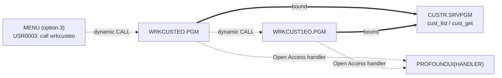
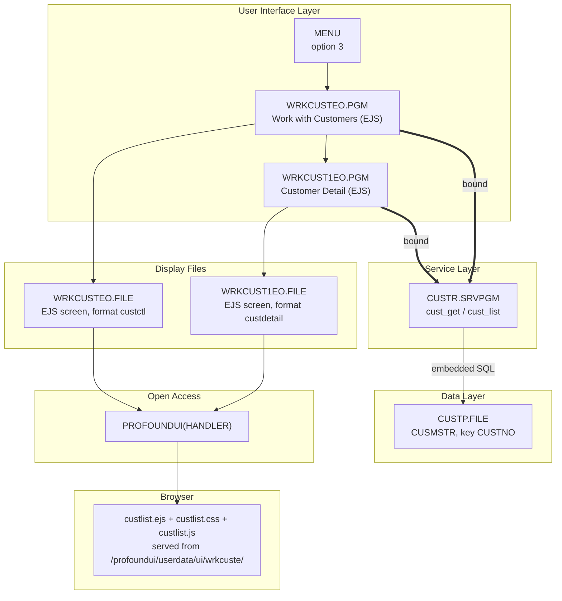
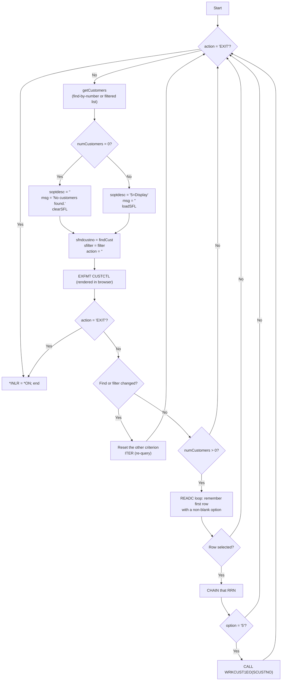

# WRKCUSTEO — Technical Documentation

|  |  |
|---|---|
| **Program** | WRKCUSTEO |
| **Type** | *PGM |
| **Language** | ILE RPG, fully free-format (`**FREE`) — RPG Open Access |
| **Source** | `cfdemo/qrpglesrc/wrkcusteo.rpgle` |
| **IBM i target release** | Not specified (TGTRLS defaults to the build machine's release) |
| **Version / Author / Date** | 1.0 / Claude (Opus 5) / 2026-08-19 |

### Revision History

| Version | Date | Author | Change | Ref |
|---|---|---|---|---|
| 1.0 | 2026-08-19 | Claude (Opus 5) | Initial documentation | — |

## 1. Overview

`WRKCUSTEO` is the **EJS screen-mode** version of Work with Customers. Like `WRKCUSTRO` it is an RPG
Open Access program (`HANDLER('PROFOUNDUI(HANDLER)')`), but its display file is defined by an
**EJS-type JSON** (`"type": "ejs"`) that names an HTML/EJS template, a stylesheet and a script file
instead of describing widgets. The RPG program supplies named fields and subfile rows; the template
decides how they look.

The consequence is a noticeably simpler program than the 5250 and Rich Display variants:

| Aspect | `WRKCUSTR` / `WRKCUSTRO` | `WRKCUSTEO` |
|---|---|---|
| Indicators | `*IN03`, 30, 31, 40, 41, 50, 51 | **none** |
| Screen exit | `*IN03` from `CA03` / button response | `action = 'EXIT'` (a character field) |
| Messages | Message subfile + `QMHSNDPM` + PSDS | a single `msg` char(78) field |
| Record formats | 4 (`custctl`, `custfoot`, `custnone`, `custmsgctl`) | 1 (`custctl`) |
| Subfile clear | `SFLCLR` via `*IN31` | `sflclear = '1'` |
| Invalid-option handling | `isValidOption` + re-prompt loop | **none** — non-`5` options are ignored |
| Field widths | `SNAME` 20, `SEMAIL` 25 (truncated) | `sname` 40, `semail` 60, `saddr` 100 (full) |

**How it is invoked:** menu option **3** of the `MENU` menu ("Work with Customers (EJS)"), which runs
`call wrkcusteo` from message `USR0003` in `MENU.MSGF`. No parameters.

## 2. Technical Specifications

**Control Options**

| Option | Value | Description |
|---|---|---|
| `DFTACTGRP` | `*NO` | ILE program |
| `ACTGRP` | `*NEW` | Fresh activation group per call, reclaimed on return |
| `BNDDIR` | `'CUST'` | Binds `CUSTR *SRVPGM` |
| `OPTION` | *(compiler default)* | Not overridden |
| `THREAD` | *(not coded)* | Not declared thread-safe |

**Input Parameters** — none.

**Files Used**

| File | Type | Usage | Access | Description |
|---|---|---|---|---|
| `WRKCUSTEO` | WORKSTN (EJS screen, Open Access) | Update (`EXFMT`/`WRITE`/`READC`/`CHAIN`) | `SFILE(CUSTSFL : RRN)`, `HANDLER('PROFOUNDUI(HANDLER)')` | Browser-rendered customer list — one format, one subfile |
| `CUSTP` | DISK | Input (indirect) | Set-based SQL inside `CUSTR` | Never declared here |

The program object and the display file object share the name `WRKCUSTEO` (they are different object
types, so this is legal — and it means `%eof(wrkcusteo)` in the source refers to the *file*).

**Service Programs / Procedures Called**

| Service Program | Procedure | Bound/Dynamic | Description |
|---|---|---|---|
| `CUSTR` | `cust_list`, `cust_get` | Bound (via `BNDDIR('CUST')`) | Customer retrieval |
| `PROFOUNDUI` | `HANDLER` | Open Access handler, resolved at run time | Renders the EJS screen in the browser |
| *(this program)* | `WRKCUST1EO` | Dynamic (`EXTPGM` program call) | EJS customer detail |

No `QMHSNDPM`, no local subprocedures — this program has no `DCL-PROC` at all.

## 3. ILE Structure & Invocation

- **Activation group** — `ACTGRP(*NEW)`; the handler activates in the same group and is reclaimed with
  it.
- **Binding** — static bind to `CUSTR` through `CUST.BNDDIR`. The handler is a run-time literal;
  the EJS template, CSS and JS are fetched by the browser at run time from the Profound UI HTTP
  server, so **nothing about the screen's appearance is checked at compile time**.
- **Call hierarchy**



## 4. Dependency Tree (text)

```
WRKCUSTEO.PGM
├── Source
│   ├── wrkcusteo.rpgle
│   └── custr_pr.rpgle               (/COPY member: cust_rec template + prototypes)
├── Display Files
│   └── WRKCUSTEO.FILE               (EJS screen file, ENHDSP(*YES), generated from
│                                     qddssrc/wrkcusteo.json — format custctl,
│                                     subfile custsfl)
├── Client-side assets (IFS, served by the Profound UI HTTP instance)
│   ├── /profoundui/userdata/ui/wrkcuste/custlist.ejs   (docs/htdocs/... in the repo)
│   ├── /profoundui/userdata/ui/wrkcuste/custlist.css
│   └── /profoundui/userdata/ui/wrkcuste/custlist.js
├── Service Programs
│   ├── CUSTR.SRVPGM                 (cust_list, cust_get)
│   └── PROFOUNDUI.SRVPGM            (Open Access handler — third party, run-time)
├── Binding Directory
│   └── CUST.BNDDIR
├── Programs called
│   └── WRKCUST1EO.PGM               (EJS customer detail)
└── Database
    └── CUSTP.FILE (PF, key CUSTNO) — accessed only through CUSTR.SRVPGM
```

## 5. Dependency Diagram (Mermaid)



## 6. Complete Object Dependency List

**Programs**

| Object | Type | Library | Source member | Description |
|---|---|---|---|---|
| `WRKCUSTEO` | *PGM | `$IBMI_BUILD_LIBRARY` (e.g. `AITSK00104`) / `CFDEMO` | `cfdemo/qrpglesrc/wrkcusteo.rpgle` | Customer list (EJS) |
| `WRKCUST1EO` | *PGM | build library | `cfdemo/qrpglesrc/wrkcust1eo.rpgle` | Customer detail (EJS) |

**Service Programs**

| Object | Type | Library | Source member | Description |
|---|---|---|---|---|
| `CUSTR` | *SRVPGM | build library | `qrpglesrc/custr.sqlrpgle` + `qsrvsrc/custr.bnd` | Customer data service |
| `PROFOUNDUI` | *SRVPGM | Profound UI product library (via *LIBL) | *(third party — source not available; documented from reference only)* | Open Access handler |

**Display Files**

| Object | Type | Library | Source member | Description |
|---|---|---|---|---|
| `WRKCUSTEO` | *FILE (DSPF, `ENHDSP(*YES)`) | build library | `cfdemo/qddssrc/wrkcusteo.json` | EJS screen definition — see §8 |

**Physical Files**

| Object | Type | Library | Source member | Description |
|---|---|---|---|---|
| `CUSTP` | *FILE (PF) | *LIBL | `cfdemo/qddssrc/custp.pf` | Customer master (via `CUSTR`) |

**Binding Directories**

| Object | Type | Library | Source member | Description |
|---|---|---|---|---|
| `CUST` | *BNDDIR | build library | `cfdemo/cust.bnddir` | Resolves `CUSTR` |

**Message Files**

| Object | Type | Library | Source member | Description |
|---|---|---|---|---|
| `MENU` | *MSGF | build library | `cfdemo/menu.msgf` | `USR0003` = `call wrkcusteo` |

**Copy Members**

| Object | Type | Library | Source member | Description |
|---|---|---|---|---|
| `custr_pr` | Source | n/a | `cfdemo/qrpglesrc/custr_pr.rpgle` | `cust_rec` template + prototypes |

**IFS assets** (not IBM i objects, and **not deployed by codermake** — see §15)

| Path in repo | Deployed path | Description |
|---|---|---|
| `docs/htdocs/profoundui/userdata/ui/wrkcuste/custlist.ejs` | `/profoundui/userdata/ui/wrkcuste/custlist.ejs` | List screen template |
| `.../custlist.css` | same | List screen styling |
| `.../custlist.js` | same | Client-side column sorting + zero-blanking |

## 7. Database Schema & Access (DB2 for i)

No direct database access — everything through `cust_list` / `cust_get`. See
`CUSTR_Technical_Documentation.md` §7 for the full `CUSTP` layout and access-path analysis.

Column-to-field mapping, with the widths declared in `wrkcusteo.json`:

| `CUSTP` field(s) | Screen field | JSON type/length | Notes |
|---|---|---|---|
| `CUSTNO` | `scustno` | zoned 6 | Passed to `WRKCUST1EO` |
| `CNAME` | `sname` | char 40 | **Full length** — no truncation, unlike the 5250/Rich Display variants |
| `CEMAIL` | `semail` | char 60 | **Full length** |
| `CPHONE` | `sphone` | char 15 | |
| `CADDR1`+`CADDR2`+`CCITY`+`CSTATE`+`CZIP` | `saddr` | char 100 | Assembled by `loadSFL`; 100 characters is enough for the concatenation the program builds |

- **Key & access path** — rows arrive `ORDER BY CUSTNO` from `cust_list`, using `CUSTP`'s non-unique
  keyed access path.
- **Referential integrity / triggers / journaling** — none defined in source.
- **Commitment control** — none; read-only program, `CUSTR` runs `COMMIT(*NONE)`.

Because the fields are full-width here, this variant is the only one where the visible list always
contains the text the server-side filter matched on.

## 8. Display File Layout

`WRKCUSTEO` is an **EJS-type Rich Display source**: `cfdemo/qddssrc/wrkcusteo.json` declares
`"type": "ejs"` and, per format, the template/CSS/JS URLs plus a flat list of fields — there is no
widget geometry at all. codermake converts it to DDS and compiles it `ENHDSP(*YES)`; the visual
layout lives entirely in `custlist.ejs`.

**Format `custctl`** — "Customer List Control"

| Asset | Path |
|---|---|
| `template` | `/profoundui/userdata/ui/wrkcuste/custlist.ejs` |
| `css` | `/profoundui/userdata/ui/wrkcuste/custlist.css` |
| `js` | `/profoundui/userdata/ui/wrkcuste/custlist.js` |

| Field | Type | Length | Direction in practice | Description |
|---|---|---|---|---|
| `action` | char | 10 | Both | Command channel: template sends `SEARCH` or `EXIT`; program tests for `EXIT` and clears it before each display |
| `sfndcustno` | zoned | 6 | Both | Find by customer number |
| `sfilter` | char | 50 | Both | Server-side filter text |
| `soptdesc` | char | 20 | Output | Option legend (`5=Display`, or blank) |
| `msg` | char | 78 | Output | Single-line message area (errors, `No customers found.`) |

**Subfile `custsfl`** — "Customer Subfile"; `clear` field: `sflclear`

| Field | Type | Length | Description |
|---|---|---|---|
| `sopt` | char | 2 | Option entry per row |
| `scustno` | zoned | 6 | Customer number |
| `sname` | char | 40 | Customer name |
| `semail` | char | 60 | Email |
| `sphone` | char | 15 | Phone |
| `saddr` | char | 100 | Assembled address |

Note that `sflclear` is **not** declared in the RPG source — it is a field of the generated display
file, so assigning `sflclear = '1'` before `WRITE custctl` is the EJS equivalent of turning on an
`SFLCLR` indicator. The same is true of `action` and `msg`.

**Rendered layout** (`custlist.ejs`)

```
┌──────────────────────────────────────────────────────────────────────────┐
│ Work with Customers                                                      │
│                                                                          │
│ Find Customer #: [______]   Filter: [___________________]  [ Search ]    │
│                                                                          │
│ ‹ message area — shown only when msg is non-blank ›                      │
│ ‹ options hint — shown only when soptdesc is non-blank ›                 │
│                                                                          │
│ Opt │ Number ▲ │ Name ▲ │ Email ▲ │ Phone ▲ │ Address ▲   (sortable)    │
│ [__]│ 100001   │ ACME…  │ orders@…│ 555-0100│ 100 MAIN ST…              │
│ [__]│ 100002   │ …      │ …       │ …       │ …                         │
│                                                                          │
│                                                    [ Exit (F3) ]         │
└──────────────────────────────────────────────────────────────────────────┘
```

Template mechanics worth knowing:

- **Submit channel.** Buttons call `pui.submit({action: 'SEARCH'})` and `pui.submit({action: 'EXIT'})`,
  and a hidden `<input name="action" value="">` carries the field otherwise. The Exit button also
  carries `data-fkey="F3"`.
- **Subfile row inputs** are named `custsfl.sopt.<%= row._rrn %>`, which is how the handler maps a
  browser input back to a specific subfile RRN. `custsfl` is exposed to the template as an array of
  row objects with a `_rrn` property.
- **Defensive field references.** Every optional field is wrapped in
  `typeof x !== 'undefined' && x && x.trim()`. That matters: in EJS screens a reference to a field the
  format does not declare throws and aborts the whole render (a blank screen, no error), so the guards
  are load-bearing, not decorative.
- **Lower-case field names.** The handler exposes DDS field names to the template in lower case, which
  is why the JSON declares them lower case and the template uses `sfndcustno`, `msg`, `row.scustno`.
- **Client-side sorting.** `custlist.js` wires the `.sort-button` header buttons to a DOM sort using
  `data-sort-*` attributes, and blanks `sfndcustno` when it renders as `0`. It sorts only the rows
  already loaded — it is not a re-query.
- **Known gotcha in this environment:** a file listed in the format's `js` array is loaded and executed
  *before* the template's DOM exists, so `DOMContentLoaded`/`readyState` initialisation like
  `custlist.js` uses can run against an empty document and silently bind nothing — the sort buttons and
  the zero-blanking then do nothing. The reliable pattern is inline handler attributes calling window
  globals (which is exactly what the buttons in the template already do). Verify sorting actually
  works before assuming it does.
- **Deployment coupling.** The template is fetched by the browser from the Profound UI document root.
  It is *not* part of the display file object and *not* deployed by codermake, so a rebuilt program with
  stale (or absent) IFS assets renders the old screen or nothing at all. Version-stamping the asset URLs
  in the JSON is the usual defence against browser caching after an edit.

## 9. Program Flow (Mermaid) & Key Routines



**Key routines**

| Routine | Kind | Purpose |
|---|---|---|
| `getCustomers` | Subroutine | `cust_get` when `findCust <> 0` (0 or 1 row), else `cust_list` with the trimmed filter; a returned error string is assigned to `msg` |
| `clearSFL` | Subroutine | `rrn = 0`, `sflclear = '1'`, `WRITE custctl`, `sflclear = '0'` |
| `loadSFL` | Subroutine | Clears, then one `WRITE custsfl` per customer, assembling `saddr` from four address columns |

**Control-flow differences from the other two variants** — all of them simplifications:

- The loop condition is `dow action <> 'EXIT'`, and `action` is cleared to `''` immediately before each
  `EXFMT`, so a stale `EXIT` can never re-trigger. Exit is handled twice: a `select`/`leave` right after
  the `EXFMT`, and the loop condition itself.
- **No option validation.** There is no `isValidOption` and no re-prompt. A row with an option other
  than `5` is read, `CHAIN`ed and then falls through the `select` with no `other` branch — the option is
  silently ignored and the list simply refreshes. The 5250 and Rich Display variants tell the user
  `Invalid option: x`; this one does not.
- **Simplified multi-selection rule.** The `READC` loop keeps the first row whose `sopt` is non-blank
  (`if sopt <> '' and selrrn = 0`) and updates every changed row; later selections are ignored without
  the extra blanking logic the other variants use.
- **`msg` instead of a message subfile** — one line, last message wins; there is no `QMHSNDPM`, no
  `SFLPGMQ`/`SFLMSGKEY` plumbing and no PSDS.

**Storage note** — as in the other variants, `customers` is a module-level `dim(9999)` array of the
271-byte `cust_rec` (~2.6 MB static), and `cust_list` is called with `limit = %elem(customers)`, so the
list silently caps at 9999 rows.

## 10. Indicators Used

**None.** This program uses no numbered indicators at all — not even `*IN03`. That is the headline
difference from the other two front ends: screen state is carried by *named character fields*
(`action`, `msg`, `soptdesc`, `sflclear`) rather than by indicators, which is what makes the EJS
template readable as ordinary HTML. `*INLR` is set `*ON` at the end to close down cleanly.

| Named condition field | Values | Purpose |
|---|---|---|
| `action` | `''`, `'SEARCH'`, `'EXIT'` | Command from the template; `EXIT` ends the program |
| `msg` | free text | Error / status line |
| `soptdesc` | `''` or `'5=Display'` | Option legend |
| `sflclear` | `'1'` / `'0'` | Subfile clear (replaces `SFLCLR` + indicator) |

## 11. Error & Exception Handling

**Strategy — error text as data in a single message field; no exception monitors.** No `MONITOR`, no
`*PSSR`, no PSDS, no INFDS, no `(E)` extenders.

| Condition | Detection | User sees | Recovery |
|---|---|---|---|
| `cust_list` / `cust_get` failure | non-blank return value tested in `getCustomers` | `msg` line: `Error retrieving customer list. SQLCODE = ..., SQLSTATE = ...` | Check library list / authority / `CUSTP` layout; the screen stays usable with an empty list |
| No rows matched | `numCustomers = 0` | `msg` = `No customers found.`, option legend blank | Adjust the filter |
| Invalid subfile option | **not handled** | Nothing — the option is ignored and the list refreshes | Consider adding validation if this matters |
| `PROFOUNDUI` handler missing / wrong FP level | **not handled** | Escape message on first `WRITE`/`EXFMT`, or a blank screen | Environmental |
| Missing / stale IFS template assets | **not handled** | Blank or outdated screen with the program running normally | Deploy the assets; cache-bust the URLs |
| Workstation/device error, missing display file | **not handled** | Default handler inquiry, then `RNX` dump | Fix the library list and re-call |

One subtlety in the message flow: `msg` is reassigned on every pass (`''` when rows are found), so a
service-program error raised on one pass is cleared on the next successful pass. There is no message
history, unlike the scrollable message subfile in the other variants.

Nothing is written to the database, so no failure requires a back-out.

## 12. Security & Authority

- No adopted authority; runs with the caller's authority.
- Required authority: `*USE` on `WRKCUSTEO` (program and display file), `WRKCUST1EO`, `CUSTR`, `CUSTP`
  and the Profound UI product objects, plus `*EXECUTE` on the libraries.
- The Profound UI HTTP instance is part of the perimeter, and additionally the **IFS assets** are: the
  `.ejs` template is served to the browser, so anyone who can read the document root can read the
  template. Keep the template free of anything sensitive (it currently contains only markup) and treat
  write access to `/profoundui/userdata/ui/...` as a code-deployment authority — a modified template can
  change what the screen submits.
- Sensitive data (names, emails, phone numbers here; credit limit and balance on the detail screen) is
  unmasked, and the full-width fields in this variant expose *more* than the truncated 5250 list. No
  field procedures, no audit journalling of views.

## 13. Interfaces & Integration

| Interface | Direction | Format | Trigger |
|---|---|---|---|
| Open Access handler `PROFOUNDUI(HANDLER)` | Bidirectional | Field/subfile values | Every `WRITE` / `EXFMT` / `READC` |
| HTTP(S) fetch of `custlist.ejs` / `.css` / `.js` | Inbound to the browser | Text assets from the IFS | Screen render |
| `pui.submit({action: ...})` | Browser → program | `action` field value | User clicks Search / Exit, or presses Enter/F3 |

No data queues, data areas, web services, MQ or file transfers.

## 14. Batch / Job Flow

Not applicable — interactive, browser-driven.

## 15. Build & Compile

```
CRTDSPF   FILE(<LIB>/WRKCUSTEO) SRCFILE(<LIB>/QDDSSRC) ENHDSP(*YES)    <- DDS generated from wrkcusteo.json
CRTBNDRPG PGM(<LIB>/WRKCUSTEO) SRCSTMF('cfdemo/qrpglesrc/wrkcusteo.rpgle')
```

`Rules.mk`:

```makefile
wrkcusteo.file: qddssrc/wrkcusteo.json
wrkcusteo.pgm:  qrpglesrc/wrkcusteo.rpgle qddssrc/wrkcusteo.json qrpglesrc/custr_pr.rpgle custr.srvpgm | wrkcusteo.file cust.bnddir
```

Build order: `custp.file` → `custr.module` → `custr.srvpgm` → `cust.bnddir` → `wrkcusteo.file` →
`wrkcusteo.pgm` (plus `wrkcust1eo.pgm` for the drill-down). Build with codermake — never issue the
create commands by hand:

```bash
cd /workspace/workspace/ibmi-agentic
codermake wrkcusteo.pgm
```

**The build is only half the deployment.** codermake creates IBM i objects; it does **not** copy the
`htdocs` tree. The three client assets under `docs/htdocs/profoundui/userdata/ui/wrkcuste/` must be
transferred to the Profound UI instance's document root at
`/profoundui/userdata/ui/wrkcuste/` for the screen to render. A green build with no asset deployment
produces a blank screen, which is the single most common way this variant appears "broken".

## 16. Related Programs

| Program | Description | Relationship |
|---|---|---|
| `WRKCUST1EO` | Customer detail (EJS) | Callee — option `5`, passes `SCUSTNO` |
| `CUSTR` | Customer data service program | Callee (bound) |
| `WRKCUSTR` | Same function on a 5250 DDS display file | Alternate front end (menu option 1) |
| `WRKCUSTRO` | Same function on a Profound UI Rich Display file | Alternate front end (menu option 2) |
| `MENU` | `Agentic Coding Demo Menu` | Caller — option 3 |

## 17. Testing Notes

Requires a Profound UI browser session **and** the IFS assets in place.

| Scenario | Steps | Expected result |
|---|---|---|
| Screen renders | Menu option 3 | `Work with Customers` heading, search toolbar, customer table styled by `custlist.css` |
| Assets missing | Rename/remove the `.ejs` on the server | Blank screen with the program still running — confirms the deployment coupling |
| List loads | — | Rows in customer-number order; full names, full emails, assembled address |
| Search by filter | Type in *Filter*, click `Search` | `action = 'SEARCH'` submitted; database re-queried; only matching rows |
| Find by number | Type a number in *Find Customer #* | Single row; filter cleared |
| Find missing number | Number not in `CUSTP` | `No customers found.` in the message area, no option hint |
| Zero blanked | Return to the list after a find | `sfndcustno` shows blank rather than `0` — **verify**, since this comes from `custlist.js`, which may not initialise (see §8) |
| Column sorting | Click the `Number` / `Name` header buttons | Rows re-sorted client-side, ascending then descending — **verify**, same caveat |
| Valid option | Type `5` in a row's Opt box and submit | `WRKCUST1EO` detail screen for that customer |
| Invalid option | Type `9` in a row's Opt box and submit | **Silently ignored** — the list simply refreshes with no message (documented behaviour, not a defect to file against the screen) |
| Multiple options | Type `5` on two rows | Only the first is opened |
| Exit | Click `Exit (F3)` | `action = 'EXIT'`; program ends and returns to the menu |

No automated tests exist in the repository.

## 18. Version Information

| Attribute | Value |
|---|---|
| Source Format | Fully free-format (`**FREE`) |
| ILE Compatible | Yes |
| Activation Group | `*NEW` |
| Uses Embedded SQL | No (SQL is inside `CUSTR`) |
| Multi-threaded | No |
| Display Type | Profound UI **EJS screen** (`"type": "ejs"`, RPG Open Access, `ENHDSP(*YES)`) |
| Indicators Used | None |
| Target Release (TGTRLS) | Compiler default (build machine's release) |
