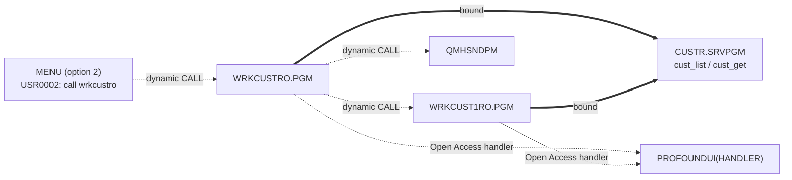
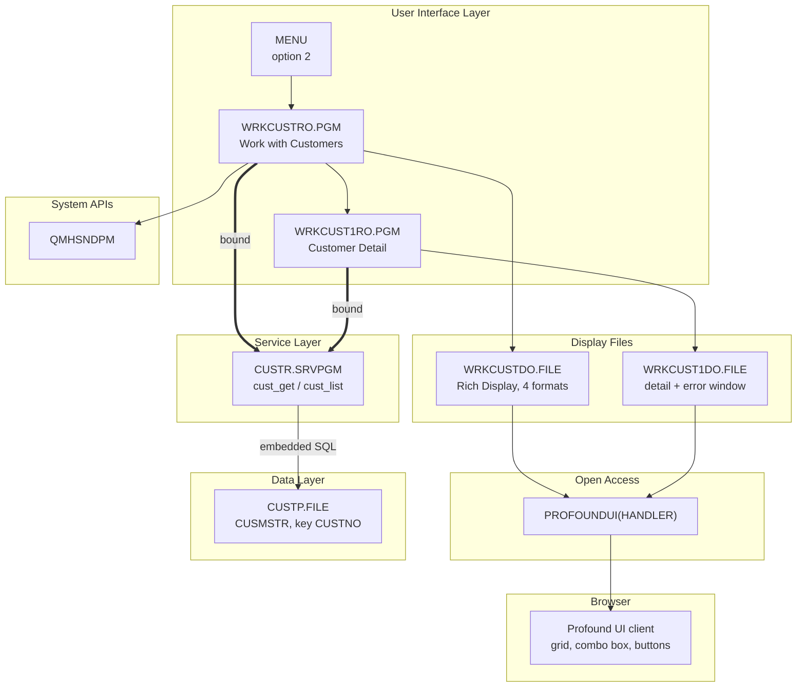
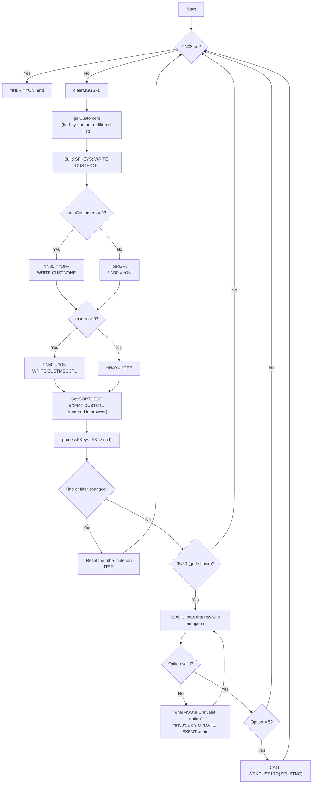

# WRKCUSTRO — Technical Documentation

|  |  |
|---|---|
| **Program** | WRKCUSTRO |
| **Type** | *PGM |
| **Language** | ILE RPG, fully free-format (`**FREE`) — RPG Open Access |
| **Source** | `cfdemo/qrpglesrc/wrkcustro.rpgle` |
| **IBM i target release** | Not specified (TGTRLS defaults to the build machine's release) |
| **Version / Author / Date** | 1.0 / Claude (Opus 5) / 2026-08-19 |

### Revision History

| Version | Date | Author | Change | Ref |
|---|---|---|---|---|
| 1.0 | 2026-08-19 | Claude (Opus 5) | Initial documentation | — |

## 1. Overview

`WRKCUSTRO` is the **Profound UI Rich Display** version of Work with Customers. It is the same
program logic as the 5250 `WRKCUSTR` — load-all subfile, find-by-number, server-side filter,
message subfile, option `5=Display` — but its workstation file is a **Rich Display File** and the
`DCL-F` carries `HANDLER('PROFOUNDUI(HANDLER)')`, so the RPG Open Access handler intercepts every
`WRITE`/`EXFMT`/`READC` and renders the screen as HTML widgets in a browser instead of a 5250 data
stream.

The RPG source differs from `WRKCUSTR` in exactly four lines: the file name and handler on the
`DCL-F`, the `%EOF` file name, and the prototype/call of the detail program (`WRKCUST1RO` instead of
`WRKCUST1R`). Everything else — indicator scheme, subfile handling, `QMHSNDPM` messaging, PSDS
usage, option validation — is identical. That is the point of the example: Open Access modernizes the
presentation without touching business logic.

**How it is invoked:** menu option **2** of the `MENU` menu ("Work with Customers (RPGOA)"), which
runs `call wrkcustro` from message `USR0002` in `MENU.MSGF`. No parameters.

## 2. Technical Specifications

**Control Options**

| Option | Value | Description |
|---|---|---|
| `DFTACTGRP` | `*NO` | ILE program |
| `ACTGRP` | `*NEW` | New activation group per call, reclaimed on return |
| `BNDDIR` | `'CUST'` | Binds `CUSTR *SRVPGM` |
| `OPTION` | *(compiler default)* | Not overridden |
| `THREAD` | *(not coded)* | Not declared thread-safe |

**Input Parameters** — none.

**Files Used**

| File | Type | Usage | Access | Description |
|---|---|---|---|---|
| `WRKCUSTDO` | WORKSTN (Rich Display, Open Access) | Update (`EXFMT`/`WRITE`/`READC`/`CHAIN`) | `SFILE(CUSTSFL : RRN)`, `SFILE(CUSTMSGSFL : MSGRRN)`, `HANDLER('PROFOUNDUI(HANDLER)')` | Browser-rendered customer list, footer, empty-list overlay, message subfile |
| `CUSTP` | DISK | Input (indirect) | Set-based SQL inside `CUSTR` | Never declared here |

The `HANDLER` keyword is the whole difference at runtime. The file is still compiled as a display
file object (created `ENHDSP(*YES)` from the Rich Display JSON), and the RPG operation codes are
unchanged, but the Open Access handler `PROFOUNDUI(HANDLER)` — a Profound UI service program
procedure — receives each I/O request and exchanges field values with the browser client.

**Service Programs / Procedures Called**

| Service Program | Procedure | Bound/Dynamic | Description |
|---|---|---|---|
| `CUSTR` | `cust_list`, `cust_get` | Bound (via `BNDDIR('CUST')`) | Customer retrieval |
| `PROFOUNDUI` | `HANDLER` | Open Access handler (resolved at run time from the library list) | Renders the Rich Display file in the browser |
| `QSYS/QMHSNDPM` | — | Dynamic (`EXTPGM`) | Sends `CPF9897` info messages for the message subfile |
| *(this program)* | `WRKCUST1RO` | Dynamic (`EXTPGM` program call) | Rich Display customer detail |

**Local procedures**

| Procedure | Interface | Purpose |
|---|---|---|
| `writeMSGSFL` | `(msgData varchar(80) const options(*varsize))` | `QMHSNDPM` + one message-subfile record |
| `isValidOption` | `(option char(2) const)` → `ind` | Whitelists subfile options; only `5` |

## 3. ILE Structure & Invocation

- **Activation group** — `ACTGRP(*NEW)`. Note that the Profound UI handler is activated in this group
  too, so its state (session, widget metadata) is scoped to the invocation and cleaned up on return.
- **Binding** — static bind to `CUSTR` through `CUST.BNDDIR`. The Open Access handler is **not** bound
  at compile time: `HANDLER('PROFOUNDUI(HANDLER)')` is a literal resolved at run time, so a missing
  or wrong-level `PROFOUNDUI` service program in the library list is a **runtime** failure, not a
  build failure.
- **Call hierarchy**



## 4. Dependency Tree (text)

```
WRKCUSTRO.PGM
├── Source
│   ├── wrkcustro.rpgle
│   └── custr_pr.rpgle               (/COPY member: cust_rec template + prototypes)
├── Display Files
│   └── WRKCUSTDO.FILE               (Rich Display File, ENHDSP(*YES), generated from
│                                     qddssrc/wrkcustdo.json: custctl, custfoot,
│                                     custnone, custmsgctl)
├── Service Programs
│   ├── CUSTR.SRVPGM                 (cust_list, cust_get)
│   └── PROFOUNDUI.SRVPGM            (Open Access handler — third party, resolved at run time)
├── Binding Directory
│   └── CUST.BNDDIR
├── Programs called
│   ├── WRKCUST1RO.PGM               (Rich Display customer detail)
│   └── QSYS/QMHSNDPM                (send program message)
├── Message Files
│   └── QSYS/QCPFMSG                 (CPF9897 as a text carrier)
├── Client-side assets (served by the Profound UI HTTP instance)
│   └── pls-- theme classes (skin CSS/JS), material icons
└── Database
    └── CUSTP.FILE (PF, key CUSTNO) — accessed only through CUSTR.SRVPGM
```

## 5. Dependency Diagram (Mermaid)



## 6. Complete Object Dependency List

**Programs**

| Object | Type | Library | Source member | Description |
|---|---|---|---|---|
| `WRKCUSTRO` | *PGM | `$IBMI_BUILD_LIBRARY` (e.g. `AITSK00104`) / `CFDEMO` | `cfdemo/qrpglesrc/wrkcustro.rpgle` | Customer list (Rich Display) |
| `WRKCUST1RO` | *PGM | build library | `cfdemo/qrpglesrc/wrkcust1ro.rpgle` | Customer detail (Rich Display) |
| `QMHSNDPM` | *PGM | `QSYS` | *(IBM-supplied)* | Send Program Message API |

**Service Programs**

| Object | Type | Library | Source member | Description |
|---|---|---|---|---|
| `CUSTR` | *SRVPGM | build library | `qrpglesrc/custr.sqlrpgle` + `qsrvsrc/custr.bnd` | Customer data service |
| `PROFOUNDUI` | *SRVPGM | Profound UI product library (via *LIBL) | *(third party — source not available; documented from reference only)* | Open Access handler |

**Display Files**

| Object | Type | Library | Source member | Description |
|---|---|---|---|---|
| `WRKCUSTDO` | *FILE (DSPF, `ENHDSP(*YES)`) | build library | `cfdemo/qddssrc/wrkcustdo.json` | Rich Display File — see §8 |

**Physical Files**

| Object | Type | Library | Source member | Description |
|---|---|---|---|---|
| `CUSTP` | *FILE (PF) | *LIBL | `cfdemo/qddssrc/custp.pf` | Customer master (via `CUSTR`) |

**Binding Directories**

| Object | Type | Library | Source member | Description |
|---|---|---|---|---|
| `CUST` | *BNDDIR | build library | `cfdemo/cust.bnddir` | Resolves `CUSTR` |

**Message Files**

| Object | Type | Library | Source member | Description |
|---|---|---|---|---|
| `QCPFMSG` | *MSGF | `QSYS` | *(IBM-supplied)* | `CPF9897` text carrier |
| `MENU` | *MSGF | build library | `cfdemo/menu.msgf` | `USR0002` = `call wrkcustro` |

**Copy Members**

| Object | Type | Library | Source member | Description |
|---|---|---|---|---|
| `custr_pr` | Source | n/a | `cfdemo/qrpglesrc/custr_pr.rpgle` | `cust_rec` template + prototypes |

## 7. Database Schema & Access (DB2 for i)

Identical to `WRKCUSTR`: no direct database access, everything through `cust_list` / `cust_get`.
See `CUSTR_Technical_Documentation.md` §7 for the full `CUSTP` layout, key and access-path analysis.
Summary of what matters here:

- `CUSTP`, format `CUSMSTR`, 271-byte record, non-unique keyed access path on `CUSTNO`; rows arrive
  `ORDER BY CUSTNO`.
- No referential constraints, no triggers, no journaling, no commitment control.
- The subfile fields truncate as in the 5250 version — `SNAME` is 20 characters (from `CNAME(40)`) and
  `SEMAIL` is 25 (from `CEMAIL(60)`) — because the Rich Display JSON keeps the original 5250 field
  lengths. The server-side filter still matches on the full column values, so a match can be
  invisible in the grid. (`WRKCUSTEO`, the EJS variant, widens these fields and avoids this.)

## 8. Display File Layout

`WRKCUSTDO` is a **Profound UI Rich Display File**: the source of truth is
`cfdemo/qddssrc/wrkcustdo.json`, which codermake converts to DDS and compiles with
`CRTDSPF ... ENHDSP(*YES)`. There is no 5250 panel to mock up in the usual sense — widgets are
positioned in pixels, and the record formats carry `overlay range` values that map them onto the
notional 24×80 grid the RPG program still thinks in.

| Record format | Overlay | Overlay range | Purpose |
|---|---|---|---|
| `custctl` | Yes | 1–22 | Subfile control record: heading panel, find/filter fields, grid |
| `custfoot` | — | 23–23 | Function-key legend |
| `custnone` | Yes | 10–10 | "No customers to display" overlay (design overlay: `custctl`) |
| `custmsgctl` | Yes | 24–24 | Message subfile control record |

**`custctl` widgets**

| Widget | Type | Bound field / behaviour |
|---|---|---|
| `custctl_screenlayout` | layout — `css panel` | Header text `Work with Customers`; themes `pls--header` / `pls--body`, class `pls--panel--wide` |
| `sfndcustno` | textbox | `sfndcustno` zoned(6) — find by number |
| `sfilter` | textbox | `sfilter` char(48) — server-side filter |
| `custctl_btnsubmit` | graphic button | `Filter/Find`, icon `material:filter_list`, shortcut **Enter** |
| `custctl_btnclear` | graphic button | `Clear Form`, `onclick: pls.field.clearForm(this)` — client-side only |
| `btnCA03` | graphic button | `Exit`, shortcut **F3**, response `*IN03`, `bypass validation` |
| `btnSubmit` | graphic button | `Continue`, shortcut **Enter** (hidden-field container) |
| `soptdesc` | output field | `soptdesc` char(77) — option legend |
| `OptionButtons1` | option buttons | Driven by `soptdesc`; `user defined data` = `custsfl`, `user defined data 2` = `sopt` — renders the legend as clickable option buttons that write into the grid's option column |
| `custsfl_filterAll` | textbox | Placeholder `Filter All`, `onkeyup: pls.grid.setFilter('custsfl', this)` — **client-side** filter across loaded grid rows |
| `custsfl` | grid | The subfile — see below |
| `sopt` | combo box (grid column 0) | `sopt` char(2), uppercase; `css class 2` = `RI` when `*IN50`; `set focus` when `*IN50` |
| `scustno`, `sname`, `semail`, `sphone`, `saddr` | output fields (grid columns 1–5) | zoned(6), char(20), char(25), char(15), char(64) |

**`custsfl` grid properties** — the Rich Display equivalent of the 5250 subfile keywords:

| Property | Value | 5250 equivalent |
|---|---|---|
| `record format name` | `custsfl` | `SFL` |
| `subfile size` / `number of rows` | 15 / 15 | `SFLSIZ` / `SFLPAG` |
| `display subfile` | expression `N31 and 30` | `SFLDSP` conditioned `N31 30` |
| `display control record` | `true` | `SFLDSPCTL` |
| `clear subfile` | expression `31` | `SFLCLR` |
| `subfile end` | expression `N31 and 30` | `SFLEND` |
| `subfile next changed` | expression `51` | `SFLNXTCHG` |
| `collapsed` | expression `N31 and 30` | `SFLDROP(CF11)` — the fold/unfold equivalent |
| `row selection` | `single` | — |
| `column headings` | `Select,Cust #,Name,Primary Email,Phone,Address` | Row 8 constants |
| `column widths` | `60,70,180,240,130,460` (px) | Column positions |
| `sortable / movable / resizable columns`, `hide columns option`, `reset option`, `find option`, `filter option` | `true` | *(no 5250 equivalent)* |
| `xlsx export` / `export only visible columns` / `export with headings` | `true` | *(no 5250 equivalent)* |
| `persist state` | `program only` | *(no 5250 equivalent)* |
| `scrollbar` | `sliding`, tool tip `row number` | Page up/down |
| `css class` | `pls--grid` | — |

**`custfoot`** — `sfkeys` output field, char(**512**) in the Rich Display definition (the 5250 field
is 77). The program only ever assigns `F3=Exit` or `F3=Exit  F11=Fold/Unfold`, so the extra length is
headroom, not a difference in behaviour.

**`custnone`** — a single output constant `** No customers to display **`.

**`custmsgctl`** — `custmsgsfl` grid, one column, no header, `subfile size` 2, `number of rows` 1,
class `pls--grid-messages`, with the message-subfile bindings that replace the DDS keywords:

| Property | Bound field | 5250 equivalent |
|---|---|---|
| `subfile program message queue` | `spgmq` char(10) | `SFLPGMQ(10)` |
| `subfile message key` | `smsgkey` char(4) | `SFLMSGKEY` |
| `display subfile` / `subfile end` | expression `N41 and 40` | `SFLDSP` / `SFLEND` |
| `clear subfile` | expression `41` | `SFLCLR` |

**Two filters, one screen.** Worth being explicit about, because it surprises people: `sfilter` is a
*server-side* filter (the value is sent to the program, which passes it to `cust_list`, which
re-queries `CUSTP`), while `custsfl_filterAll` and the grid's own filter/find options are
*client-side* and only narrow the rows already loaded into the browser. A user who filters
client-side is looking at a subset of at most the loaded 9999 rows; a user who types in `sfilter`
gets a fresh database query.

**Runtime environment note.** Rendering requires a working Profound UI installation whose server-side
objects and client-side JavaScript are at compatible fix-pack levels. When they are not, the handler
returns no widget metadata and the screen renders blank or partially blank even though the program
runs correctly — worth checking before assuming a code defect.

## 9. Program Flow (Mermaid) & Key Routines

Flow is identical to `WRKCUSTR`. The screen is refreshed from the database on every pass of the
outer loop.



**Key routines**

| Routine | Kind | Purpose |
|---|---|---|
| `getCustomers` | Subroutine | `cust_get` when `findCust <> 0`, else `cust_list` with the trimmed filter; returned error text goes to the message subfile |
| `clearSFL` | Subroutine | `RRN = 0`, `*IN31` on, `WRITE CUSTCTL`, `*IN31` off |
| `loadSFL` | Subroutine | One `WRITE CUSTSFL` per customer; assembles `SADDR` from four address columns |
| `clearMSGSFL` | Subroutine | `MSGRRN = 0`, `*IN41` on, `WRITE CUSTMSGCTL`, `*IN41` off |
| `processFKeys` | Subroutine | `*IN03` → `*INLR` and `RETURN` |
| `writeMSGSFL` | Subprocedure | `QMHSNDPM` → message-subfile record (see §11) |
| `isValidOption` | Subprocedure | `*ON` only for option `5` |

Selection semantics, the single-selection rule, the `SFLNXTCHG` re-prompt loop and the ~2.6 MB
`dim(9999)` array are all exactly as documented in `WRKCUSTR_Technical_Documentation.md` §9;
`validOpt` is likewise declared and unused here.

## 10. Indicators Used

| Indicator | Purpose |
|---|---|
| `*IN03` | Exit — set by the `btnCA03` widget's `response` property (F3), not by a DDS `CA03` keyword |
| `*IN30` | Grid has content: `display subfile`, `subfile end`, `collapsed` expressions |
| `*IN31` | `clear subfile` for `custsfl` |
| `*IN40` | Message grid has content |
| `*IN41` | `clear subfile` for `custmsgsfl` |
| `*IN50` | Selected row: `RI` styling on the option combo box plus `set focus` |
| `*IN51` | `subfile next changed` on the selected row |
| `*INLR` | Set `*ON` before returning |

The indicator *contract* is unchanged from the 5250 program; only the consumer differs. In the Rich
Display file the conditions are written as expressions (`N31 and 30`, `41`, `50`) on widget
properties rather than as DDS conditioning indicators, which is why the same RPG code drives both
files without modification.

## 11. Error & Exception Handling

The strategy is identical to `WRKCUSTR` — error text as data, surfaced through the message subfile;
no `MONITOR`, no `*PSSR`, no INFDS, and the PSDS used only to obtain the program name:

```rpgle
dcl-ds statusDS psds qualified;
  programName char(10) pos(334);
end-ds;
```

| Condition | Detection | User sees |
|---|---|---|
| `cust_get` / `cust_list` failure | non-blank return value tested in `getCustomers` | `Error retrieving customer list. SQLCODE = ..., SQLSTATE = ...` in the message grid |
| Invalid subfile option | `isValidOption` returns `*OFF` | `Invalid option: x`, row styled `RI`, focus set on the option field, re-prompted until corrected or blanked |

`writeMSGSFL` sends `CPF9897` from `QCPFMSG` as an `*INFO` message with call-stack entry `*` and
counter `1`, writing the returned key straight into the DDS `SFLMSGKEY` field (`smsgkey`) and setting
`spgmq` from the PSDS program name — the same mechanics detailed in
`WRKCUSTR_Technical_Documentation.md` §11, and equally load-bearing here: the Rich Display message
grid reads `subfile program message queue` / `subfile message key` from those two fields.

**Open Access-specific failure modes** — these have no equivalent in the 5250 program and are the
first things to check when this variant misbehaves while `WRKCUSTR` works:

| Condition | Symptom | Notes |
|---|---|---|
| `PROFOUNDUI` service program not in the library list | Runtime escape message on the first `WRITE`/`EXFMT` | The handler name is a literal resolved at run time; the program compiles regardless |
| Program started from a plain 5250 session instead of a Profound UI / Genie session | Handler cannot reach a client | This program is browser-only |
| Server-side and client-side Profound UI fix-pack levels mismatched | Screen renders blank or missing widgets, no error message | Environmental, not a code defect |

All other unhandled conditions (device error, missing display file, RPG runtime exception) reach the
default handler with an inquiry message and then an `RNX` dump. Nothing is written to the database,
so no back-out is required.

## 12. Security & Authority

- No adopted authority; runs with the caller's authority.
- Required authority: `*USE` on `WRKCUSTRO`, `WRKCUST1RO`, `CUSTR`, `WRKCUSTDO`, `WRKCUST1DO`,
  `CUSTP`, and on the Profound UI product objects, plus `*EXECUTE` on the libraries.
- Additional surface compared with the 5250 variant: the browser front end reaches the program
  through the Profound UI HTTP instance, so the HTTP server's authentication and the profile it runs
  jobs under are part of the security perimeter. The grid's **xlsx export** lets a user take the
  visible customer list off the system as a spreadsheet — a data-exfiltration consideration that
  simply does not exist on the 5250 screen.
- Sensitive data (names, emails, phones; credit limit and balance on the detail screen) is unmasked;
  no field procedures, no audit-journal entries for viewing.

## 13. Interfaces & Integration

The only integration is the Open Access handler: the program's workstation I/O is serviced by
`PROFOUNDUI(HANDLER)`, which exchanges field values with the Profound UI browser client over HTTP(S)
served by a Profound UI HTTP instance. Direction is bidirectional and request/response-shaped
(display → user action → field values returned). No data queues, data areas, web services, IFS or MQ
are used by this program.

## 14. Batch / Job Flow

Not applicable — interactive, browser-driven.

## 15. Build & Compile

```
CRTDSPF   FILE(<LIB>/WRKCUSTDO) SRCFILE(<LIB>/QDDSSRC) ENHDSP(*YES)     <- DDS generated from wrkcustdo.json
CRTBNDRPG PGM(<LIB>/WRKCUSTRO) SRCSTMF('cfdemo/qrpglesrc/wrkcustro.rpgle')
```

`Rules.mk`:

```makefile
wrkcustdo.file: qddssrc/wrkcustdo.json
wrkcustro.pgm:  qrpglesrc/wrkcustro.rpgle qddssrc/wrkcustdo.json qrpglesrc/custr_pr.rpgle custr.srvpgm | wrkcustdo.file cust.bnddir
```

Build order: `custp.file` → `custr.module` → `custr.srvpgm` → `cust.bnddir` → `wrkcustdo.file` →
`wrkcustro.pgm` (plus `wrkcust1ro.pgm` for the drill-down). Build with codermake — never issue the
create commands by hand:

```bash
cd /workspace/workspace/ibmi-agentic
codermake wrkcustro.pgm
```

Two build notes specific to Rich Display files:

- The `.json` is the source of truth. codermake converts it to DDS and then compiles it; never edit
  generated DDS, and never hand-edit the display file object.
- Adding a **second subfile to one Rich Display format** is known to generate malformed DDS
  (`SFL`/`SFLCTL` ordering). This file is safe because its two subfiles live in two different formats
  (`custctl` and `custmsgctl`).

## 16. Related Programs

| Program | Description | Relationship |
|---|---|---|
| `WRKCUST1RO` | Customer detail (Rich Display) | Callee — option `5`, passes `SCUSTNO` |
| `CUSTR` | Customer data service program | Callee (bound) |
| `WRKCUSTR` | Same function on a 5250 DDS display file | Alternate front end (menu option 1); the RPG differs in four lines |
| `WRKCUSTEO` | Same function on a Profound UI EJS screen | Alternate front end (menu option 3) |
| `MENU` | `Agentic Coding Demo Menu` | Caller — option 2 |

## 17. Testing Notes

Requires a Profound UI (or Genie) browser session — this program cannot be tested from a plain 5250
screen.

| Scenario | Steps | Expected result |
|---|---|---|
| Grid loads | Menu option 2 | `Work with Customers` panel, grid with headings `Select / Cust # / Name / Primary Email / Phone / Address`, rows in customer-number order |
| Server-side filter | Type in *Filter* and click `Filter/Find` (or press Enter) | Database re-queried; only matching customers |
| Client-side filter | Type in the `Filter All` box | Loaded rows narrowed in the browser; no program interaction, no new query |
| Clear form | Click `Clear Form` | Input widgets cleared client-side; the list is not re-queried until Enter/`Filter/Find` |
| Find by number | Enter an existing customer number | Single row; filter cleared |
| Find missing number | Enter a number not in `CUSTP` | `** No customers to display **` overlay |
| Grid features | Sort a column, resize/move/hide columns, use the grid's find/filter, export to xlsx | Client-side behaviours work without a program round trip; export contains only visible columns, with headings |
| Fold / unfold | Toggle the grid's collapsed state (`*IN30`/`*IN31` expressions) | Address column collapses like `SFLDROP` on 5250 |
| Valid option | Choose `5` in a row's option combo box and submit | `WRKCUST1RO` detail screen for that customer |
| Invalid option | Type an option other than `5` | `Invalid option: x` in the message grid, row styled `RI`, focus set on that field |
| Exit | Click `Exit` or press F3 | Returns to the menu |

No automated tests exist in the repository.

## 18. Version Information

| Attribute | Value |
|---|---|
| Source Format | Fully free-format (`**FREE`) |
| ILE Compatible | Yes |
| Activation Group | `*NEW` |
| Uses Embedded SQL | No (SQL is inside `CUSTR`) |
| Multi-threaded | No |
| Display Type | Profound UI Rich Display File (RPG Open Access, `HANDLER('PROFOUNDUI(HANDLER)')`, `ENHDSP(*YES)`) |
| Target Release (TGTRLS) | Compiler default (build machine's release) |
