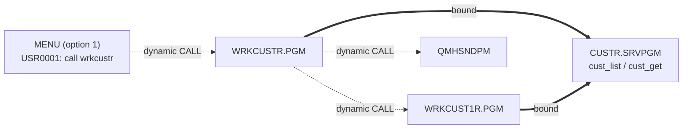
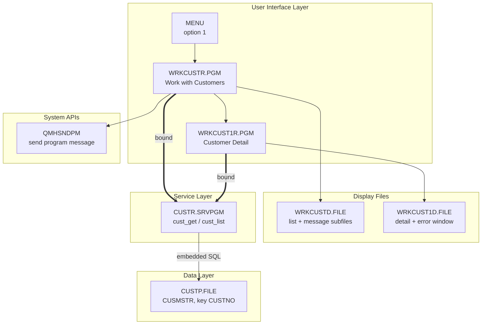
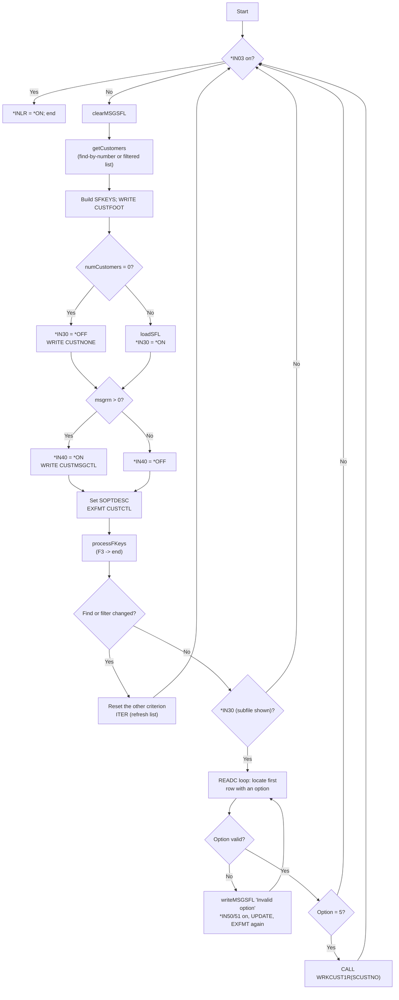

# WRKCUSTR — Technical Documentation

|  |  |
|---|---|
| **Program** | WRKCUSTR |
| **Type** | *PGM |
| **Language** | ILE RPG, fully free-format (`**FREE`) |
| **Source** | `cfdemo/qrpglesrc/wrkcustr.rpgle` |
| **IBM i target release** | Not specified (TGTRLS defaults to the build machine's release) |
| **Version / Author / Date** | 1.0 / Claude (Opus 5) / 2026-08-19 |

### Revision History

| Version | Date | Author | Change | Ref |
|---|---|---|---|---|
| 1.0 | 2026-08-19 | Claude (Opus 5) | Initial documentation | — |

## 1. Overview

`WRKCUSTR` is the classic 5250 **Work with Customers** program: a load-all subfile listing customers
from `CUSTP`, with a "find by number" field, a free-text filter, a message subfile for errors, and a
single subfile option (`5=Display`) that drills into `WRKCUST1R` for customer detail.

It owns no database I/O of its own. The list and the single-record retrieval both come from the
`CUSTR` service program (`cust_list`, `cust_get`), so this program is purely presentation plus
navigation. It is the 5250 member of a family of three functionally equivalent front ends —
`WRKCUSTR` (5250), `WRKCUSTRO` (Profound UI Rich Display), `WRKCUSTEO` (Profound UI EJS screen
mode) — which is what makes the repository useful as a modernization demo.

**How it is invoked:** menu option **1** of the `MENU` menu ("Work with Customers"), which runs
`call wrkcustr` from message `USR0001` in `MENU.MSGF`. It takes no parameters, so it can equally be
started with a plain `CALL WRKCUSTR`.

## 2. Technical Specifications

**Control Options**

| Option | Value | Description |
|---|---|---|
| `DFTACTGRP` | `*NO` | ILE program; may bind to service programs |
| `ACTGRP` | `*NEW` | A fresh activation group per call, destroyed on return. Overrides, SQL cursors and the `CUSTR` activation are all scoped to this one invocation and cleaned up automatically when the program ends. |
| `BNDDIR` | `'CUST'` | Binds `CUSTR *SRVPGM` (see `cfdemo/cust.bnddir`) |
| `OPTION` | *(compiler default)* | Not overridden |
| `THREAD` | *(not coded)* | Not declared thread-safe |

**Input Parameters** — none (no `DCL-PI *ENTRY`).

**Files Used**

| File | Type | Usage | Access | Description |
|---|---|---|---|---|
| `WRKCUSTD` | WORKSTN | Update (`EXFMT`/`WRITE`/`READC`/`CHAIN`) | Two subfiles: `SFILE(CUSTSFL : RRN)` and `SFILE(CUSTMSGSFL : MSGRRN)` | Customer list screen, footer, "no customers" overlay, and message subfile |
| `CUSTP` | DISK | Input (indirect) | Set-based SQL inside `CUSTR` | Never declared here — reached only through the service program |

**Service Programs / Procedures Called**

| Service Program | Procedure | Bound/Dynamic | Description |
|---|---|---|---|
| `CUSTR` | `cust_list` | Bound (via `BNDDIR('CUST')`) | Retrieve the filtered customer list |
| `CUSTR` | `cust_get` | Bound | Retrieve one customer for the "find by number" path |
| `QSYS/QMHSNDPM` | — | Dynamic (`EXTPGM`) | Send `CPF9897` info messages for the message subfile |
| *(this program)* | `WRKCUST1R` | Dynamic (`EXTPGM` program call) | Customer detail screen |

**Local procedures**

| Procedure | Interface | Purpose |
|---|---|---|
| `writeMSGSFL` | `(msgData varchar(80) const options(*varsize))` | Sends a program message and writes one message-subfile record |
| `isValidOption` | `(option char(2) const)` → `ind` | Whitelists subfile options; currently only `5` |

## 3. ILE Structure & Invocation

- **Activation group** — `ACTGRP(*NEW)`. Each `CALL WRKCUSTR` creates a new activation group; it is
  destroyed when the program returns with `*INLR` on. Because `CUSTR` is `ACTGRP(*CALLER)`, the
  service program activates *inside* this group, so its SQL cursor state lives and dies with this
  invocation. `WRKCUST1R` is also `ACTGRP(*NEW)`, so the drill-down gets its own group and its own
  `CUSTR` activation — nothing is shared across the call boundary except the parameter.
- **Binding** — static bind to `CUSTR` through the `CUST` binding directory, resolved at
  `CRTBNDRPG` time. The prototypes come from `/copy custr_pr.rpgle`, so an interface change requires
  recompiling this program (see the fixed-signature warning in `CUSTR_Technical_Documentation.md` §3).
- **Call hierarchy**



## 4. Dependency Tree (text)

```
WRKCUSTR.PGM
├── Source
│   ├── wrkcustr.rpgle
│   └── custr_pr.rpgle              (/COPY member: cust_rec template + prototypes)
├── Display Files
│   └── WRKCUSTD.FILE               (DSPF: CUSTSFL, CUSTCTL, CUSTFOOT, CUSTNONE,
│                                     CUSTMSGSFL, CUSTMSGCTL)
├── Service Programs
│   └── CUSTR.SRVPGM                (cust_list, cust_get)
├── Binding Directory
│   └── CUST.BNDDIR
├── Programs called
│   ├── WRKCUST1R.PGM               (customer detail)
│   └── QSYS/QMHSNDPM               (send program message)
├── Message Files
│   └── QSYS/QCPFMSG                (message CPF9897 used as a text carrier)
└── Database
    └── CUSTP.FILE (PF, key CUSTNO) — accessed only through CUSTR.SRVPGM
```

## 5. Dependency Diagram (Mermaid)



## 6. Complete Object Dependency List

**Programs**

| Object | Type | Library | Source member | Description |
|---|---|---|---|---|
| `WRKCUSTR` | *PGM | `$IBMI_BUILD_LIBRARY` (e.g. `AITSK00104`) / `CFDEMO` | `cfdemo/qrpglesrc/wrkcustr.rpgle` | Customer list (5250) |
| `WRKCUST1R` | *PGM | build library | `cfdemo/qrpglesrc/wrkcust1r.rpgle` | Customer detail (5250), called with `SCUSTNO` |
| `QMHSNDPM` | *PGM | `QSYS` | *(IBM-supplied)* | Send Program Message API |

**Service Programs**

| Object | Type | Library | Source member | Description |
|---|---|---|---|---|
| `CUSTR` | *SRVPGM | build library | `qrpglesrc/custr.sqlrpgle` + `qsrvsrc/custr.bnd` | Customer data service |

**Display Files**

| Object | Type | Library | Source member | Description |
|---|---|---|---|---|
| `WRKCUSTD` | *FILE (DSPF) | build library | `cfdemo/qddssrc/wrkcustd.dspf` | Six record formats — see §8 |

**Physical Files**

| Object | Type | Library | Source member | Description |
|---|---|---|---|---|
| `CUSTP` | *FILE (PF) | *LIBL | `cfdemo/qddssrc/custp.pf` | Customer master (accessed via `CUSTR`) |

**Binding Directories**

| Object | Type | Library | Source member | Description |
|---|---|---|---|---|
| `CUST` | *BNDDIR | build library | `cfdemo/cust.bnddir` | Resolves `CUSTR` at bind time |

**Message Files**

| Object | Type | Library | Source member | Description |
|---|---|---|---|---|
| `QCPFMSG` | *MSGF | `QSYS` | *(IBM-supplied)* | Supplies `CPF9897`, used to carry free-form text |
| `MENU` | *MSGF | build library | `cfdemo/menu.msgf` | Menu option commands (`USR0001` = `call wrkcustr`) |

**Copy Members**

| Object | Type | Library | Source member | Description |
|---|---|---|---|---|
| `custr_pr` | Source | n/a | `cfdemo/qrpglesrc/custr_pr.rpgle` | `cust_rec` template + prototypes |

## 7. Database Schema & Access (DB2 for i)

This program performs **no direct database access** — there is no `DCL-F` for a disk file and no
embedded SQL. All access is delegated to `CUSTR`, which reads `CUSTP` with set-based SQL.

`CUSTP` layout, key and access-path notes (as consumed here through `cust_rec`):

| Field | Type | Length | Dec | Used by this program |
|---|---|---|---|---|
| `CUSTNO` | Packed | 6 | 0 | `SCUSTNO` in the subfile; passed to `WRKCUST1R` |
| `CNAME` | Char | 40 | | `SNAME` — **truncated to 20** by the subfile field |
| `CADDR1` / `CADDR2` | Char | 40 | | Concatenated into `SADDR` |
| `CCITY` | Char | 30 | | Concatenated into `SADDR` |
| `CSTATE` | Char | 2 | | Concatenated into `SADDR` |
| `CZIP` | Char | 10 | | Concatenated into `SADDR` |
| `CPHONE` | Char | 15 | | `SPHONE` |
| `CEMAIL` | Char | 60 | | `SEMAIL` — **truncated to 25** by the subfile field |
| `CSTATUS` / `CTYPE` | Char | 1 | | Not shown on the list |
| `CLIMIT` / `CBALANCE` | Packed | 11 | 2 | Not shown on the list |
| `CLASTORD` / `CCREATED` | Zoned | 8 | 0 | Not shown on the list |

- **Key & access path** — `CUSTP` is keyed non-uniquely on `CUSTNO`; `cust_list` returns rows
  `ORDER BY CUSTNO`, so the subfile is always in customer-number sequence.
- **Referential integrity / triggers** — none defined in source.
- **Journaling** — none established by the build (`CUSTP` is a `CRTPF` DDS file).
- **Commitment control** — none. `CUSTR` runs `SET OPTION COMMIT = *NONE`, and this program is
  read-only, so there are no transaction boundaries to reason about.

**Truncation is a real behaviour, not a documentation nicety:** the subfile shows the first 20
characters of the name and the first 25 of the email. The filter, however, is applied by `CUSTR`
against the *full* column values, so a search can legitimately match a customer whose displayed
name or email does not visibly contain the search text. The Rich Display and EJS variants widen
these fields and do not have this artefact.

## 8. Display File Layout

`WRKCUSTD` — `DSPSIZ(24 80 *DS3)`, six record formats.

```
                              Work with Customers                                (1,31)
                                                                                 
  Find customer by number . :  123456                                            (3)
  Filter  . . . . . . . . . :  ________________________________________________  (4)
                                                                                 
  5=Display                                                                      (6)  SOPTDESC
                                                                                 
  Opt  Cust # Name                 Primary Email             Phone               (8)  headings
  __   100001 ACME INDUSTRIES      orders@acme.example       555-0100            (9)  CUSTSFL line 1
       Address: 100 MAIN ST STE 4 SPRINGFIELD, IL 62704                          (10) CUSTSFL line 2
  __   100002 ...                                                                (11)
       Address: ...                                                              (12)
                                                        (7 records = rows 9-22)  
                                                                                 
  F3=Exit  F11=Fold/Unfold                                                       (23) CUSTFOOT
  Error text appears here from the message subfile                               (24) CUSTMSGSFL
```

**`CUSTSFL`** — subfile record (`SFL`), two display lines per record.

| Field | Length | Type | Row/Col | Description |
|---|---|---|---|---|
| `SOPT` | 2A | B (both) | 9, 2 | Option entry; `DSPATR(RI)` + `DSPATR(PC)` when `*IN50` |
| `SCUSTNO` | 6S 0 | O | 9, 6 | Customer number |
| `SNAME` | 20A | O | 9, 15 | Customer name (truncated from 40) |
| `SEMAIL` | 25A | O | 9, 37 | Email (truncated from 60) |
| `SPHONE` | 15A | O | 9, 64 | Phone |
| `SADDR` | 64A | O | 10, 15 | `CADDR1 CADDR2 CCITY, CSTATE CZIP` assembled by the program |

Conditioning: `*IN51` → `SFLNXTCHG` (record is returned by the next `READC` even if the user does
not retype it); `*IN50` → reverse image and cursor placement on `SOPT`. The literal `Address:` on
line 10 is `COLOR(WHT)`.

**`CUSTCTL`** — subfile control record (`SFLCTL(CUSTSFL)`).

| Keyword | Value | Effect |
|---|---|---|
| `SFLSIZ` / `SFLPAG` | 8 / 7 | `SFLSIZ = SFLPAG + 1` — the "expandable subfile" idiom: the system extends the subfile as records are written, so the program can load all customers in one pass and let the workstation handle paging |
| `SFLDSP` | `N31 30` | Display subfile records only when there is something to show |
| `SFLDSPCTL` | *(unconditioned)* | Always show the control record (headings, find/filter fields) |
| `SFLCLR` | `31` | Clear the subfile |
| `SFLEND` | `N31 30` | `+` / bottom-of-list indicator |
| `SFLDROP(CF11)` | `N31 30` | F11 folds/unfolds the second (address) line |
| `CA03(03 'Exit')` | | F3 sets `*IN03`; input fields are *not* returned |
| `OVERLAY` | | Do not clear the rest of the screen |

| Field | Length | Type | Row/Col | Description |
|---|---|---|---|---|
| `SFNDCUSTNO` | 6Y 0 | B | 3, 31 | Find-by-number; `EDTCDE(Z)` zero-suppresses, so an empty search shows blank rather than `000000` |
| `SFILTER` | 48A | B | 4, 31 | Free-text filter; `CHECK(LC)` permits lower case |
| `SOPTDESC` | 77A | O | 6, 2 | Option legend (`5=Display`, or blank when the list is empty), `COLOR(BLU)` |

Column headings (`Opt`, `Cust #`, `Name`, `Primary Email`, `Phone`) are `COLOR(WHT)` constants on
row 8; the title `Work with Customers` is on row 1.

**`CUSTFOOT`** — function-key footer.

| Field | Length | Type | Row/Col | Description |
|---|---|---|---|---|
| `SFKEYS` | 77A | O | 23, 2 | Key legend built by the program, `COLOR(BLU)` |

**`CUSTNONE`** — `OVERLAY`; a single constant `** No customers to display **` at row 10, col 26.

**`CUSTMSGSFL` / `CUSTMSGCTL`** — program-message subfile on line 24.

| Field | Definition | Description |
|---|---|---|
| `SMSGKEY` | `SFLMSGKEY` | Message reference key returned by `QMHSNDPM` |
| `SPGMQ` | `SFLPGMQ(10)` | Program message queue name; set from the PSDS program name |

`SFLMSGRCD(24)` places messages on line 24; `SFLSIZ(2)`/`SFLPAG(1)` shows one at a time;
`SFLDSP`/`SFLEND` are conditioned `N41 40` and `SFLCLR` on `41`; `OVERLAY` keeps the rest of the
screen intact.

**Subfile behaviour summary** — load-all (not page-at-a-time): every row returned by `cust_list`
is written before the screen is displayed, and paging is handled by the workstation controller.
F11 toggles fold/truncate through `SFLDROP`, which is also a device-level function — the program
never sees F11 and does not need to redisplay.

`SFLDROP` (rather than `SFLFOLD`) means the **initial** display is *truncated*: only line 1 of each
record is shown, the address line is hidden, and more records fit on the panel. Verified against the
running application — the first display shows 10 single-line records on rows 9–18, and pressing F11
folds them out to 7 two-line records on rows 9–22 with the `SFLEND` `+` indicator at the bottom
right. A redisplay of the control record returns the panel to the truncated state.

## 9. Program Flow (Mermaid) & Key Routines



**Key routines**

| Routine | Kind | Purpose |
|---|---|---|
| `getCustomers` | Subroutine | If `findCust <> 0`, calls `cust_get` for that one customer (`numCustomers` 0 or 1); otherwise calls `cust_list` with the trimmed filter. Any returned error text is pushed to the message subfile. |
| `clearSFL` | Subroutine | `RRN = 0`, `*IN31` on, `WRITE CUSTCTL` (SFLCLR), `*IN31` off |
| `loadSFL` | Subroutine | Clears then writes one subfile record per customer, assembling `SADDR` from four address columns |
| `clearMSGSFL` | Subroutine | `MSGRRN = 0`, `*IN41` on, `WRITE CUSTMSGCTL`, `*IN41` off |
| `processFKeys` | Subroutine | On `*IN03`: sets `*INLR` and `RETURN`s out of the program |
| `writeMSGSFL` | Subprocedure | `QMHSNDPM` → message subfile record (see §11) |
| `isValidOption` | Subprocedure | Returns `*ON` only for option `5` |

**Selection semantics worth knowing.** The `READC` loop scans every changed subfile record and
remembers the **RRN of the first** row carrying an option; subsequent selections are ignored
(`SELRRN` is already set). Each changed record is rewritten with `UPDATE` so the typed option
persists on redisplay, and `*IN50`/`*IN51` are turned off during that update. After the loop,
`CHAIN SELRRN CUSTSFL` re-reads that row so `SOPT` and `SCUSTNO` describe the selected customer.
If the option is not valid, the program writes an `Invalid option: x` message, turns on `*IN50`
(reverse image + cursor) and `*IN51` (`SFLNXTCHG`) on that row, redisplays, and loops until the
option is blank or valid.

**Storage note.** `customers` is a module-level `dim(9999)` array of the 271-byte `cust_rec`, i.e.
about 2.6 MB of static storage per activation, and `cust_list` is always called with
`limit = %elem(customers)` = 9999. The list is therefore capped at 9999 customers with no
"more rows exist" indication — beyond that, rows are silently absent. Fine for the demo dataset;
worth revisiting for real volumes.

**Dead declaration.** `validOpt ind` is declared and never referenced.

## 10. Indicators Used

| Indicator | Purpose |
|---|---|
| `*IN03` | F3 pressed (`CA03`) — ends the program via `processFKeys` |
| `*IN30` | Customer subfile has content: enables `SFLDSP`, `SFLEND`, `SFLDROP` |
| `*IN31` | `SFLCLR` for `CUSTSFL` (set only around `clearSFL`) |
| `*IN40` | Message subfile has content: enables `SFLDSP`/`SFLEND` on `CUSTMSGCTL` |
| `*IN41` | `SFLCLR` for `CUSTMSGSFL` |
| `*IN50` | On the selected row: `DSPATR(RI)` + `DSPATR(PC)` to highlight an invalid option and place the cursor |
| `*IN51` | `SFLNXTCHG` on the selected row, so `READC` returns it again until it is corrected |
| `*INLR` | Set `*ON` before returning so the program closes down cleanly |

`*IN30`/`*IN31` and `*IN40`/`*IN41` are used in pairs because the DDS conditions are written
`N31 30` — content *and* not-clearing — a conventional 5250 subfile idiom.

## 11. Error & Exception Handling

**Strategy — error text as data, surfaced through a message subfile.** There is no `MONITOR`, no
`*PSSR`, no INFDS, and no `(E)` extender anywhere in the program. Two classes of problem are
handled deliberately, and everything else is left to the default handler:

1. **Service-program failures.** `cust_get` / `cust_list` return a `varchar(80)` message rather than
   throwing. `getCustomers` tests it and calls `writeMSGSFL`, so an SQL problem appears on line 24
   as, for example, `Error retrieving customer list. SQLCODE = -204, SQLSTATE = 42704`. The list is
   simply empty in that case and the program stays usable.
2. **Invalid subfile option.** `isValidOption` rejects anything but `5`; the message
   `Invalid option: x` is written, the offending row is highlighted (`*IN50`) and marked
   `SFLNXTCHG` (`*IN51`), and the screen is redisplayed until it is corrected or cleared.

**Message mechanics.** `writeMSGSFL` sends the text through `QMHSNDPM`:

| Argument | Value | Meaning |
|---|---|---|
| Message ID | `CPF9897` | A general-purpose "text carrier" message |
| Message file | `QCPFMSG   QSYS` | IBM-supplied |
| Message data | the caller's text, padded to `char(80)` | Substituted into `CPF9897` |
| Message type | `*INFO` | Informational — no reply, no escape |
| Call stack entry / counter | `*` / `1` | One entry up from the subprocedure that called the API, i.e. the main program — the queue that `SPGMQ`/`SFLPGMQ` names |
| Message key | `SMSGKEY` | The DDS `SFLMSGKEY` field, receiving the reference key |
| Error code | `x'0000000000000000'` | Bytes-provided = 0, so API failures are signalled as escape messages rather than returned quietly |

Two details in that call are load-bearing. The key must be written **directly into the DDS
`SFLMSGKEY` field** — a private variable copied afterwards does not work, and getting it wrong
crashes on the first message. And `SPGMQ` is set from the PSDS:

```rpgle
dcl-ds statusDS psds qualified;
  programName char(10) pos(334);
end-ds;
```

That is the program's **only** use of the PSDS — it supplies the program name for `SFLPGMQ` rather
than any error information.

**Formats and `OVERLAY`.** Every format that is `WRITE`n or `EXFMT`d after the subfile is loaded
(`CUSTCTL`, `CUSTMSGCTL`, `CUSTNONE`) carries `OVERLAY`. Without it the device would clear the
already-loaded subfile and the next `EXFMT` would fail with a device error (`CPF5006` / `RNX1255`) —
worth remembering before adding a new format to this file.

**Unhandled conditions.** A workstation device error (session dropped, `WRKCUSTD` missing from the
library list), an unresolved reference to `WRKCUST1R` at call time, or an RPG runtime exception
inside `loadSFL` all reach the default handler: an inquiry message, then an `RNX` dump if
unanswered. Recovery is to end the job's program and correct the library list or rebuild the missing
object; nothing is written to the database, so there is nothing to back out.

## 12. Security & Authority

- No adopted authority — built without `USRPRF(*OWNER)`, so the program runs with the caller's
  authority throughout. A user without `*USE` on `CUSTP` sees an SQL error in the message subfile,
  not a system security message.
- Required authority: `*USE` on `WRKCUSTR`, `WRKCUST1R`, `CUSTR`, `WRKCUSTD`, `WRKCUST1D` and
  `CUSTP` (plus `*EXECUTE` on the libraries).
- Object ownership is the building profile (`$IBMI_USER`); public authority follows the build
  library's `CRTAUT`. No `*AUTL` is referenced in source.
- Sensitive data: the list exposes customer names, emails and phone numbers; the detail screen adds
  credit limit and balance. There is no masking, no field procedure and no audit-journal entry for
  viewing. Access control is entirely object-level.

## 13. Interfaces & Integration

Not applicable — no data queues, data areas, web services, IFS or MQ. The only external interface
is the `QMHSNDPM` system API and the program call to `WRKCUST1R`.

## 14. Batch / Job Flow

Not applicable — interactive only. It requires a workstation device (`EXFMT`) and cannot be
submitted to batch.

## 15. Build & Compile

```
CRTDSPF   FILE(<LIB>/WRKCUSTD) SRCFILE(<LIB>/QDDSSRC)
CRTBNDRPG PGM(<LIB>/WRKCUSTR) SRCSTMF('cfdemo/qrpglesrc/wrkcustr.rpgle')
```

`CRTBNDRPG` picks up `DFTACTGRP(*NO)`, `ACTGRP(*NEW)` and `BNDDIR('CUST')` from the `CTL-OPT`
statements in the source, so they do not appear on the command.

`Rules.mk`:

```makefile
wrkcustd.file: qddssrc/wrkcustd.dspf
wrkcustr.pgm:  qrpglesrc/wrkcustr.rpgle qddssrc/wrkcustd.dspf qrpglesrc/custr_pr.rpgle custr.srvpgm | wrkcustd.file cust.bnddir
```

Build order: `custp.file` → `custr.module` → `custr.srvpgm` → `cust.bnddir` → `wrkcustd.file` →
`wrkcustr.pgm` (and `wrkcust1r.pgm` for the drill-down to work). Build with codermake — never issue
the create commands by hand:

```bash
cd /workspace/workspace/ibmi-agentic
codermake wrkcustr.pgm
```

`custr.srvpgm` is a **normal** prerequisite (rebuilding the service program recompiles this program,
which is what you want given the fixed export signature), while `wrkcustd.file` and `cust.bnddir`
are **order-only** (they must exist, but rebuilding them does not force a program rebuild).

## 16. Related Programs

| Program | Description | Relationship |
|---|---|---|
| `WRKCUST1R` | Customer detail (5250) | Callee — invoked for option `5` with `SCUSTNO` |
| `CUSTR` | Customer data service program | Callee (bound) |
| `WRKCUSTRO` | Same function on a Profound UI Rich Display file | Alternate front end (menu option 2) |
| `WRKCUSTEO` | Same function on a Profound UI EJS screen | Alternate front end (menu option 3) |
| `MENU` | `Agentic Coding Demo Menu` | Caller — option 1 |

## 17. Testing Notes

| Scenario | Steps | Expected result |
|---|---|---|
| List loads | Menu option 1 | Subfile in ascending customer-number order, `5=Display` legend on row 6, `F3=Exit  F11=Fold/Unfold` on row 23 |
| Fold / unfold | Press F11 | Address line hides/shows; no program interaction needed |
| Find by number | Type an existing number in *Find customer by number* and press Enter | Exactly one row; the filter field is cleared |
| Find missing number | Type a number not in `CUSTP` | `** No customers to display **`, no `5=Display` legend, `F3=Exit` only in the footer |
| Filter by name | Type part of a customer name (any case) | Matching rows only; note a match may be invisible if it falls beyond the 20-character displayed name |
| Filter by phone | Type leading digits of a phone number | Prefix matches only |
| Find and filter interact | Enter a filter, then a find number | Setting one clears the other |
| Valid option | Type `5` beside a row and press Enter | `WRKCUST1R` detail screen for that customer; F3 returns to the refreshed list |
| Invalid option | Type `9` beside a row | `Invalid option: 9` on line 24, the row in reverse image, cursor on the option field, list still usable |
| Multiple options | Type `5` beside two rows | Only the first selected row is opened |
| Exit | Press F3 | Returns to the menu |

No automated tests exist in the repository.

## 18. Version Information

| Attribute | Value |
|---|---|
| Source Format | Fully free-format (`**FREE`) |
| ILE Compatible | Yes |
| Activation Group | `*NEW` |
| Uses Embedded SQL | No (SQL is inside `CUSTR`) |
| Multi-threaded | No |
| Display Type | 5250 DDS display file (`DSPSIZ(24 80 *DS3)`) |
| Target Release (TGTRLS) | Compiler default (build machine's release) |
