# Giant Tiger — Warehouse Floor Mobile POC

**Working title:** GT Warehouse Mobile · *GT Entrepôt Mobile*
**Status:** DRAFT v0.3 — all open questions answered. **Ready to cut code pending §23.**
**Architecture:** IBM i · ILE RPG (SQLRPGLE) · RPG Open Access · Profound UI Rich Display **EJS**
**Target library:** `TIGERPOC` · **Branch:** `TIGERPOC`
**Date:** 2026-08-06

---

## Table of Contents

1. [What we are proving](#1-what-we-are-proving)
2. [Decisions locked](#2-decisions-locked)
3. [Brand foundation](#3-brand-foundation)
4. [Architecture](#4-architecture)
5. [Entry point and application map](#5-entry-point-and-application-map)
6. [Shared components (the reusable core)](#6-shared-components-the-reusable-core)
7. [Application 1 — Receiving](#7-application-1--receiving)
8. [Application 2 — Inventory & Movement](#8-application-2--inventory--movement)
9. [Application 3 — Item Lookup](#9-application-3--item-lookup)
10. [Application 4 — Cycle Count](#10-application-4--cycle-count)
11. [Application 5 — Scan Lab](#11-application-5--scan-lab)
12. [Application 6 — Supervisor View](#12-application-6--supervisor-view)
13. [Bilingual EN / FR design](#13-bilingual-en--fr-design)
14. [Responsive design and information priority](#14-responsive-design-and-information-priority)
15. [Barcode scanning design](#15-barcode-scanning-design)
16. [Camera, photos and image storage](#16-camera-photos-and-image-storage)
17. [Data model — SQL DDL, journaling and commitment control](#17-data-model--sql-ddl-journaling-and-commitment-control)
18. [Demo data](#18-demo-data)
19. [Build and deployment into TIGERPOC](#19-build-and-deployment-into-tigerpoc)
20. [Naming and file conventions](#20-naming-and-file-conventions)
21. [Delivery waves](#21-delivery-waves)
22. [Technical risks and spikes](#22-technical-risks-and-spikes)
23. [Demo narrative and screen capture](#23-demo-narrative-and-screen-capture)
24. [Open questions — round 3](#24-open-questions--round-3)

---

## 1. What we are proving

Giant Tiger runs RF guns on 5250 emulation today. **The guns are being replaced regardless**, so the
POC does not need to defend the existing hardware — it needs to show what the replacement looks like
on ordinary consumer devices: iPhone, Android phone, iPad, Android tablet, and a desktop screen.

Five claims:

| # | Claim | How the POC proves it |
|---|-------|-----------------------|
| 1 | **The device becomes a free choice.** | Nothing in the application depends on a proprietary emulator or a specific scanner vendor. Any modern browser on any modern device is a terminal — a phone in a pocket, a tablet on a cart, a screen at a desk. |
| 2 | **Your RPG survives the transition intact.** | Every screen is driven by an ordinary ILE RPG program using a Rich Display File through Open Access. Same job structure, same embedded SQL, same commitment control, same skills on staff. The emulator goes; the application layer does not. |
| 3 | **It looks and behaves like a modern mobile app.** | Big-target, thumb-reachable, branded, image-rich screens. Camera scanning, photos, haptics, swipe. Nothing looks like a green screen with lipstick. |
| 4 | **One codebase, every screen size.** | The same program and the same record format render correctly on a phone, a tablet and a desktop — showing *more* information as real estate allows, never a truncated or sideways-scrolled mess. |
| 5 | **Fully bilingual, instantly.** | One tap flips every label, button, message and data description between English and French. A green screen cannot do this without a second display file. |

**Non-goals.** We are not building a WMS. Slotting logic, wave planning, labour standards, carrier
integration, device management and real ERP integration are explicitly out. Where the demo needs an
answer from one of those, it is stubbed with plausible demo data.

---

## 2. Decisions locked

Answers from rounds 1 and 2, recorded so we do not relitigate them.

| Ref | Question | Decision |
|-----|----------|----------|
| 1.1 | Wave 1 scope | **Agreed as proposed** — Sign-on, Menu, Item Lookup, Receiving, Inventory & Move. |
| 1.2 | Image storage | **BLOB in DB2.** Named IFS files rejected as hard to administer. See §16. |
| 1.3 | TLS / hosting | **Already in place** in the Genie environment. Application-level work only. |
| 1.4 | "On the screen itself" | **Not a 5250 terminal.** All web, inside Genie / Profound UI. Requirement is *responsive throughout* — use all available real estate, key information only on small screens. Drives §14. |
| 1.5 | Devices | RF guns on 5250 emulation today; moving away. Live demo on **Android**. |
| 1.6 | Bilingual EN/FR | **In.** Toggle on **every screen**. See §13. |
| 1.7 | Data and imagery | **Invent it all.** Enough volume for finger-scrolled tables. |
| 1.8 | Existing schema | **None. Carte blanche.** |
| 1.9 | Symbologies | **Go wide.** UPC, EAN, Code 128, GS1-128, ITF-14, Code 39, QR, Data Matrix, PDF417. |
| 1.10 | Audience | **Executives, 30 minutes.** Recorded compilation plus a live Android demo. |
| 2.1 | Database | **All tables on IBM i in DB2 via modern SQL DDL.** No DDS physical files. |
| 2.2 | Integrity | **Journaled, with commitment control and rollback throughout.** See §17.3–§17.5. |
| 3.1 | Genie skin | **No skin work.** Add one option to the **existing sign-on menu** that calls the mobile menu. From that point on everything is EJS Rich Display and the skin is irrelevant. See §5.1 and §19.2. |
| 3.2 | Library and branch | **Library `TIGERPOC`. Branch `TIGERPOC`.** All artifacts built there. See §19. |
| 3.3 | Commercial close | **Not our concern** — the salesman closes. Focus purely on a great end-to-end mobile demo. |
| 3.4 | Supervisor View + Transaction History | **In.** See §12 and §17.3. |
| 3.5 | French | **Machine translation accepted**, disclosed as such, with a production audit called out. Every screen bilingual. See §13.4. |
| 3.6 | Imagery | **Generated imagery accepted.** |
| 3.7 | Live demo device | **Samsung Galaxy S24 Ultra, current OS.** Primary design target. See §14.1 and §15.1. |
| 3.8 | Recordings | **Attempt them.** Produce what we can; the user records manually otherwise. See §23.3. |
| 3.9 | Existing RF guns | **Being replaced. Not a concern.** Build for phones and tablets as originally stated. |

---

## 3. Brand foundation

From Giant Tiger's official *Logo Standard Guide 2025 (EN)* — authoritative, and the guide states the
corporate colours cannot be changed.

| Colour | Pantone | Hex | RGB | Use in the app |
|--------|---------|-----|-----|----------------|
| GT Red | PMS 186 C | `#E31837` | 227 / 24 / 55 | Primary action, active state, brand bar, destructive-confirm |
| GT Yellow | PMS 116 C | `#FFCD00` | 255 / 205 / 0 | Accent, header band, attention chips, scan-target framing |
| GT Black | Process Black | `#000000` | 0 / 0 / 0 | Wordmark, primary text, reversed-logo plates |

Supporting neutrals we add (not brand-owned, ours to choose): a warm-grey ramp
`#F7F7F5 → #E4E4E1 → #9A9A96 → #2B2B2B`, plus semantic green `#127C3B` (confirmed / in balance) and
amber `#B45309` (variance / short).

**Identity rules that affect us:**

- The bilingual `GIANT TIGER 🐯 TIGRE GÉANT` lockup is preferred for corporate representation, with
  unilingual lockups permitted when materials exist separately per language. Since the app is
  bilingual and switchable, **the header uses the unilingual lockup matching the active language and
  flips with the toggle** — a small detail that is very noticeable on camera.
- The logo is a registered trademark, must not be altered or recreated, and marketing approval is
  required. We use official artwork and label the build a prospect demonstration.
- Protected space = the width of the wordmark "N", encoded as a CSS custom property.
- Reversed (knockout) lockups exist for dark plates; the app header is a black band, so we use those.
- A vertical/stacked lockup exists and suits the narrow phone header; horizontal for tablet and desktop.

**Tagline:** "Low Price is What We Do." Right for the splash screen, not for an internal tool's chrome.

---

## 4. Architecture

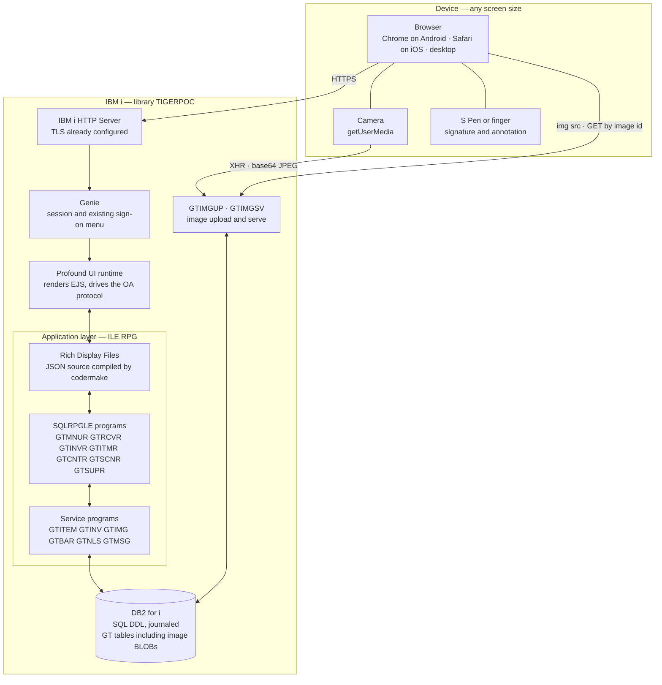
```mermaid
flowchart TB
    subgraph DEV["Device — any screen size"]
        B["Browser<br/>Chrome on Android · Safari on iOS · desktop"]
        CAM["Camera<br/>getUserMedia"]
        PEN["S Pen or finger<br/>signature and annotation"]
        B --- CAM
        B --- PEN
    end

    subgraph IBMI["IBM i — library TIGERPOC"]
        HTTP["IBM i HTTP Server<br/>TLS already configured"]
        GENIE["Genie<br/>session and existing sign-on menu"]
        PUI["Profound UI runtime<br/>renders EJS, drives the OA protocol"]
        subgraph RPGLAYER["Application layer — ILE RPG"]
            OA["Rich Display Files<br/>JSON source compiled by codermake"]
            PGM["SQLRPGLE programs<br/>GTMNUR GTRCVR GTINVR GTITMR GTCNTR GTSCNR GTSUPR"]
            SRV["Service programs<br/>GTITEM GTINV GTIMG GTBAR GTNLS GTMSG"]
        end
        CGI["GTIMGUP · GTIMGSV<br/>image upload and serve"]
        DB[("DB2 for i<br/>SQL DDL, journaled<br/>GT tables including image BLOBs")]
    end

    B -- "HTTPS" --> HTTP
    HTTP --> GENIE --> PUI
    PUI <--> OA
    OA <--> PGM
    PGM <--> SRV
    SRV <--> DB
    CAM -- "XHR · base64 JPEG" --> CGI
    B -- "img src · GET by image id" --> CGI
    CGI <--> DB
```

**Two things to notice.**

*The application layer is completely conventional.* `GTRCVR` is an RPG program with a display file,
write/read cycles, subfiles, embedded SQL and commitment control. What changed is that the display
file's record formats render as HTML templates rather than a 24×80 buffer. That is the whole argument,
and §23 ends by putting the source on screen.

*Images do not travel through the Open Access field buffer.* They are far too large. Photos go over a
side channel to `GTIMGUP`, and only a small integer image ID returns to the RPG program. Images are
read back through `GTIMGSV` as ordinary `` requests. §16 has the detail.

---

## 5. Entry point and application map

### 5.1 Getting in — one new menu option, no skin work

The existing demo sign-on menu (`MENU`, "Agentic Coding Demo Menu") already offers options 1, 2, 3 and
90. We add **option 4**, which calls the mobile application. From that point on everything is EJS Rich
Display and the Genie skin is irrelevant.

```
              Agentic Coding Demo Menu

  Select one of the following:

     1. Work with Customers
     2. Work with Customers (RPGOA)
     3. Work with Customers (EJS)
     4. Warehouse Mobile / Entrepôt mobile        <-- new
    90. Sign off
```

That is a two-line addition to `menu.dspf` and one `ADDMSGD` in `menu.msgf`, shadow-built into
`TIGERPOC`. §19.2 covers the shadowing mechanics and the trap to avoid.

### 5.2 Application map

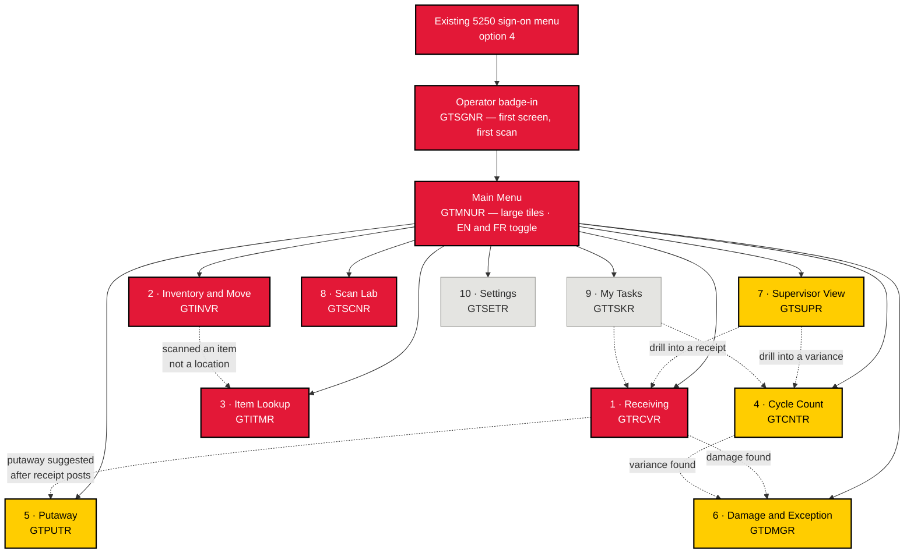
```mermaid
flowchart TD
    MENU5250["Existing 5250 sign-on menu<br/>option 4"]
    SIGNON["Operator badge-in<br/>GTSGNR — first screen, first scan"]
    MENU["Main Menu<br/>GTMNUR — large tiles · EN and FR toggle"]

    MENU5250 --> SIGNON --> MENU

    MENU --> RCV["1 · Receiving<br/>GTRCVR"]
    MENU --> INV["2 · Inventory and Move<br/>GTINVR"]
    MENU --> ITM["3 · Item Lookup<br/>GTITMR"]
    MENU --> CNT["4 · Cycle Count<br/>GTCNTR"]
    MENU --> PUT["5 · Putaway<br/>GTPUTR"]
    MENU --> DMG["6 · Damage and Exception<br/>GTDMGR"]
    MENU --> SUP["7 · Supervisor View<br/>GTSUPR"]
    MENU --> SCN["8 · Scan Lab<br/>GTSCNR"]
    MENU --> TSK["9 · My Tasks<br/>GTTSKR"]
    MENU --> SET["10 · Settings<br/>GTSETR"]

    RCV -.->|"putaway suggested<br/>after receipt posts"| PUT
    RCV -.->|"damage found"| DMG
    CNT -.->|"variance found"| DMG
    INV -.->|"scanned an item<br/>not a location"| ITM
    SUP -.->|"drill into a receipt"| RCV
    SUP -.->|"drill into a variance"| CNT
    TSK -.-> RCV
    TSK -.-> CNT

    classDef w1 fill:#E31837,stroke:#000,color:#fff,stroke-width:2px
    classDef w2 fill:#FFCD00,stroke:#000,color:#000,stroke-width:2px
    classDef w3 fill:#E4E4E1,stroke:#9A9A96,color:#2B2B2B
    class MENU5250,SIGNON,MENU,RCV,INV,ITM,SCN w1
    class CNT,DMG,PUT,SUP w2
    class TSK,SET w3
```

**Legend —** red = Wave 1, yellow = Wave 2, grey = Wave 3. See §21.

**Sign-on model.** `GTSGNR` handles *operator* identity with a badge scan, which is how shared
warehouse devices work and means the demo's first action is a barcode scan. It can be skipped with a
"continue as demo operator" button if we want a shorter path on camera.

### 5.3 Program-to-format dependency

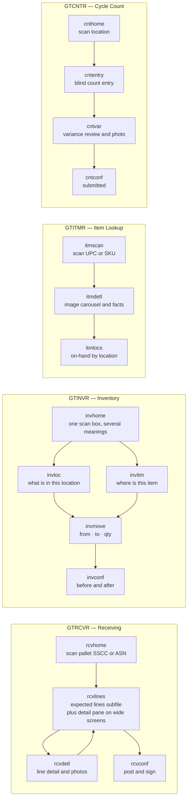
```mermaid
flowchart LR
    subgraph GTRCVR["GTRCVR — Receiving"]
      R1["rcvhome<br/>scan pallet SSCC or ASN"]
      R2["rcvlines<br/>expected lines subfile<br/>plus detail pane on wide screens"]
      R3["rcvdetl<br/>line detail and photos"]
      R4["rcvconf<br/>post and sign"]
      R1 --> R2 --> R3
      R2 --> R4
      R3 --> R2
    end

    subgraph GTINVR["GTINVR — Inventory"]
      I1["invhome<br/>one scan box, several meanings"]
      I2["invloc<br/>what is in this location"]
      I3["invitm<br/>where is this item"]
      I4["invmove<br/>from · to · qty"]
      I5["invconf<br/>before and after"]
      I1 --> I2 --> I4 --> I5
      I1 --> I3 --> I4
    end

    subgraph GTITMR["GTITMR — Item Lookup"]
      T1["itmscan<br/>scan UPC or SKU"]
      T2["itmdetl<br/>image carousel and facts"]
      T3["itmlocs<br/>on-hand by location"]
      T1 --> T2 --> T3
    end

    subgraph GTCNTR["GTCNTR — Cycle Count"]
      C1["cnthome<br/>scan location"]
      C2["cntentry<br/>blind count entry"]
      C3["cntvar<br/>variance review and photo"]
      C4["cntconf<br/>submitted"]
      C1 --> C2 --> C3 --> C4
    end
```

**Design rule:** every screen is reachable in at most three taps or scans from the main menu, every
screen has a persistent Home and Back, and **every screen carries the EN | FR toggle**.

---

## 6. Shared components (the reusable core)

Built once in `ui/gtcommon/`, consumed by every screen. If Giant Tiger later builds twenty more
screens, they reuse these — a large part of the commercial argument.

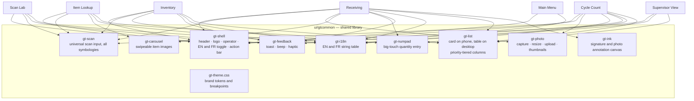
```mermaid
flowchart TD
    subgraph COMMON["ui/gtcommon — shared library"]
        SHELL["gt-shell<br/>header · logo · operator · EN and FR toggle · action bar"]
        SCAN["gt-scan<br/>universal scan input, all symbologies"]
        PHOTO["gt-photo<br/>capture · resize · upload · thumbnails"]
        CAROUSEL["gt-carousel<br/>swipeable item images"]
        NUMPAD["gt-numpad<br/>big-touch quantity entry"]
        FEEDBACK["gt-feedback<br/>toast · beep · haptic"]
        I18N["gt-i18n<br/>EN and FR string table"]
        LIST["gt-list<br/>card on phone, table on desktop<br/>priority-tiered columns"]
        INK["gt-ink<br/>signature and photo annotation canvas"]
        THEME["gt-theme.css<br/>brand tokens and breakpoints"]
    end

    RCV["Receiving"] --> SHELL & SCAN & PHOTO & CAROUSEL & NUMPAD & FEEDBACK & I18N & LIST & INK
    INV["Inventory"] --> SHELL & SCAN & NUMPAD & FEEDBACK & I18N & LIST
    ITM["Item Lookup"] --> SHELL & SCAN & CAROUSEL & I18N & LIST
    CNT["Cycle Count"] --> SHELL & SCAN & PHOTO & NUMPAD & FEEDBACK & I18N & LIST
    SCN["Scan Lab"] --> SHELL & SCAN & FEEDBACK & I18N
    SUP["Supervisor View"] --> SHELL & I18N & LIST
    MENU["Main Menu"] --> SHELL & I18N
    COMMON --- THEME
```

**`gt-shell`** — Persistent chrome. Header: GT lockup for the active language (stacked on phone,
horizontal ≥835px) · screen title · operator initials · connection dot · **EN | FR toggle**. Footer
action bar fixed to the bottom on phones, inline on desktop, at most three primary actions. Back and
Home always present; browser back trapped so a swipe never silently abandons an in-flight transaction.

**`gt-list`** — The component that delivers §1 claim 4. One markup structure rendered as stacked cards
on a phone and a sortable table on tablet or desktop, with each column declared at a priority tier so
wider screens reveal more columns rather than wider ones. Detailed in §14.

**`gt-ink`** — New in v0.3. A pressure-aware canvas for driver signatures and photo annotation. The
S24 Ultra has an S Pen, so signing with the stylus is available on the live demo device and looks
excellent on camera; finger and mouse work identically everywhere else.

**`gt-carousel`** — Swipeable, dot-indicated, 2–4 images per item, pinch to zoom, lazy-loaded from
`GTIMGSV`, GT-yellow placeholder when an item has no imagery.

**`gt-numpad`** — Quantity entry for gloved hands: `−` / value / `+` steppers with a large tap-to-open
numeric keypad, unit-of-measure chip alongside, and a one-tap "same as expected" fill. Never relies on
the OS keyboard, which is slow and covers half a phone screen. Numeric fields always show a real zero
rather than blanking, because a counted quantity of zero is meaningful.

**`gt-feedback`** — A warehouse is loud and bright and the device may be holstered, so every outcome is
signalled three ways at once: a colour-coded toast, a distinct audio tone per outcome, and
`navigator.vibrate` haptics.

---

## 7. Application 1 — Receiving

> *"Scan something on the pallet coming in, show all the items in that receipt, confirm or adjust
> numbers down, take pictures of any damages."*

### 7.1 Flow

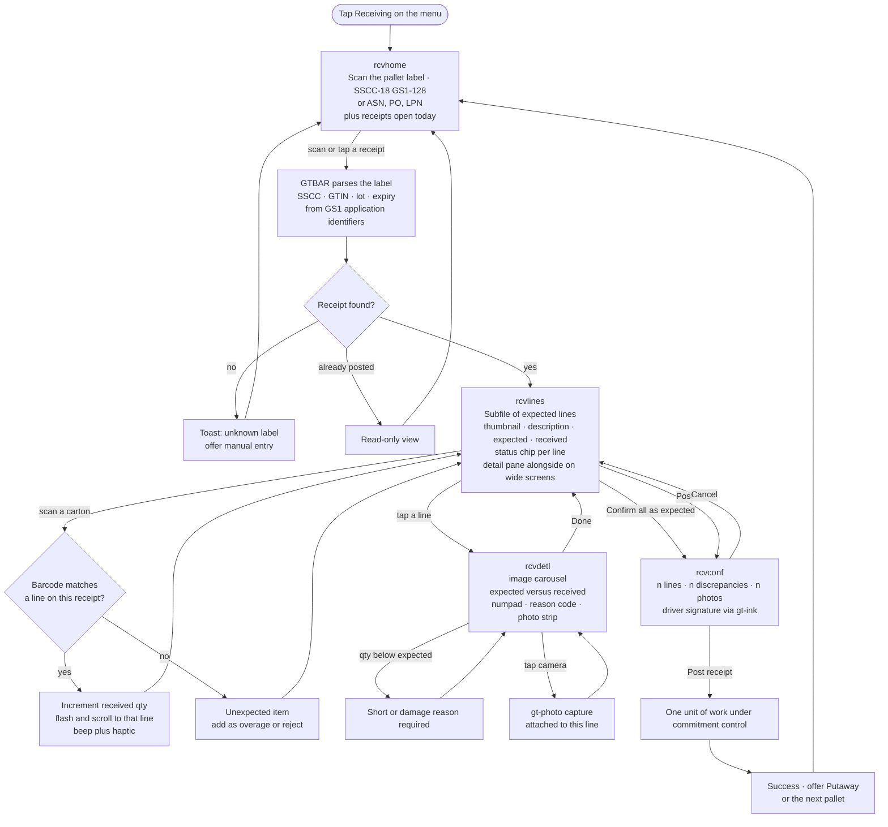
```mermaid
flowchart TD
    START(["Tap Receiving on the menu"]) --> HOME

    HOME["rcvhome<br/>Scan the pallet label · SSCC-18 GS1-128<br/>or ASN, PO, LPN<br/>plus receipts open today"]
    HOME -->|"scan or tap a receipt"| PARSE["GTBAR parses the label<br/>SSCC · GTIN · lot · expiry<br/>from GS1 application identifiers"]
    PARSE --> LOOKUP{"Receipt found?"}
    LOOKUP -->|no| ERR["Toast: unknown label<br/>offer manual entry"] --> HOME
    LOOKUP -->|"already posted"| POSTED["Read-only view"] --> HOME
    LOOKUP -->|yes| LINES

    LINES["rcvlines<br/>Subfile of expected lines<br/>thumbnail · description · expected · received<br/>status chip per line<br/>detail pane alongside on wide screens"]

    LINES -->|"scan a carton"| MATCH{"Barcode matches<br/>a line on this receipt?"}
    MATCH -->|yes| BUMP["Increment received qty<br/>flash and scroll to that line<br/>beep plus haptic"] --> LINES
    MATCH -->|no| UNEXP["Unexpected item<br/>add as overage or reject"] --> LINES

    LINES -->|"tap a line"| DETAIL

    DETAIL["rcvdetl<br/>image carousel<br/>expected versus received<br/>numpad · reason code · photo strip"]
    DETAIL -->|"qty below expected"| REASON["Short or damage reason required"]
    DETAIL -->|"tap camera"| PHOTO["gt-photo capture<br/>attached to this line"]
    REASON --> DETAIL
    PHOTO --> DETAIL
    DETAIL -->|Done| LINES

    LINES -->|"Confirm all as expected"| CONFIRM
    LINES -->|Post| CONFIRM

    CONFIRM["rcvconf<br/>n lines · n discrepancies · n photos<br/>driver signature via gt-ink"]
    CONFIRM -->|"Post receipt"| TXN["One unit of work under commitment control"]
    TXN --> DONE["Success · offer Putaway<br/>or the next pallet"]
    DONE --> HOME
    CONFIRM -->|Cancel| LINES
```

### 7.2 Screen notes

**`rcvhome`** — A large scan target dominating the upper area, with a card list of receipts open today
underneath so a supervisor can tap instead of scan. The pallet label is a **GS1-128** carrying an
SSCC-18 plus GTIN, lot and expiry; parsing all of that from a single scan (§15.3) is one of the
strongest technical beats in the demo and it is pure RPG string handling.

**`rcvlines`** — The screen that has to be perfect, because subfiles are where "mobile RPG" demos
usually fall apart.

- **Scan-to-confirm is the primary interaction.** The operator does not tap; they scan each carton and
  the matching line ticks up with a beep and a haptic. Tapping is the exception path.
- On a **phone** each subfile record is a card: 64px thumbnail, description over SKU, `expected →
  received` with a colour chip (green matched, amber short, red over, grey untouched).
- On a **tablet or desktop** the identical data becomes a sortable table *and* a detail pane appears
  alongside, so the selected line's images, reason code and photos are visible without navigating.
  See §14.4 — the flagship responsive moment.
- Sticky summary bar: `12 of 34 lines confirmed · 2 discrepancies · 3 photos`.
- Subfile paged at 25–50 rows with touch-friendly infinite scroll; never render an unbounded subfile.

**`rcvdetl`** — Image carousel at the top, then expected versus received with the numpad, then the
reason-code picker (shown only when received ≠ expected), then the photo strip with a large camera
button.

**`rcvconf`** — Summary and post, with driver signature capture via `gt-ink`, stored through the same
image pipeline as photos.

### 7.3 Unit of work

Posting a receipt is **one commit-controlled transaction** covering: receipt header status, every
detail line's received quantity and reason, an inventory movement row per line, the inventory balance
upsert into staging, image linkage and pallet status. Any failure rolls the whole receipt back —
nothing half-received. §17.4 lists the boundaries for every application.

---

## 8. Application 2 — Inventory & Movement

> *"Scan a barcode on an inventory location, show me the on-hand balance in that location and the
> available balance in bulk inventory, with the option to do an inventory movement."*

### 8.1 Flow

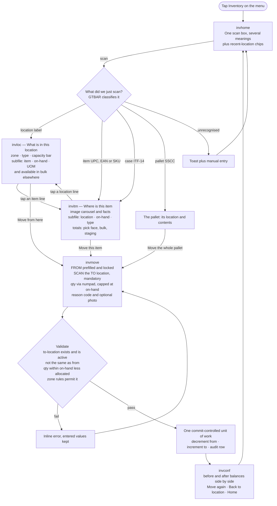
```mermaid
flowchart TD
    START(["Tap Inventory on the menu"]) --> HOME

    HOME["invhome<br/>One scan box, several meanings<br/>plus recent-location chips"]
    HOME -->|scan| CLASSIFY{"What did we just scan?<br/>GTBAR classifies it"}

    CLASSIFY -->|"location label"| LOC
    CLASSIFY -->|"item UPC, EAN or SKU"| ITM
    CLASSIFY -->|"case ITF-14"| ITM
    CLASSIFY -->|"pallet SSCC"| LPN["The pallet: its location and contents"]
    CLASSIFY -->|unrecognised| ERR["Toast plus manual entry"] --> HOME

    LOC["invloc — What is in this location<br/>zone · type · capacity bar<br/>subfile: item · on-hand · UOM<br/>and available in bulk elsewhere"]
    ITM["invitm — Where is this item<br/>image carousel and facts<br/>subfile: location · on-hand · type<br/>totals: pick face, bulk, staging"]

    LOC -->|"tap an item line"| ITM
    ITM -->|"tap a location line"| LOC

    LOC -->|"Move from here"| MOVE
    ITM -->|"Move this item"| MOVE
    LPN -->|"Move the whole pallet"| MOVE

    MOVE["invmove<br/>FROM prefilled and locked<br/>SCAN the TO location, mandatory<br/>qty via numpad, capped at on-hand<br/>reason code and optional photo"]
    MOVE --> VALID{"Validate<br/>to-location exists and is active<br/>not the same as from<br/>qty within on-hand less allocated<br/>zone rules permit it"}
    VALID -->|fail| MOVEERR["Inline error, entered values kept"] --> MOVE
    VALID -->|pass| POST["One commit-controlled unit of work<br/>decrement from · increment to · audit row"]
    POST --> CONF["invconf<br/>before and after balances side by side<br/>Move again · Back to location · Home"]
    CONF --> HOME
```

### 8.2 One scan box, several meanings

Rather than making the operator choose *"am I scanning a location or an item?"*, `invhome` has a single
scan target and `GTBAR` classifies the payload — symbology, then format, then a lookup against the
master tables in priority order. Small thing, reads as very polished, trivially done in RPG.

### 8.3 The bulk versus pick-face story

For every item in the scanned location, `invloc` shows two numbers:

| | |
|---|---|
| **In this location** | what you are standing in front of |
| **Available in bulk** | on-hand summed across all `BULK`-type locations for that item, less allocations |

with a **Replenish** shortcut when the pick face is below its minimum and bulk has stock. The shortcut
pre-fills the move screen — bulk location as FROM, this location as TO, suggested quantity — turning an
inquiry into a one-scan action. That is the operational value story in a single tap.

---

## 9. Application 3 — Item Lookup

The best showcase for the image carousel, nearly free once `gt-scan` and `gt-carousel` exist, and the
screen everyone in the room instantly understands. It is the demo's opener.

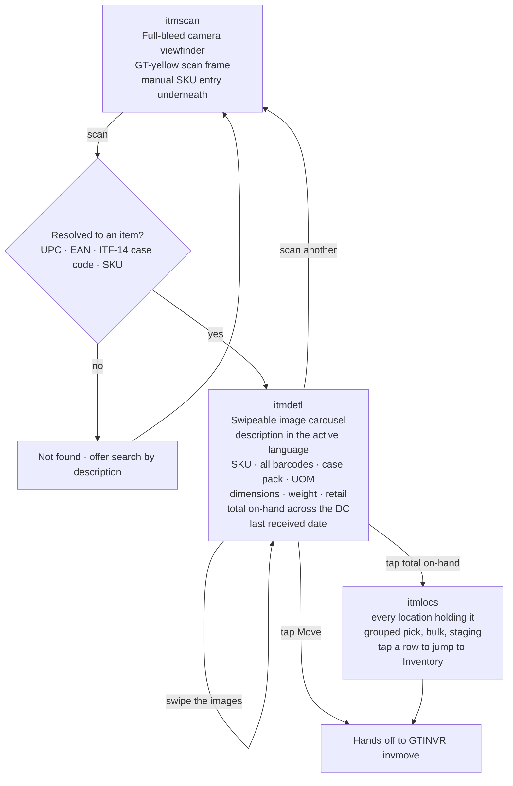
```mermaid
flowchart TD
    A["itmscan<br/>Full-bleed camera viewfinder<br/>GT-yellow scan frame<br/>manual SKU entry underneath"] -->|scan| B{"Resolved to an item?<br/>UPC · EAN · ITF-14 case code · SKU"}
    B -->|no| A2["Not found · offer search by description"] --> A
    B -->|yes| C

    C["itmdetl<br/>Swipeable image carousel<br/>description in the active language<br/>SKU · all barcodes · case pack · UOM<br/>dimensions · weight · retail<br/>total on-hand across the DC<br/>last received date"]

    C -->|"swipe the images"| C
    C -->|"tap total on-hand"| D["itmlocs<br/>every location holding it<br/>grouped pick, bulk, staging<br/>tap a row to jump to Inventory"]
    C -->|"tap Move"| E["Hands off to GTINVR invmove"]
    D --> E
    C -->|"scan another"| A
```

`itmdetl` is the most graphical screen in the app and should be treated as the brand showpiece: large
product imagery, GT-yellow accent band, generous type, facts as chips and stat tiles rather than a
form. Vertical scroll on a phone; two-column with images left and facts right on a tablet;
three-column on a desktop.

---

## 10. Application 4 — Cycle Count

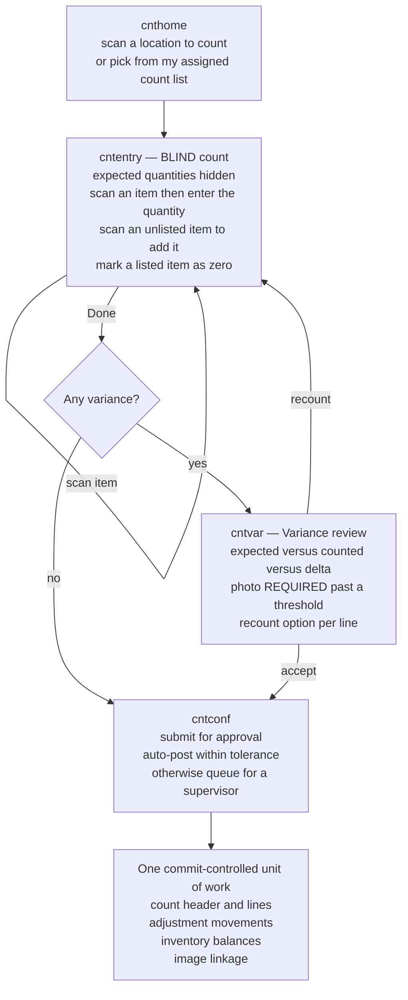
```mermaid
flowchart TD
    A["cnthome<br/>scan a location to count<br/>or pick from my assigned count list"] --> B

    B["cntentry — BLIND count<br/>expected quantities hidden<br/>scan an item then enter the quantity<br/>scan an unlisted item to add it<br/>mark a listed item as zero"]
    B -->|"scan item"| B
    B -->|Done| C

    C{"Any variance?"}
    C -->|no| E
    C -->|yes| D

    D["cntvar — Variance review<br/>expected versus counted versus delta<br/>photo REQUIRED past a threshold<br/>recount option per line"]
    D -->|recount| B
    D -->|accept| E

    E["cntconf<br/>submit for approval<br/>auto-post within tolerance<br/>otherwise queue for a supervisor"]
    E --> F["One commit-controlled unit of work<br/>count header and lines<br/>adjustment movements<br/>inventory balances<br/>image linkage"]
```

**Blind counting** — hiding the expected quantity — is the operationally correct behaviour and it makes
the variance reveal a genuinely satisfying demo moment. The photo-required-past-a-threshold rule,
driven declaratively from the reason-code table, is what makes the camera feel like a control rather
than a gimmick.

---

## 11. Application 5 — Scan Lab

A single screen that scans *anything* and shows what it found: symbology detected, raw payload, parsed
GS1 application identifiers if present, and whether it resolved to anything in the database.

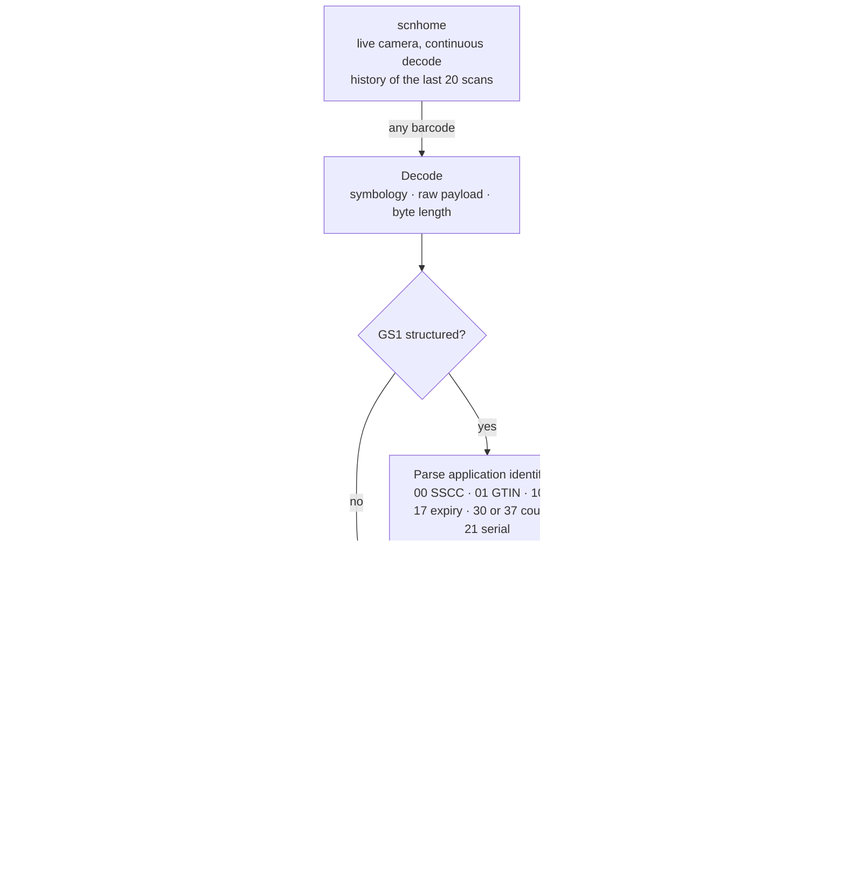
```mermaid
flowchart TD
    A["scnhome<br/>live camera, continuous decode<br/>history of the last 20 scans"] -->|"any barcode"| B

    B["Decode<br/>symbology · raw payload · byte length"]
    B --> C{"GS1 structured?"}
    C -->|yes| D["Parse application identifiers<br/>00 SSCC · 01 GTIN · 10 lot<br/>17 expiry · 30 or 37 count · 21 serial"]
    C -->|no| E
    D --> E
    E{"Resolves in DB2?"}
    E -->|item| F["Show the item card with images"]
    E -->|location| G["Show the location card"]
    E -->|pallet| H["Show the pallet card"]
    E -->|"no match"| I["Show decoded payload only<br/>expected for outside barcodes"]
```

**Why it earns a Wave 1 slot for a 30-minute exec demo:** it costs almost nothing — `gt-scan` plus a
results card — and it is the only screen where you can hand an executive the phone and let them scan
their own conference badge, a water bottle, a driver's licence. Nothing converts a sceptical room
faster than watching their own object decode correctly. It also demonstrates the full symbology range
without a contrived scenario.

---

## 12. Application 6 — Supervisor View

Confirmed for Wave 2. The answer to the question every exec audience asks: *what does management see?*

A read-only, auto-refreshing screen designed **desktop-first** — the one place in the app where the LG
breakpoint is the primary target rather than an adaptation. It still works on a phone, which is itself
worth showing.

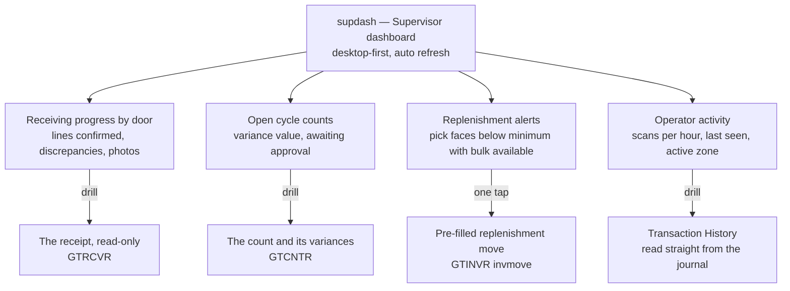
```mermaid
flowchart TD
    A["supdash — Supervisor dashboard<br/>desktop-first, auto refresh"]
    A --> B["Receiving progress by door<br/>lines confirmed, discrepancies, photos"]
    A --> C["Open cycle counts<br/>variance value, awaiting approval"]
    A --> D["Replenishment alerts<br/>pick faces below minimum with bulk available"]
    A --> E["Operator activity<br/>scans per hour, last seen, active zone"]

    B -->|drill| F["The receipt, read-only<br/>GTRCVR"]
    C -->|drill| G["The count and its variances<br/>GTCNTR"]
    D -->|"one tap"| H["Pre-filled replenishment move<br/>GTINVR invmove"]
    E -->|drill| I["Transaction History<br/>read straight from the journal"]
```

**Transaction History** (§17.3) reads the journal directly, so every scan, adjustment and photo is
attributable without building any audit tables. For an exec audience, *"it is auditable by default"*
lands harder than any screen.

---

## 13. Bilingual EN / FR design

**Confirmed. The toggle appears on every screen.**

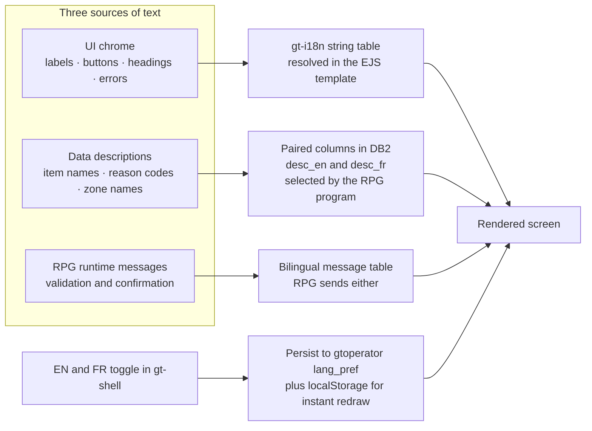
```mermaid
flowchart LR
    subgraph SRC["Three sources of text"]
        UI["UI chrome<br/>labels · buttons · headings · errors"]
        DATA["Data descriptions<br/>item names · reason codes · zone names"]
        MSG["RPG runtime messages<br/>validation and confirmation"]
    end

    UI --> A["gt-i18n string table<br/>resolved in the EJS template"]
    DATA --> B["Paired columns in DB2<br/>desc_en and desc_fr<br/>selected by the RPG program"]
    MSG --> C["Bilingual message table<br/>RPG sends either"]

    A --> R["Rendered screen"]
    B --> R
    C --> R

    T["EN and FR toggle in gt-shell"] --> P["Persist to gtoperator lang_pref<br/>plus localStorage for instant redraw"]
    P --> R
```

### 13.1 Three sources, three mechanisms

UI chrome from a flat string table resolved *inside the EJS template* so it survives a client-side
re-render. Data descriptions from paired `_en` / `_fr` columns chosen by the RPG program. Runtime
messages from a bilingual message table so RPG can send either.

### 13.2 Instant toggle

Preference is written to `GTOPERATOR.LANG_PREF` and mirrored to `localStorage`, so the screen redraws
immediately and every subsequent screen — and the next session — honours it.

### 13.3 French is the layout stress test

French UI strings run roughly 15–25% longer than English. **Every screen is designed and reviewed in
French first**, at the narrowest supported width. This is exactly where a fixed 24×80 grid fails and a
responsive layout wins, so we show it deliberately. The GT lockup flips too — `GIANT TIGER` on English
screens, `TIGRE GÉANT` on French.

Numbers, dates and units are localised: `1 234,56` and `2026-08-06` versus `1,234.56`, with French UOM
abbreviations.

### 13.4 Machine translation — disclosed, not hidden

Translation will be machine-generated, with a **production audit called out explicitly** in the demo.
That is the right call: every screen bilingual demonstrates the capability far better than a few
hand-perfected screens would.

Two things we do to keep the quality defensible:

- **Canadian French, warehouse register.** Terminology is fixed up front in a glossary rather than
  translated per string — *entrepôt, réception, emplacement, palette, inventaire, dénombrement,
  quantité prévue / reçue, écart, réapprovisionnement, endommagé*. Consistency across screens matters
  more than elegance in any one string.
- **A single reviewable glossary file** so a French speaker can audit terminology in minutes rather
  than reading every screen.

---

## 14. Responsive design and information priority

The steer: *use all the real estate available; show only key information on small screens.* That is
stronger than "does not break on a phone", so it gets a formal mechanism rather than ad-hoc media
queries.

### 14.1 Breakpoints and the primary target

The live demo runs on a **Samsung Galaxy S24 Ultra**, which presents roughly **412 × 915 CSS pixels**
in Chrome (its 1440p panel is downsampled by a device pixel ratio of ~3.5). That is the primary design
target. We still verify at **360px** as the floor, because that is the narrowest device worth
supporting and French at 360px is the hardest combination in the app.

| Band | Width | Typical device | Behaviour |
|------|-------|----------------|-----------|
| **XS** | ≤ 480px | **S24 Ultra (412px) — primary target**, iPhone | Single column · tiles 2-up · lists as **cards** · fixed bottom action bar · stacked lockup |
| **SM** | 481–834px | Phone landscape, small tablet portrait | Two columns · tiles 3-up · denser cards |
| **MD** | 835–1279px | iPad, Android tablet | Tiles 4-up · lists as **tables** · detail screens two-column · horizontal lockup · inline action bar |
| **LG** | ≥ 1280px | Desktop — and the primary target for Supervisor View | Tiles 4–6-up · **master-detail split panes** · three-column detail · more columns, not wider ones |

### 14.2 Information priority tiers

Every field on every screen is assigned a tier, declared once in the template markup and enforced by
`gt-list`, so "what shows where" is a reviewable design artifact rather than a CSS accident.

| Tier | Meaning | XS | SM | MD | LG |
|------|---------|----|----|----|----|
| **P1 Essential** | The operator cannot act without it | ✓ | ✓ | ✓ | ✓ |
| **P2 Contextual** | Confirms or disambiguates the action | tap to expand | tap to expand | ✓ | ✓ |
| **P3 Reference** | Audit, provenance, rarely needed on the floor | in detail screen | in detail screen | tap to expand | ✓ |

**Rules we hold ourselves to:**

- **P1 fields never truncate into ambiguity.** A quantity is never abbreviated, a status is never
  reduced to a colour alone, and a description truncates to two lines with an ellipsis rather than
  being cut mid-word.
- On XS a card expands **in place** via a chevron to reveal its P2 fields. The operator is never forced
  to navigate away just to disambiguate two similar items.
- Going wider adds **columns, not padding**. An LG screen showing the same five fields as a phone with
  huge whitespace is a failure of this requirement.
- Minimum touch target 48 × 48 CSS px; primary action buttons 64px tall. A "Large Touch" preference
  adds roughly 25% for gloved hands.
- Nothing critical sits in the top third of a phone screen where a thumb cannot reach — actions to the
  bottom, information to the top.
- Safe-area insets respected. Orientation change re-flows with no server round-trip and no data loss.

### 14.3 Worked example — `rcvlines`

| Field | Tier | XS card | MD table | LG split |
|-------|------|---------|----------|----------|
| Item thumbnail | P1 | ✓ 64px | ✓ 48px | ✓ 48px |
| Description | P1 | ✓ 2 lines | ✓ | ✓ |
| Expected qty | P1 | ✓ | ✓ | ✓ |
| Received qty (input) | P1 | ✓ | ✓ | ✓ |
| Status chip | P1 | ✓ | ✓ | ✓ |
| SKU | P2 | expand | ✓ | ✓ |
| UOM / case pack | P2 | expand | ✓ | ✓ |
| Reason code | P2 | ✓ when set | ✓ | ✓ |
| Photo count | P2 | ✓ as icon | ✓ | ✓ |
| Barcode scanned | P3 | detail | expand | ✓ |
| Line number | P3 | detail | expand | ✓ |
| Vendor item number | P3 | detail | expand | ✓ |
| Last updated by / at | P3 | detail | expand | ✓ |
| **Selected-line detail pane** | — | separate screen | separate screen | **alongside the list** |

### 14.4 The master-detail split, and what it costs

On LG, `rcvlines` shows the list *and* the selected line's detail — carousel, reason code, photos —
side by side, so no navigation is needed. On XS and MD those are two screens.

This is one record format, not two. The detail fields live in the same format and are hidden by CSS
below LG. The cost is that **the RPG program always populates the selected line's detail fields**, even
when the client will not display them. That is a handful of extra fields per round trip and it is
worth it: rotating a tablet and watching a two-screen flow collapse into one is the clearest possible
demonstration of "one codebase, every screen size".

> **Environment note.** The Genie skin applies a global `div { white-space: nowrap }` plus a `z-index`
> rule that break text wrapping and trap dropdowns inside stacking contexts. Our theme resets both
> inside the app wrapper and uses `minmax(0, 1fr)` in grid tracks so long French strings wrap instead
> of overflowing. Recorded here so it is designed around rather than rediscovered.

---

## 15. Barcode scanning design

### 15.1 The camera is the scanner

The RF guns are being replaced and the target devices are phones and tablets, so **camera scanning is
the primary and expected path** — not a fallback.

The live demo device is a **Samsung Galaxy S24 Ultra running Chrome**, which means:

- **The native `BarcodeDetector` API is available.** Decoding happens in the browser engine — fast,
  no JavaScript library, low battery cost. This is the primary decode path and it is what the audience
  will see.
- **The camera is excellent** — high resolution with good close focus, so small and damaged barcodes
  decode reliably. Worth exploiting: the demo can deliberately scan a scuffed carton label.
- **Haptics and audio are available** for scan feedback.
- **The S Pen** gives us a genuinely nice signature and annotation moment (§6, `gt-ink`).

`BarcodeDetector` is not available in iOS Safari, so a **ZXing-js fallback** is built for iPad and
iPhone coverage. A hidden focused input also accepts keyboard-wedge input, which costs a few lines and
means a paired Bluetooth scanner works if anyone ever wants one — but it is no longer part of the
pitch.

### 15.2 The decision tree

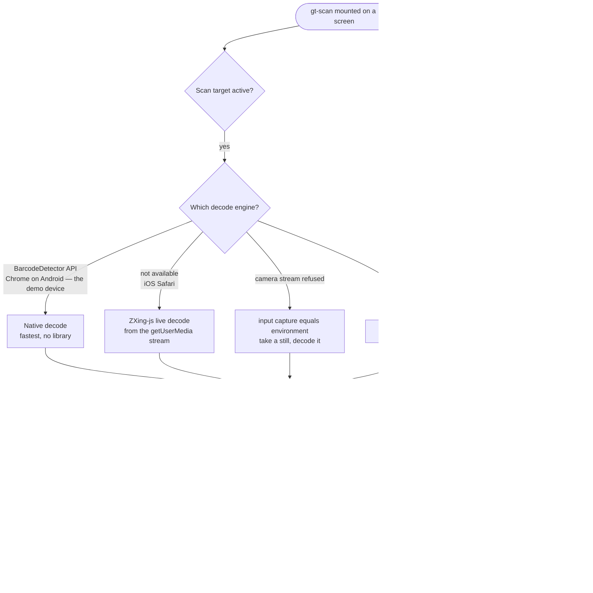
```mermaid
flowchart TD
    START(["gt-scan mounted on a screen"]) --> TAP{"Scan target active?"}
    TAP -->|yes| ENGINE

    ENGINE{"Which decode engine?"}
    ENGINE -->|"BarcodeDetector API<br/>Chrome on Android — the demo device"| NATIVE["Native decode<br/>fastest, no library"]
    ENGINE -->|"not available<br/>iOS Safari"| ZXING["ZXing-js live decode<br/>from the getUserMedia stream"]
    ENGINE -->|"camera stream refused"| FILE["input capture equals environment<br/>take a still, decode it"]
    ENGINE -->|"no camera at all"| MANUAL["Manual entry keypad"]

    START --> WEDGE["Hidden focused input<br/>accepts a paired scanner<br/>low cost, not part of the pitch"]

    NATIVE --> GOT["Payload captured"]
    ZXING --> GOT
    FILE --> GOT
    MANUAL --> GOT
    WEDGE --> GOT

    GOT --> PARSE["GTBAR service program<br/>identify symbology<br/>parse GS1 AIs<br/>classify and resolve"]
    PARSE --> FEED["Beep · haptic · green frame flash"]
    FEED --> SUBMIT["pui.submit sends payload plus symbology to RPG"]
```

### 15.3 Symbologies

Going wide, as agreed. Each is chosen because it appears somewhere real in a DC.

| Symbology | Where it shows up in the demo |
|-----------|------------------------------|
| **UPC-A / UPC-E** | Retail item barcodes — the core Item Lookup scan |
| **EAN-13 / EAN-8** | Imported goods |
| **ITF-14** | Case and carton GTINs — what receiving actually scans |
| **Code 128** | Location labels, licence plates, internal IDs |
| **GS1-128** | **Pallet labels** — SSCC-18 plus GTIN, lot and expiry in one scan |
| **Code 39** | Legacy labels and operator badges |
| **QR** | Location labels that deep-link, operator badges, the demo splash |
| **Data Matrix** | Small-item marking |
| **PDF417** | Driver's licence — proof of delivery, and a great Scan Lab moment |
| **Codabar** | Legacy, decoder support only |

**GS1 Application Identifier parsing** is the technical highlight. One scan of a pallet label yields:

| AI | Meaning | Example |
|----|---------|---------|
| `00` | SSCC-18 pallet licence plate | `006141411234567890` |
| `01` | GTIN-14 | `10061414123456` |
| `10` | Batch / lot | `L2026A17` |
| `17` | Expiry `YYMMDD` | `270131` |
| `37` | Count of contained units | `144` |

Parsing that is ordinary RPG string handling in `GTBAR`, and watching four database fields populate
from a single beep is more persuasive than any slide.

**Barcode generation too.** Location labels and licence plates render on screen as scannable Code 128
and QR, so one device can scan a barcode displayed on another. It closes the loop without printed
labels in the room — and it is how the recorded demo (§23.3) feeds barcodes to a synthetic camera.

### 15.4 Behavioural details that make it feel right

- **Continuous scan mode** on `rcvlines`, `cntentry` and `scnhome`: the camera stays open and decodes
  repeatedly, with a short dedupe window so one carton is not counted twice.
- **Scan-ahead buffering**: if the operator scans again while the previous round trip is in flight, the
  scan queues rather than being dropped.
- **Symbology is captured alongside the payload** and stored on the transaction, which is what makes
  Scan Lab possible and gives the audit trail real substance.

---

## 16. Camera, photos and image storage

**BLOB in DB2**, per §2. One backup boundary, one security model, no orphaned files, and the images
are journaled and saved with the rest of the database.

### 16.1 Why base64 over the wire, and why an endpoint is unavoidable

Two constraints shape this:

1. **An EJS template cannot run SQL.** It receives only display-file field values, so a base64 image
   cannot reach the template through the Open Access buffer — it is orders of magnitude too large.
   Image bytes therefore *must* arrive over a separate HTTP request. This rules out the "CLOB rendered
   as a data URI in the template" variant, attractive as it sounds.
2. **Base64 survives EBCDIC translation; raw binary does not.** A base64 payload uses only invariant
   characters (`A–Z`, `a–z`, `0–9`, `+`, `/`, `=`), so it passes through the HTTP server's ASCII-to-
   EBCDIC translation of CGI input unharmed. Posting raw multipart binary means fighting CCSID handling
   on stdin. Base64 costs about 33% more bytes and removes an entire class of bug.

So: **base64 in on upload, binary out on retrieval**, with a text fallback if binary output proves
awkward (§16.4).

### 16.2 The pipeline

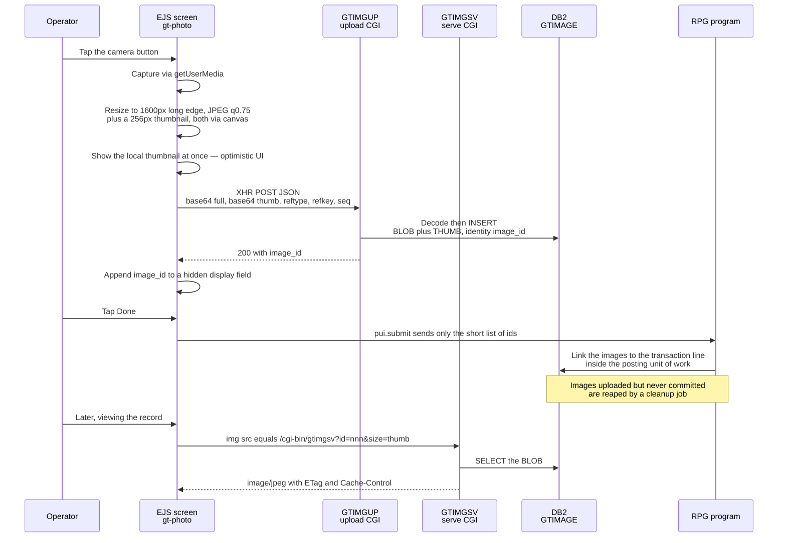
```mermaid
sequenceDiagram
    participant U as Operator
    participant S as EJS screen<br/>gt-photo
    participant UP as GTIMGUP<br/>upload CGI
    participant SV as GTIMGSV<br/>serve CGI
    participant D as DB2<br/>GTIMAGE
    participant R as RPG program

    U->>S: Tap the camera button
    S->>S: Capture via getUserMedia
    S->>S: Resize to 1600px long edge, JPEG q0.75<br/>plus a 256px thumbnail, both via canvas
    S->>S: Show the local thumbnail at once — optimistic UI
    S->>UP: XHR POST JSON<br/>base64 full, base64 thumb, reftype, refkey, seq
    UP->>D: Decode then INSERT<br/>BLOB plus THUMB, identity image_id
    UP-->>S: 200 with image_id
    S->>S: Append image_id to a hidden display field
    U->>S: Tap Done
    S->>R: pui.submit sends only the short list of ids
    R->>D: Link the images to the transaction line<br/>inside the posting unit of work
    Note over R,D: Images uploaded but never committed<br/>are reaped by a cleanup job
    U->>S: Later, viewing the record
    S->>SV: img src equals /cgi-bin/gtimgsv?id=nnn&size=thumb
    SV->>D: SELECT the BLOB
    SV-->>S: image/jpeg with ETag and Cache-Control
```

### 16.3 Decisions

- **Resize on the client, always.** A modern phone camera produces 4–12 MB per shot — the S24 Ultra
  considerably more. A 1600px long edge at q0.75 lands around 200–350 KB, far more detail than anyone
  needs to see a crushed carton, and it uploads in well under a second.
- **The client generates the thumbnail too**, stored in a separate small BLOB column. IBM i never
  manipulates pixels, and list screens load fast because they request `size=thumb`.
- **Only the image ID crosses the OA boundary.** The RPG program deals in a small list of integers.
- **Optimistic UI.** The thumbnail appears the instant the photo is taken, with an upload spinner
  overlay. The screen never blocks on the network.
- **Item catalogue images use the same table and the same endpoint** — pre-seeded rows with
  `ref_type = 'ITEM'`. One pipeline for catalogue photos, damage photos, variance photos, signatures
  and annotations.
- **Caching.** `GTIMGSV` returns a strong `ETag` and a long `Cache-Control`, because an image row is
  immutable once written. Carousel swiping then costs nothing after the first view.
- **Guards.** Reject payloads over 4 MB, reject non-JPEG/PNG MIME types, store a SHA-256 so duplicate
  uploads collapse to one row.

### 16.4 The one implementation risk, and its fallback

`GTIMGSV` writes **binary** bytes to stdout, and the HTTP server must not translate them. This is a
known-fiddly area (CGI output CCSID and `QtmhWrStout` behaviour). It is a Wave 0 spike, not a design
unknown.

**Fallback:** have `GTIMGSV` return base64 text with `Content-Type: text/plain` and have `gt-carousel`
build a `data:` URI in JavaScript. Text output entirely sidesteps CCSID translation, at the cost of
~33% payload and no browser image caching. Acceptable for a POC, and worth knowing we have it.

### 16.5 Journaling caveat

Journaling is required throughout (§17.3), and image BLOBs in journal receivers grow receivers fast.
`GTIMAGE` therefore gets **its own journal and receiver**, sized and managed separately, so image churn
cannot swamp the audit trail we actually want to demonstrate in Transaction History.

---

## 17. Data model — SQL DDL, journaling and commitment control

### 17.1 Ground rules

- **Every table is created with modern SQL DDL** — `CREATE TABLE`, not DDS physical files. Indexes via
  `CREATE INDEX`, not logical files. Derived and joined access via `CREATE VIEW`.
- **Long, readable SQL names with 10-character system names** via `FOR SYSTEM NAME` on tables and
  `FOR COLUMN` on columns, so RPG uses short names while the SQL layer stays legible.
- **Declarative integrity**: primary keys, foreign keys with referential constraints, check constraints
  on status and type domains, `NOT NULL WITH DEFAULT` throughout, identity columns for surrogate keys.
- **Everything journaled, every change under commitment control** — §17.3 and §17.4.
- Built through `codermake` using `RUNSQLSTM`. No manual compile commands.

Three DDL gotchas known on this platform, designed around rather than discovered:

1. `FOR COLUMN` must precede the data type, not follow it.
2. Audit columns using `DEFAULT USER` need to be `VARCHAR(18)`.
3. `GENERATED ALWAYS AS (expression)` computed columns do not work here. **Derived values live in views
   or in RPG**, never in a computed column. `GENERATED ALWAYS AS IDENTITY` is fine.

### 17.2 Entity model

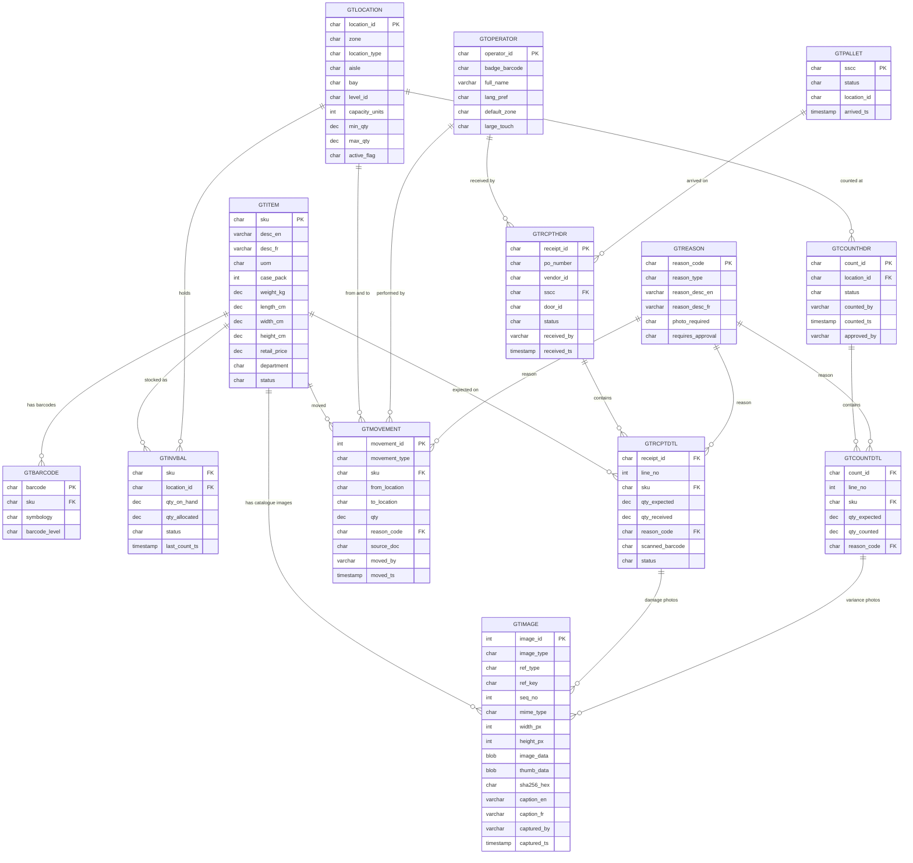
```mermaid
erDiagram
    GTITEM ||--o{ GTBARCODE : "has barcodes"
    GTITEM ||--o{ GTIMAGE : "has catalogue images"
    GTITEM ||--o{ GTINVBAL : "stocked as"
    GTLOCATION ||--o{ GTINVBAL : "holds"
    GTITEM ||--o{ GTRCPTDTL : "expected on"
    GTRCPTHDR ||--o{ GTRCPTDTL : "contains"
    GTRCPTDTL ||--o{ GTIMAGE : "damage photos"
    GTITEM ||--o{ GTMOVEMENT : "moved"
    GTLOCATION ||--o{ GTMOVEMENT : "from and to"
    GTCOUNTHDR ||--o{ GTCOUNTDTL : "contains"
    GTCOUNTDTL ||--o{ GTIMAGE : "variance photos"
    GTLOCATION ||--o{ GTCOUNTHDR : "counted at"
    GTOPERATOR ||--o{ GTMOVEMENT : "performed by"
    GTOPERATOR ||--o{ GTRCPTHDR : "received by"
    GTREASON ||--o{ GTRCPTDTL : "reason"
    GTREASON ||--o{ GTMOVEMENT : "reason"
    GTREASON ||--o{ GTCOUNTDTL : "reason"
    GTPALLET ||--o{ GTRCPTHDR : "arrived on"

    GTITEM {
        char sku PK
        varchar desc_en
        varchar desc_fr
        char uom
        int case_pack
        dec weight_kg
        dec length_cm
        dec width_cm
        dec height_cm
        dec retail_price
        char department
        char status
    }
    GTBARCODE {
        char barcode PK
        char sku FK
        char symbology
        char barcode_level
    }
    GTLOCATION {
        char location_id PK
        char zone
        char location_type
        char aisle
        char bay
        char level_id
        int capacity_units
        dec min_qty
        dec max_qty
        char active_flag
    }
    GTINVBAL {
        char sku FK
        char location_id FK
        dec qty_on_hand
        dec qty_allocated
        char status
        timestamp last_count_ts
    }
    GTIMAGE {
        int image_id PK
        char image_type
        char ref_type
        char ref_key
        int seq_no
        char mime_type
        int width_px
        int height_px
        blob image_data
        blob thumb_data
        char sha256_hex
        varchar caption_en
        varchar caption_fr
        varchar captured_by
        timestamp captured_ts
    }
    GTPALLET {
        char sscc PK
        char status
        char location_id
        timestamp arrived_ts
    }
    GTRCPTHDR {
        char receipt_id PK
        char po_number
        char vendor_id
        char sscc FK
        char door_id
        char status
        varchar received_by
        timestamp received_ts
    }
    GTRCPTDTL {
        char receipt_id FK
        int line_no
        char sku FK
        dec qty_expected
        dec qty_received
        char reason_code FK
        char scanned_barcode
        char status
    }
    GTMOVEMENT {
        int movement_id PK
        char movement_type
        char sku FK
        char from_location
        char to_location
        dec qty
        char reason_code FK
        char source_doc
        varchar moved_by
        timestamp moved_ts
    }
    GTCOUNTHDR {
        char count_id PK
        char location_id FK
        char status
        varchar counted_by
        timestamp counted_ts
        varchar approved_by
    }
    GTCOUNTDTL {
        char count_id FK
        int line_no
        char sku FK
        dec qty_expected
        dec qty_counted
        char reason_code FK
    }
    GTOPERATOR {
        char operator_id PK
        char badge_barcode
        varchar full_name
        char lang_pref
        char default_zone
        char large_touch
    }
    GTREASON {
        char reason_code PK
        char reason_type
        varchar reason_desc_en
        varchar reason_desc_fr
        char photo_required
        char requires_approval
    }
```

**Notes**

- `GTIMAGE` is deliberately generic — `ref_type` plus `ref_key` lets one table and one endpoint serve
  item catalogue photos, receiving damage photos, count variance photos, signatures and annotations.
- `GTREASON.photo_required` drives the "a photo is mandatory here" rule declaratively rather than
  hard-coding thresholds in RPG.
- Bilingual `_en` / `_fr` column pairs sit alongside each other; the RPG program selects on the
  operator's `lang_pref`. A pair of views can expose a single `descr` column where that reads better.
- Indexes needed: `GTINVBAL` by `location_id` and by `sku`; `GTBARCODE` by `barcode` (the hot path —
  every scan hits it); `GTRCPTDTL` by `receipt_id`; `GTMOVEMENT` by `sku` and by `moved_ts`.
- A view computing "available in bulk" per SKU keeps §8.3's logic in one place — and it must be a view
  rather than a computed column, per §17.1 gotcha 3.

### 17.3 Journaling

| Item | Decision |
|------|----------|
| Transactional journal | `GTJRN` with receiver `GTRCV0001`, `MNGRCV(*SYSTEM)`, threshold sized for demo volume |
| Image journal | **Separate** — `GTJRNIMG` / `GTRCVI0001`, because BLOB images inflate receivers fast (§16.5) |
| Tables journaled | **All of them**, `IMAGES(*BOTH)` so before and after images are captured |
| Why before-images | Enables rollback, and powers Transaction History |
| Ordering | Journals and receivers created **before** the tables, so nothing is ever left unjournaled |

> **Environment note.** In some libraries, `CREATE TABLE` via `RUNSQLSTM` auto-attaches the table to
> `QSQJRN`, and a later custom `STRJRNPF` silently no-ops. The build must therefore either explicitly
> `ENDJRNPF` and re-journal to `GTJRN`, or accept `QSQJRN` — verified during Wave 0, not assumed.

**Transaction History** (§12) reads the journal directly via `QSYS2.DISPLAY_JOURNAL`, giving a
who-changed-what-and-when panel with no audit tables to maintain. Note that journal entry data comes
back as a raw BLOB requiring field-offset decoding, so the panel targets the entries we care about
rather than trying to be generic.

### 17.4 Commitment control — transaction boundaries

Every write path is a single explicit unit of work. Nothing posts partially.

| Application | One unit of work covers | On failure |
|-------------|------------------------|------------|
| **Receiving post** | Receipt header status · every detail line's received qty and reason · one movement row per line · inventory balance upsert into staging · image linkage · pallet status | `ROLLBACK` — the receipt stays open, nothing half-received |
| **Inventory move** | Decrement the from-balance · increment the to-balance · insert the movement audit row · optional image linkage | `ROLLBACK` — balances untouched, operator keeps entered values |
| **Cycle count submit** | Count header status · every count line · one adjustment movement per varying line · inventory balance updates · image linkage | `ROLLBACK` — the count stays in progress |
| **Putaway** | Movement row · balance decrement from staging · balance increment at destination · pallet location update | `ROLLBACK` |
| **Damage report** | Exception row · image linkage · optional inventory status change | `ROLLBACK` |
| **Badge-in / settings** | Operator preference update | Committed immediately |

**Isolation.** `COMMIT(*CS)` — cursor stability — is the right default. Balance updates that must not
race use `SELECT ... FOR UPDATE` on the balance row, so two operators moving the same SKU out of the
same location serialise correctly. Worth demonstrating deliberately: two devices, one location, one
wins cleanly and the other gets a clear message rather than a corrupted balance.

**A trap we design around.** `codermake` compiles SQLRPGLE with `COMMIT(*CHG)` by default, meaning
uncommitted work is discarded at program end. With commitment control now used deliberately, that
default is correct — but **every posting program must issue an explicit `COMMIT`**, and forgetting it
means the transaction silently vanishes. Every write path therefore ends in an explicit `COMMIT` or
`ROLLBACK`, and Wave 0 includes a test that proves a rollback actually rolls back.

### 17.5 Error handling

Validation failures never reach the rollback path — they are caught before any write and returned to
the screen as an inline message in the operator's language, with entered values preserved. `ROLLBACK`
is reserved for genuine failures: constraint violations, lock timeouts, unexpected SQL states. When one
occurs the operator sees plain language, not an SQLSTATE.

---

## 18. Demo data

Invented, per §2. Sized so scrolling and searching feel real on a touch screen, small enough to rebuild
in seconds.

| Table | Volume | Why |
|-------|--------|-----|
| `GTITEM` | ~400 items across 8 departments | Realistic search, varied carousel |
| `GTBARCODE` | ~1,200 rows | Retail UPC, case ITF-14, an EAN or two per item |
| `GTIMAGE` | ~1,000 catalogue images, 2–4 per item | The carousel needs depth to convince |
| `GTLOCATION` | ~600 across 5 zones | Pick faces, bulk racking, staging, returns, damage |
| `GTINVBAL` | ~4,000 rows | Long scrolling lists in `invitm` and `invloc` |
| `GTRCPTHDR` / `GTRCPTDTL` | 8 open receipts, largest with 60 lines | 60 lines forces real touch scrolling on camera |
| `GTPALLET` | ~30 with valid SSCC-18 check digits | Pallet labels must actually decode |
| `GTCOUNTHDR` / `GTCOUNTDTL` | 4 count assignments, 30–50 lines each | Believable variances |
| `GTOPERATOR` | ~10, split EN and FR preference | Lets us badge in as a French-preference operator on camera |
| `GTREASON` | ~25, all bilingual | Damage, shortage, overage, replenishment, count variance |

**Data quality rules, because a demo dies on details:**

- Barcode **check digits must be valid** — UPC-A, EAN-13, ITF-14 and SSCC-18 all have them, and a
  scanner rejects an invalid one on camera. Every generated barcode is computed, not typed.
- Product descriptions are **genuinely bilingual**, not English with accents.
- Quantities and locations are internally consistent: `GTINVBAL` sums match what Item Lookup reports,
  and pick faces below minimum actually have bulk stock to replenish from.
- Deliberately "interesting" records are seeded on the demo path: a short-shipped line, a damaged case,
  a location with a real variance, an item with four photos.

**Imagery** is generated (per §2), which sidesteps any licensing question in the room.

---

## 19. Build and deployment into TIGERPOC

### 19.1 Target

| | |
|---|---|
| **Library** | `TIGERPOC` |
| **Git branch** | `TIGERPOC` (repo root is `<workspace>/ibmi-agentic/docs`, currently on `documentation`) |
| **Source tree** | `<repo>/gtwms/` |
| **Web assets** | `<repo>/htdocs/profoundui/userdata/ui/gtcommon/` and `.../ui/gt*d/` |
| **Build tool** | `codermake` only — never a manual `CRT*` command |

`IBMI_BUILD_LIBRARY` is currently a per-task library. Pointing the build at `TIGERPOC` is a
build-configuration change, and build configuration belongs to you rather than to me — **see §24.1.**

### 19.2 The menu shadow, and the trap in it

To add option 4 without writing to the shared base library, we build our **own** `MENU` object into a
library that precedes `AIDEMOBASE` on the library list, where it shadows the base copy. That library
is the **CoderFlow task library**, not `TIGERPOC` — `PUISETENV` already puts the task library first,
and `TIGERPOC` only joins the list *after* option 4 is taken. **§25.3 has the verified mechanism and
the per-task rebuild it requires; read it before touching the menu.**

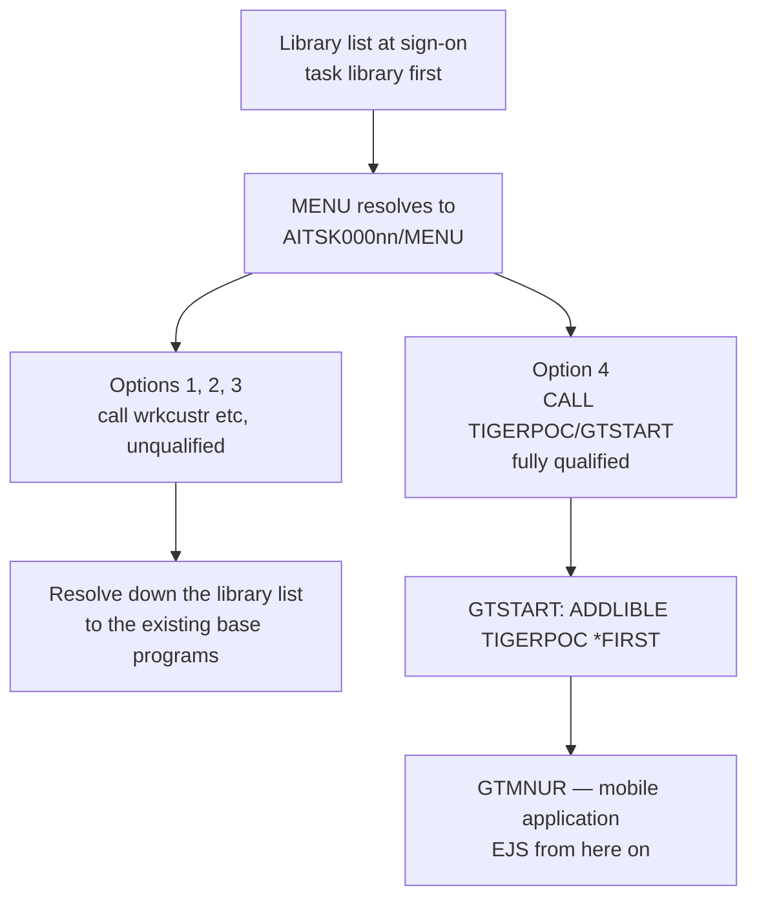
```mermaid
flowchart TD
    A["Library list at sign-on<br/>task library first"] --> B["MENU resolves to<br/>AITSK000nn/MENU"]
    B --> C["Options 1, 2, 3<br/>call wrkcustr etc, unqualified"]
    C --> D["Resolve down the library list<br/>to the existing base programs"]
    B --> E["Option 4<br/>CALL TIGERPOC/GTSTART<br/>fully qualified"]
    E --> G["GTSTART: ADDLIBLE TIGERPOC *FIRST"]
    G --> F["GTMNUR — mobile application<br/>EJS from here on"]
```

**The trap.** The existing menu's `Rules.mk` sits in a project whose other targets include data files
such as `custp.file`. Building those into a library that shadows `AIDEMOBASE` would create **empty**
copies that hide the populated base data and break options 1–3. So:

- Build **only** `menu.file`, `menu.msgf` and `menu.menu` from the existing project into the task
  library, plus everything under `gtwms/` into `TIGERPOC`.
- **Never** build the existing data files into either library.
- Name specific `codermake` targets. Never run a bare full build, which would pull in every module.

There is also a known quirk in the menu build rule: the `.menu` pattern only matches when both the
`.file` and the `.msgf` are **normal** prerequisites. If the `.file` is order-only the recipe is
dropped silently. Our `Rules.mk` declares both normally.

### 19.3 Build order


```mermaid
flowchart LR
    A["1 · CRTLIB TIGERPOC"] --> B["2 · Journals and receivers<br/>GTJRN · GTJRNIMG"]
    B --> C["3 · Tables via RUNSQLSTM<br/>then verify journal attachment"]
    C --> D["4 · Indexes and views"]
    D --> E["5 · Seed data"]
    E --> F["6 · Service programs<br/>GTITEM GTINV GTIMG GTBAR GTNLS GTMSG"]
    F --> G["7 · Rich Display Files<br/>from JSON"]
    G --> H["8 · Programs<br/>GTMNUR GTRCVR ..."]
    H --> I["9 · CGI programs<br/>GTIMGUP GTIMGSV"]
    I --> J["10 · Menu shadow<br/>menu.file msgf menu"]
    J --> K["11 · Deploy htdocs assets<br/>codermake does NOT do this"]
```

Two ordering points that matter: **journals before tables**, so nothing is created unjournaled; and
**htdocs assets are not deployed by codermake** — they need a separate copy step to the Profound UI
document root.

---

## 20. Naming and file conventions

```
<repo>/gtwms/
  Rules.mk
  docs/
    GT-WAREHOUSE-POC.md          this document
  qddssrc/
    gtmnud.json        Main menu      Rich Display, EJS
    gtsgnd.json        Badge sign-on
    gtrcvd.json        Receiving      rcvhome rcvlines rcvdetl rcvconf
    gtinvd.json        Inventory      invhome invloc invitm invmove invconf
    gtitmd.json        Item lookup    itmscan itmdetl itmlocs
    gtcntd.json        Cycle count    cnthome cntentry cntvar cntconf
    gtscnd.json        Scan Lab       scnhome
    gtsupd.json        Supervisor     supdash suphist
  qsqlsrc/
    gt_journal.sql     journals and receivers, created FIRST
    gt_tables.sql      CREATE TABLE, constraints, FOR SYSTEM NAME
    gt_indexes.sql     CREATE INDEX
    gt_views.sql       CREATE VIEW, including bulk availability
    gt_seed.sql        demo data
  qrpglesrc/
    gtmnur.sqlrpgle  gtsgnr.sqlrpgle  gtrcvr.sqlrpgle  gtinvr.sqlrpgle
    gtitmr.sqlrpgle  gtcntr.sqlrpgle  gtscnr.sqlrpgle  gtsupr.sqlrpgle
    gtitem.sqlrpgle  gtinv.sqlrpgle   gtimg.sqlrpgle
    gtbar.sqlrpgle   gtnls.sqlrpgle   gtmsg.sqlrpgle          service modules
    gtitem_pr.rpgle  gtinv_pr.rpgle   gtimg_pr.rpgle
    gtbar_pr.rpgle   gtnls_pr.rpgle   gtmsg_pr.rpgle          prototypes
  qsrvsrc/
    gtitem.bnd  gtinv.bnd  gtimg.bnd  gtbar.bnd  gtnls.bnd  gtmsg.bnd
  qcgisrc/
    gtimgup.sqlrpgle   image upload
    gtimgsv.sqlrpgle   image serve
  tools/
    gen-demo-data.js   generates seed SQL with valid check digits
    gen-images.js      generates product imagery
    capture-demo.js    Playwright demo capture (§23.3)

<repo>/htdocs/profoundui/userdata/ui/
  gtcommon/
    gt-theme.css  gt-shell.css  gt-shell.js
    gt-scan.js    gt-photo.js   gt-carousel.js
    gt-numpad.js  gt-feedback.js gt-i18n.js  gt-list.js  gt-ink.js
    gt-strings-en.js  gt-strings-fr.js
  gtmnud/  menu.ejs   menu.css
  gtrcvd/  rcvhome.ejs rcvhome.css ...
  gtinvd/  invhome.ejs ...
  gtitmd/  itmscan.ejs ...
  gtcntd/  cnthome.ejs ...
  gtscnd/  scnhome.ejs ...
  gtsupd/  supdash.ejs ...
```

**Conventions:**

- IBM i object names ≤ 10 characters, `GT` prefix. SQL long names via `FOR SYSTEM NAME`.
- Display file JSON `gt<app>d.json` → object `GT<app>D`. Program `gt<app>r.sqlrpgle` → `GT<app>R`.
- Template directory matches the display file name; each record format gets its own `.ejs` / `.css` /
  optional `.js`.
- **All field names lowercase** in JSON and templates — the Profound UI runtime lowercases DDS names
  when handing them to EJS, and an uppercase reference silently renders blank.
- Every screen carries an `action` char(10) hidden field for routing button and F-key presses to RPG.
- Shared `gtcommon/` CSS and JS listed in each format's `css` / `js` arrays *before* the
  screen-specific file.
- Only `Rules.mk` is ever hand-edited — never a generated Makefile.
- **Never hardcode the library name in CL or RPG source.** `TIGERPOC` is today's answer; pass the
  library as a parameter or rely on `*LIBL` so the same source builds anywhere.

**Three build-time gotchas designed around, not discovered:**

1. Every `<%= field %>` in a template must correspond to a field declared in *that format's* JSON, or
   the whole render aborts. Shared components take values through a documented, guarded interface.
2. Screen JS executes *before* the template's DOM exists, so components initialise from inline handler
   attributes calling window-scoped functions, not `addEventListener` at load time.
3. Screen JS re-executes on every render, including subfile reloads. Nothing at the top level of a
   component may stack listeners or wrappers.

---

## 21. Delivery waves

| Wave | Contents | Why this order | Size |
|------|----------|----------------|------|
| **0 — Spikes** | `TIGERPOC` created and building · journals, tables, commit and rollback proven · image upload and retrieval round trip · one EJS screen rendering full-bleed and responsive · menu option 4 reaching a stub program | De-risks what is cheap to test and expensive to discover late | Small |
| **1 — Core proof** | SQL DDL, journaling, generated data and imagery · the ten shared components · badge sign-on · Main Menu · **Item Lookup** · **Receiving** · **Inventory & Move** · **Scan Lab** · full EN/FR · master-detail split | Delivers a complete 30-minute exec story and every claim in §1 | Large |
| **2 — Depth** | **Cycle Count** · **Supervisor View** · **Transaction History** · Damage/Exception · Putaway · photo annotation and S Pen signature · QR deep links · Large Touch · connection-loss UX | Adds operational and compliance credibility | Medium |
| **3 — Capture and polish** | Scripted demo capture (§23.3) · still frames · timing and audio polish · French terminology pass | Only meaningful once the screens are stable | Small |
| **4 — Stretch** | Directed picking · My Tasks · label reprint | Cut freely | Medium |

**Recommendation:** Wave 0 and 1 are the commitment; Wave 2 is expected; Wave 3 is what makes the
recording good. A tight, polished Wave 1 plus Supervisor View will out-demo a broad Wave 4 that is
rough — on a phone, on camera, rough is very visible.

---

## 22. Technical risks and spikes

| # | Risk | Impact | Mitigation |
|---|------|--------|------------|
| 1 | **Binary image output from `GTIMGSV`** — CGI stdout CCSID translation corrupting JPEG bytes | Images do not render | **Wave 0 spike.** Base64-text fallback already designed (§16.4) |
| 2 | **Journaling and commit behaviour** — SQL `CREATE TABLE` may auto-journal to `QSQJRN` and a later `STRJRNPF` silently no-op; `COMMIT(*CHG)` discards uncommitted work at program end | Silent data loss or an audit trail on the wrong journal | **Wave 0 spike.** Journals before tables, verify attachment, and a test that proves rollback rolls back |
| 3 | **Menu shadowing** — `TIGERPOC` must precede the base library on the library list, and building the wrong targets would create empty data files that shadow populated ones | Options 1–3 break, or option 4 never appears | §19.2. Named targets only, never a bare full build |
| 4 | **`codermake` targeting `TIGERPOC`** — build configuration is yours, not mine to change | Cannot build at all | **§24.1** — needs your answer before Wave 0 |
| 5 | **BLOB journal receiver growth** | Receivers fill during a long demo | Separate journal for `GTIMAGE` (§16.5), `MNGRCV(*SYSTEM)` |
| 6 | **Subfile performance on a phone** — 60-line receipts as cards | Sluggish scrolling on camera | Page at 25–50 rows with touch-friendly infinite scroll |
| 7 | **Round-trip latency per scan** | Fast operators outrun the app | Scan-ahead buffering (§15.4), optimistic photo UI, non-blocking activity indicator |
| 8 | **Genie skin CSS bleeding into EJS screens** — global `white-space: nowrap` and `z-index` | Broken layouts, trapped dropdowns, French overflowing | Wrapper-scoped theme with explicit resets, `minmax(0, 1fr)` grid tracks |
| 9 | **French text overflow** at 360px | Layout breaks in the language half the audience cares about | Design and review every screen in French first (§13.3) |
| 10 | **Machine-translated French** | Credibility risk | Accepted and disclosed (§2 ref 3.5); mitigated by a fixed Canadian-French glossary (§13.4) |
| 11 | **Automated demo capture may not be achievable** — driving an authenticated Genie session from Playwright, and faking a camera stream | No recordings from me | §23.3 has a staged fallback down to still frames. You record manually if it fails |
| 12 | **Trademark use** — the GT logo requires marketing approval and must not be recreated | Awkward moment | Official artwork only; label the build a prospect demonstration |

---

## 23. Demo narrative and screen capture

### 23.1 The 30-minute shape

No commercial close needed — the salesman handles that. Our job is a great end-to-end demo.

| Time | Segment | Point being made |
|------|---------|------------------|
| 0–4 | **The problem** | 5250 emulation on RF guns: training time, hiring difficulty, device lock-in, no camera, no images, English-only screens |
| 4–6 | **What we built, and in how long** | Set the effort expectation *before* they see it, so it lands as achievable rather than merely impressive |
| 6–22 | **The demo** (§23.2) | 16 minutes, live on the S24 Ultra where possible, recorded where screen-share is a barrier |
| 22–26 | **The punchline** | Put the RPG source on screen. Ordinary ILE RPG, a display file, a subfile, embedded SQL, commitment control |
| 26–30 | **Q&A** | Handed to the salesman |

### 23.2 The 16-minute demo


```mermaid
flowchart LR
    A["0:00 Badge in<br/>scan an operator badge"] --> B["0:45 Main menu<br/>tap EN to FR<br/>the whole app flips"]
    B --> C["2:00 Item Lookup<br/>camera-scan a UPC<br/>swipe four product images"]
    C --> D["4:00 Receiving<br/>scan a GS1-128 pallet label<br/>SSCC, GTIN, lot and expiry<br/>from one beep"]
    D --> E["6:00 Scan cartons<br/>60 lines, scroll by finger<br/>lines tick up, beep, haptic<br/>no tapping"]
    E --> F["8:00 A damaged case<br/>adjust down, reason code<br/>photograph the damage"]
    F --> G["9:30 Sign with the S Pen<br/>post the receipt<br/>one commit-controlled transaction"]
    G --> H["11:00 Inventory<br/>scan a location<br/>here versus bulk<br/>one-tap replenish move"]
    H --> I["13:00 Same screens on a desktop<br/>Supervisor View and the journal<br/>every scan attributable"]
    I --> J["15:00 Scan Lab<br/>hand them the phone<br/>let them scan anything"]
```

**The two beats that matter most.** *Scan Lab* at 15:00 — handing an executive the phone and letting
them scan their own badge converts scepticism faster than any scripted flow. And *the RPG source* at
22:00 — after sixteen minutes of a slick mobile app, showing that it is ordinary RPG is the whole
argument.

### 23.3 Producing the recordings

You will record manually if needed, but here is what I will attempt, staged so that a failure at any
level still leaves something useful.

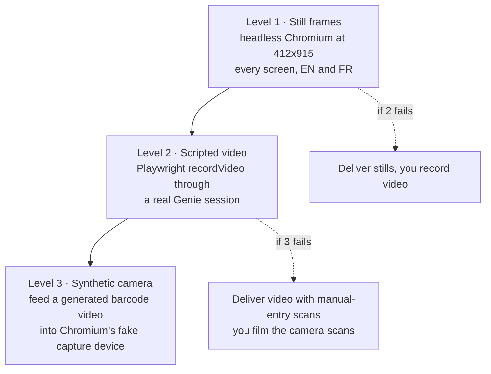
```mermaid
flowchart TD
    A["Level 1 · Still frames<br/>headless Chromium at 412x915<br/>every screen, EN and FR"] --> B
    B["Level 2 · Scripted video<br/>Playwright recordVideo through<br/>a real Genie session"] --> C
    C["Level 3 · Synthetic camera<br/>feed a generated barcode video<br/>into Chromium's fake capture device"]
    A -.->|"if 2 fails"| D["Deliver stills, you record video"]
    B -.->|"if 3 fails"| E["Deliver video with manual-entry scans<br/>you film the camera scans"]
```

**What is already available in this environment:** Playwright's Chromium build and its bundled ffmpeg
are cached locally, so video capture and encoding do not need new system packages.

**The interesting trick** is level 3. Chromium accepts
`--use-fake-device-for-media-stream` together with `--use-file-for-fake-video-capture=<file>.y4m`,
which replaces the webcam with a video file. Since §15.3 already has us **generating barcodes on
screen**, we can render a pallet label to an image, encode it to Y4M, and feed it to the fake camera —
so a recorded run performs a *real* decode through the real `BarcodeDetector` path rather than
simulating one. If it works it is genuinely convincing footage.

**The honest uncertainty:** driving an authenticated Genie session from Playwright is the part I cannot
promise. Sessions here have defeated automated fetching before. That is risk §22.11, and the staged
fallback above is the answer.

**Designing for the camera**, since much of this is watched as a recording:

- **Portrait phone capture** for mobile segments; the Supervisor View segment is the only landscape one.
- **No hover-dependent affordances** — nothing that appears only on mouseover, because there is no mouse.
- **High-contrast focus and active states**, because recordings lose subtle colour.
- **Deliberate pacing** — the demo path uses the seeded "interesting" records from §18 so nothing is
  hunted for on camera.
- **Audio matters.** The scan beep and post confirmation carry the recording; get the tones right.

---

## 24. Open questions — round 3

Only three left, and they are mechanical rather than design questions.

### 24.1 How should `codermake` be pointed at `TIGERPOC`?

Build configuration belongs to you, and I am instructed not to create, edit or export build-related
environment variables. `IBMI_BUILD_LIBRARY` is currently `AITSK00071`. To build into `TIGERPOC` I need
one of:

- you set `IBMI_BUILD_LIBRARY=TIGERPOC` for these tasks, or
- you set up `CODERMAKE_LIBRARY_MAP` so `gtwms` targets resolve to `TIGERPOC`, or
- you confirm I may pass a library override on the `codermake` command line for this project.

**Which one?** This blocks Wave 0.

### 24.2 Library list — will `TIGERPOC` precede the base library?

The menu shadow in §19.2 only works if `TIGERPOC` comes before the base demo library on the library
list of the signed-on session. Can you confirm that is how the demo session will be set up, or should
I plan on adding `TIGERPOC` to the library list from within the application instead?

### 24.3 Branch mechanics

The repo here is on branch `documentation`. You said you would push to a `TIGERPOC` branch — do you
want me to create and switch to that branch as part of the first build task, or will you handle the
branching and I simply commit on whatever branch is checked out?

---

*End of draft v0.3. Still no code — but with §24 answered, the next step is Wave 0.*

---

## 25. Wave 0 results — what the build actually taught us

Recorded because several of these overturned an assumption in the design above,
and because the next person to build this project will otherwise rediscover
them the hard way.

### 25.1 Completed and verified

| Item | Status |
|------|--------|
| `TIGERPOC` library created via `IBMI_BUILD_LIBRARY=TIGERPOC codermake <target>` | Done — the override works, no env or `.env` change needed |
| `GTJRN` + `GTRCV0001`, `GTJRNIMG` + `GTRCVI001` | Created, verified by the script's own check |
| 13 tables in modern SQL DDL | Created, **all 13 verified journaled**, `GTIMAGE` correctly isolated to `GTJRNIMG` |
| 12 indexes, 6 views | Created |
| Demo data | 408 items · 952 barcodes · 1,032 locations · 1,088 balances · 8 receipts (196 lines, largest 60) · 4 counts · 25 bilingual reason codes · 10 operators |
| Barcode check digits | Every UPC-A, EAN-13, ITF-14 and SSCC-18 validated in the generator; build fails if any is wrong |
| French round-trip | Accents and apostrophes survive the CCSID translation intact — verified by reading rows back |
| **Commitment control** | **Proven.** Two rows written, one rolled back, one committed; exactly the committed row survived |

### 25.2 Findings that changed the design

**`FOR SYSTEM NAME` is rejected when it matches the SQL name** (SQL7029). It may
only be specified where the names differ. §17.1 said to use it throughout; it is
now used selectively.

**`CURRENT SCHEMA` resolves to `*LIBL` inside `RUNSQLSTM`,** not to the build
library, and codermake performs no `$LIBRARY` substitution in `.sql` sources —
that is a message-file and binding-directory feature only. A build script that
needs to issue CL through `QCMDEXC` therefore cannot discover its own library.
Resolved by naming the library exactly once per script, as a documented constant
plus an `ADDLIBLE`, so every subsequent CL command resolves through `*LIBL`.
Application source (RPG, CL, DDS) still names no library anywhere.

**Journalling is a hard prerequisite, not a nice-to-have.** `TIGERPOC` is a plain
library with no `QSQJRN`, so DB2 refuses `INSERT`/`UPDATE`/`DELETE` on an
unjournaled table under commitment control (SQL7008). The journal script must
run before the tables, and each table is journaled as it is created. The
`SQL7905` warnings in the build log are expected — they are emitted at `CREATE`
time, before the `STRJRNPF` that immediately follows.

**Identity values are not rolled back.** The rolled-back insert still consumed
`movement_id` 1, so the surviving committed row is `movement_id` 2. Correct DB2
behaviour, but it means movement IDs have gaps and nothing should infer a count
from the highest ID.

### 25.3 The library list — what "add TIGERPOC to the LIBL" concretely means

The sign-on chain is now known:

| Setting | Value |
|---------|-------|
| Initial program | `DRPUIDEV/PUISETENV` |
| Initial menu | **`*LIBL/MENU`** |
| Job description | `AIDEMO/AIDEMO` |
| JOBD initial library list | `AIDEMOBASE`, `QGPL`, `QTEMP`, `DRPUIDEV` |

The good news is that the initial menu resolves through `*LIBL`, so the shadowing
plan in §19.2 works exactly as designed — a `MENU` object in a library ahead of
`AIDEMOBASE` is what the operator sees.

`TIGERPOC` is not on that list. The obvious lever is the job description:

```
CHGJOBD JOBD(AIDEMO/AIDEMO) INLLIBL(TIGERPOC AIDEMOBASE QGPL QTEMP DRPUIDEV)
```

**That route is closed, and not by policy — by authority:**

```
CPD1602: Not authorized to job description AIDEMO in library AIDEMO.
CPF1625: Job description AIDEMO in library AIDEMO not changed.
```

`aidemo` cannot change its own job description. Which is just as well, since
`AIDEMO` is a shared profile. The working answer needs **no environment change at
all**, because `PUISETENV` already puts the **CoderFlow task library**
(`AITSK000nn`) ahead of `AIDEMOBASE` on the interactive library list:

| Step | Where it lives |
|------|----------------|
| Sign-on resolves the initial menu via `*LIBL/MENU` | — |
| Shadowed `MENU` — display file, message file, menu | **the task library**, `IBMI_BUILD_LIBRARY` |
| Option 4 runs `CALL TIGERPOC/GTSTART` — **fully qualified** | `menu.msgf`, so no LIBL dependency |
| `GTSTART` does `ADDLIBLE TIGERPOC *FIRST`, then `CALL GTMNUR` | everything downstream resolves via `*LIBL` |

Every persistent application object stays in `TIGERPOC`. Nothing shared is
touched, and no `CHGJOBD`, `CHGUSRPRF` or `CHGCURLIB` is needed.

> ### The one per-task chore this creates
>
> The task library **changes with every CoderFlow task** — `AITSK00071`,
> `AITSK00072`, and so on — and the old one is not on the new session's library
> list. So the `MENU` shadow has to be **rebuilt into the current task library at
> the start of any task that needs to reach the app from the menu**:
>
> ```bash
> rm -f build/menu.file build/menu.msgf build/menu.menu   # stamps are not keyed by library
> codermake menu.menu                                     # default IBMI_BUILD_LIBRARY = task library
> ```
>
> The `rm` is not optional. codermake's stamps record *that* a target was built,
> not *which library* it went to, so a stamp left over from the previous task
> makes `menu.menu` look current and the build silently does nothing — leaving
> option 4 missing with no error to explain it.
>
> **Do not build the shadow into `TIGERPOC`.** `TIGERPOC` is not on the library
> list at sign-on time — `GTSTART` only adds it *after* option 4 is taken — so a
> `MENU` there is never found, and it also creates a duplicate that makes a later
> session think the shadow is present when it isn't.

### 25.4 Next

Wave 0 remaining: image upload/serve round trip, one EJS screen rendering
full-bleed, and menu option 4 reaching the application. Then Wave 1 proper.

---

## 26. The Genie EJS shim — required, not optional

The first live test of the menu failed: a blank screen. The cause is
environmental rather than anything in the application.

**Profound UI fetches an EJS template over XHR from `/profoundui/userdata/ui/...`,
and that request does not reach the browser in this environment.** The screen
renders as a blank white page with no error. `start.html` demonstrably does
reach the browser, so the template and its CSS are base64-snapshotted into a
script block in the Genie skin's `start.html` and served from a `data:` URI.

Two independent interception points, because neither is reliable alone:

| Point | Why |
|-------|-----|
| The screen-render hook | Its name changed between Profound UI builds — older `genie.js` exposes `pui.vu`, the build deployed here exposes `pui.QD`. Both are patched if present rather than assuming either. |
| A patched `XMLHttpRequest` | This is what actually carries the load on the current build. It chains onto whatever `window.XMLHttpRequest` already is, so it composes safely with the other projects' shim blocks in the same file. |

**Screen JS is deliberately not snapshotted**, because these screens are built
to render correctly with no JavaScript at all — i18n is resolved inside the
template and handlers are inline `onclick` attributes. Note for future screens:
`<script src="...userdata/ui/...">` does not reach the browser here either, so
anything that genuinely needs JS would have to be snapshotted too.

### 26.1 The stale-snapshot trap

The shim holds a **copy** of the template. Editing the `.ejs` and redeploying it
changes nothing on screen — the browser keeps receiving the old snapshot. This
is the single easiest way to lose an hour on this project.

Two tools guard it, both committed:

```
node gtwms/tools/gen-gt-shim.js <start.html>            # regenerate
node gtwms/tools/gen-gt-shim.js <start.html> --check    # fail if stale
node gtwms/tools/test-gt-shim.js                        # functional test
```

`test-gt-shim.js` fetches the **deployed** `start.html`, runs the shim in a real
browser, issues the same XHR Profound UI does, and asserts the response is the
current template byte for byte. It also asserts the other projects' shim blocks
in the shared file survived, since breaking those would be worse than our own
screen failing.

### 26.2 Every skin needs its own shim

The shim lives in a **skin's** `start.html`, and each skin holds an independent
copy of the snapshot. Testing under one skin proves nothing about another — a
screen that works under `pls` will render blank under `Classic` until that skin
is shimmed too.

Currently deployed to **`pls`** (the default) and **`Classic`**. The other stock
skins on this server — `Gradient`, `Hybrid`, `MTA_Gradient`, `Plain`, `Skyline`,
`Tablet` — are not shimmed; add one with a single command when needed.

### 26.3 Deployment order

Editing a template is a **two-step** deploy, and step 2 is not optional:

1. `scp` the `.ejs` / `.css` to the Profound UI document root.
2. `gtwms/tools/deploy-shim.sh` — for every skin.

`deploy-shim.sh` backs up each `start.html`, regenerates the block,
**syntax-checks the generated JavaScript before uploading** (a broken
`start.html` would take down every screen in that skin, including the other
projects that share the file), uploads, and then verifies against the deployed
copy. Recorded in `gtwms/Rules.mk` alongside the build rules.

---

## 27. Build log — Scan Lab (menu option 8)

Built before Item Lookup on purpose. Item Lookup's whole point is the image
carousel, which is blocked on the image pipeline; Scan Lab needs no images and
delivers `GTBAR` and `gt-scan`, which Item Lookup, Receiving, Inventory and
Cycle Count all depend on. It also puts camera scanning — the biggest open
question in the POC — in front of a real device immediately.

### 27.1 What was built

| Object | Purpose |
|--------|---------|
| `GTBAR` *SRVPGM* | Barcode identification, GS1 parsing, resolution. Every scan in the application goes through `gtbar_parse` |
| `GTBARTST` | Unit test for the above, with results in a table rather than a joblog |
| `GTSCND` | Rich Display file — `scnhome` with a `scnsfl` history subfile |
| `GTSCNR` | The program |
| `gt-scan.js` | Shared camera scan component |

`GTBAR` works in three stages: **normalise** (strip the AIM symbology
identifier and the FNC1/GS separators that scanners emit inconsistently),
**structure** (walk GS1 application identifiers), **resolve** (look the keys up
and say what they are). Symbology is inferred server-side from length and
content rather than trusted from the client, because a keyboard-wedge scan
arrives with no symbology at all.

`UNKNWN` is a first-class result, not a failure — showing a correctly decoded
payload for a barcode that is not ours is the point of the screen.

### 27.2 Verified

All ten `GTBARTST` cases pass, including the three scanner-dialect variants of
the same GS1 label (clean, `]C1`-prefixed, literal `{GS}`), all yielding
identical SSCC / GTIN / lot / expiry. Screen pre-flighted clean at 360px, 412px
and 1280px in both languages, and the shim verified across both skins.

### 27.3 Findings

**The SQL precompiler rejects subfields of a `likeds()` procedure PARAMETER as
host variables** (SQL0312). Every `INTO` target has to be a local scalar copied
into the result afterwards.

**A `/copy` member must match the existing house layout** — 7-space indent, no
conditional directives. Written any other way it is read as fixed-format and
fails with `RNF0257` / `RNF3304`, which points at the wrong file entirely.

**Two statements on one line inside a `SELECT` gives `RNF5508`**, and the
compiler cannot prove a `SELECT` covers every path, so a value-returning
procedure needs a trailing `return` even when the `SELECT` is exhaustive
(`RNF5415`).

**Binder export symbols must be uppercase** even though the procedure is
declared in mixed case.

**Screen JS has to be snapshotted into the shim too** — `<script src="…
userdata/ui/…">` does not reach the browser any more than the template XHR
does. The shim generator now carries `js` per screen and runs it once the root
element appears. Screens are still written to work with no JavaScript at all:
`gt-scan` only adds the camera on top of a working manual-entry screen, so a
failure degrades rather than blanks.

---

## 28. Image pipeline — binary CGI resolved

Section 17 risk #1 (binary image output from a CGI corrupted by CCSID
translation) is **closed**. `GTIMGSV` serves a JPEG BLOB out of DB2 over HTTPS
byte-for-byte intact. The base64 + `data:` URI fallback designed in §16.4 is
**not needed**.

### 28.1 What it took

| Point | Finding |
|-------|---------|
| Route | The drpuidev instance carries `ScriptAlias /cgi-bin /qsys.lib/drusso.lib`, so **`GTIMGSV` must be built into `DRUSSO`**, not TIGERPOC. Everything else stays in TIGERPOC. |
| CGI APIs | `QtmhWrStout` / `QtmhGetEnv` are ILE **bound procedures** in `QHTTPSVR/QZHBCGI`, not programs. `extpgm` fails with `RNF0646` because the name is 11 characters and no object name may exceed 10. Use `extproc` and bind the service program. |
| Headers | **Must be plain EBCDIC text.** The instance config shows `CgiConvMode binary`, but that sits in a different container and does not apply here. Hand-encoding the headers as ASCII produced `ZSRV_MSG0108: Header from script is not valid` with the bytes shown as mojibake. |
| Body | Written after the blank line, and passed through **untranslated** — so the mode is effectively mixed. This is the finding that kills the fallback. |
| Authority | The CGI runs under the HTTP server's profile, so the program, the library and the table all need `*PUBLIC *USE`. |
| Library list | A CGI job starts with the instance's library list, not ours, so the program does `ADDLIBLE TIGERPOC` before any SQL. |

### 28.2 Verified

Seeded one JPEG as a BLOB, fetched it back through
`https://…:8103/cgi-bin/GTIMGSV.PGM?id=1`:

```
status 200 | ctype image/jpeg | bytes 3420 vs 3420
magic ffd8ff (ffd8ff=JPEG) | BYTE-IDENTICAL: True
```

### 28.3 Note on DRUSSO

Two CGI objects (`GTIMGSV`, and `GTIMGUP` when it lands) must live in `DRUSSO`
because that is where the `/cgi-bin` alias points. They are `GT`-prefixed so
they cannot collide, and `aidemo` has create rights there — but it is a library
we do not own, and worth stating rather than leaving to be discovered.

---

## 29. Image serving — revised to keep everything in TIGERPOC

§28 got images working through an RPG CGI, but that required the program to
live in **DRUSSO**, because every `/cgi-bin` `ScriptAlias` on this server is
hard-wired to one specific library:

| Instance | `/cgi-bin` points at |
|---|---|
| drpuidev | `DRUSSO` |
| puidev | `PUICGI` |
| PCCONFIG | `PCDEMO` |
| plwebdev | a single named program |

None can be pointed at `TIGERPOC` without editing a shared `httpd.conf`, which
is out of scope. Putting our objects in a library we do not own is the wrong
trade, so **the CGI approach is retired.** `GTIMGSV` and its binding directory
have been deleted from DRUSSO; that library is clean again.

### 29.1 What replaces it

**DB2 stays the system of record.** `GTIMAGE` still holds every image as a
journaled BLOB, so the reasons BLOB was chosen over loose IFS files all still
hold: one backup, one security boundary, images travel with a database save,
nothing to orphan.

**Serving is static.** Images are exported from the BLOBs to
`htdocs/profoundui/userdata/ui/gtimg/<image_id>.jpg` and referenced with a
plain ``. Verified byte-identical over HTTPS:

```
status 200 | ctype image/jpeg | bytes 3420 vs 3420
magic ffd8ff | BYTE-IDENTICAL: True
```

Those files are a **generated cache**, not a second source of truth — the same
relationship `gtseed.table.sql` has to its generator. Deleting the directory
loses nothing; re-running the export rebuilds it from DB2.

### 29.2 The trade-off, stated plainly

A freshly captured photo is not on disk until the export runs, so it cannot be
served by URL immediately.

That matters less than it sounds, because the capturing device already holds
the image in memory: `gt-photo` shows it straight from a local object URL as
optimistic UI, which §16.3 specified anyway. The gap only shows for an image
captured on a *different* device or in a previous session — acceptable for a
POC, and worth flagging as a production consideration rather than hiding.

If a live-streaming endpoint is ever wanted, the options are a `/cgi-bin` alias
of our own in the instance config, or Profound UI's own program-call route.
Both need a config change, so both are decisions for Giant Tiger's team rather
than for the POC.

---

## 30. Product imagery — generated, stored, exported, served

The full loop now works: **generate → BLOB in DB2 → export → serve over HTTPS**,
verified byte-identical at the far end.

| Stage | Tool | Result |
|-------|------|--------|
| Generate | `tools/gen-demo-images.js` | 102 images, 51 families x 2 views, 480px full + 160px thumb |
| Store | `qsqlsrc/gtimg<dept>.table.sql` | Loaded as journaled BLOBs, 8 files split by department |
| Map | `qsqlsrc/gtvimg.view.sql` | `GTVITEMIMG` — **all 408 items** resolve to imagery |
| Export | `tools/export-images.js` | 206 files, 1,136 KB, each checked for JPEG magic |
| Serve | static htdocs | `200 image/jpeg`, byte-identical to source |

### 30.1 Why generated, and why per family

Stock photography would put a licensing question in the middle of a customer
meeting, so these are honestly-synthetic product cards — clean, on-brand, and
obviously demo assets. Real Giant Tiger photography drops in later unchanged;
the pipeline does not care what the pixels are.

Imagery is per **family**, not per item: 51 families, 102 images, shared across
408 variants. A 1 kg and a 2 kg bag of the same rice are the same photograph in
any real catalogue too. Two views per family, because one image makes a carousel
look broken and two make the swipe mean something.

### 30.2 Three bugs worth recording

**The family parser swallowed the reason codes.** The regex was bounded on a
comment string that had drifted, so it matched the `REASONS` array too and
produced 17 bogus "departments" named `DMGC`, `SHRT`, `OVER`... Now bounded on
`const REASONS` with an assertion that every parsed department is one of the
eight real ones.

**Each department file deleted the others' images.** The per-file `DELETE` used
`ref_key LIKE 'FAM%'`, so running the eight files in sequence left only the last
department's images — and nothing would have looked wrong until most items
showed no picture. Now scoped to the exact `ref_key` list each file inserts.

**`DIGITS()` off-by-one left 72 items with no image.** `DIGITS()` of an INTEGER
returns **ten** characters, so the value sits at position 7 and the original
`SUBSTR(x, 6, 4)` produced `'0000'` for single-digit families. It matched 42 of
51 families by coincidence — the worst kind of near-miss, since it looks like it
works. Replaced with `RIGHT(..., 4)`, which cannot drift. Caught only by
asserting that item coverage was 408/408 rather than "the view built cleanly".

### 30.3 A tooling ceiling worth knowing

`aitool sql` truncates its JSON output somewhere above ~140 KB, and it surfaces
as an unterminated JSON string rather than an error. `HEX()` on a BLOB hits that
immediately. The export therefore reads two rows per query.

---

## 31. Item Lookup — built

Menu option 3. The demo's opener and the brand showpiece.

### 31.1 Two formats, not three

The design specified `itmscan`, `itmdetl` and `itmlocs`. Built as **two**: the
location list folds into the detail screen as a subfile. Fewer taps for the
operator, one less screen to keep consistent, and the "where is it" answer sits
next to the stock totals it explains rather than a tap away.

| Format | Contents |
|--------|----------|
| `itmscan` | Camera, manual barcode entry, description search, results as tappable cards with thumbnails |
| `itmdetl` | Image carousel, title/price/department, four stat tiles, product facts, location subfile |

Resolution goes through `GTBAR` like every other scan, so a UPC, a case ITF-14,
a GS1 pallet label carrying a GTIN and a bare SKU all arrive the same way. When
the scan resolves to something that is **not** an item, the screen says what it
actually was — "That is a location, not an item: D01011" — rather than "not
found".

### 31.2 The carousel is CSS, not JavaScript

`gt-carousel.js` does **not** implement swiping. The strip is a CSS
`scroll-snap` container, so the gesture is native: smoother than anything
hand-rolled, correct momentum and rubber-banding on both platforms, and it
works with **no JavaScript at all**. That matters here, because screen JS is
delivered through the Genie shim and could go stale. The JS only syncs the dot
indicators, handles tap-a-dot, and adds arrows for mouse users on desktop.

### 31.3 Findings

**RPG rejects multiple statements on one line, anywhere** — not just inside a
`SELECT`, which is what the earlier Scan Lab build suggested. `dimg1 = 0;
dimg2 = 0;` on one line gives `RNF5508 "End of free-format statement is not
blank"`, which reads like a column-width error and is not one. One statement
per line, always.

**Shared CSS had been copied rather than shared.** `.gt-facts`, `.gt-card-sub`
and `.gt-section-title` were written inside the Scan Lab stylesheet, so when
Item Lookup reused the class names the detail screen rendered with unstyled
fact lists and oversized headings. Moved into `gt-theme.css` where they belong.

**French subtitles broke the header at 412px.** `RECHERCHE D'ARTICLE` against
`ITEM LOOKUP` is nearly twice as long, and the logo block was `flex: 0 0 auto`,
so it pushed the whole header past the viewport — in French only, and only at
412px, which is exactly the demo device. Now shrinkable. This is the third
header sizing bug in a row and all three were French-first problems, which is
the argument for reviewing every screen in French rather than translating at
the end.

### 31.4 Verified

Both screens pre-flight clean at 360px, 412px and 1280px in both languages
(`tools/preflight-item.js`), the shim carries all four screens across both
skins, and the queries the detail screen runs return real data:

```
APPL-000226  Men's Crew Neck T-Shirt - Small   2 images  674 on hand  2 locs  531 bulk
GROC-000004  Long Grain White Rice - 1 kg      2 images  277 on hand  2 locs  273 bulk
TOYS-000408  Board Game - One Size             2 images  364 on hand  2 locs  300 bulk
```

---

## 32. ONE FORMAT PER DISPLAY FILE

A rule the whole project now follows, learned from a bug in Item Lookup.

### 32.1 What went wrong

`GTITMD` originally carried two formats, `itmscan` and `itmdetl`, and one
program wrote whichever it needed. **Both stayed rendered at once.** The detail
screen sat on top of the search screen, so:

- "Scan another" appeared to do nothing — RPG *had* processed it and
  redisplayed `itmscan`, but the detail screen was still covering it;
- the search screen's own footer, including its way back to the menu, was
  unreachable;
- F3 worked, because a function key goes straight to the program rather than
  through a button on a covered screen.

That last detail is what makes this deceptive: the flow is provably correct and
the screen still looks broken. The screen state confirmed it — `ACTION` came
back as `BACK`, `ITMSCAN` was `active: true`, and `ITMDETL` was still in the
format list.

### 32.2 The rule

**One record format per display file. To move to another screen, call another
program.** This is the pattern the existing `cfdemo` screens in this repo
already use — `wrkcusteo` calls `wrkcust1eo` for its detail screen — and the
reason is now clear rather than incidental.

Item Lookup is therefore:

| Object | Screen |
|--------|--------|
| `GTITMD` / `GTITMR` | Scan and search |
| `GTITDD` / `GTITDR` | Detail, called with the SKU |

`GTITDR` returns an action to its caller, so **Menu** on the detail screen ends
both programs and lands the operator back on the main menu rather than dropping
them into a search they had already finished with.

This also settles how the Receiving master-detail split in §14.4 must be built:
the wide-screen split has to be **one format** whose panes are shown or hidden
by CSS, never two formats written together.

### 32.3 Every screen now has a visible way out

F-keys are a convenience, not the interface. Both Item Lookup screens carry
labelled buttons:

| Screen | Buttons |
|--------|---------|
| Scan / search | `Clear` · `‹ Menu` (F3) |
| Detail | `‹ Back to results` (F3) · `Menu` (F12) |

---

## 33. Camera capture — operator photographs in the carousel

The catalogue image shows what a product is *supposed* to look like. This adds
what is *actually* on the pallet: a crushed carton, a relabelled case, a skid
built wrong, water damage. The operator is already standing in front of it with
a camera in their hand.

### 33.1 The path a photograph takes

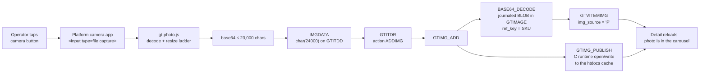
```mermaid
flowchart LR
  A["Operator taps<br/>camera button"] --> B["Platform camera app<br/>&lt;input type=file capture&gt;"]
  B --> C["gt-photo.js<br/>decode + resize ladder"]
  C --> D["base64 &le; 23,000 chars"]
  D --> E["IMGDATA<br/>char(24000) on GTITDD"]
  E --> F["GTITDR<br/>action ADDIMG"]
  F --> G["GTIMG_ADD"]
  G --> H["BASE64_DECODE<br/>journaled BLOB in GTIMAGE<br/>ref_key = SKU"]
  G --> I["GTIMG_PUBLISH<br/>C runtime open/write<br/>to the htdocs cache"]
  H --> J["GTVITEMIMG<br/>img_source = 'P'"]
  J --> K["Detail reloads —<br/>photo is in the carousel"]
  I --> K
```

The whole thing completes on **one round trip**. The screen is simply re-read
after the insert, so the new photograph comes back through the same view the
catalogue imagery does and lands in the next free carousel slot. There is no
special case in the render path — to the screen it is just another image.

### 33.2 Why the payload rides on a display-file field

There is no upload endpoint, and §29 explains why: every `/cgi-bin` alias on
this server is hard-wired to a specific library, none can be pointed at
TIGERPOC, and putting our objects in someone else's library was rejected.

So the photograph travels the only channel that already exists — a field on the
display file. That is a real constraint with real consequences:

| Constraint | Consequence |
|---|---|
| `IMGDATA` is `char(24000)` | JPEG must come in under ~17 KB |
| Field is EBCDIC-translated | Payload must be base64 (invariant alphabet only) |
| Field ships back on every write | `IMGDATA` is cleared immediately after the insert |

A display file **does** accept a 24,000-byte field — that was the first thing
verified, before any other work, because the whole design collapses if it does
not.

### 33.3 The resize ladder

`gt-photo.js` drops **resolution before quality**, because a slightly soft
800px photo of a damaged carton is still useful and a 340px one at quality 0.30
is not. The first rung that fits wins, so a small photo keeps its full quality:

| Rung | Max edge | Quality |
|---|---|---|
| 1 | 1024 | 0.72 |
| 2 | 900 | 0.66 |
| 3 | 800 | 0.60 |
| 4 | 700 | 0.52 |
| 5 | 600 | 0.45 |
| 6 | 500 | 0.40 |
| 7 | 420 | 0.35 |
| 8 | 340 | 0.30 |

Past the last rung it refuses rather than storing mush.

Measured on a 2400×1800, 908 KB source photograph: **rung 5 — 600×450, 12.5 KB,
17,124 base64 characters**, comfortably inside the field.

### 33.4 `getUserMedia` with a file-input fallback — revised

This started as `<input type="file" capture>`, on the reasoning that handing off
to the platform camera app buys autofocus, exposure, HDR, flash, tap-to-focus
and pinch-zoom for free and degrades to a file picker on a laptop.

**Reversed after testing on the device.** Those are real gains, but they are
bought with the one thing that matters on a warehouse floor: on Android the
operator got an intermediate *camera or gallery?* chooser, and on a desktop a
plain file dialog. Neither is "press the button, take the picture" while
standing in front of a crushed carton.

So the camera button now opens a **live `getUserMedia` stream inside the panel**
with an explicit shutter — the same path `gt-scan.js` uses, and the same
camera-with-a-no-entry-badge icon to close it, so the gesture reads identically
on both screens. The `<input type="file">` is still present and still wired, but
it is reached **only** when `getUserMedia` is refused: no camera on the machine,
or a non-secure origin. Nothing ever opens a file dialog on its own; the
fallback surfaces a *Choose a file* button and says why.

One shrink ladder serves both paths, so the `char(24000)` guarantee holds
however the photograph arrived. The camera is released the instant the shutter
fires — leaving it streaming behind a still costs battery and leaves the
recording indicator lit for nothing.

**`getUserMedia` needs a secure origin.** It works here because Genie is served
over HTTPS. If that ever changes, every device silently lands on the fallback
and the status line explains it rather than failing blank.

### 33.4a The camera button lives on the image, at every width

It overlays the **bottom-left** corner of the carousel at `z-index: 21`. Three
things had to be got right, and two of them had been wrong:

- **Left, not right.** The right edge is where the *next* arrow sits; on a
  narrow phone the two overlapped.
- **It must never be hidden by a breakpoint.** There used to be a second,
  labelled *Add photo* button below the carousel that appeared at 640px, and
  the round one on the image was the only control below that. A breakpoint was
  deciding whether an operator could add a photo at all. The labelled duplicate
  is gone; there is now exactly one camera button, present at every width.
- **The carousel arrows persist too.** They were gated behind
  `(hover: hover) and (min-width: 835px)` on the reasoning that a phone swipes
  instead. Wrong in practice: the swipe is not discoverable, and a gloved hand
  is worse at it than at a 44px target. Swipe still works; the arrows are now
  additive, and 38px on a narrow phone.

**State a `z-index` above 10 explicitly for anything sitting on the image.** The
stock Genie skin applies `div { z-index: 10 }` to bare divs, and although
`gt-theme.css` resets it, both selectors score (0,0,1) — so which wins depends
on the order the skin happens to load its stylesheets. The carousel slides are
bare divs. A button at `z-index: 3` is a button that may or may not be clickable
depending on the skin, which is not a thing to leave to chance.

`gtwms/tools/preflight-item.js` now hit-tests `.gt-car-add`, `.gt-car-prev` and
`.gt-car-next` at 360/412/1280 in both languages — it taps each centre point and
fails if the element is missing, zero-sized, or if something else answers the
tap. A visible-but-covered button photographs perfectly and does nothing.

### 33.5 `GTVITEMIMG` now unions two sources

```
img_source  img_group  ref_key         meaning
----------  ---------  --------------  ---------------------------------
C           0          'FAMnnnn'       catalogue, shared across a family
P           1          the SKU itself  operator photograph of this item
```

`img_group` orders them, so the carousel still **opens on the clean product
shot** with the operator's photographs appended. A SKU never looks like
`FAMnnnn`, so the two arms cannot claim each other's rows.

Carousel capacity is **8 slots** (`fetch first 8 rows only`). With two
catalogue images that leaves room for six photographs before the oldest stop
appearing. Raising it is a `MAX_IMGS` constant and eight more field triples —
deliberately not done until there is a reason.

### 33.6 Things that cost time

**`codermake` passes no `BNDDIR` to `CRTSQLRPGI`.** Adding `gtimg.srvpgm` as a
Rules.mk prerequisite is *not* enough — that controls build order, not the
binder's search path. The bind failed with `CPD5D02: Definition not found for
symbol 'GTIMG_ADD'` even though `DSPSRVPGM` showed the export present. The fix
is in the source, where the rest of the project already does it:

```rpgle
ctl-opt bnddir('GTIMG');
```

**CL does not pad a character literal to the receiver's declared size.** The
first capture test passed base64 as a `CALL ... PARM('...')` against a
`char(30000)` parameter. It stored nothing, silently: the program read 30,000
bytes out of a 4,560-byte buffer, the length guard saw garbage, and
`GTIMG_ADD` returned 0 with no error anywhere. There is now a staging table,
`GTIMGSTG`, and `GTIMGTST` takes no parameters at all.

**The imagery targets depended on the wrong thing.** They had `gttables.file`
as their prerequisite, but `gtseed.table.sql` opens with `DELETE FROM GTIMAGE`.
On a fresh clone or a fresh container make would load 102 images and then the
seed would wipe every one of them — invisible on an incremental build, because
neither target re-runs. Corrected to depend on `gtseed.file`.

**`gtimgspk.file` was a dead Rules.mk target.** Its source was never committed,
so any build that reached it failed outright with *No rule to make target*.
Removed.

### 33.7 Verified

| Check | Result |
|---|---|
| Display file accepts `char(24000)` | compiles |
| Real ladder on a 908 KB / 2400×1800 photo | 600×450, 12.5 KB, 17,124 chars |
| Payload survives the RDF datastream | 17,124 chars arrive intact |
| `ADDIMG` stores and publishes | `image_id` 206 |
| Served bytes vs. what the client encoded | **byte-identical**, 12,841 bytes |
| `GTVITEMIMG` ordering | 2 × `C` (group 0), then `P` (group 1) |
| Bilingual captions | `Photo d'entrepôt 2026-08-06` / `Warehouse photo …` |
| Empty payload | rejected with a message, nothing stored |
| `IMGDATA` after the add | length 0 — not shipped back |
| Back navigation | still returns to the search results |
| Shim, both skins | template + `gt-carousel.js` + `gt-photo.js` all current |

Then again after the switch to a live camera, driven headlessly against a
synthetic Chromium camera by `gtwms/tools/test-photo-capture.js` — which serves
and executes the **real** `gt-photo.js`, not a copy of its logic:

| Check | Result |
|---|---|
| Camera button position | bottom-left of the carousel, `x=27` at 412px |
| Button opens a live camera | `is-live`, 1920×1080, streaming |
| **A file chooser is never raised** | confirmed on open, on retake, throughout |
| Shutter produces a still | `data:image/jpeg`, 1024×576 |
| Payload vs. `IMGDATA` char(24000) | 9,404 base64 chars, inside the 23,000 cap |
| Camera released after capture | `srcObject` cleared |
| Retake returns to live | `is-live` again, still no file dialog |
| Close-camera | panel closed, tracks stopped |
| No camera present | falls back, *Choose a file* offered, **no dialog opened unasked** |
| Controls hit-tested at 360/412/1280, EN and FR | camera button and both arrows answer their own taps |

That last row is the one that matters for the regression: the check taps each
control's centre point, so it fails on a hidden control *and* on a covered one.
Verified to fail correctly by re-introducing both old faults — the 835px arrow
gate, and a slide painted over the button.

---

## 34. Build log — Receiving (menu tile 2)

The flagship application, and the one the customer described first: *"scan
something on the pallet coming in, show all the items in that receipt for us to
confirm numbers or adjust numbers down."*

### 34.1 What was built

| Object | Role |
|---|---|
| `GTVRCVLIN` | one row per receipt line, ready to render — description in both languages, and the line's catalogue thumbnail, so the subfile needs no per-row query |
| `GTVRCVOPEN` | receipts a receiver can work on; excludes posted ones in the view, so the list and its count cannot disagree |
| `GTRCHD` / `GTRCHR` | `rcvhome` — scan the pallet label, or tap a receipt |
| `GTRCLD` / `GTRCLR` | `rcvlines` — scan-to-confirm, inline quantity adjust, post |
| `gt-rcvlines.js` | scroll-to-the-scanned-line, beep and haptic, post confirmation |

Three ways into a receipt, in the order a receiver would try them: scan the
pallet label, key the receipt or PO when the label has peeled off, or tap a card.

**A case barcode means a case.** A scanned ITF-14 increments by the item's case
pack; a GS1-128 carrying AI 30/37 increments by the quantity it states; an each
increments by one. Verified live: one scan of `10614141003799` moved line 1 from
0 to 12, not to 1. This is the difference between a receiver trusting the app and
quietly counting on paper alongside it.

### 34.2 Posting is one unit of work

Movement rows, the balance upsert into staging, untouched lines, the header and
the pallet — all inside one commit boundary, with every statement checked and a
`ROLLBACK` on any failure. The balance upsert is an `UPDATE` then an `INSERT`
rather than a `MERGE`, and in that order: insert first and the update
double-counts.

Verified against the database rather than the screen — three independently
computed totals agreeing is the check that matters:

| Check | Result |
|---|---|
| `GTMOVEMENT` rows for the receipt | 15, one per line |
| `GTINVBAL` rows at `STAGE01` | 15 |
| sum received = sum moved = sum on hand | **3788.00 = 3788.00 = 3788.00** |
| Header | `POST`, `received_by` `GT001` |
| Pallet | `RECV` at `STAGE01` |
| Open-receipt count | 8 → 7 |
| Reopening a posted receipt | read-only, scan refused with a message |

### 34.3 Four findings

**`CPF5021` on the first run — the subfile CLEAR writes the RECORD FORMAT, not
the subfile record.** Writing the subfile with the RRN still 0 produces
"incorrect relative record number", which arrives as an *inquiry message on the
operator's screen*. It compiles perfectly.

**Ordering the line list by status was wrong in the hand.** `GTVRCVLIN` offers a
`sort_group` — untouched first, then variances — and it reads well on paper. In
use, every scan moved the line that had just been scanned somewhere else, so the
flash-and-scroll landed on a row that had jumped. Scan-to-confirm needs a list
that holds still: `ORDER BY line_no`, always. The view keeps `sort_group` for a
future review toggle.

**A gap in `GTBAR` only appeared when Receiving became its first new caller.**
`result.sscc` was populated solely from AI 00 inside a GS1-128, so a *bare*
18-digit pallet label — which is how they are frequently printed — was
classified `SSCC-18` and then resolved as though it were an item barcode. It
found nothing, and the screen said "no receipt found for …". Fixed in the
service program with a unit-test case (now 12, all passing), not worked around
in the caller.

**Every primary button in the application had near-black text on GT red.**
`.gt-app button { color: inherit }` scores (0,1,1) and beat
`.gt-btn-primary { color: #FFFFFF }` at (0,1,0) — the same specificity trap that
cost the header its padding in §31.3, but this time it had been shipping
unnoticed because it looks plausible in a screenshot. Found by asserting
`getComputedStyle().color` rather than by looking. Fixed with `:where()`, which
repairs every screen at once.

### 34.4 Not built yet, deliberately

`rcvdetl` — the per-line drill-down with the reason-code picker and damage
photographs — and `rcvconf`, the summary-and-signature screen. Both are additive:
the flow is complete and postable without them. The reason-code table
(`GTREASON`, bilingual, with `photo_required`) and the capture pipeline
(`GTIMG`, `ref_type` `RCPT`/`DMG`) are already in place for them.

Overage handling is also deferred: a carton scanned that is not on the receipt
currently reports so plainly rather than offering to add it as an overage.

### 34.5 The quantity stepper — the spinners had to go

The inline quantity box shipped as a plain `<input type="number">`, and on a
phone that means the browser's own spinner arrows: a few pixels tall, stacked on
top of each other in the corner of the field. Unusable with a thumb, never mind a
gloved one.

Replaced with a **48px `−` to the left of the box and a 48px `+` to the right**,
the native spinners suppressed in CSS, plus a per-line **"In full n"** that jumps
straight to the expected quantity — one tap for a clean line instead of stepping
up to 864. The receipt-level *Confirm all as expected* stays in the footer for a
whole clean pallet.

**The step is the item's case pack**, carried down in a new `LCASE` subfile
field, and shown on the button when it is not 1. Stepping by one would be as
unusable as the arrows on a line expecting 864 eaches, and inventing a step in
the template would have been a number with no meaning — cartons arrive in cases.

All three controls act on the box **client-side**; nothing round-trips.
Forty-eight cases must not be forty-eight submits, so the operator adjusts freely
and *Save quantities* commits the lot through the same `READC` the typed path
already used. With the screen JS absent the buttons do nothing and the box is
still a number field that can be typed into — the screen stays usable, which is
the rule for anything delivered through the shim.

`tools/test-rcv-stepper.js` clicks all of it against the real `gt-rcvlines.js`:
step sizes come from the case pack (24/12/1), minus stops at zero, **plus is
deliberately not clamped at expected** because an overage is a real thing a
receiver must be able to record, "in full" lands on the expected quantity, a
posted receipt renders none of the controls, and nine taps produce **zero**
submits.

The pre-flight also gained a **touch-target assertion** — under 44px fails. It
caught my own *In full* button at 40px. A control can be visible, hit-testable
and still too small to hit; that is precisely what the spinners were, and
"present and correct" was never the same as usable.

### 34.6 One level of controls, and two bugs French found

*"Move the in full button up and to the right on the same level. Move the status
bar down to make some room. Space everything aesthetically."*

`In full` was a full-width block underneath the stepper, which cost every card a
line, and in the table layout the status chip had a column of its own beside the
controls — which is what kept the quantity column too narrow to hold them on one
row. Both moved: **the four controls now sit on one level** (`−`, box, `+`,
`in full`) and **the status chip drops underneath them**, in the same column. The
wide layout went from five columns to four and the fourth heading was dropped, the
chip labelling itself.

Spacing: card padding and row gaps evened to 12/10px so the card reads as three
bands — identity, quantity, status — and the shared camera block, whose reserved
space is orphaned on this screen because its stage stays hidden, was tightened
from a 38px/14px gap to a symmetric 12px/12px. Overridden for this screen, not
copied.

**Two real bugs surfaced, both only in French, both invisible in English.**

**Every quantity box on the French screen was empty.** The `value` attribute was
being rendered through the localising `num()` helper, so French produced `24,00`
— and an `<input type="number">` *silently discards* a value that is not a valid
floating-point literal. The box came up blank with no error anywhere, and pressing
*Save quantities* would have written zeroes across the receipt. A number input's
`value` is data, not display. Every live test until now had been in English.

**And the box had been squeezed to 40px.** With `AU COMPLET` — twice the length
of `IN FULL` — beside it at 360px, `minmax(48px, 1fr)` collapsed and the value
had nowhere to render. The floor is now 72px, the three buttons drop to 44px
below 420px, and the word is replaced by a **tick** under 835px, which carries
the same meaning in a quarter of the width.

Both had passed every check I had, because an overflow test bounded on the
viewport sees nothing wrong: the control never crossed the edge, it just had no
room inside. The pre-flight now also asserts a minimum control width, that
`scrollWidth` does not exceed `clientWidth` on the control itself, and that the
quantity box's value **survives the browser** — verified to fail by
re-introducing the 48px floor.

### 34.7 Save did nothing, and the header never moved

Two bugs from the same report, one of them a design error rather than a slip.

**`READC` cannot see a browser edit in an EJS screen.** Change a quantity, press
*Save quantities*, and the screen answered *"No quantities were changed"* every
time — for a typed value, a stepper tap and *in full* alike.

The cause is structural. In an EJS Rich Display screen **the subfile rows are
rendered by the template**, not by Profound UI grid widgets. So all 27 quantity
boxes carry the same `name="lqty"` with no record number attached anywhere, and
the runtime derives its `{SUBFILE}.rrn` changed-record marker from its own grid
widgets — of which there are none here. `READC` had nothing to return.

**And it had passed a live test**, because that test POSTed
`LINSFL.LQTY.2=92.00&LINSFL.rrn=2` by hand — supplying the row index the browser
has no way to know. Driving the datastream directly is not a test of the screen;
it only proved the RPG half. The lesson is sharper than the bug: a verification
that stands in for the client can confirm something the client can never do.

**The fix follows the grain the application already has.** The changed rows now
travel in one `QTYEDITS char(1024)` field as `"seq:qty;seq:qty;"`, the row index
encoded exactly as `PICKnn` encodes it and as `IMGDATA` carries a photograph. The
client sends only boxes that differ from a `data-gt-orig` attribute, so a save
with nothing changed is still free and `updated_by` is still not stamped across
untouched lines.

The parser then produced `RNX0100` on the first live run — a **trailing
separator** leaves the scan position on the final character, and advancing past
it is out of range. Like `CPF5021` before it, that arrives as an inquiry message
on the operator's screen, not as an error the program can report. Numeric
conversion is wrapped in `monitor` for the same reason: `%dec` of a malformed
token is `RNX0105`, and one bad token must not discard the operator's other
edits.

Exercised live against the real program: a trailing separator, no trailing
separator, an empty payload, `banana;xx:yy;4:116.00;` (garbage skipped, the valid
entry still applied), an index out of range, and a negative value (clamped to
zero by RPG as well as by the client). No crash in any of them.

**The receipt header never left `OPEN`.** It read "Not started" on the screen and
in the open-receipt list however many lines had been confirmed, because only the
final post ever wrote `receipt_status` — nothing lifted it to `PART`. Now done
whenever a line is written, inside the same commit boundary as the line, so the
header and the detail move together or not at all.

`tools/test-rcv-stepper.js` grew seven assertions on the payload: that it carries
the row index, that a box returned to its original drops out, that an empty box
is skipped rather than sent as a zero, and that *Save* submits once with the
payload on both the action and the hidden field. It also had to be corrected to
click `.gt-lin-acts .gt-btn-primary` — `.gt-btn-primary` alone matched the scan
row's *Go* button, so the test had been clicking the wrong control.

### 34.8 The scan controls are pinned

A 27-line receipt is several screens long, and scanning is the primary
interaction — so a receiver working at line 20 was having to scroll back to the
top to scan the next carton. Progress, the camera button and the scan box now sit
in one **sticky band at the top of the scroll**, with the lines passing
underneath.

The band costs 135px on a 412px phone, which took some arranging:

- **The camera button and the scan box share a row.** Stacked they were two rows
  of pinned height; side by side the band pays for one.
- **The progress bar and its figures went from two lines to one.** Every pixel a
  pinned band takes is a pixel of the list the operator cannot see.
- **The scan row lives inside `.gt-scan-camera`.** The shared camera component
  hides whichever of its two buttons does not match `.is-live` using *descendant*
  selectors, so moving the controls out of that element would have left both the
  open and close buttons showing at once.
- The receipt identity card deliberately scrolls away. The receipt number is
  worth a glance, not permanent real estate.

**`position: sticky` fails silently, so it is asserted by scrolling.** One
ancestor with `overflow` other than `visible` and it does not stick at all — no
warning, no console message, and it looks perfectly fine until someone scrolls.
`test-rcv-stepper.js` now scrolls the page for real and checks that the camera
button and the scan box are still in the viewport, that the band sits at `top: 0`,
that nothing is drawn over it, and that `elementFromPoint` just below its edge
finds a **line card** — proving the rows pass under rather than over.

Verified to fail correctly in both ways it can break: with `position: static`
(controls at `-43px`, off screen) and with an `overflow: hidden` ancestor, which
produces exactly the same failure and is the one that would otherwise be
impossible to spot.

Two things a pinned band needs beyond the sticky itself, both learned here: an
**opaque background**, or the cards show through as they pass beneath; and a
**z-index above whatever the rows claim** — the cards use 20–21 to beat Genie's
`div { z-index: 10 }`, so the band takes 30.
