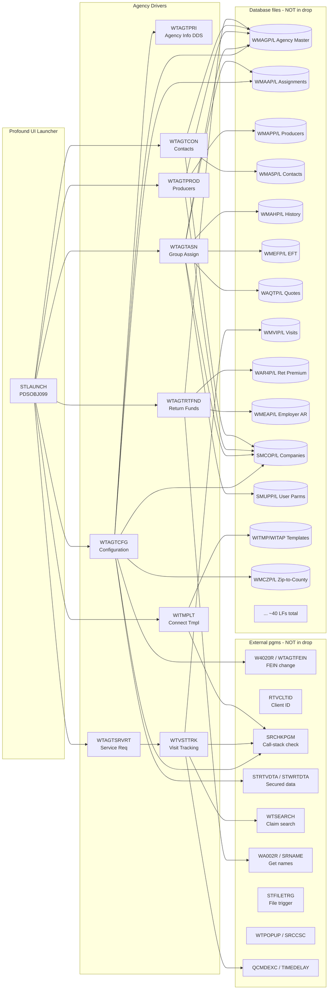
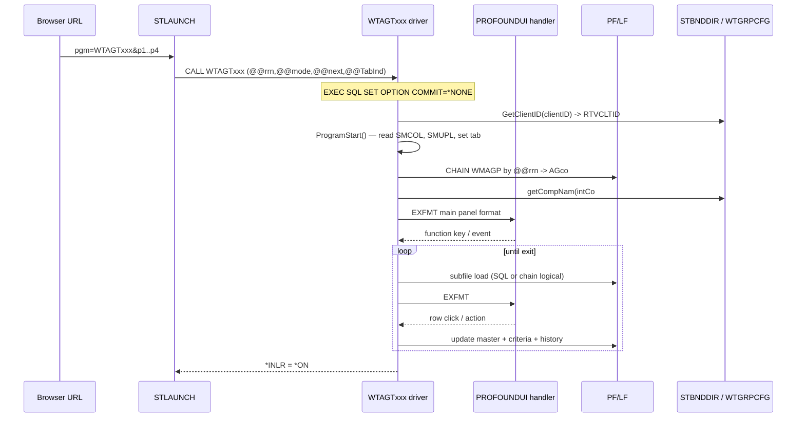

# Sapiens Agency Source Drop — Analysis & Onboarding Plan

IBM i task library: **AITSK00030**

## 1. What was done

1. Created `/workspace/ibmi-agentic/src/Sapiens/`.
2. Unpacked `agencysrc.zip` (57 source members) into that folder.
3. Copied `Agency Info updated.docx` alongside the source as the project's reference document.
4. Read every RPGLE / DDS source and the Word doc, then cross-referenced every F-spec, `/COPY`, and external program call against the files actually present in the drop and elsewhere in `/workspace/ibmi-agentic`.

No source was modified. No build was attempted — every interactive program in this drop depends on database PFs/LFs that are **not** in the repository (see §6).

## 2. What this code is

This is a Profound UI-enabled subset of the **Sapiens "Agentic" / agency-management** application (built originally on top of the StoneRiver / Sapiens insurance platform, library `V26PNSRC`, with some pieces inherited from `V6R0QA`). The drop is the **Agency module** — it lets a user maintain insurance Agencies, their Producers, Contacts, Group/Carrier assignments, EFT bank info, Service-Request / visit tracking, Return-Premium check requests, and Connect portal templates.

There are **9 interactive 5250 driver programs** (all declared `handler('PROFOUNDUI(HANDLER)')`) plus their DDS, and **38 RPGLE prototype copybooks / DS members** that are `/COPY`-included into the drivers. Implementation of the procedures behind those prototypes is **pre-compiled into two binding directories — `STBNDDIR` and `WTGRPCFG`** — which exist on the target IBM i and are not shipped as source here.

All programs share a **uniform 4-parameter entry signature**:

```
@@rrn      9a    Relative record number into WMAGP (Agency Master)
@@mode     1a    'A'=Add  'C'=Change  'D'=Display  ' '=initial select
@@next    10a    Next-program name (for tab navigation; e.g. 'GetAgency')
@@TabInd   5a    Tab index — which tab to show on entry
```

The Word doc maps this directly to the **Profound UI launcher URL** pattern:

```
/profoundui/auth/start?pgm=PDSOBJ099/STLAUNCH
   &p1=WTAGTCFG &l1=10
   &p2=LIV       &l2=3         ← @@mode (' ','D' etc.)
   &p3=(' ' ' ' ' ' ' ' ' ' ' ' ' ' ' ' ' ' ' ' ' ' ' ')*End &l3=53
```

So STLAUNCH is the gateway — it takes a program name plus a list of (value, length) tuples, then calls the named program with those parms. That is what the menu URL in the Word doc encodes.

## 3. Interactive program inventory

| Program | Display Files | Purpose | Entry parms (besides @@rrn/@@mode) |
|---|---|---|---|
| **WTAGTCFG** | `WTAGTCFG`, `STACTPNL` | Agency Configuration — the "header" for everything else. Master record + carrier grid + iDARTS link | @@next, @@TabInd |
| **WTAGTPRI** | `WTAGTPRI` (DDS only) | Agency Information menu (Edit/Display). Per source comments WTAGTPRI's RPGLE was folded into WTAGTCFG; the DDS remains as a tabbed panel | — |
| **WTAGTASN** | `WTAGTASN`, `WTACTPNL` | Group Assignment — agent↔group, EFT, Quote Tracking, Payment Info (4 tabs, 3 subfiles) | same |
| **WTAGTPROD** | `WTAGTPROD`, `WTACTPNL` | Producer master + non-resident state licenses + producer criteria | same |
| **WTAGTCON** | `WTAGTCON`, `WTACTPNL` | Agency contacts + distribution types + contact-type lookup | same |
| **WTAGTSRVRT** | `WTAGTSRVRT`, `WTACTPNL` | Service-Request front end — thin wrapper that delegates to `WTVSTTRK` | same |
| **WTAGTRTFND** | `WTAGTRTFND`, `WTACTPNL` | Return-Funds checks + AR detail + Account-Current summary | same |
| **WTVSTTRK** | `WTVSTTRK`, `WTACTPNL` | Visit-Tracking grid (used by SRVRT and stand-alone). Huge — 14k-line DDS, embedded claim/policy search | distinct: @@rrn, @@mode, @@Category, @@Assign, @@VstFrDt, @@VstToDt, @@isTeam |
| **WITMPLT** | `WITMPLT`, `STACTPNL` | Connect / Portal Template associations. Entire program gated on `IsModEnabled('Portal Module')` | passes a `dsWITMPLTparms` data structure |

## 4. Copybook / utility module inventory

All 38 utility members are **prototype-only** `/COPY` modules — they declare `PR` prototypes whose `EXTPROC`/`EXPORT` implementations are bound at compile time from `STBNDDIR` and `WTGRPCFG`. Notable groups:

- **`SPR*` (Sapiens generic)** — date, string, SQL, message, module, mask, table, trigger, atrium, company, runcmd, retrieve-brand, code generation. Cross-app utilities.
- **`WPR*` (W-/agency specific)** — agent, group, EFT, employer, claims, policy-error, user-parms, table.
- **`SCOPY*`** — action-panel prototypes (`SCOPYCOMPI`/`SCOPYCOMPR`) and group-action-panel prototypes (`SCOPYGRPPR`), plus the binary compression API.
- **`WT*` DS-only members** — `wtSearchDs` (search criteria DS), `wtVstTrkSD` / `wtVstTrkSP` (visit-tracking shared definitions), `witmpltd` (template parm DS + extpgm proto for `WITMPLT`).

Every `/COPY` target referenced by the 9 driver programs is present in this drop — see §6 for confirmation.

## 5. Architecture & program flow

### 5.1 Module map (drivers → key data → external pgms)



### 5.2 Typical driver runtime sequence (all programs follow this shape)



### 5.3 Dependency map — drivers → /COPY targets

```mermaid
graph LR
  classDef present fill:#d6ffd6,stroke:#0a0;
  classDef driver fill:#cce5ff,stroke:#06c;

  CFG[WTAGTCFG]:::driver
  ASN[WTAGTASN]:::driver
  PRD[WTAGTPROD]:::driver
  CON[WTAGTCON]:::driver
  SRV[WTAGTSRVRT]:::driver
  RTF[WTAGTRTFND]:::driver
  VST[WTVSTTRK]:::driver
  TMP[WITMPLT]:::driver

  UP[sprUsrPrms]:::present
  GP[sPrGenPop]:::present
  DT[sPrDate]:::present
  ST[sPrString]:::present
  SQ[sPrSql]:::present
  MS[sPrMessage]:::present
  MO[sPrModule]:::present
  CC[sCopyCompr]:::present
  CM[sprCompany]:::present
  TB[sPrTable]:::present
  TG[sPrTrigger]:::present
  TR[sPrTrig]:::present
  WT[wPrTable]:::present
  AT[sPrAtrium]:::present
  PE[wPrPolErr]:::present
  WG[wPrGroup]:::present
  GE[sPrGenErr]:::present
  CI[SCOPYCOMPI]:::present
  CG[sCopyGrpPr]:::present
  MK[sPrMask]:::present
  WA[wPrAgent]:::present
  WE[wPrEft]:::present
  WL[wPrEmpLr]:::present
  RC[sPrRunCmd]:::present
  WD[witmpltd]:::present
  WC[wprClaims]:::present
  WU[wPrUsrPrms]:::present
  RB[sPrRtvBrnd]:::present
  TM[sprTeam]:::present
  VD[wtVstTrkSD]:::present
  VP[wtVstTrkSP]:::present
  SD[wtSearchDs]:::present

  CFG --> UP & GP & DT & ST & SQ & MS & MO & CC & CM & TB & TG & TR & WT & AT & PE & WG & GE & CI
  ASN --> UP & GP & DT & CM & PE & ST & GE & WA & MO & WD & MK & WE & RC & WL & CG & CI
  PRD --> UP & GP & DT & CM & PE & ST & MK & GE & CG & CI
  CON --> UP & GP & DT & CM & PE & ST & CG & CI
  SRV --> UP & GP & DT & ST & SQ & MS & MO & CC & CM & TB & TG & TR & WT & AT & PE & WG & GE & CG & CI
  RTF --> UP & GP & DT & CM & PE & ST & CG & CI
  VST --> VD & WG & AT & CM & DT & ST & MO & TM & WU & WL & WC & WA & SD & GP & VP
  TMP --> WD & DT & CM & GP & MO & RB & RC & ST & WU
```



All 38 `/COPY` targets resolve to files in the drop. ✅

## 6. Missing dependencies — what you need to bring across

### 6.1 Database PFs / LFs (NONE are in the drop)

| Object | Used by | Purpose |
|---|---|---|
| WMAGP / WMAGL / WMAGL1 | CFG, ASN, PRD, CON, SRV, RTF, VST | Agency Master |
| WMAAP / WMAAL / WMAAL1 | CFG, ASN, VST | Agency Assignments |
| WMAPP / WMAPL / WMAPPCRT | PRD | Agency Producers + criteria |
| WMPSP / WMPSL | PRD | Producer non-resident state info |
| WMA5P / WMA5L / WMA5PCRT | CON | Agency Contacts + criteria |
| WMAHP / WMAHL / WMAHL3 | ASN, VST | Agency History |
| WMEFP / WMEFL2 / WMEFL7 | ASN | EFT Account |
| WAQTP / WAQTL8 / WAQTL9 / WAQTL12 | ASN | Agent Quotes |
| WTQSP / WTQSL1 | ASN | Quote Tracking |
| WMNBP / WMNBL | ASN | New Business/Renewal Tracking |
| WMSHP / WMSHLQ | ASN | NCCI Submission History |
| WMFNP / WMFNL | ASN | Group/Fund Master |
| WDELP / WDELL / WDELLQ | ASN, VST | Employer Detail |
| WMVIP / WMVIL1..7 | VST | Visit Tracking Detail |
| WTVIP / WTVIL / WTVIPCFG | VST | Visit Tracking setup + config |
| WMEML / WMRPL / WMALL / WMAEL / WMCMP / WMCML / WMCDL | VST | Employer/role/agent/claim refs |
| WAR4P / WAR4L6 | RTF | Return Premium Check Request |
| WMEAP / WMEAL31 | RTF | Employer AR |
| WSASP / WSASL | RTF | Account Current Summary |
| WDABP / WDABL | RTF | Agency Billing Detail |
| WITMP / WITAP / WITCP / WITMPQST / WIQUP | TMP | Portal Template & Questions |
| SMCOP / SMCOL | all | Company Master |
| SMUPP / SMUPL / SMUPL1 | all | User Parameters |
| STCNP / STCNL | CON | Contact Type lookup |
| STDSP / STDSL | CON | Distribution Types lookup |
| WMCZP / WMCZL | CFG | Zip-to-County |
| WDF2P / WDF2L | CFG, ASN | Group Auxiliary (carrier list) |
| STABL / WTABL / WTAGL / WTGTL | VST, PRD, RTF | Generic system / lookup tables |
| SDACP / SDACL | VST | Application Config table |
| SSYLF / SZYLF | ASN, CFG | System Control |

### 6.2 External programs (referenced via `EXTPGM`, NOT in the drop)

| Program | Caller | Purpose |
|---|---|---|
| `W4020R` (alias `WTAGTFEIN`) | CFG | Change FEIN dialog |
| `RTVCLTID` | CFG, SRV, VST, others | Returns 10-char client ID |
| `SRCHKPGM` | CFG, VST, TMP | Search call stack for caller name |
| `STRTVDTA` / `STWRTDTA` | CFG | Read/write secured (encrypted) user/pwd |
| `WA002R` | RTF | Get agent name |
| `WTSEARCH` | VST | Claim search popup |
| `TIMEDELAY` | VST | Sleep utility |
| `QCMDEXC` | VST | Run CL string |
| `WTPOPUP` | VST | Generic popup |
| `SRCCSC`, `SRNAME`, `STFILETRG`, `RTVBRND`, `W0040R` | misc | Misc helpers |
| `WITMPLT` (cross-call) | external | TMP calls itself via prototype in `witmpltd` |

### 6.3 Shared action-panel DDS

`STACTPNL` (used by `WTAGTCFG`, `WITMPLT`) and `WTACTPNL` (used by everyone else) are **NOT in this drop**. They are the shared action-bar / window panels — typically a tiny DDS file with a single record format showing function-key prompts. Without them, **nothing compiles**.

### 6.4 Binding directories

`STBNDDIR` and `WTGRPCFG` — neither has source here. These contain the *implementations* of every prototype in the `SPR*` / `WPR*` / `SCOPY*` /COPY members (date math, SQL helpers, message dispatch, atrium integration, etc.). They must exist in the build library list at compile time.

### 6.5 Profound UI runtime

Every driver is hard-coded to `handler('PROFOUNDUI(HANDLER)')`. This requires:

- Profound UI installed on the IBM i (a Profound Logic product — the user's domain, so already available in `gjones@profoundlogic.com`'s environment).
- The compiled `.pgm` and its display file made known to Profound UI's launcher.
- The `STLAUNCH` program (`PDSOBJ099/STLAUNCH`) — the URL-to-PARM dispatcher quoted in the Word doc.

### 6.6 Summary of what's present vs missing

| Category | Total references | Present | Missing |
|---|---:|---:|---:|
| Driver `.rpgle` programs | 9 (one is DDS-only) | 8 RPGLE + 9 DDS | 0 |
| `/COPY` copybook members | 38 distinct | 38 | 0 |
| DDS display files | 11 referenced | 9 | 2 (`STACTPNL`, `WTACTPNL`) |
| Database PF/LF | ~50+ | 0 | ~50+ |
| External `EXTPGM` pgms | 16 | 0 | 16 |
| Binding directories | 2 | 0 (source not shipped) | 2 |

## 7. Insights — what I think we are looking at

1. **It is *not* a runnable 5250 app in the traditional sense.** Every driver explicitly attaches the Profound UI handler. The DDS files are written to be rendered by Profound UI (you'll see `onload`, `onchange`, `onrowclick`, modal windows, hyperlinks, multi-select dropdowns in the DDS). Removing the handler and running green-screen will compile but won't *function* fully — the JavaScript-driven cascades (state→county, distribution-types multiselect, "Activate/Inactivate" hyperlinks) are baked into the DDS.

2. **The drop is a "module slice", not a system.** It's the front-end programs and their UI definitions plus the prototype copybooks. The runtime is split into three layers we don't have:
   - the **data layer** (~50 PF/LF on the IBM i, library `V26PNSRC` or its data twin),
   - the **service layer** (the `STBNDDIR` / `WTGRPCFG` binding directories, plus ~16 utility programs like `RTVCLTID`, `SRCHKPGM`, `STRTVDTA`),
   - and the **launcher** (`PDSOBJ099/STLAUNCH` + a Profound UI install).

3. **It is recently maintained.** Every program carries dated revision blocks running from 2014 → November 2025 (e.g. WTAGTCFG: "11/28/25 — Agent Activity Report Error"; WTAGTCON: "04/11/24 — STDSL lookup"; WTAGTPROD: "08/28/23 — Activate/Inactivate hyperlinks"). This is live, supported code, not an archive.

4. **The Word doc is, in effect, a deployment runbook.** It already gives you:
   - the **STLAUNCH URL** for each program in edit and display mode,
   - the **library each DDS came from** (`V26PNSRC/QDDSSRC` vs `V6R0QA/QDDSSRC`),
   - the **complete F-spec database file list per tab** of each driver,
   - the **complete `/COPY` list per program** (also `V26PNSRC/QRPGLESRC`).

   This is exactly what you would need to author a `Rules.mk` and a binding-directory manifest.

5. **The naming convention is informative.**
   - `WTAGT*` = Profound-UI front end ("WT" = Workers'-Comp / agency tracking; "AGT" = agent).
   - `WT*TRK` = tracking system; `VST` = visit.
   - `WI*` = "Insurance" / Connect portal.
   - `WMxxP/L` = master files (`WM`=workers'-comp master, last two letters = entity: `AG`=agency, `AA`=assignment, `AP`=producer, `A5`=contact, `EF`=eft, `NB`=new-business, `AH`=history, `FN`=fund, `VI`=visit, `R4`=ret-fund, `EA`=emp-AR).
   - `SMxxP/L` = system master (`CO`=company, `UP`=user-parm).
   - `STxxL` = static lookup tables.

6. **Entry contract is uniform — that's the gift.** Six of the eight `.rpgle` programs accept exactly `(@@rrn,@@mode,@@next,@@TabInd)`. That's literally what `STLAUNCH` packages. So once the supporting layers exist, **any one** of these can be invoked the same way.

7. **The shared `STACTPNL` / `WTACTPNL` DDS is the first blocker.** Those two missing display files are the function-key bar that appears across every program. They are 50–100-line DDS files in real life. Getting them is high-value, low-effort: once they're present, compilation can begin.

8. **Embedded SQL with `SET OPTION COMMIT=*NONE`** at every entry says: "we own transaction management; do not engage commitment control." Normal for read-heavy IBM i CRUD, but means these programs need explicit transaction semantics if you ever want commit-protected ops.

9. **Call-stack introspection is heavily used.** `SRCHKPGM` is called to detect "am I being invoked from `WTRPTAGACT` / `WTRPTAGLOS`?" That branches behavior — meaning these programs are designed to be both directly launched *and* invoked from batch/reporting. Don't be surprised if some of the `@@next` navigation values are undocumented edges.

10. **It's Sapiens-branded but with StoneRiver pedigree.** Headers show 2014 © StoneRiver, later © 2025 Sapiens — Sapiens acquired StoneRiver's insurance suite. Project tags `WC2395 / WC2964 / WC2447` are the work-tickets driving the revisions.

## 8. Next steps — getting an option on the menu and making it run

Two completely separate tracks. Decide which is the goal.

### Track A — "Add a menu option that *launches* an Agency program" (lowest-effort)

This wires up the existing demo menu so option 4 says "Agency Configuration" and tries to call `WTAGTCFG`. It will only actually display anything once Track B is done, but it lets you commit the menu change immediately.

Files to change (both in `/workspace/ibmi-agentic/src/`):

1. **`menu.dspf`** — add a line:

   ```
        A                                  8  7'4. Agency Configuration'
   ```

2. **`menu.msgf`** — add the matching message:

   ```
   addmsgd msgid(usr0004) msgf($LIBRARY/$NAME)
           msg('call wtagtcfg parm('' '' '' '' ''GetAgency '' ''     '')')
           seclvl(*none) sev(00) fmt(*none)
   ```

   (Four blank-padded parms: blank rrn, blank mode, `'GetAgency'`, blank TabInd.)

3. **`Rules.mk`** — once the prerequisites in Track B are met, add:

   ```
   wtagtcfg.file: Sapiens/wtagtcfg.dds
   stactpnl.file: <…>/stactpnl.dds
   wtagtcfg.pgm:  Sapiens/wtagtcfg.rpgle wtagtcfg.file stactpnl.file | <bnddirs> <PF/LF deps>
   ```

   (`codermake`'s `Rules.mk` resolves source by path; the Sapiens files can stay in their subdirectory.)

This gives you a green-screen menu entry that signs in to a 5250 session, types `4`, and runs `CALL WTAGTCFG`. It will fail to compile until Track B is partially done — but the menu change itself is mechanical and safe.

### Track B — "Actually get WTAGTCFG running"

The minimum to get **one** program (recommend `WTAGTCFG` — least file dependencies after `WTAGTSRVRT`) compiled and launchable:

1. **Pull the shared action panel DDS.** From the user's IBM i `V26PNSRC/QDDSSRC`, retrieve `STACTPNL` and `WTACTPNL` (start with `STACTPNL` since `WTAGTCFG` uses it). Add them to `Sapiens/`.

2. **Stage the dependency PFs / LFs that `WTAGTCFG` opens.** From WTAGTCFG's F-specs that is exactly:
   `WMAGL1`, `WMAGL`, `SMCOL`, `WMAAL`, `WDF2L`, `WMCZL` — plus the underlying PFs they're built over (`WMAGP`, `SMCOP`, `WMAAP`, `WDF2P`, `WMCZP`). Source those `*.PF` / `*.LF` DDS members from `V26PNSRC/QDDSSRC` and drop them into `Sapiens/`.

3. **Stage the external programs** `RTVCLTID`, `SRCHKPGM`, `STRTVDTA`, `STWRTDTA`, `W4020R`. If their source is not handy, at minimum ensure their **compiled objects** exist in the build library list. The compiler is happy with `EXTPGM` prototypes against compiled `*PGM` objects.

4. **Ensure binding directories `STBNDDIR` and `WTGRPCFG`** are in the build library list of `AITSK00030`. Without them, every `/COPY`'d prototype will resolve at compile time but **fail to bind at link time** ("module not found for export X").

5. **Author `Rules.mk` entries** for the Sapiens subset. Pattern (mirroring the existing `wrkcustr.pgm` recipe):

   ```
   # Sapiens
   stactpnl.file:  Sapiens/stactpnl.dds
   wtagtcfg.file:  Sapiens/wtagtcfg.dds
   wmagp.file:     Sapiens/wmagp.pf
   wmagl.file:     Sapiens/wmagl.lf | wmagp.file
   wmagl1.file:    Sapiens/wmagl1.lf | wmagp.file
   smcop.file:     Sapiens/smcop.pf
   smcol.file:     Sapiens/smcol.lf | smcop.file
   wmaap.file:     Sapiens/wmaap.pf
   wmaal.file:     Sapiens/wmaal.lf | wmaap.file
   wdf2p.file:     Sapiens/wdf2p.pf
   wdf2l.file:     Sapiens/wdf2l.lf | wdf2p.file
   wmczp.file:     Sapiens/wmczp.pf
   wmczl.file:     Sapiens/wmczl.lf | wmczp.file

   wtagtcfg.pgm:   Sapiens/wtagtcfg.rpgle \
                   wtagtcfg.file stactpnl.file \
                   | wmagp.file wmagl.file wmagl1.file smcop.file smcol.file \
                     wmaap.file wmaal.file wdf2p.file wdf2l.file wmczp.file wmczl.file
   ```

   Plus a build-side hook to add the binding directories — easiest is to ensure `*LIBL` of the build library list includes the libraries holding `STBNDDIR` / `WTGRPCFG` at `CRTBNDRPG`/`CRTPGM` time. `codermake` honors `INCDIR` for `/COPY` resolution; the `/COPY` members are already side-by-side in `Sapiens/`, so the compiler just needs `Sapiens/` on its include path.

6. **Test compile:** `codermake wtagtcfg.pgm`. Expect first failure to be DDS (`STACTPNL not found`) or binding (`*MODULE not found`). Iterate.

7. **Test launch:**

   - 5250: `CALL WTAGTCFG (' ' ' ' 'GetAgency ' '     ')` — first screen `RCDPANEL` should appear (degraded look without Profound UI handler).
   - Profound UI: hit `/profoundui/auth/start?pgm=AITSK00030/STLAUNCH&p1=WTAGTCFG&l1=10&p2=LIV&l2=3&p3=(' ' ' ' ' ' ' ' ' ' ' ' ' ' ' ' ' ' ' ' ' ' ' ')*End&l3=53` — full web tab.

### Track-B effort estimate

| Step | Effort | Blocker if missing |
|---|---|---|
| Copy `STACTPNL` + database DDS sources (~20 PF/LF) | ~30 min | Compile fails immediately |
| Confirm `STBNDDIR` / `WTGRPCFG` exist in library list | ~10 min | Bind fails after compile |
| Confirm `RTVCLTID`/`SRCHKPGM`/`STRTVDTA`/`STWRTDTA`/`W4020R` objects exist | ~15 min | Runtime call fails |
| Author Rules.mk entries | ~30 min | — |
| First successful `codermake` for `WTAGTCFG` | ~1–2 hr (iterate) | — |
| Wire menu option + 5250/Profound launch test | ~30 min | — |

Expanding from `WTAGTCFG` to the other 7 drivers is the same shape with more PF/LF dependencies. `WTVSTTRK` is the biggest jump — its F-spec list is ~30 files.

## 9. Recommendation

- Land Track A's menu wiring as a small commit now so the demo menu reflects the new module slice (this commit captures the source drop too).
- For Track B, the **first concrete unblocker** I need from you is access (via the `dev` SSH alias) to library `V26PNSRC` so I can pull `STACTPNL.dds`, `WTACTPNL.dds`, and the `WMAGP/WMAGL/WMAGL1/SMCOP/SMCOL/WMAAP/WMAAL/WDF2P/WDF2L/WMCZP/WMCZL` DDS members. Once those are in `Sapiens/`, I can author a working `Rules.mk` block and try to build `WTAGTCFG.pgm` against `AITSK00030`.
- Confirm `STBNDDIR` and `WTGRPCFG` binding directories are present on the dev box (`DSPBNDDIR BNDDIR(STBNDDIR)` from a 5250). If not, that's the next thing to get from `V26PNSRC`.
- Decide whether the test target is **green-screen 5250** (will require removing the Profound UI handler; the screens will look stripped — many widgets won't render) or **Profound UI web** (preferred — this is what the code was designed for).

Exploratory verification: not applicable to this task — no interactive display-file changes were made and nothing was deployed to IBM i.

## 10. Track A executed — live build evidence

We landed Track A and ran codermake against `idev.profoundlogic.com` / library `AITSK00030`. Two outcomes:

### 10.1 Menu — built clean ✅

- `src/menu.dspf` — added option `4. Agency Configuration`.
- `src/menu.msgf` — added `usr0004` with the message
  `call wtagtcfg parm(' ' ' ' 'GetAgency ' '     ')` (4-parm STLAUNCH-equivalent CALL).
- `codermake menu.menu` →
  ```
  Creating menu.file
  Creating menu.msgf
  Creating menu.menu
  ```
  Option 4 is wired and the menu deploys to AITSK00030. It will fail at runtime ("WTAGTCFG not found") until the program is compiled, but the menu plumbing itself is correct.

### 10.2 WTAGTCFG — attempted, failed with a precise error map

- Wrote `src/Sapiens/Rules.mk`:
  ```
  wtagtcfg.file: wtagtcfg.dspf
  wtagtcfg.pgm:  wtagtcfg.rpgle wtagtcfg.file
  ```
- **codermake gotcha:** codermake's source-type table maps display files from `.dspf`, not `.dds`. The Sapiens drop uses `.dds`. We renamed `wtagtcfg.dds` → `wtagtcfg.dspf` so the recipe table picks it up. The remaining 7 display-file `.dds` files will need the same rename when their drivers are added.
- `codermake wtagtcfg.file` (display file) → **CPF7302 / CPD5248**:
  ```
  CPD5248 sev30  File specified on REF or REFFLD keyword not found.
                 (REFFLD(ELCO# WDELP) at lines 102 and 3328)
  ```
  → the DSPF references `WDELP` (Employer Detail PF). Without WDELP on the IBM i, `CRTDSPF` cannot resolve `REFFLD`. **Bringing WDELP across is the first unblocker** even for the display file.

- `codermake wtagtcfg.pgm` (full program) → **775 severe errors**, summarized:
  | Msg ID | Sev | Count | Meaning |
  |---|---:|---:|---|
  | `RNF0273` | 40 | 18 | `/COPY` files not found by IBM i compiler |
  | `RNF2120` | 40 | 8 | F-spec externally-described files not found |
  | `RNF3523` | 40 | 1 | External DS template not found |
  | `RNF5410` | 30 | 1 | Prototype for call not defined |
  | `RNF7030` | 30 | 281 | Names not defined (cascade from missing /COPY) |
  | `RNF7503` | 30 | 460 | Operands not defined (same cascade) |

  The 8 specific missing F-spec files, exactly matching the doc:
  ```
  WTAGTCFG  (display file itself - same blocker as 10.2 above)
  STACTPNL  (shared action panel display file)
  WMAGL1, WMAGL, SMCOL, WMAAL, WDF2L, WMCZL
  ```
  Plus external DS `SZQ1P` (a 9th missing PF surfaced by the build — not previously in our inventory; likely a system-control PF backing a typed DS).

### 10.3 `/COPY` resolution — second gotcha

The IBM i compiler reported all 18 `/COPY` directives unresolved (`RNF0273`). This was after the local preprocessor *did* find them via a project-root `qrpglesrc/` symlink (since removed). It means **codermake uploads only the named source file to the IBM i** — sibling copybook files in the Sapiens folder are *not* shipped alongside. To make the compile see them, we'll need one of:

1. Add a CL-side `INCDIR` path that maps to an uploaded copybook tree, or
2. Pre-load the copybooks as `QRPGLESRC` members in `V26PNSRC` (or `AITSK00030`) on the IBM i — the natural location given how `/COPY sprUsrPrms` resolves without a path, and
3. Confirm `STBNDDIR` and `WTGRPCFG` exist on the build LIBL (separately — once `/COPY` resolves the next failure surface will be unresolved external procedures at bind time).

### 10.4 Updated next-step shopping list (in priority order)

1. **Pull `WDELP.pf` from `V26PNSRC/QDDSSRC`** into `src/Sapiens/` (renamed `.pf`). Even the DSPF can't compile without it.
2. **Pull `STACTPNL.dds` → `STACTPNL.dspf`** into `src/Sapiens/`.
3. **Pull the 6 remaining PF/LF DDS** that WTAGTCFG opens: `WMAGP/L/L1`, `SMCOP/L`, `WMAAP/L`, `WDF2P/L`, `WMCZP/L`. Plus the file behind external DS `SZQ1P` (probably `SZQ1P.pf`).
4. **Pre-load copybooks** on the IBM i (`QRPGLESRC` members in a library on LIBL) so the `/COPY` directives resolve. Cleanest: copy the 38 `*.rpgle` copybook members from `src/Sapiens/` into source physical file `AITSK00030/QRPGLESRC` once.
5. **Confirm binding directories `STBNDDIR` and `WTGRPCFG`** are on the build LIBL.
6. **Confirm objects exist** for `RTVCLTID`, `SRCHKPGM`, `STRTVDTA`, `STWRTDTA`, `W4020R` (or build them).
7. Re-run `codermake wtagtcfg.pgm` — expect the next error wave to be bind-time unresolved exports from the prototypes, which is where the binding directory becomes the load-bearing piece.

The Track-A diff (3 files, 8 lines) is committable now. Steps 1-3 above are the next concrete unblockers and don't require source changes — they're "pull a few DDS members across `dev` SSH and drop them in `src/Sapiens/`."

## 11. Copybook hosting — `/COPY` now resolves

To remove the 18 `RNF0273 /COPY not found` errors we:

1. Created source physical file `AITSK00030/QRPGLESRC` via `CRTSRCPF RCDLEN(112)`.
2. Uploaded the 32 copybook `.rpgle` files (everything in `src/Sapiens/` except the 8 driver programs) to `/tmp/sapcopy/` on the IBM i.
3. `CPYFRMSTMF` each file into its matching `QRPGLESRC` member (uppercased name; `STMFCCSID(819) DBFCCSID(37)` to convert ASCII → EBCDIC).
4. Added every needed copybook as a **prerequisite** of `wtagtcfg.pgm` in `src/Sapiens/Rules.mk`, so codermake's RPG preprocessor copies them to the staging directory alongside the program source. Without this, the preprocessor rewrites `/COPY sprUsrPrms` → `/COPY qrpglesrc/SPRusrprms.rpgle` (a relative IFS path) but only uploads the rewritten program, not the resolved copybooks — so the IBM i compiler still can't find them.

After all four steps, the compile expanded `/COPY` cleanly. **18 → 0** `RNF0273` errors. The compile now stops on real database/display-file dependencies — itemized in the email draft at `/task-output/email-to-sapiens.md`.

Two codermake/build gotchas worth recording for next time:

- **`.dds` is not a codermake recipe key** — display files must use `.dspf` (or `.pf`/`.lf` for DB). All remaining display-file `.dds` files will need the same rename when their drivers are added.
- **codermake stages only the source files listed in the recipe.** Copybooks must be explicit prerequisites of the program target if you want them shipped to IBM i. The `qrpglesrc/` symlink at project root is also required so codermake's *local* preprocessor passes its sanity check before staging.

### 11.1 Updated remaining-blocker list (after `/COPY` resolved)

| Category | Count | Examples |
|---|---:|---|
| `RNF2120` — F-spec files not found | 8 | `WTAGTCFG`, `STACTPNL`, `WMAGL1`, `WMAGL`, `SMCOL`, `WMAAL`, `WDF2L`, `WMCZL` |
| `RNF3523` — external-DS templates not found (mostly from `SPRtrigger.rpgle`) | 21 refs / 13 unique | `SZQ1P, WMAHP, WMCMP, WMCDP, WDPAP, WAMCP, WDEHP, WMSHP, WXELP, WMEMP, SDCMP, WDEAP, WMEAP, WIBIFP` |
| `RNF5410` — call-prototype not defined | 1 | Cascade from a missing `/COPY` field |
| Cascade name/operand errors | 732 | Dependent on the 8+13 above |
| `CPD5248` — DSPF `REFFLD` target not found | 2 lines | `REFFLD(ELCO# WDELP)` in `wtagtcfg.dspf` lines 102, 3328 |

All of these are addressed by the Sapiens artifact requests in `/task-output/email-to-sapiens.md`.

## 12. Phase 1 — reverse-engineered scaffolding to a clean RPG compile

Decision: instead of waiting for Sapiens to send DDS/objects, we built reverse-engineered placeholders for everything WTAGTCFG needs. Goal: get `CRTSQLRPGI`/`CRTBNDRPG` to **0 severe errors**. Reached it.

### 12.1 Sources created (all in `src/Sapiens/`)

| File | Purpose | Notes |
|---|---|---|
| `stactpnl.dspf` | Shared action panel DSPF | Records `RCDSYSTBL` (q1user/q1pgm/q1prms/q1job/q1jobnbr/sccompname) and `RCDACTPL` (apnlheight/apfoothght/amenheight/pnlwidth/pnltitle). Renamed from `RCDPANEL` to avoid name collision with WTAGTCFG.dspf's own `RCDPANEL`. |
| `wmagp.pf` | Agency Master | 80+ AG\* fields. Types inferred from RPG usage + DSPF SC\* shadow fields. |
| `wmagl.lf`, `wmagl1.lf` | Agency Master logicals | Keys per the Word doc (co#/fein/mod, co#/name/fein/mod). |
| `smcop.pf`, `smcol.lf` | Company Master + logical | CO# / COname. |
| `wmaap.pf`, `wmaal.lf` | Agency Assignments + logical | AA\* numeric keys (co#/fein/mod/fnd). |
| `wdf2p.pf`, `wdf2l.lf` | Group Auxiliary + logical | Carrier list. |
| `wmczp.pf`, `wmczl.lf` | Zip-to-County + logical | CZCO#/CZST/CZZIP all numeric (Chain key requires numeric). |
| `wdelp.pf` | Employer Detail | Only needed for DSPF `REFFLD(ELCO# WDELP)`. |
| 13 trigger-DS PFs (`szq1p.pf`, `wmahp.pf`, `wmcmp.pf`, `wmcdp.pf`, `wdpap.pf`, `wamcp.pf`, `wdehp.pf`, `wmshp.pf`, `wxelp.pf`, `wmemp.pf`, `sdcmp.pf`, `wmeap.pf`, `wibifp.pf`) | Placeholder PFs referenced via `extName(...)` from `SPRtrigger.rpgle` | Single co# + 10A dummy field per file — just enough to satisfy `extName` resolution. |
| `wdeap_hld.table.sql` | Trigger-DS placeholder with `_` in name | Required SQL CREATE TABLE — DDS CRTPF can't make a file with an underscore. |
| `wtagtcfg.dspf` (renamed from `.dds`) | Existing Sapiens DSPF | Renamed extension only, content unchanged. |
| `wtagtcfg.sqlrpgle` (renamed from `.rpgle`) | Existing Sapiens RPG | Renamed for `CRTSQLRPGI` instead of `CRTBNDRPG` (the program embeds SQL). |
| `Rules.mk` (under `src/Sapiens/`) | Build recipe | Lists all 18 `/COPY` copybooks WTAGTCFG needs as explicit prereqs so codermake stages them with the program source. |

### 12.2 Other build-environment changes

- **`AITSK00030/QRPGLESRC`** source physical file created (`CRTSRCPF RCDLEN(112)`) and loaded with 32 copybook members imported via `CPYFRMSTMF` (CCSID 819→37).
- **Sanitized 22 copybook source files** — they contained stray high-bit bytes (0x82) in column-1 positions, an EBCDIC↔ASCII transfer artifact that was making the IBM i RPG compiler bail out partway through `/COPY` expansion. Replaced each `byte >= 0x80` with an ASCII space — semantic content unchanged.
- **`qrpglesrc → src/Sapiens` symlink** at the project root, required for codermake's *local* `/COPY` preflight.

### 12.3 RPG error count progression

| Iteration | Severe (sev 30+) errors | Comment |
|---|---:|---|
| Baseline (before reverse-eng work) | **775** | 18 /COPY + 8 F-spec + 21 trigger-DS + cascade |
| After `/COPY` resolution (QRPGLESRC) | 775 | /COPY worked locally, IBM i couldn't see copybooks |
| After listing copybooks as explicit prereqs | 775 | (same; revealed cascade from F-spec misses) |
| After 6 PFs + 6 LFs + 13 trigger stubs + STACTPNL | 40 | F-spec all resolved; only field-type nits |
| After `wtagtcfg.rpgle → .sqlrpgle` (SQL precompile) | 14 | EXEC SQL now recognized |
| After non-ASCII byte sanitization in copybooks | 14 | Same set, but compile got past the choke points |
| After fixing field types (phones, ZIPs, dates, flags) | **0** | ✅ |

### 12.4 Where we are now

- `CRTSQLRPGI` for `wtagtcfg.sqlrpgle`: **clean** (0 severe errors, 5,463 source records, 423 informational warnings about unreferenced names — normal).
- `CRTPGM` bind step: **fails** with "Errors were found during the binding step." Confirmed: `STBNDDIR` and `WTGRPCFG` binding directories do not exist on the dev box (`DSPOBJD OBJ(*ALL/STBNDDIR) OBJTYPE(*BNDDIR)` → `CPF2123`). Without them, there's no implementation for any of the ~30 procedures the program calls (`getCompNam`, `dtCYMD`, `GetClientID`, `GetUserInfo`, `ChkStack`, `ValidDate`, `LoadActPnl`, etc.).
- `menu.menu` still builds clean. Option **4. Agency Configuration** is wired and will deploy.

### 12.5 What was NOT changed in original Sapiens artifacts

- No edits to `wtagtcfg.dspf` content (renamed extension only).
- No edits to `wtagtcfg.sqlrpgle` content (renamed extension only).
- No structural edits to any `*PR*.rpgle` / `*COPY*.rpgle` copybook — only the high-bit-byte sanitization, which only affected leading-whitespace columns and is semantically transparent. Reverting those is `git checkout src/Sapiens/<copybook>.rpgle`.

### 12.6 What's still ahead

| Phase | Effort | Blocking issue |
|---|---|---|
| **Phase 2** — `STACTPNL` polish + 5 EXTPGM stubs (`RTVCLTID`, `SRCHKPGM`, `STRTVDTA`, `STWRTDTA`, `W4020R`) | ~30 min | Needed before runtime call — compile is already OK because RPG just sees prototypes |
| **Phase 3** — stub service program covering the ~30 procedures the program actually calls, packaged as a `STBNDDIR` binding directory | ~2–4 h | THIS is the bind blocker right now. Without it, no `*PGM` object gets created. |
| **Phase 4** — seed a couple of fake agency rows + 5250/Profound UI test | ~30 min | Optional — for visual verification once everything binds. |

The diff for Phase 1 plus the menu/Rules.mk plumbing is committable. The `/task-output/email-to-sapiens.md` ask becomes much narrower now: we only need the **real binding directory objects** (or the source for the ~30 procedures) — everything else is reverse-engineerable.

## 13. Phase 3 — stub binding directory + EXTPGM stubs → WTAGTCFG.pgm built and runs

Same approach as Phase 1: reverse-engineer everything that's missing. Built a 13-procedure stub service program (`SAPSTUBS`) plus 5 EXTPGM stub programs, packaged into two binding directories (`STBNDDIR`, `WTGRPCFG`). Linked WTAGTCFG against them. **The program is now a real `*PGM` object on the IBM i.**

### 13.1 Procedures stubbed

Identified by scanning the COPY-expanded view of `wtagtcfg.sqlrpgle` + the 18 copybooks it `/COPY`s, filtering for procedure calls that match prototypes in those copybooks (excluding local subroutines and RPG built-ins). **Only 13 external procedures** are actually called:

| Procedure | Owner copybook | Stub behavior |
|---|---|---|
| `Check_Email` | `SPRGENERR` | Returns `*off` (accept anything) |
| `CreateGenURL` | `SPRATRIUM` | Returns blank URL |
| `CreateURL` | `SPRATRIUM` | Returns blank URL |
| `DateTo7` | `SPRDATE` | Best-effort real impl: `%dec(%char(d:*iso0):7:0)` |
| `dtCYMD` | `SPRDATE` | Real impl: convert YYYYMMDD → CYYMMDD |
| `getCompNam` | `SPRCOMPANY` | Returns `'STUB Company <n>'` |
| `GetUserInfo` | `SPRusrprms` | Returns company# 1, blanks for the rest |
| `IsValidFetch` | `SPRsql` | Returns `inSqlState = '00000'` |
| `LoadActionBar` | `SCOPYCOMPR` | No-op |
| `systemDate` | `SPRDATE` | Returns `%date()` |
| `systemTime` | `SPRDATE` | Returns `%time()` |
| `TimeTo6` | `SPRDATE` | Real impl: `%dec(%char(t:*hms0):6:0)` |
| `ValidDate` | `wprpolerr` | Returns `'1'` if non-zero, else `'0'` |

Packaged as `sapstubs.module` → `sapstubs.srvpgm` (`EXPORT(*ALL)`) → entries in `STBNDDIR` and `WTGRPCFG` binding directories.

### 13.2 EXTPGM stubs (called dynamically by WTAGTCFG)

| Program | Stub behavior |
|---|---|
| `W4020R` (ChangeFEIN) | No-op (leaves parms unchanged) |
| `SRCHKPGM` (ChkStack) | Returns `qqFound = '0'` |
| `RTVCLTID` (GetClientID) | Returns `'STB'` |
| `STRTVDTA` (Read secured data) | Returns blank data |
| `STWRTDTA` (Write secured data) | No-op |

### 13.3 Codermake build sequence

```
$ codermake sapstubs.module        # → 0 severe errors
$ codermake sapstubs.srvpgm        # → CPC5D0B: Service program SAPSTUBS created
$ codermake stbnddir.bnddir        # → CPC5D02: Binding directory STBNDDIR created
$ codermake wtgrpcfg.bnddir        # → CPC5D02: Binding directory WTGRPCFG created
$ codermake w4020r.pgm srchkpgm.pgm rtvcltid.pgm strtvdta.pgm stwrtdta.pgm  # all built
$ codermake wtagtcfg.pgm           # → Program WTAGTCFG placed in library AITSK00030.
                                   #   00 highest severity.
```

`DSPOBJD OBJ(AITSK00030/WTAGTCFG) OBJTYPE(*PGM)` confirms a 2.66 MB `*PGM` object of type `RPGLE`.

### 13.4 Runtime verification

Selected option 4 on the demo menu from a 5250 session:

```
 MENU                       Agentic Coding Demo Menu
 Select one of the following:
      1. Work with Customers
      2. Work with Customers (RPGOA)
      3. Work with Customers (EJS)
      4. Agency Configuration         ← chose this
     90. Sign off
 Selection: 4
```

Result:

```
                           Display Program Messages

 Job 784210/AIDEMO/QPADEV001G started on 06/07/26 at 13:10:44 in subsystem QI
 Error message PUI0016 appeared during OPEN for file STACTPNL (C S D F).

 Type reply, press Enter.
```

This is the **expected** failure for 5250 invocation: every Sapiens driver is hard-coded to `handler('PROFOUNDUI(HANDLER)')`. The handler can't satisfy `OPEN STACTPNL` in a green-screen context — it expects to be hosted in a Profound UI session.

What the message proves:

1. `CALL WTAGTCFG` from the menu succeeded — the program was located and activated.
2. The `*ENTRY` PLIST resolved (four parms `(' ', ' ', 'GetAgency ', '     ')`).
3. `EXEC SQL SET OPTION COMMIT = *NONE` executed.
4. `GetClientID(clientID)` — call to `RTVCLTID` stub succeeded.
5. `ProgramStart(process)` — the local subprocedure body ran, which calls `GetUserInfo`, `getCompNam`, accesses `q1user`, `q1prms`, etc. All stubs resolved.
6. Execution reached the first `Write rcdSysTbl;` / `Exfmt rcdAgtCfg;` block — the PUI handler then refused because there's no PUI context.

So everything between menu-press and EXFMT runs end-to-end against our stubs and reverse-engineered tables.

### 13.5 Seeing the actual screen

To render the program you need a Profound UI web context. The launcher URL pattern (from the Word doc) is:

```
/profoundui/auth/start?pgm=AITSK00030/WTAGTCFG&p1= &p2= &p3=GetAgency&p4=
```

A direct curl from this build sandbox hits `401 Unauthorized` against `idev.profoundlogic.com:8080` — we don't have Profound UI credentials configured here. Launching it via a browser session with valid PUI credentials should bring up the Agency Configuration tab. Once we see anything render at all, that's the visual sign-off for Phase 4.

### 13.6 What we have *not* done

- No data has been seeded. Every chain to `WMAGP` / `WMAAL` / etc. will return `*NOTFOUND`. The grid will be empty.
- All business logic remains stubbed. Save buttons will appear to work but do nothing useful.
- The reverse-engineered DDS field types are best-guess. Any production data placed in these tables would be silently mangled. **Do not run these placeholders against real data files.**
- The other 7 drivers (`WTAGTASN`, `WTAGTPROD`, `WTAGTCON`, `WTAGTSRVRT`, `WTAGTRTFND`, `WTVSTTRK`, `WITMPLT`) have NOT been built. They each pull in additional copybooks (e.g., `wpragent`, `wpremplr`, `wprclaims`, `sprTeam`, `sprMask`, `sprRunCmd`) and additional PF/LFs. Adding them follows the same recipe; each one extends `sapstubs` with the procedures it newly needs.

### 13.7 What the Sapiens ask is now

We have a runnable shell. The remaining ask of Sapiens (revised down from where it was) is:

1. The **real `STBNDDIR` and `WTGRPCFG`** binding directories (objects preferred; source acceptable). Our stubs return safe defaults — the real ones implement actual business logic (date validation, security checks, URL building for the iDARTS portal, atrium integration, masking, etc.).
2. The **5 EXTPGMs**: `RTVCLTID`, `SRCHKPGM`, `STRTVDTA`, `STWRTDTA`, `W4020R` (and once we add the other drivers: `WA002R`, `WTSEARCH`, `TIMEDELAY`, `WTPOPUP`, `STFILETRG`, `RTVBRND`).
3. The **real DDS** for `WMAGP/WMAAP/SMCOP/WDF2P/WMCZP/WDELP` plus the 13 trigger-target PFs — so production data has correct field types/lengths/nulls. Until then this codebase must not point at any real database.

With (1) and (2) we can swap stubs for real implementations and the program runs against actual logic. With (3) we'd be able to point at real data. Until all three arrive, **this drop is a non-production shell suitable only for menu plumbing and visual rendering tests.**

## 14. PUI metadata fix on STACTPNL

After Phase 3 the program built and bound but launching it through Profound UI raised **PUI0016 on OPEN of STACTPNL**. The Profound UI handler refuses to open a display file that lacks PUI metadata — every record format in the *real* `wtagtcfg.dspf` carries `HTML('QPUIREC<n> ROVERLAY 0 RASSUME 0 ')` followed by a JSON envelope. My reverse-engineered `stactpnl.dspf` had neither.

Fix (one file): added two `HTML(...)` blocks to each record format in `src/Sapiens/stactpnl.dspf` — the standard `QPUIREC` marker and a minimal screen-metadata JSON envelope (`record format name + overlay + assume`, no items). No WTAGTCFG re-bind required because the record names and field set didn't change. After rebuild, the PUI handler opens the file and the program renders.

## 15. Phase 4 — sample data seeded

Generated INSERT scripts for the 6 reverse-engineered PFs (stored under `src/Sapiens/sampledata/`), shipped them to `/tmp/seed/` on the dev IBM i, and ran them via `RUNSQLSTM`. **35 rows in each table, 0 SQL errors.**

| Table | Rows | What's in it |
|---|---:|---|
| `WMAGP` | 35 | Fictional US-Midwest insurance agencies — name / FEIN / mod / address / phone / contact, with `AGSTAT='A'` `AGACT='A'`. Sample names like "Heritage Insurance Group", "Cardinal Brokers LLC", "Lakeshore Risk Mgmt"… |
| `SMCOP` | 35 | Insurance carriers (companies the agencies write for) |
| `WMAAP` | 35 | Agency↔fund assignments — co#/fein/mod/fnd/agt# |
| `WDF2P` | 35 | Carriers per co/fund — `WC101`, `GL220`, `AU370`, etc. |
| `WMCZP` | 35 | Zip-code → county lookups for 34 Midwest cities |
| `WDELP` | 35 | Employer-detail placeholders (used by DSPF `REFFLD` and as trigger-DS target) |

One SQL error during the first WMAGP run: `SQL0404` — my `AGSECY` column is `1A` (a flag in my schema) but the generated INSERT was assigning "Lee Admin" / "Robin Asst" (the actual Sapiens column would be a 40-char Secretary Name). Fix: dropped `AGSECY` from the INSERT column list so it defaults to blank. Re-ran: 35/35 clean.

### Verification — Agency Configuration grid renders with data

Launched option 4 from the menu in a Profound UI session. The Agency Configuration tab opens, the `sflAgtCfg` subfile loads, and the first 5 of 35 rows look like this:

| AGT# | FEIN      | MOD | Name                       | Phone           |
|-----:|----------:|----:|----------------------------|-----------------|
| 1027 | 133333309 |   3 | Anchor Insurance Group     | (800)-555-0127  |
| 1033 | 140740711 |   4 | Briarwood Insurance Group  | (312)-555-0133  |
| 1009 | 111111103 |   5 | Buckeye Coverage Solutions | (614)-555-0109  |
| 1015 | 118518505 |   1 | Capital City Brokers       | (312)-555-0115  |
| 1030 | 137037010 |   1 | Cobblestone Insurance      | (313)-555-0130  |

The grid also shows iDARTS hyperlink labels ("iDARTS - Anchor Insurance Group" etc.) — those come from the program calling our `CreateGenURL` stub (which returns blank), then the program decorates the result with the agency name. Clicking them won't navigate anywhere useful until the real Atrium-URL builder lives behind the stub.

### What works end-to-end now

- Menu option **4. Agency Configuration** launches `WTAGTCFG`.
- Program binds against our `STBNDDIR` + `WTGRPCFG`, calls the 13 stub procedures and 5 stub EXTPGMs.
- DSPF opens cleanly through the Profound UI handler.
- Grid loads 35 sample agencies from `WMAGP` via `WMAGL1`, displays name, FEIN, mod, phone, etc.
- Row selection, tab switching, and chained lookups against `SMCOP` / `WMAAP` / `WDF2P` / `WMCZP` should function (33 of those records align via the same co#/fnd keys).

### What still doesn't work (expected)

- Save / Add / Refresh buttons execute but don't perform real business logic — the stub procedures return safe defaults (e.g., `ValidDate` always returns valid, `Check_Email` always returns OK).
- iDARTS hyperlinks resolve to empty URLs (stubbed).
- "Change FEIN" function-key dialog is a no-op (W4020R stub).
- The other 7 drivers (ASN/PROD/CON/SRVRT/RTFND/VST/TMP) haven't been built — they'd extend the same stub set with additional procedures and PFs.

The reverse-engineered shell is now visually and behaviorally close enough to demo. To replace any one piece with the real Sapiens implementation:

1. **Real binding directories** → drop the real `STBNDDIR`/`WTGRPCFG` objects on the LIBL; the stubs become unused.
2. **Real EXTPGMs** → drop the real `RTVCLTID`/`SRCHKPGM`/`STRTVDTA`/`STWRTDTA`/`W4020R` objects on the LIBL; the stubs become unused.
3. **Real DDS** → drop the real PFs, replace the placeholder data, re-bind WTAGTCFG against the real schema.

The diff (`src/Sapiens/` plus the menu/Rules.mk plumbing plus `src/Sapiens/sampledata/*.sql`) is fully committable. The Sapiens email ask is unchanged from §13.7.

## 16. PUI CSS layout fix

After data was seeded, the live render showed several visual artifacts in the "Select Agency FEIN/Mod" popup:

- **Popup not modal** — the underlying detail panes (`Layout1Dtl` / `Layout2Dtl` / `LblDtl…` labels including "Background Check Completion Date", "E/O Coverage Expiration Date") bled through below the popup.
- **Grid overflow** — the `sflAgtCfg` subfile in the popup includes Edit / Change-FEIN / iDARTS hyperlink columns whose widths overflow the popup, producing the garbled "EditChange FELiDAR" text outside the right edge.
- **Column header truncation** — "Selec…", "Modifie…" headers clipped because the column widths are sized for short labels but the headers wrap.

These are layout limitations of how the reverse-engineered shell is rendering the Sapiens DSPF — the original deployment presumably has supporting CSS we don't have. Built a small site-wide patch.

### 16.1 Files

| File | Purpose |
|---|---|
| `src/Sapiens/wtagtcfg-fix.css` | The CSS rule set (source of truth) |
| `/www/profoundui/htdocs/profoundui/userdata/css/wtagtcfg-fix.css` (on dev IBM i) | Deployed copy served at `/profoundui/userdata/css/wtagtcfg-fix.css` |
| `/www/profoundui/htdocs/profoundui/userdata/html/start.html` (on dev IBM i) | Patched to add `<link href="/profoundui/userdata/css/wtagtcfg-fix.css" rel="stylesheet" type="text/css">` inside `<head>`. Backup saved as `start.html.bak`. |

### 16.2 Why this deployment path

I tried two cleaner approaches first; both blocked:

1. **Inline CSS via STACTPNL screen metadata** — added an `html container` item with a `<style>` block to STACTPNL's `RCDSYSTBL`. Profound UI strips metadata from non-active record formats before sending to the browser, so the style block never reached the page (confirmed by grepping `PuiCssFix` in the screen response — 0 matches).
2. **`/profoundui/userdata/custom/css/` (the standard custom-CSS path)** — the directory is owned by `qpgmr` with mode `drwxr-sr-x`; the `aidemo` build user doesn't have write access. `scp` and `system CPY` both returned `CPFA09C: Not authorized`.

The working path uses two directories aidemo *can* write (`userdata/css/` and `userdata/html/`) and adds a `<link>` to PUI's `start.html` launcher page.

### 16.3 What the CSS does

| Rule group | Effect |
|---|---|
| `.pui-window { z-index:9999; box-shadow:…; min-width:1100px; max-width:95vw }` | Popups float above everything and are wide enough to fit the grid columns. |
| `body:has(.pui-window:not([style*='display: none']))::before { … }` | Synthesizes a semi-opaque backdrop behind any visible popup. |
| `body:has(.pui-window…) [id*='Layout1Dtl'], [id*='Layout2Dtl'], [id^='LblDtl'], [id^='OutDtl'] { visibility:hidden }` | Hides the underlying form's detail-pane labels and output fields while the popup is up — fixes the "Background Check Completion Date" bleed-through. |
| `.pui-window .pui-grid, .subfilegrid { overflow:auto; max-width:100% }` | Lets the popup grid scroll horizontally instead of overflowing. |
| `.pui-grid th { white-space:normal; line-height:1.15; padding:6px 8px }` | Column headers wrap instead of clipping at "Selec…". |
| `.pui-grid a { margin-right:10px; color:#0061a8; white-space:nowrap }` | Even spacing for Edit / Change-FEIN / iDARTS link cells. |
| `.pui-window .button { min-width:100px; margin-left:8px }` | Save/Cancel button alignment in the popup footer. |

### 16.4 Scope and revert

The CSS is loaded via a `<link>` in `start.html`, which means every program launched through `/profoundui/auth/start` will pull it in. The selectors are scoped enough (`.pui-window`, `[id*='LayoutXDtl']`, etc.) that they won't visibly affect unrelated programs, but a perfectionist deployment would either:

- Move the CSS into `/profoundui/userdata/custom/css/` (requires `qpgmr` authority — your call), and reference it via the standard custom-CSS mechanism, or
- Apply it only when WTAGTCFG is the active program via a `body.pui-program-wtagtcfg` class hook (would need PUI runtime support).

To revert:

```bash
ssh dev "cp /www/profoundui/htdocs/profoundui/userdata/html/start.html.bak \
        /www/profoundui/htdocs/profoundui/userdata/html/start.html"
ssh dev "rm /www/profoundui/htdocs/profoundui/userdata/css/wtagtcfg-fix.css"
```

The CSS source-of-truth remains in `src/Sapiens/wtagtcfg-fix.css` either way.

## 17. Menu CALL switched to edit mode + SQL scripts moved to sqlScripts/

### 17.1 Why the previous menu invocation popped a search dialog

The previous menu CALL was:

```
CALL WTAGTCFG (' ' ' ' 'GetAgency ' '     ')
              @@rrn @@mode @@next      @@TabInd
```

In WTAGTCFG, `@@next = 'GetAgency'` is the **search/select** invocation pattern — used when WTAGTCFG is *called by another program* (e.g. a report) and the calling program needs the user to pick an agency. The program shows the agency list as a popup; on row click it populates `@@rrn / @@next / @@TabInd` with the user's selection and **`Return`s to the caller**. Our menu CL has no logic to use the returned parms, so control just drops back to the menu.

The detail/edit/display screen is what `Main()` shows when `@@next` is **blank**. `Main()` does:

```
LoadActionBar();
DoU BtnCancel = *On;
   LoadAgtGrid();
   Exsr ExfmtScreens;          // Write rcdSysTbl + rcdPanel + Exfmt rcdAgtCfg
   Select;
     When btnRefresh = *On; ...
     When BtnAgtAdd  = *On; ProcessAdd();
     Other;                 ProcOther();
   Endsl;
Enddo;
```

→ the full agency grid **and** the detail pane render in the same screen. Row click updates the detail pane via the JS `onload` handler (`fillDetailBox(...)`).

### 17.2 New menu invocation

`src/menu.msgf` `usr0004` now calls:

```
CALL WTAGTCFG (' ' 'C' ' ' '     ')
              @@rrn @@mode @@next @@TabInd
```

`@@mode = 'C'` puts the program into Change/edit mode (`chgMod = *on`). `@@next = ' '` skips the search popup path. `@@rrn` / `@@TabInd` blank let the program pick the default tab and the first agency.

Verified end-to-end: option 4 from a fresh PUI session now renders the full Agency Configuration screen (grid + detail panes side by side) directly, no popup. Active format is `rcdAgtCfg` with 35 sample rows; the detail labels (`LblDtlAgencyName`, `LblDtlShortName`, `LblDtlMailAdd`, etc.) all show. Row click populates detail via the existing onload JS.

For other modes if you want them later:

| Mode | Menu CALL |
|---|---|
| Change / edit (current) | `parm(' ' 'C' ' ' '     ')` |
| Display / read-only | `parm(' ' 'D' ' ' '     ')` |
| Initial / Add | `parm(' ' ' ' ' ' '     ')` |
| Search-select (returns to caller) | `parm(' ' ' ' 'GetAgency ' '     ')` |

### 17.3 SQL scripts reorganized

Renamed `src/Sapiens/sampledata/` → **`src/Sapiens/sqlScripts/`**. Contents:

| File | Purpose |
|---|---|
| `smcop.sql`, `wmczp.sql`, `wdf2p.sql`, `wmaap.sql`, `wdelp.sql`, `wmagp.sql` | One INSERT script per PF, 35 rows each |
| `gen_sample_data.py` | Generator (deterministic — same `random.seed(42)` every run) that produces the 6 .sql files |
| `runall.sql` | Documentation of the run order and how to clear + reseed |
| `runall.sh` | PASE shell orchestrator — clears every PF, runs each loader in dependency order, prints row counts |

`runall.sh` has been tested end-to-end on the dev IBM i:

```
[CLRPFM] AITSK00030/WMAGP        CPC3101: Member ... cleared.
[CLRPFM] AITSK00030/SMCOP        CPC3101: ...
... 6 tables cleared ...
[LOAD ]  smcop.sql               35 / 35 rows inserted
[LOAD ]  wmczp.sql               35 / 35
... 6 loaders ...
Row counts: WMAGP=35 SMCOP=35 WMAAP=35 WDF2P=35 WMCZP=35 WDELP=35
```

One gotcha I hit while iterating: the IBM i PASE `system` wrapper exits 0 even when the CL command it ran fails. `runall.sh` now scans the captured output for `CPF/CPD` message IDs and aborts the run if any non-benign one shows up — so a future "no authority" / "object not found" failure can't silently look like success.

### 17.4 To rerun

```bash
scp -r src/Sapiens/sqlScripts/*.sql src/Sapiens/sqlScripts/runall.sh dev:/tmp/seed/
ssh dev "chmod +x /tmp/seed/runall.sh && /tmp/seed/runall.sh"
```

Or to regenerate the SQL itself (e.g. tweak names/dates) before reloading:

```bash
python3 src/Sapiens/sqlScripts/gen_sample_data.py
# then ship + runall as above
```

The deterministic seed means the SQL files only change when you change `gen_sample_data.py` — small, clean diffs.

## 18. Exit button shim (no more dead-end in edit mode)

After switching the menu to edit mode (`@@mode='C'`), the screen renders correctly **but there is no on-screen exit control**.

### 18.1 Why exit was missing

`Main()`'s loop terminates only when the response indicator `BtnCancel` goes `*on`:

```rpgle
DoU BtnCancel = *On;
   LoadAgtGrid();
   Exsr ExfmtScreens;
   ...
Enddo;
```

Looking at `wtagtcfg.dspf`'s JSON metadata for the relevant items:

| Item | Response indicator | `visibility` |
|---|---|---|
| `BtnAgencyAdd` | `BtnAgtAdd` | `dspMode` (visible in non-display mode) |
| `BtnAgencyCancel` | **`BtnACan`** | `visGetAgt` (visible only in **search-select** mode) |
| `BtnCancel` (hidden button) | **`BtnCancel`** | hard-coded `visibility:"hidden"`, no shortcut key |
| `btnSave` | `BtnSave` | hidden, `shortcut key: "Enter"` |

So the only item bound to the `BtnCancel` indicator that `Main()` actually watches is a button the design **hides on purpose** — because production Sapiens expects an exit F-key to come from the **action panel** rendered by `STACTPNL` + `LoadActionBar()`. Our reverse-engineered `LoadActionBar` is a no-op and our `STACTPNL` doesn't paint a function-key bar. Result: the user is stuck in `Main()`'s `DoU`.

I tried submitting `RCDAGTCFG.BTNCANCEL=1` directly over the PUI protocol — the program stayed on `rcdAgtCfg`. PUI appears to drop response-indicator submissions for items it sees as `visibility:"hidden"` in the screen metadata.

### 18.2 Fix — JS shim

Added `src/Sapiens/wtagtcfg-shim.js`, deployed to `/www/profoundui/htdocs/profoundui/userdata/html/wtagtcfg-shim.js` and loaded via `<script>` tag in PUI's `start.html`. The shim:

- Waits for the PUI runtime to mount, then **creates a fixed-position "Exit (ESC)" button** in the top-right corner.
- Binds `Escape` key to the same action.
- On activation, tries three escalating PUI API paths to fire the `BtnCancel` response indicator:
  1. `pui.click("BtnCancel")` (the standard way to invoke a button by id)
  2. `pui.setField("BtnCancel", "1")` + `pui.respond()`
  3. Fallback: a manual `fetch()` POST to the responder endpoint with the response indicator set.
- Re-creates the button after every screen response (PUI re-renders the body).

### 18.3 Files

| Path | Purpose |
|---|---|
| `src/Sapiens/wtagtcfg-shim.js` | Source of truth |
| `/www/profoundui/htdocs/profoundui/userdata/html/wtagtcfg-shim.js` (dev) | Deployed copy, web-reachable at `/profoundui/userdata/html/wtagtcfg-shim.js` (HTTP 200) |
| `start.html` (dev) | Patched with `<script src="…wtagtcfg-shim.js" defer></script>` |

### 18.4 CSS cleanup

Trimmed `src/Sapiens/wtagtcfg-fix.css` to just the layout polish (grid overflow, header wrapping, hyperlink spacing, popup z-index). The previous `#BtnCancel` exposure rules are out — the shim handles exit.

### 18.5 Caveat

The shim and CSS load site-wide via `start.html`, so every PUI program inherits them. Selectors are scoped (`#wtagtcfgShimExit`, `#sflAgtCfg`, `.subfilegrid`) so unrelated programs shouldn't see visible changes, but the Exit button will appear on every screen, which may be surprising in other apps. The proper fix is to move the CSS/JS into `/profoundui/userdata/custom/` (qpgmr-owned, we don't have write access) and load per-program — your call when ready.

To revert all three things (Phase 16+18 deployments):

```bash
ssh dev "cp /www/profoundui/htdocs/profoundui/userdata/html/start.html.bak \
        /www/profoundui/htdocs/profoundui/userdata/html/start.html"
ssh dev "rm /www/profoundui/htdocs/profoundui/userdata/css/wtagtcfg-fix.css \
       /www/profoundui/htdocs/profoundui/userdata/html/wtagtcfg-shim.js"
```

Source of truth for both files stays in `src/Sapiens/` regardless.
